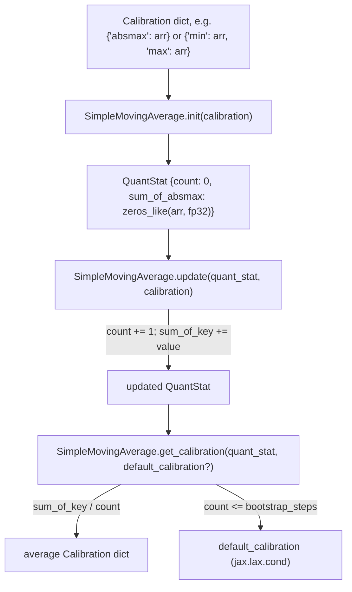

# qwix._src.averaging — SimpleMovingAverage for quant stats

## Overview

[`SimpleMovingAverage`](../catalog/qwix/_src/averaging.md#SimpleMovingAverage) is the single
statistics-accumulation primitive shared by every static-range/calibration-collecting code path in
the repo: [`OdmlQatProvider._update_and_get_quant_stat`](../catalog/qwix/_src/providers/odml.md#OdmlQatProvider._update_and_get_quant_stat),
[`QtProvider._update_and_get_quant_stat`](../catalog/qwix/_src/providers/qt.md#QtProvider._update_and_get_quant_stat),
[`SinglePassCalibrationProvider._collect_stats`](../catalog/qwix/contrib/calibration.md#SinglePassCalibrationProvider._collect_stats)
(GPTQ/AWQ/SQ), and QEP's own
[`_update_flat_stats_with_moving_average`](../catalog/qwix/contrib/qep.md#_update_flat_stats_with_moving_average)
all build on it. It maintains a running count plus a running sum-per-key in fp32, dividing only
when the average is actually requested — a design that keeps accumulation numerically stable
across many training/calibration steps.

## Diagram

## Design rationale (why it's built this way)

**The running sum is always kept in fp32, even if the underlying calibration values are bf16.**
[`SimpleMovingAverage.init`](../catalog/qwix/_src/averaging.md#SimpleMovingAverage.init)'s comment
is explicit: "bf16 only has 7 bits of precision, which will cause accumulation becomes a no-op
after a few hundreds of steps" — accumulating small per-step updates into a low-precision running
sum would silently stop updating once the sum grows large enough that individual updates round to
zero. Keeping the accumulator in fp32 regardless of the calibration dict's own dtype avoids this
class of bug entirely.

**Division is deferred to read time, not folded into the update.** [`update`](../catalog/qwix/_src/averaging.md#SimpleMovingAverage.update)
only adds to `sum_of_*` and increments `count`; [`get_calibration`](../catalog/qwix/_src/averaging.md#SimpleMovingAverage.get_calibration)
does the division. This means the *stored* state (`QuantStat`) is a pure sum/count pair, cheap to
merge or checkpoint, and the averaging formula lives in exactly one place regardless of how many
call sites read it.

**Bootstrapping falls back to a default calibration via `jax.lax.cond`, not a Python `if`.**
[`get_calibration`](../catalog/qwix/_src/averaging.md#SimpleMovingAverage.get_calibration) needs
`quant_stat['count']` (a traced value under `jax.jit`) to decide whether enough samples have
accumulated — a Python-level `if` would fail to trace, so the bootstrap/no-bootstrap branch is
expressed as `jax.lax.cond(quant_stat['count'] > self._bootstrap_steps, lambda: calibration, lambda:
default_calibration)`, letting the same jitted function serve both the early-training (bootstrap)
and steady-state regimes without retracing.

**Shape mismatches are treated as a hard configuration error, not silently broadcast.**
[`update`](../catalog/qwix/_src/averaging.md#SimpleMovingAverage.update) explicitly raises
`ValueError` if the incoming calibration's shape doesn't match the stored `sum_of_*` shape, with a
comment noting this "usually indicates a config error" — e.g. a rule's `channelwise_axes`
disagreeing between the step that initialized the stat and a later step that updates it.

## Entry points

- [`SimpleMovingAverage.init`](../catalog/qwix/_src/averaging.md#SimpleMovingAverage.init) —
  called (typically inside `flax_util.get_or_create_variable`'s lazy-init callback) the first time
  a given quant-stat variable is needed.
- [`SimpleMovingAverage.update`](../catalog/qwix/_src/averaging.md#SimpleMovingAverage.update) —
  called every step a new calibration batch is observed, gated by
  `flax_util.should_update_quant_stats()` in the calling providers.
- [`SimpleMovingAverage.get_calibration`](../catalog/qwix/_src/averaging.md#SimpleMovingAverage.get_calibration) —
  called wherever the averaged statistic is actually needed to compute a scale/zero_point, e.g.
  inside `quantize_act`'s
  [`init`](../catalog/qwix/_src/providers/ptq.md#quantize_act.init) closure and inside
  [`extract_calibrated_quant_context`](../catalog/qwix/contrib/calibration.md#extract_calibrated_quant_context)
  for offline GPTQ/AWQ/QEP quantization.

## Mechanism (step-by-step)

1. **First observation.** [`init`](../catalog/qwix/_src/averaging.md#SimpleMovingAverage.init)
   builds a `{'count': 0}` dict plus one `f'sum_of_{key}'` entry per calibration key, all zeros,
   with the sums explicitly cast to `jnp.float32`.
2. **Each subsequent batch.** [`update`](../catalog/qwix/_src/averaging.md#SimpleMovingAverage.update)
   increments `count` by 1 and adds each calibration value into its corresponding `sum_of_*` entry,
   after validating shapes match.
3. **Reading the average.** [`get_calibration`](../catalog/qwix/_src/averaging.md#SimpleMovingAverage.get_calibration)
   divides every `sum_of_*` by `count` to reconstruct a plain `Calibration` dict (stripping the
   `sum_of_` prefix from keys).
4. **Optional bootstrap fallback.** If `default_calibration` is supplied, the dtype of the computed
   average is cast to match it, and `jax.lax.cond` selects between the computed average and the
   default based on whether `count` exceeds
   [`self._bootstrap_steps`](../catalog/qwix/_src/averaging.md#SimpleMovingAverage._bootstrap_steps).

## Key data structures

- **`QuantStat`** (`../catalog/qwix/_src/averaging.md#QuantStat.QuantStat`) — a `dict[str,
  jax.Array]` with a `'count'` scalar plus one `sum_of_<key>` array per calibration statistic;
  this is the literal shape of the Flax `quant_stats` variable collection.
- **[`Calibration`](../catalog/qwix/_src/averaging.md#Calibration.Calibration)** — the same
  `dict[str, jax.Array]` shape as what `qarray.calibrate` itself returns (e.g.
  `{'absmax': ...}` or `{'min': ..., 'max': ...}`), letting `SimpleMovingAverage` treat any
  calibration method's output uniformly without knowing which method produced it.

## Dynamics (design intent)

`self._bootstrap_steps` (a plain Python int stored on the `SimpleMovingAverage` instance, not part
of the traced `QuantStat` pytree) means the bootstrap threshold itself is fixed at construction
time and cannot vary per-call — a deliberate simplicity tradeoff, since the instance is typically
constructed fresh per call site (e.g. `averaging.SimpleMovingAverage()` inline) rather than shared
across different stats with different bootstrap needs.

## Edge cases

- `SimpleMovingAverage()`'s default `bootstrap_steps=0` means, absent an explicit override, the
  very first `get_calibration` call (with `count=1 > 0`) already uses the computed average rather
  than any default — bootstrapping is opt-in, not automatic.
- Because `sum_of_*` is always fp32 regardless of input dtype, `get_calibration`'s dtype-casting
  step (`x.astype(y.dtype)` against `default_calibration`) is what brings the average back to
  whatever dtype the rest of the pipeline expects.

## Open questions

- Whether `QuantStat`'s `'count'` field is ever reset mid-training (other than the explicit
  fixed-range special-case in [`OdmlConversionProvider`](qwix-_src-providers-odml.md), which starts
  fresh to avoid floating-point accumulation error) is not addressed by this module itself.

## See also
- [qwix-_src-core-qarray](qwix-_src-core-qarray.md) — `calibrate`/`compute_scale_zero_point`, whose
  output/input shapes this module's `Calibration`/`QuantStat` dicts mirror.
- [qwix-_src-providers-ptq](qwix-_src-providers-ptq.md) — `quantize_act`, a primary consumer for
  static-range activation quantization.
- [qwix-contrib-calibration](qwix-contrib-calibration.md) — `SinglePassCalibrationProvider`, the
  shared base for GPTQ/AWQ/SQ statistics collection built on this module.
