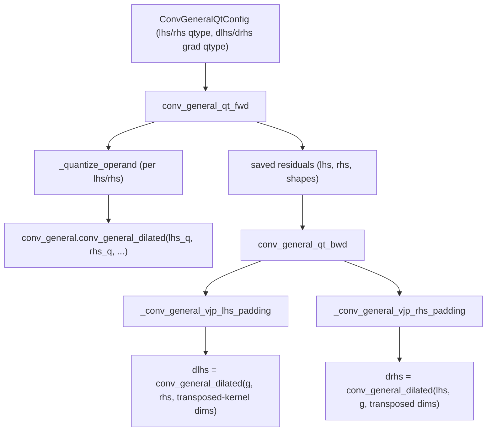

# qwix._src.core.conv_general_qt — custom_vjp quantized convolution for training

## Overview

[`conv_general_qt`](../catalog/qwix/_src/core/conv_general_qt.md#conv_general_qt) is
`conv_general_dilated`'s counterpart to [qwix-_src-core-dot_general_qt](qwix-_src-core-dot_general_qt.md):
a `jax.custom_vjp` pair — [`conv_general_qt_fwd`](../catalog/qwix/_src/core/conv_general_qt.md#conv_general_qt_fwd)/
[`conv_general_qt_bwd`](../catalog/qwix/_src/core/conv_general_qt.md#conv_general_qt_bwd) — driven
by a [`ConvGeneralQtConfig`](../catalog/qwix/_src/core/conv_general_qt.md#ConvGeneralQtConfig) that
quantizes forward lhs/rhs and backward dlhs/drhs gradients independently. Convolution's backward
pass is structurally a *different* convolution (the VJP w.r.t. input and w.r.t. filter each have
their own padding/dilation math), so this module carries a set of padding-computation helpers
([`_conv_general_vjp_lhs_padding`](../catalog/qwix/_src/core/conv_general_qt.md#_conv_general_vjp_lhs_padding)/
[`_conv_general_vjp_rhs_padding`](../catalog/qwix/_src/core/conv_general_qt.md#_conv_general_vjp_rhs_padding))
that [qwix-_src-core-dot_general_qt](qwix-_src-core-dot_general_qt.md) has no analogue for.

## Diagram

## Design rationale (why it's built this way)

**The VJP padding formulas are the mathematical core of this module, and they exist because
convolution's backward pass is not "just transpose the op".** [`_conv_general_vjp_lhs_padding`](../catalog/qwix/_src/core/conv_general_qt.md#_conv_general_vjp_lhs_padding)
computes `pad_before`/`pad_after` from the dilated shapes of input, kernel, and output — a direct
implementation of the standard conv-transpose-as-conv-backward identity, needed because
`jax.lax.conv_general_dilated`'s own autodiff rule is being *replaced* here (via `custom_vjp`), so
Qwix must reimplement the padding math JAX's default backward rule would otherwise supply for
free.

**Forward and backward quantization reuse [`qarray`](qwix-_src-core-qarray.md) directly, not a
conv-specific quantization path.** [`conv_general_qt_fwd`](../catalog/qwix/_src/core/conv_general_qt.md#conv_general_qt_fwd)'s
[`_quantize_operand`](../catalog/qwix/_src/core/conv_general_qt.md#conv_general_qt_fwd._quantize_operand)
helper calls the same [`calibrate`](../catalog/qwix/_src/core/qarray.md#calibrate)/
[`compute_scale_zero_point`](../catalog/qwix/_src/core/qarray.md#compute_scale_zero_point)/
[`quantize_with_scale_zero_point`](../catalog/qwix/_src/core/qarray.md#quantize_with_scale_zero_point)
sequence used throughout the codebase — convolution-specific logic is confined entirely to shape/
padding bookkeeping, not to a parallel quantization implementation.

**`@interception.disable_interceptions` guards the whole forward function.** Marking
[`conv_general_qt_fwd`](../catalog/qwix/_src/core/conv_general_qt.md#conv_general_qt_fwd) with
[`disable_interceptions`](../catalog/qwix/_src/interception.md#disable_interceptions) prevents the
provider's own patched `jax.lax.conv_general_dilated` from re-intercepting the *internal* call this
function itself makes to the real convolution primitive — the same recursion-avoidance pattern
used in [qwix-_src-core-dot_general_qt](qwix-_src-core-dot_general_qt.md).

**No tile-size / subchannel support for convolution, unlike `dot_general_qt`.**
[`ConvGeneralQtConfig`](../catalog/qwix/_src/core/conv_general_qt.md#ConvGeneralQtConfig) has no
`tile_size` field at all (contrast `dot_general_qt`'s per-op config, see
[qwix-_src-core-dot_general_qt](qwix-_src-core-dot_general_qt.md)) —
[`QtProvider.conv_general_dilated`](../catalog/qwix/_src/providers/qt.md#QtProvider.conv_general_dilated)
raises explicitly if a rule requests `tile_size` for a conv op, making subchannel quantization a
`dot_general`/`einsum`-only feature in this codebase.

## Entry points

- [`conv_general_qt`](../catalog/qwix/_src/core/conv_general_qt.md#conv_general_qt) — the public
  `custom_vjp`-wrapped function; called from
  [`QtProvider.conv_general_dilated`](../catalog/qwix/_src/providers/qt.md#QtProvider.conv_general_dilated).
- [`conv_general_qt_fwd`](../catalog/qwix/_src/core/conv_general_qt.md#conv_general_qt_fwd) — the
  registered forward rule; quantizes operands and computes the real convolution.
- [`conv_general_qt_bwd`](../catalog/qwix/_src/core/conv_general_qt.md#conv_general_qt_bwd) — the
  registered backward rule; computes `dlhs`/`drhs` via the VJP padding helpers.

## Mechanism (step-by-step)

1. **Forward quantization.** `conv_general_qt_fwd`'s
   [`_quantize_operand`](../catalog/qwix/_src/core/conv_general_qt.md#conv_general_qt_fwd._quantize_operand)
   quantizes `lhs`/`rhs` per [`config.lhs_qtype`](../catalog/qwix/_src/core/conv_general_qt.md#ConvGeneralQtConfig.lhs_qtype)/
   [`rhs_qtype`](../catalog/qwix/_src/core/conv_general_qt.md#ConvGeneralQtConfig.rhs_qtype) if set.
2. **The real convolution runs**, wrapped by
   [`disable_interceptions`](../catalog/qwix/_src/interception.md#disable_interceptions) so the
   provider's own patched `conv_general_dilated` doesn't re-intercept this internal call.
3. **Residuals for backward** are saved by
   [`conv_general_qt_fwd`](../catalog/qwix/_src/core/conv_general_qt.md#conv_general_qt_fwd) — the
   possibly-quantized operands plus shape metadata needed for the VJP padding computations.
4. **Backward padding derivation.** [`_conv_general_vjp_lhs_padding`](../catalog/qwix/_src/core/conv_general_qt.md#_conv_general_vjp_lhs_padding)/
   [`_conv_general_vjp_rhs_padding`](../catalog/qwix/_src/core/conv_general_qt.md#_conv_general_vjp_rhs_padding)
   compute the padding each backward convolution needs, purely from the forward shapes/strides/
   dilation — no data dependency.
5. **Backward quantization and computation.** The incoming gradient is quantized per
   [`config.dlhs_grad_qtype`](../catalog/qwix/_src/core/conv_general_qt.md#ConvGeneralQtConfig.dlhs_grad_qtype)/
   [`drhs_grad_qtype`](../catalog/qwix/_src/core/conv_general_qt.md#ConvGeneralQtConfig.drhs_grad_qtype),
   and `dlhs`/`drhs` are each computed as a `conv_general_dilated` call with the VJP-derived
   padding/dimension numbers.

## Key data structures

- **[`ConvGeneralQtConfig`](../catalog/qwix/_src/core/conv_general_qt.md#ConvGeneralQtConfig)** —
  a frozen, slotted dataclass (not a registered pytree, unlike `DotGeneralQtConfig`) holding fwd
  (`lhs_qtype`/`rhs_qtype`/calibration methods) and bwd (`dlhs_grad_qtype`/`drhs_grad_qtype`/
  calibration methods) fields plus per-side `disable_channelwise_axes` flags.
- **`_conv_spec_transpose` / `_conv_sdims`** — small lambda helpers for swapping the first two
  dimension-spec entries (N/C) and extracting spatial dimensions, used throughout the padding
  derivations.

## Dynamics (design intent)

Because the VJP padding formulas depend only on static shapes (input/kernel/output shapes,
strides, dilation — all known at trace time), the entire backward-padding computation happens
during `jax.jit` tracing with zero runtime branching, keeping the quantized-conv backward pass as
traceable and fusible as the unquantized default.

## Edge cases

- [`_conv_general_vjp_rhs_padding`](../catalog/qwix/_src/core/conv_general_qt.md#_conv_general_vjp_rhs_padding)
  special-cases a 0D convolution (`if not in_shape: return []`) — a degenerate shape the general
  padding formula would otherwise mishandle.

## Open questions

- Whether the lack of subchannel/tiled quantization support for convolution is a permanent
  architectural choice (convolution's spatial structure making per-tile scales awkward) or simply
  not-yet-implemented is not stated in the source seen here.

## See also
- [qwix-_src-core-dot_general_qt](qwix-_src-core-dot_general_qt.md) — the `dot_general` sibling
  this module's `custom_vjp` structure directly parallels.
- [qwix-_src-core-qarray](qwix-_src-core-qarray.md) — `calibrate`/`compute_scale_zero_point`/
  `quantize_with_scale_zero_point`, the quantization primitives both fwd and bwd call into.
- [qwix-_src-providers-qt](qwix-_src-providers-qt.md) — `QtProvider`, which builds
  `ConvGeneralQtConfig` and dispatches to this module.
