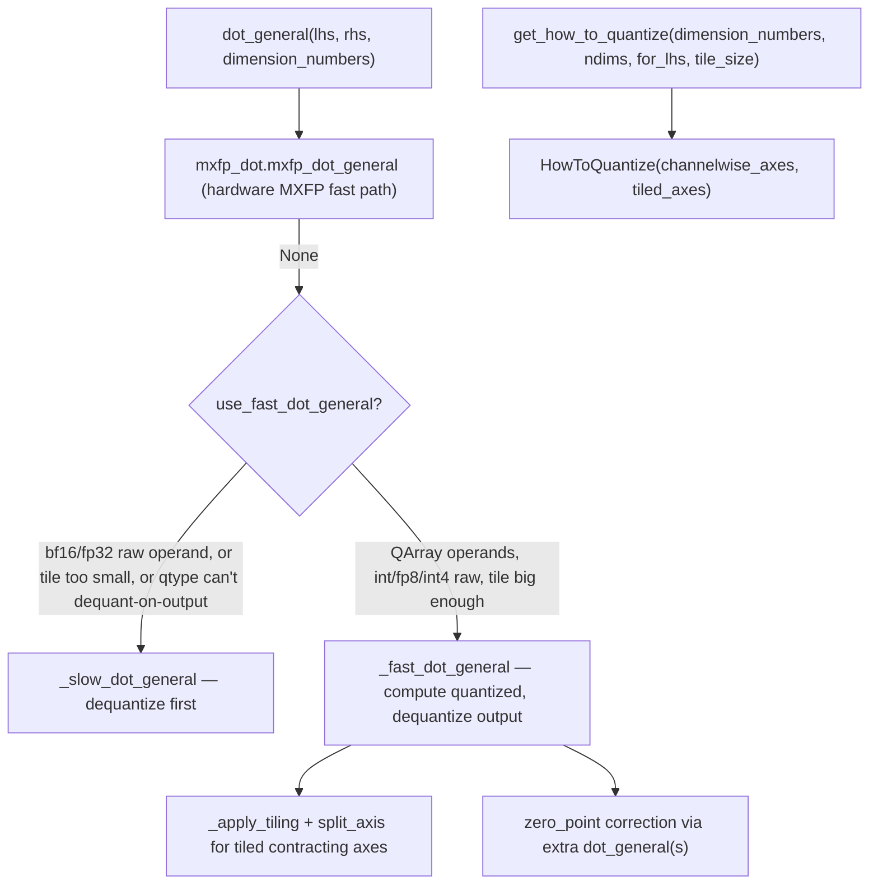

# qwix._src.core.dot_general — quantized jax.lax.dot_general with subchannel support

## Overview

[`dot_general`](../catalog/qwix/_src/core/dot_general.md#dot_general) is the drop-in
`jax.lax.dot_general` replacement every provider in the repo ultimately calls: it accepts
[`MaybeQArray`](../catalog/qwix/_src/core/qarray.md#MaybeQArray.MaybeQArray) operands (plain
arrays or [`QArray`](../catalog/qwix/_src/core/qarray.md#QArray)s, possibly with subchannel/tiled
scales) and picks between three execution strategies —
[`_fast_dot_general`](../catalog/qwix/_src/core/dot_general.md#_fast_dot_general) (compute in
quantized types, dequantize the output),
[`_slow_dot_general`](../catalog/qwix/_src/core/dot_general.md#_slow_dot_general) (dequantize the
inputs first, compute in float), or [`loop_dot_general`](../catalog/qwix/_src/core/dot_general.md#loop_dot_general)
(an explicit tile-accumulation loop for Pallas-kernel contexts) — based on which is actually faster
for the given tiling/dtype combination. [`get_how_to_quantize`](../catalog/qwix/_src/core/dot_general.md#get_how_to_quantize)
is the companion function that derives a [`HowToQuantize`](../catalog/qwix/_src/core/qarray.md#HowToQuantize)
recipe directly from `dot_general`'s own dimension numbers.

## Diagram

## Design rationale (why it's built this way)

**The fast/slow choice is a genuine cost-model decision, not a fixed policy.** [`dot_general`](../catalog/qwix/_src/core/dot_general.md#dot_general)'s
own comments spell out the tradeoff: if either raw (non-`QArray`) operand is bf16/fp32,
[`_slow_dot_general`](../catalog/qwix/_src/core/dot_general.md#_slow_dot_general) is used because
XLA can fuse the dequantize into the surrounding matmul and the slow path is "usually not slower"
while being simpler; but for raw fp8/int4/bool operands, or when a contracting axis is tiled below
[`MIN_TILE_SIZE_TO_DEQUANT_ON_OUTPUT`](../catalog/qwix/_src/core/dot_general.md) (128), the fast
path wins because computing in the native low-precision type avoids materializing a full-precision
intermediate.

**Subchannel (tiled) contraction is implemented by literally splitting the contracting axis into
`(tile_count, tile_size)` and summing.** [`_fast_dot_general`](../catalog/qwix/_src/core/dot_general.md#_fast_dot_general)
calls [`split_axis`](../catalog/qwix/_src/core/qarray.md#split_axis) on both operands'
`qvalue`/`zero_point`/`scale`, updates dimension numbers via
[`_apply_tiling`](../catalog/qwix/_src/core/dot_general.md#_apply_tiling) to turn the tile-count
axis into a new batch axis, runs `jax.lax.dot_general` per tile, applies the (correctly
transposed) scale, and — when tiling introduced extra summed axes — reduces with `jnp.sum`. This
reuses `jax.lax.dot_general` itself as the inner primitive rather than hand-writing a tiled matmul.

**Zero-point correction is two extra `dot_general` calls, not fused arithmetic.** For asymmetric
quantization (`zero_point is not None`),
[`_fast_dot_general`](../catalog/qwix/_src/core/dot_general.md#_fast_dot_general) computes the
correction term as `dot_general(zero_point_broadcast, rhs_value)` (or the symmetric case for rhs)
and subtracts it from the main product — mathematically `(q - zp) · r = q·r - zp·r`, expressed as
two matmuls rather than a fused subtract-then-multiply, so XLA's own matmul fusion handles the
correction term the same way it handles the main product.

**`loop_dot_general` targets a different caller than `_fast_dot_general`/`_slow_dot_general`.**
Its extensive docstring explains it assumes inputs are *already spatially sharded* (e.g. by a
Pallas grid) but carry the *full* contracting dimension, and its job is purely the "temporal loop"
over MXU-sized tiles of that dimension — a different axis of tiling (K-dimension chunking for
hardware tile-size constraints) than the subchannel-scale tiling `_fast_dot_general` handles.

## Entry points

- [`dot_general`](../catalog/qwix/_src/core/dot_general.md#dot_general) — the public entry point;
  called directly by [`PtqProvider.dot_general`](../catalog/qwix/_src/providers/ptq.md#PtqProvider.dot_general),
  [`padded_ptq.dot_general`](../catalog/qwix/contrib/padded_ptq.md#dot_general), and
  [`SqInferenceProvider.dot_general`](../catalog/qwix/contrib/smooth_quant.md#SqInferenceProvider.dot_general).
- [`get_how_to_quantize`](../catalog/qwix/_src/core/dot_general.md#get_how_to_quantize) — called
  by every provider ([`PtqProvider`](qwix-_src-providers-ptq.md),
  [`QtProvider`](qwix-_src-providers-qt.md), the ODML `DotEinsumConv` op via
  [`_get_how_to_quantize`](../catalog/qwix/_src/providers/odml_ops.md#DotEinsumConv._get_how_to_quantize))
  to derive channelwise/tiled axes from `dot_general`'s own dimension numbers.
- [`loop_dot_general`](../catalog/qwix/_src/core/dot_general.md#loop_dot_general) — reached from
  Pallas-kernel contexts (per its docstring, callers within a Pallas grid) needing an internal
  accumulation loop over K-dimension tiles.

## Mechanism (step-by-step)

1. **MXFP fast path check.** [`dot_general`](../catalog/qwix/_src/core/dot_general.md#dot_general)
   first tries [`mxfp_dot_general`](../catalog/qwix/_src/core/mxfp_dot.md#mxfp_dot_general)
   (hardware microscaling-format dot); if it returns `None` (inputs aren't MXFP-shaped), the normal
   decision logic proceeds.
2. **Fast-vs-slow decision.** For each operand paired with its contracting axes, `dot_general`
   checks: is it a raw array in a high-precision dtype ([`should_quantize`](../catalog/qwix/_src/core/numerics.md#should_quantize)
   true) → forces slow; is it a [`QArray`](../catalog/qwix/_src/core/qarray.md#QArray) whose
   [`qtype`](../catalog/qwix/_src/core/qarray.md#QArray.qtype) can't dequantize-on-output (e.g.
   `nf4`) → forces slow; is a tiled contracting axis's tile size below the efficiency threshold →
   forces slow. Otherwise, fast.
3. **Fast path.** [`_fast_dot_general`](../catalog/qwix/_src/core/dot_general.md#_fast_dot_general)
   extracts `qvalue`/`scale`/`zero_point` per operand (or treats a raw array as an unscaled,
   unshifted "QArray"), reconciles tile sizes between lhs/rhs contracting axes, splits tiled axes,
   runs the core `jax.lax.dot_general` on the raw quantized values, applies scale correction (and
   zero-point correction via extra dot products) via
   [`call_with_generic_broadcast`](../catalog/qwix/_src/core/qarray.md#call_with_generic_broadcast),
   and casts to the [`get_accumulator_and_result_type`](../catalog/qwix/_src/core/qarray.md#get_accumulator_and_result_type)-determined
   output dtype.
4. **Slow path.** [`_slow_dot_general`](../catalog/qwix/_src/core/dot_general.md#_slow_dot_general)
   simply [`dequantize`](../catalog/qwix/_src/core/qarray.md#dequantize)s any `QArray` operand and
   calls plain `jax.lax.dot_general`.
5. **[`get_how_to_quantize`](../catalog/qwix/_src/core/dot_general.md#get_how_to_quantize)**
   computes [`channelwise_axes`](../catalog/qwix/_src/core/qarray.md#HowToQuantize.channelwise_axes)
   as every axis not in the contracting or tiled-axes set, and
   [`tiled_axes`](../catalog/qwix/_src/core/qarray.md#HowToQuantize.tiled_axes) either from an
   explicit mapping or by tiling only the innermost (last) contracting axis at the given
   `tile_size`.

## Key data structures

- **`ca_tile_counts`** (inside [`loop_dot_general`](../catalog/qwix/_src/core/dot_general.md#loop_dot_general)) —
  per-contracting-axis tile counts, reconciled between lhs/rhs the same way
  [`_fast_dot_general`](../catalog/qwix/_src/core/dot_general.md#_fast_dot_general) reconciles
  `lhs_tiled_ca`/`rhs_tiled_ca`.
- **`MIN_TILE_SIZE_TO_DEQUANT_ON_OUTPUT`** — the threshold (128) below which tiled fast-path
  computation is judged inefficient relative to dequantizing first.

## Dynamics (design intent)

The comment "if a contracting dimension is channelwise quantized, e.g. tile_size=1" documents the
degenerate case the efficiency threshold specifically guards against: per-channel (tile_size=1)
quantization on a contracting axis would force the fast path into a fully-unrolled per-element
loop, which is why `dot_general` falls back to the slow (dequantize-first) path whenever tiling
would be that fine-grained.

## Edge cases

- [`_fast_dot_general`](../catalog/qwix/_src/core/dot_general.md#_fast_dot_general) raises if
  `lhs_zero_point is not None and rhs_zero_point is not None` — asymmetric quantization is only
  supported on one operand at a time.
- Mismatched tile sizes between lhs and rhs on the same logical contracting pair raise a
  `ValueError` rather than silently picking one — tiling must agree exactly across both operands.

## Open questions

- Whether the MXFP fast path ([`mxfp_dot_general`](../catalog/qwix/_src/core/mxfp_dot.md#mxfp_dot_general))
  and the ordinary fast/slow dispatch ever both apply to the same call (i.e., whether MXFP
  operands could also hit `_fast_dot_general`'s tiling logic) isn't addressed by this packet's
  cited subgraph.

## See also
- [qwix-_src-core-qarray](qwix-_src-core-qarray.md) — `QArray`/`HowToQuantize`, the data types
  this module operates on.
- [qwix-_src-core-dot_general_qt](qwix-_src-core-dot_general_qt.md) — the training-time
  (custom_vjp, quantized-gradient) sibling built partly on this module's fast/slow primitives.
- [qwix-_src-core-einsum_info](qwix-_src-core-einsum_info.md) — `EinsumInfo`, which reduces
  `einsum` to this module's `dot_general` calling convention.
