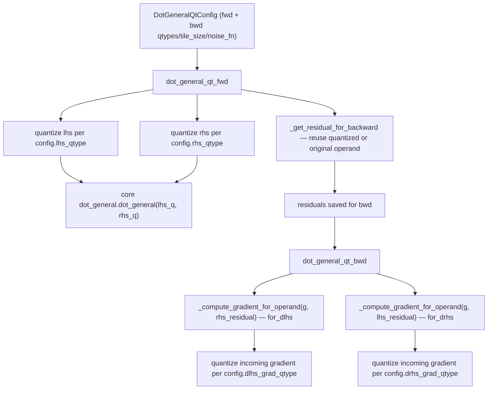

# qwix._src.core.dot_general_qt — custom_vjp quantized dot_general for training

## Overview

[`dot_general_qt`](../catalog/qwix/_src/core/dot_general_qt.md#dot_general_qt) is a
`jax.custom_vjp`-defined function: forward pass
([`dot_general_qt_fwd`](../catalog/qwix/_src/core/dot_general_qt.md#dot_general_qt_fwd)) and
backward pass ([`dot_general_qt_bwd`](../catalog/qwix/_src/core/dot_general_qt.md#dot_general_qt_bwd))
each independently apply quantization according to a
[`DotGeneralQtConfig`](../catalog/qwix/_src/core/dot_general_qt.md#DotGeneralQtConfig), letting
[`QtProvider`](qwix-_src-providers-qt.md) quantize forward activations/weights and backward
gradients/residuals to *different* precisions and calibration methods. This is the mechanism
underneath "quantized training" — not merely a quantized forward pass with float gradients, but a
custom differentiation rule where the gradient computation itself runs through
[qwix-_src-core-dot_general](qwix-_src-core-dot_general.md)'s quantized fast/slow paths.

## Diagram

## Design rationale (why it's built this way)

**Residual reuse is opt-in, and mathematically gated.** [`_get_residual_for_backward`](../catalog/qwix/_src/core/dot_general_qt.md#_get_residual_for_backward)
decides whether to save the forward's already-quantized operand for backward use, or the original
unquantized operand — reusing a tiled/subchannel-quantized or mxfp/nvfp4 residual is explicitly
disallowed ("mathematically incorrect... quantization scales defined for one contraction axis do
not align with the new contraction axis in the backward pass") because the backward pass contracts
along a *different* axis than the forward pass did. `config.use_original_residuals` gives the
caller (typically [`QtProvider`](qwix-_src-providers-qt.md)) direct control when this matters.

**The backward dimension numbers are computed once, symbolically, for both dlhs and drhs.**
[`_update_dimension_numbers_for_backward`](../catalog/qwix/_src/core/dot_general_qt.md) derives
the new contracting/batch axes for `dlhs = dot(g, rhs)` or `drhs = dot(g, lhs)` purely from the
forward pass's own dimension numbers and operand ranks — no data-dependent logic, so it is
computed identically regardless of the actual quantization applied to `g`/the residual.

**Independent stochastic-rounding noise per gradient direction.** `DotGeneralQtConfig` carries
separate `dlhs_stochastic_rounding_noise_fn`/`drhs_stochastic_rounding_noise_fn` callbacks (built
by [`QtProvider`](qwix-_src-providers-qt.md)) rather than one
shared noise source — since dlhs and drhs are computed from different gradient tensors with
potentially different shapes/dtypes, sharing a single noise function would either require
reshaping noise awkwardly or coupling the two backward computations unnecessarily.

**Gradient clipping to the calibration range is a configurable tradeoff, not always-on.**
[`DotGeneralQtConfig.disable_gradient_clipping`](../catalog/qwix/_src/core/dot_general_qt.md#DotGeneralQtConfig) —
paired with [`clip_gradient_to_calibration`](../catalog/qwix/_src/core/qarray.md#clip_gradient_to_calibration)'s
own "skip masking if scale factor >= 1.0" optimization — documents that clipping the gradient to
the input's calibration bounds improves numerical stability but costs performance; the default
absmax calibration method always skips it, since absmax's own definition guarantees no clipping is
needed.

## Entry points

- [`dot_general_qt`](../catalog/qwix/_src/core/dot_general_qt.md#dot_general_qt) — the public
  `custom_vjp`-wrapped function; called from
  [`QtProvider.dot_general`](../catalog/qwix/_src/providers/qt.md#QtProvider.dot_general) and
  [`QtProvider.custom_dot_general`](../catalog/qwix/_src/providers/qt.md) (the einsum path).
- [`dot_general_qt_fwd`](../catalog/qwix/_src/core/dot_general_qt.md#dot_general_qt_fwd) — the
  forward rule registered with `custom_vjp`; where forward-pass quantization and residual
  selection happen.
- [`dot_general_qt_bwd`](../catalog/qwix/_src/core/dot_general_qt.md#dot_general_qt_bwd) — the
  backward rule; computes both `dlhs` and `drhs` via its inner
  [`_compute_gradient_for_operand`](../catalog/qwix/_src/core/dot_general_qt.md#dot_general_qt_bwd._compute_gradient_for_operand)
  helper.

## Mechanism (step-by-step)

1. **Forward quantization.** `dot_general_qt_fwd` quantizes `lhs`/`rhs` per
   [`config.lhs_qtype`](../catalog/qwix/_src/core/dot_general_qt.md#DotGeneralQtConfig.lhs_qtype)/
   [`rhs_qtype`](../catalog/qwix/_src/core/dot_general_qt.md#DotGeneralQtConfig.rhs_qtype) (if set;
   otherwise passed through raw), optionally collecting a static-range quant stat via the config's
   `lhs_collect_quant_stat`/`rhs_collect_quant_stat` callbacks, then calls
   [`dot_general`](../catalog/qwix/_src/core/dot_general.md#dot_general) (the core quantized
   matmul) on the (possibly-quantized) operands.
2. **Residual selection.** For each operand, [`_get_residual_for_backward`](../catalog/qwix/_src/core/dot_general_qt.md#_get_residual_for_backward)
   decides between saving the quantized or original operand as the backward-pass residual,
   according to `use_original_residuals` and whether the quantized operand's tiling/qtype would be
   invalid to reuse under a different contraction axis.
3. **Backward dimension numbers.** Inside [`dot_general_qt_bwd`](../catalog/qwix/_src/core/dot_general_qt.md#dot_general_qt_bwd),
   for each of dlhs/drhs the forward dimension numbers are transformed into the corresponding
   backward dot's dimension numbers plus an output-transpose, computed purely from shapes (no data
   dependency).
4. **Gradient quantization.** [`_compute_gradient_for_operand`](../catalog/qwix/_src/core/dot_general_qt.md#dot_general_qt_bwd._compute_gradient_for_operand)
   quantizes the incoming gradient `g` per the direction's `*_grad_qtype`/`*_grad_calibration_method`/
   `*_tile_size` (with stochastic rounding if configured), applies
   [`_apply_rhs_scale_to_lhs`](../catalog/qwix/_src/core/dot_general_qt.md#_apply_rhs_scale_to_lhs)
   where needed to propagate a forward-pass scale into the backward computation, and calls the
   backward-direction `dot_general`.
5. **Optional gradient clipping.** Unless `disable_gradient_clipping` (or absmax calibration, which
   makes it a no-op), [`clip_gradient_to_calibration`](../catalog/qwix/_src/core/qarray.md#clip_gradient_to_calibration)
   masks the gradient wherever the original input fell outside the calibration bounds used to
   quantize it.

## Key data structures

- **[`DotGeneralQtConfig`](../catalog/qwix/_src/core/dot_general_qt.md#DotGeneralQtConfig)** — a
  `jax.tree_util.register_pytree_node_class`-registered, frozen, slotted dataclass; registering it
  as a pytree (with the two noise-fn callbacks as children, everything else as aux_data) lets it
  cross `jax.jit`/`custom_vjp` boundaries as a structured, traceable argument rather than an opaque
  Python object.
- **`sparsity_rule`** — an optional [`SparsityRule`](qwix-_src-core-sparsity.md) field on the
  config, letting N:M structured sparsity compose with quantized training in the same op.

## Dynamics (design intent)

`disable_interceptions` (from [qwix-_src-interception](qwix-_src-interception.md)) wraps at least
part of this module's forward computation — a comment in the source (seen when reading
`dot_general_qt.py` directly) notes the reason relates to `test_scan_custom_vjp`: a `custom_vjp`
function's forward/backward rules must not themselves be re-intercepted by the same provider's
patched `jax.lax.dot_general`, or the interception would recurse into itself.

## Edge cases

- Residuals with tiled axes or `mxfp8`/`mxfp4`/`nvfp4` qtypes are never reused for backward even if
  `use_original_residuals=False` — `_get_residual_for_backward` overrides the config in that case,
  since the mathematical mismatch (different contraction axis in bwd) makes reuse always incorrect,
  not just usually suboptimal.

## Open questions

- Whether `_apply_rhs_scale_to_lhs`'s single-channelwise-axis assumption (only one axis of the
  scale being non-trivial) can ever be violated by a config combining sparsity and tiling
  simultaneously is not resolved by this packet's cited subgraph.

## See also
- [qwix-_src-providers-qt](qwix-_src-providers-qt.md) — `QtProvider`, which builds
  `DotGeneralQtConfig` per intercepted op and calls this module.
- [qwix-_src-core-dot_general](qwix-_src-core-dot_general.md) — the underlying quantized
  `dot_general` this module's forward and backward both call into.
- [qwix-_src-core-sparsity](qwix-_src-core-sparsity.md) — `SparsityRule`, composable via
  `DotGeneralQtConfig.sparsity_rule`.
