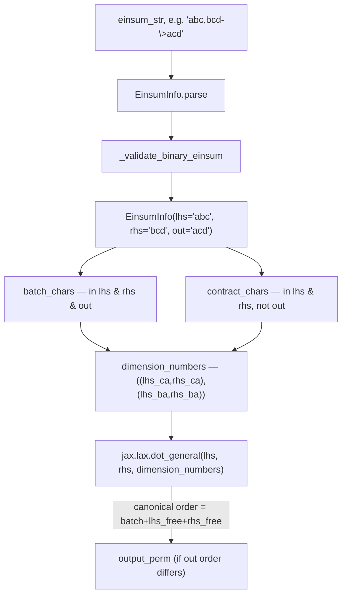

# qwix._src.core.einsum_info — parsing binary einsum strings into dot_general terms

## Overview

[`EinsumInfo`](../catalog/qwix/_src/core/einsum_info.md#EinsumInfo) is the small parser that lets
Qwix implement `jax.numpy.einsum` support as a thin wrapper over
[`dot_general`](qwix-_src-core-dot_general.md) rather than a second quantization-aware kernel:
given a binary einsum string like `'abc,bcd->acd'`, it classifies every index letter as
[`batch_chars`](../catalog/qwix/_src/core/einsum_info.md#EinsumInfo.batch_chars) (in lhs, rhs,
*and* out), [`contract_chars`](../catalog/qwix/_src/core/einsum_info.md#EinsumInfo.contract_chars)
(in lhs and rhs but not out), or free, and turns that classification into the
[`dimension_numbers`](../catalog/qwix/_src/core/einsum_info.md#EinsumInfo.dimension_numbers) tuple
`dot_general` expects, plus an [`output_perm`](../catalog/qwix/_src/core/einsum_info.md#EinsumInfo.output_perm)
if `dot_general`'s canonical output axis order doesn't match the einsum string's requested order.

## Diagram

## Design rationale (why it's built this way)

**Only the binary, explicit-output einsum form is supported — deliberately.**
[`_validate_binary_einsum`](../catalog/qwix/_src/core/einsum_info.md#EinsumInfo._validate_binary_einsum)
rejects anything that isn't exactly `lhs,rhs->out` with no repeated indices within a single term,
raising `NotImplementedError` rather than attempting a general n-ary contraction. This mirrors
[`PtqProvider.einsum`](qwix-_src-providers-ptq.md)'s own restriction to two operands — the
simplification is intentional and propagated end to end, not a parsing shortcut with a silent
fallback.

**`parse` optionally normalizes implicit/ellipsis einsum syntax via `opt_einsum` before its own
parsing runs.** When `ndims` is given, [`parse`](../catalog/qwix/_src/core/einsum_info.md#EinsumInfo.parse)
first calls `opt_einsum.parser.parse_einsum_input` to expand any implicit output or `...` ellipsis
into Qwix's required explicit `lhs,rhs->out` form, so callers can pass einsum strings in whatever
form a user's model actually wrote, not just the canonical explicit form.

**`output_perm` exists because `dot_general`'s output axis order is fixed, but einsum's isn't.**
`jax.lax.dot_general` always produces `[batch_dims, lhs_free_dims, rhs_free_dims]` in that order;
[`output_perm`](../catalog/qwix/_src/core/einsum_info.md#EinsumInfo.output_perm) computes the
permutation needed to reorder that canonical layout into whatever order the einsum string's `out`
actually requested, returning `None` when no permutation is needed (the common case) so callers
can skip an unnecessary transpose.

## Entry points

- [`EinsumInfo.parse`](../catalog/qwix/_src/core/einsum_info.md#EinsumInfo.parse) — the sole
  construction path; called by [`_perform_binary_einsum`](../catalog/qwix/_src/core/einsum.md#_perform_binary_einsum)
  (the module implementing `qwix._src.core.einsum.einsum`) and by
  [`_parse_einsum_str_for_lora`](../catalog/qwix/_src/providers/lora.md#_parse_einsum_str_for_lora)
  to derive LoRA adapter shapes from an einsum string.
- [`EinsumInfo.dimension_numbers`](../catalog/qwix/_src/core/einsum_info.md#EinsumInfo.dimension_numbers) —
  the property every caller reads to get `dot_general`-ready dimension numbers.
- [`EinsumInfo.output_perm`](../catalog/qwix/_src/core/einsum_info.md#EinsumInfo.output_perm) —
  read whenever the caller needs to reorder `dot_general`'s canonical output back to the einsum
  string's requested axis order.

## Mechanism (step-by-step)

1. **Optional normalization.** If `ndims` is supplied,
   [`EinsumInfo.parse`](../catalog/qwix/_src/core/einsum_info.md#EinsumInfo.parse) builds two
   placeholder zero arrays of the given ranks and calls `opt_einsum.parser.parse_einsum_input` on
   `(einsum_str, placeholder_lhs, placeholder_rhs)`, rewriting `einsum_str` into explicit
   `input_subs->out` form.
2. **Validation.** [`_validate_binary_einsum`](../catalog/qwix/_src/core/einsum_info.md#EinsumInfo._validate_binary_einsum)
   checks the string matches `^[a-zA-Z]*,[a-zA-Z]*->[a-zA-Z]*$` and that no term repeats an index
   internally, raising `NotImplementedError` otherwise.
3. **Splitting.** The validated string is split on `,` and `->` into
   [`lhs`](../catalog/qwix/_src/core/einsum_info.md#EinsumInfo.lhs),
   [`rhs`](../catalog/qwix/_src/core/einsum_info.md#EinsumInfo.rhs), and
   [`out`](../catalog/qwix/_src/core/einsum_info.md#EinsumInfo.out) character strings, and an
   `EinsumInfo` instance is constructed.
4. **Classification on demand.** [`batch_chars`](../catalog/qwix/_src/core/einsum_info.md#EinsumInfo.batch_chars)/
   [`contract_chars`](../catalog/qwix/_src/core/einsum_info.md#EinsumInfo.contract_chars) are
   computed lazily as set intersections/differences over `lhs`/`rhs`/`out`, sorted for determinism.
5. **[`dimension_numbers`](../catalog/qwix/_src/core/einsum_info.md#EinsumInfo.dimension_numbers)
   construction.** Maps each contract/batch character to its positional index within `lhs`/`rhs`
   via per-side dicts, producing `((lhs_contract, rhs_contract), (lhs_batch, rhs_batch))`.
6. **[`output_perm`](../catalog/qwix/_src/core/einsum_info.md#EinsumInfo.output_perm)
   construction.** Builds the canonical `dot_general` output character order
   (`batch_chars + lhs_remaining + rhs_remaining`), maps each to its position, and returns the
   permutation needed to reach `out`'s actual order — or `None` if already in canonical order.

## Key data structures

- **[`EinsumInfo`](../catalog/qwix/_src/core/einsum_info.md#EinsumInfo)** — a slotted dataclass
  holding just `lhs`/`rhs`/`out` character strings; everything else is a derived property, so the
  object stays cheap to construct per call.

## Dynamics (design intent)

Because `EinsumInfo` is a thin, stateless parser recomputed per call (not cached across calls with
the same einsum string), it composes naturally with `jax.jit` tracing — no cross-call cache
invalidation logic is needed, at the cost of re-parsing the same einsum string on every invocation
of a hot loop.

## Edge cases

- `_validate_binary_einsum` treats repeated indices *within one term* (e.g. `'aab,bc->ac'`) as
  unsupported, even though plain `jnp.einsum` would interpret that as an implicit diagonal/trace —
  `EinsumInfo` does not support that einsum feature at all.
- `sanitize_shape` (used by `broadcast_operands` in the same module, per the sibling code read for
  [qwix-_src-core-qarray](qwix-_src-core-qarray.md)) — not itself in this packet's cited
  subgraph — replaces symbolic/non-concrete dimensions with `1` before calling `opt_einsum`, since
  `opt_einsum` only needs dimension sizes for cost estimation, not correctness.

## Open questions

- Whether n-ary einsum support (explicitly deferred with a `TODO` in
  [`PtqProvider.einsum`](qwix-_src-providers-ptq.md)) would require changes to `EinsumInfo` itself
  or only to its callers isn't addressed here, since `EinsumInfo`'s own validation already assumes
  exactly two input terms.

## See also
- [qwix-_src-core-dot_general](qwix-_src-core-dot_general.md) — the `dot_general` implementation
  `EinsumInfo.dimension_numbers` targets.
- [qwix-_src-providers-lora](qwix-_src-providers-lora.md) — `_parse_einsum_str_for_lora`, which
  reuses `EinsumInfo.parse` to derive LoRA adapter shapes and a modified einsum string.
