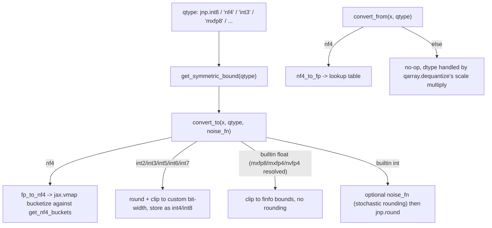

# qwix._src.core.numerics — dtype bounds, rounding, and the NF4 lookup table

## Overview

This module is the numeric-format layer underneath [`qarray`](qwix-_src-core-qarray.md): it
answers "what floating-point dtypes are even eligible for quantization"
([`should_quantize`](../catalog/qwix/_src/core/numerics.md#should_quantize)), "what's the
representable range of this target qtype" ([`get_asymmetric_bound`](../catalog/qwix/_src/core/numerics.md),
[`get_symmetric_bound`](../catalog/qwix/_src/core/numerics.md#get_symmetric_bound)), and does the
actual value-level conversion between float and quantized storage representation
([`convert_to`](../catalog/qwix/_src/core/numerics.md#convert_to)/
[`convert_from`](../catalog/qwix/_src/core/numerics.md#convert_from)) — including the one
genuinely non-uniform quantization format supported, NF4, whose bucket-lookup nature (
[`fp_to_nf4`](../catalog/qwix/_src/core/numerics.md#fp_to_nf4)/
[`nf4_to_fp`](../catalog/qwix/_src/core/numerics.md#nf4_to_fp)) is why
[`can_dequant_on_output`](../catalog/qwix/_src/core/qarray.md) (in `qarray`) exists at all.

## Diagram

## Design rationale (why it's built this way)

**Bounds are computed as continuous floats, not integer min/max, so calibration math stays
uniform across formats.** [`get_symmetric_bound`](../catalog/qwix/_src/core/numerics.md#get_symmetric_bound)'s
own docstring explains the "+0.5" convention for integer types: the representable continuous range
is extended half a step past the integer max so that "the maximum bucket is fully utilized" —
treating int8's effective bound as 127.5, not 127, which matters for how
[`compute_scale_zero_point`](../catalog/qwix/_src/core/qarray.md#compute_scale_zero_point) derives
`scale` from calibration data.

**Synthetic (non-JAX-native) qtypes are handled by pattern-matching on string names before falling
through to real dtype logic.** Both [`get_symmetric_bound`](../catalog/qwix/_src/core/numerics.md#get_symmetric_bound)
and [`convert_to`](../catalog/qwix/_src/core/numerics.md#convert_to) `match` on string literals
(`'nf4'`, `'int2'`..`'int7'`, `'mxfp8'`, `'mxfp4'`/`'nvfp4'`) before the general path — sub-byte int
types resolve down to the nearest native container (`int4` for ≤4 bits, `int8` for ≤8), and MX
formats resolve to their nearest real float dtype (`float8_e4m3fn`/`float4_e2m1fn`) — so the rest of
the codebase's dtype-dispatch logic never needs to know about these synthetic names directly once
`convert_to` has run.

**NF4 is quantized via brute-force nearest-neighbor search over a small fixed table, not a
formula.** [`fp_to_nf4`](../catalog/qwix/_src/core/numerics.md#fp_to_nf4) computes, for every
element, `argmin(abs(nf4_buckets - x))` under `jax.vmap` — a linear scan over the 16
non-uniformly-spaced buckets from the original NF4 paper (Appendix E of arXiv:2305.14314). Because
the buckets are not evenly spaced, no closed-form round-to-nearest-integer formula exists; this is
the concrete reason `nf4` cannot use the same `convert_to` division-and-round pipeline as uniform
int/float qtypes, and why [`can_dequant_on_output`](../catalog/qwix/_src/core/qarray.md) treats
`'nf4'` specially wherever it appears.

**Stochastic rounding is deliberately computed in fp32, never bf16.** [`convert_to`](../catalog/qwix/_src/core/numerics.md#convert_to)'s
comment gives a concrete numeric example (`round(bf16(41)-bf16(0.4)) ~= round(40.5) = 40` vs. the
correct `round(41-0.4) = 41`) showing bf16's 7-bit mantissa would bias the rounding decision — the
noise is always added after an explicit upcast to `jnp.float32`.

## Entry points

- [`should_quantize`](../catalog/qwix/_src/core/numerics.md#should_quantize) — the gate every
  quantization entry point checks first (in [qwix-_src-core-qarray](qwix-_src-core-qarray.md) and
  [qwix-_src-core-dot_general](qwix-_src-core-dot_general.md)) to decide whether an array is even
  eligible for quantization.
- [`convert_to`](../catalog/qwix/_src/core/numerics.md#convert_to) /
  [`convert_from`](../catalog/qwix/_src/core/numerics.md#convert_from) — called from
  [`quantize_with_scale_zero_point`](../catalog/qwix/_src/core/qarray.md#quantize_with_scale_zero_point)/
  [`dequantize`](../catalog/qwix/_src/core/qarray.md#dequantize) respectively; the actual
  value-format conversion step of the quantize/dequantize pipeline.
- [`get_symmetric_bound`](../catalog/qwix/_src/core/numerics.md#get_symmetric_bound) — called from
  [`compute_scale_zero_point`](../catalog/qwix/_src/core/qarray.md#compute_scale_zero_point) for
  symmetric (absmax-family) calibration.

## Mechanism (step-by-step)

1. **Eligibility check.** [`should_quantize`](../catalog/qwix/_src/core/numerics.md#should_quantize)
   checks `jnp.dtype(dtype) in _QUANTIZE_DTYPES` (bf16/fp16/fp32/fp64) before any calibration or
   conversion is attempted.
2. **Bound computation.** For symmetric quantization,
   [`get_symmetric_bound`](../catalog/qwix/_src/core/numerics.md#get_symmetric_bound) resolves
   synthetic qtype names to real dtypes where needed, then returns either `jnp.finfo(qtype).max`
   (floating targets) or `jnp.iinfo(qtype).max + 0.5` (integer targets).
3. **Value conversion (quantize direction).** [`convert_to`](../catalog/qwix/_src/core/numerics.md#convert_to)
   dispatches on `qtype`: `'nf4'` → [`fp_to_nf4`](../catalog/qwix/_src/core/numerics.md#fp_to_nf4);
   sub-byte int strings → manual round+clip into the nearest native int container; real float
   dtypes → clip to `finfo` bounds with no rounding (floats don't need integer rounding, just range
   clamping to avoid inf/nan); real int dtypes → optional stochastic-rounding noise (added in fp32)
   then `jnp.round`.
4. **NF4 bucket lookup.** [`fp_to_nf4`](../catalog/qwix/_src/core/numerics.md#fp_to_nf4) vmaps a
   per-element `argmin(abs(nf4_buckets - x))` over the flattened array, storing the resulting
   bucket index as `uint4`; [`nf4_to_fp`](../catalog/qwix/_src/core/numerics.md#nf4_to_fp) reverses
   this with a direct table lookup (`nf4_buckets[x]`), also vmapped.
5. **Value conversion (dequantize direction).** [`convert_from`](../catalog/qwix/_src/core/numerics.md#convert_from)
   only does real work for `'nf4'` (calling `nf4_to_fp`); every other qtype is a no-op, since
   native uniform types round-trip through their storage dtype directly and the actual dequant
   scaling happens in [`qarray.dequantize`](../catalog/qwix/_src/core/qarray.md#dequantize), not
   here.

## Key data structures

- **`NoiseFn`** ([`NoiseFn`](../catalog/qwix/_src/core/numerics.md#NoiseFn)) — the type alias for a
  stochastic-rounding noise generator: `shape -> jax.Array`, broadcastable to the requested shape.
- **`_QUANTIZE_DTYPES`** — the fixed tuple of floating dtypes eligible for quantization
  (bf16/fp16/fp32/fp64).
- **The NF4 bucket table** ([`get_nf4_buckets`](../catalog/qwix/_src/core/numerics.md#get_nf4_buckets)) —
  16 fixed, non-uniformly-spaced float values defining the NormalFloat4 format; recomputed on every
  call (a documented workaround for calling JAX functions at module-import time) rather than cached
  as a module constant.

## Dynamics (design intent)

`get_nf4_buckets` being a function rather than a module-level constant array is a specific JAX
idiom: constructing a `jax.Array` at import time (module load) can conflict with JAX's own
initialization/tracing context, so the buckets are rebuilt fresh inside any function that needs
them — a minor recurring cost traded for import-time safety.

## Edge cases

- [`get_symmetric_bound`](../catalog/qwix/_src/core/numerics.md#get_symmetric_bound) raises if
  passed a builtin dtype wider than one byte (e.g. accidentally passing `bf16` as a *qtype* rather
  than the array's original dtype) — an explicit guard against a common misconfiguration.
- [`convert_to`](../catalog/qwix/_src/core/numerics.md#convert_to)'s float-target branch clips to
  `finfo(qtype).min/max` cast to the *input* array's dtype before calling `.astype(qtype)` — this
  ordering matters to avoid overflow during the cast itself for narrow float8 targets.

## Open questions

- Whether the sub-byte int formats (`int2`/`int3`/`int5`/`int6`/`int7`) are exercised anywhere
  beyond weight-only quantization use cases, given they always round through fp32-equivalent
  rounding rather than a stochastic path, isn't addressed by this packet's cited subgraph.

## See also
- [qwix-_src-core-qarray](qwix-_src-core-qarray.md) — `quantize_with_scale_zero_point`/`dequantize`,
  the callers of `convert_to`/`convert_from`.
- [qwix-_src-core-dot_general_qt](qwix-_src-core-dot_general_qt.md) — where `NoiseFn` instances
  (stochastic rounding for gradients) are threaded through from `QtProvider`.
