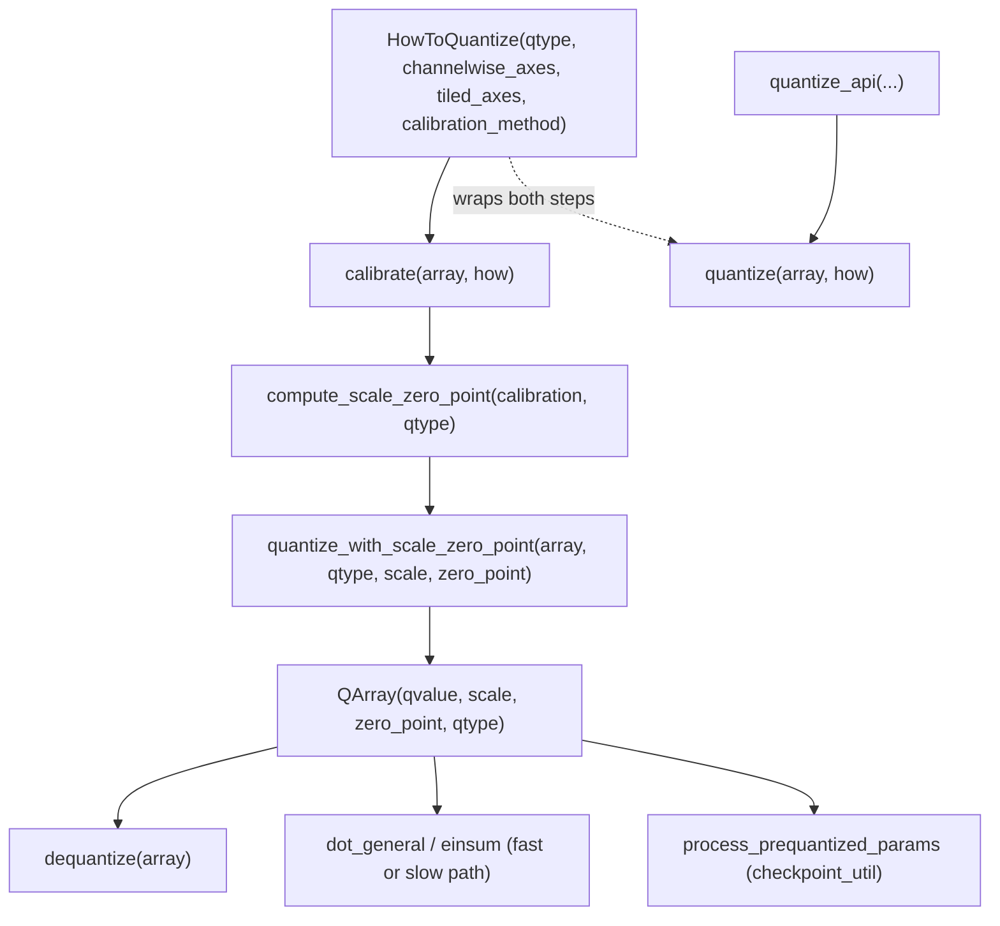

# qwix._src.core.qarray — the QArray data type and quantize/dequantize pipeline

## Overview

[`QArray`](../catalog/qwix/_src/core/qarray.md#QArray) is Qwix's universal quantized-value
representation: a `qvalue`/`scale`/`zero_point`/`qtype` bundle with built-in **subchannel**
support (scale/zero_point may be "generically broadcast" — tiled — against `qvalue`, not just
one scalar per channel). [`HowToQuantize`](../catalog/qwix/_src/core/qarray.md#HowToQuantize) is
the declarative recipe (target `qtype`, `channelwise_axes`, `tiled_axes`, calibration method,
noise function) that [`quantize`](../catalog/qwix/_src/core/qarray.md#quantize) and
[`quantize_api`](../catalog/qwix/_src/core/qarray.md#quantize_api) consume to actually build a
`QArray` from a float array via [`calibrate`](../catalog/qwix/_src/core/qarray.md#calibrate) →
[`compute_scale_zero_point`](../catalog/qwix/_src/core/qarray.md#compute_scale_zero_point) →
[`quantize_with_scale_zero_point`](../catalog/qwix/_src/core/qarray.md#quantize_with_scale_zero_point).
[`dequantize`](../catalog/qwix/_src/core/qarray.md#dequantize) is the exact reverse. Every
Qwix provider — [`PtqProvider.dot_general`](../catalog/qwix/_src/providers/ptq.md#PtqProvider.dot_general),
[`LoraProvider.dot_general`](../catalog/qwix/_src/providers/lora.md#LoraProvider.dot_general),
the core [`dot_general`](../catalog/qwix/_src/core/dot_general.md#dot_general)/[`einsum`](../catalog/qwix/_src/core/einsum.md#einsum)
kernels, and checkpoint utilities like
[`process_prequantized_params`](../catalog/qwix/_src/utils/checkpoint_util.md#process_prequantized_params) —
is ultimately producing, consuming, or converting a `QArray`.

## Diagram

## Design rationale (why it's built this way)

**One data type serves weight-only, dynamic-range, and static-range quantization uniformly.**
Every quantization mode in Qwix — [`PtqProvider.dot_general`](../catalog/qwix/_src/providers/ptq.md#PtqProvider.dot_general)
for inference, [`LoraProvider.dot_general`](../catalog/qwix/_src/providers/lora.md#LoraProvider.dot_general)
for QLoRA, and the checkpoint-loading path in
[`_process_quantized_param`](../catalog/qwix/_src/utils/checkpoint_util.md#_process_quantized_param) —
consumes the same `QArray` shape, so a weight quantized offline (GPTQ, AWQ) is interchangeable
with one quantized on the fly, as long as both produce a `QArray`.

**`HowToQuantize` decouples *what* to quantize to from *how* the scale is computed.**
[`calibrate`](../catalog/qwix/_src/core/qarray.md#calibrate) reads only `channelwise_axes`,
`tiled_axes`, and `calibration_method` off [`HowToQuantize`](../catalog/qwix/_src/core/qarray.md#HowToQuantize);
[`compute_scale_zero_point`](../catalog/qwix/_src/core/qarray.md#compute_scale_zero_point) reads
only `qtype`. This split is what lets [`get_how_to_quantize`](../catalog/qwix/_src/core/dot_general.md#get_how_to_quantize)
(see [qwix-_src-core-dot_general](qwix-_src-core-dot_general.md)) build a `HowToQuantize` purely
from `dot_general`'s dimension numbers, with zero knowledge of the calibration math itself.

**`quantize_api` exists purely to avoid exposing `HowToQuantize` construction to end users.**
[`quantize_api`](../catalog/qwix/_src/core/qarray.md#quantize_api) is documented as "a stable API
for `qarray.quantize()`" — it takes the same knobs as keyword arguments and builds the
`HowToQuantize` internally, insulating external callers from that dataclass's shape.

## Entry points

- [`quantize`](../catalog/qwix/_src/core/qarray.md#quantize) / [`quantize_api`](../catalog/qwix/_src/core/qarray.md#quantize_api) —
  reached whenever a float array needs to become a `QArray` under dynamic-range calibration;
  called directly by [`PtqProvider.dot_general`](../catalog/qwix/_src/providers/ptq.md#PtqProvider.dot_general)'s
  weight/activation preparation and by [`quantize`](../catalog/qwix/contrib/padded_ptq.md#quantize)
  in the padded-PTQ variant.
- [`calibrate`](../catalog/qwix/_src/core/qarray.md#calibrate) — reached from
  [`quantize`](../catalog/qwix/_src/core/qarray.md#quantize) and directly by
  [`SqCalibrationProvider.compute_stats`](../catalog/qwix/contrib/smooth_quant.md#SqCalibrationProvider.compute_stats)
  when a provider needs calibration statistics without immediately quantizing.
- [`dequantize`](../catalog/qwix/_src/core/qarray.md#dequantize) — reached wherever a `QArray`
  must become a plain array again, e.g. inside
  [`_dequantize_quantized_param`](../catalog/qwix/_src/utils/checkpoint_util.md#_dequantize_quantized_param)
  when a checkpoint is prequantized but the live model expects full precision.
- [`compute_scale_zero_point`](../catalog/qwix/_src/core/qarray.md#compute_scale_zero_point) —
  reached both from [`quantize`](../catalog/qwix/_src/core/qarray.md#quantize) and directly by
  [`quantize_act`](../catalog/qwix/_src/providers/ptq.md#quantize_act) when reconstructing scale/
  zero_point from previously-collected quant stats (static-range quantization).

## Mechanism (step-by-step)

1. **A caller builds a [`HowToQuantize`](../catalog/qwix/_src/core/qarray.md#HowToQuantize)** —
   directly, or via [`get_how_to_quantize`](../catalog/qwix/_src/core/dot_general.md#get_how_to_quantize)/
   [`get_how_to_quantize`](../catalog/qwix/_src/core/einsum.md#get_how_to_quantize), which derive
   `channelwise_axes`/`tiled_axes` from `dot_general`/`einsum`'s dimension numbers rather than
   requiring the caller to specify axes manually.
2. **[`quantize`](../catalog/qwix/_src/core/qarray.md#quantize) calls
   [`calibrate`](../catalog/qwix/_src/core/qarray.md#calibrate)**, which reduces the array over
   its non-channelwise, non-tiled axes according to `how.`[`calibration_method`](../catalog/qwix/_src/core/qarray.md#HowToQuantize.calibration_method)
   (`absmax`/`minmax`/`rms`/`fixed`) to produce a calibration dict (`{'min','max'}` or
   `{'absmax'}`).
3. **[`compute_scale_zero_point`](../catalog/qwix/_src/core/qarray.md#compute_scale_zero_point)**
   converts that calibration dict plus `how.`[`qtype`](../catalog/qwix/_src/core/qarray.md#HowToQuantize.qtype)
   into a concrete `(scale, zero_point)` pair, special-casing block-floating-point formats
   (`mxfp8`/`mxfp4`/`nvfp4`) by snapping the scale to a power of two or an fp8 value.
4. **[`quantize_with_scale_zero_point`](../catalog/qwix/_src/core/qarray.md#quantize_with_scale_zero_point)**
   divides (or multiplies by the reciprocal) the array by `scale`, adds `zero_point`, and converts
   to the target storage dtype, producing the final [`QArray`](../catalog/qwix/_src/core/qarray.md#QArray).
5. **Consumption downstream.** [`dot_general`](../catalog/qwix/_src/core/dot_general.md#dot_general)/
   [`einsum`](../catalog/qwix/_src/core/einsum.md#einsum) branch on whether operands are `QArray`
   and pick a fast (compute in quantized types) or slow (dequantize first) path;
   [`process_prequantized_params`](../catalog/qwix/_src/utils/checkpoint_util.md#process_prequantized_params)
   builds `QArray` leaves directly from a checkpoint's `qvalue`/`scale`/`zero_point` triple via
   [`_process_quantized_param`](../catalog/qwix/_src/utils/checkpoint_util.md#_process_quantized_param).

## Key data structures

- **[`QArray`](../catalog/qwix/_src/core/qarray.md#QArray)** — `qvalue`, `scale`, `zero_point`
  (`None` for symmetric quantization), `qtype`; a `flax.struct.dataclass` so it is a valid pytree
  node and can live inside `nn.Module`/`nnx.Module` state.
- **[`HowToQuantize`](../catalog/qwix/_src/core/qarray.md#HowToQuantize)** —
  [`qtype`](../catalog/qwix/_src/core/qarray.md#HowToQuantize.qtype),
  [`channelwise_axes`](../catalog/qwix/_src/core/qarray.md#HowToQuantize.channelwise_axes),
  [`tiled_axes`](../catalog/qwix/_src/core/qarray.md#HowToQuantize.tiled_axes), calibration method,
  noise function — a frozen, slotted dataclass, cheap to construct per-op.
- **[`MaybeQArray`](../catalog/qwix/_src/core/qarray.md#MaybeQArray.MaybeQArray)** — the type
  alias (`jax.Array | QArray`) threaded through every quantization-aware op signature in the
  codebase, marking "this argument may or may not already be quantized".

## Dynamics (design intent)

Because `HowToQuantize` is immutable and reconstructed per-call (not cached on the provider),
every `dot_general`/`einsum` interception can compute a fresh, shape-specific quantization recipe
without any provider-side mutable state — a design that composes cleanly with `jax.jit` tracing,
since no Python-side cache keyed on shape needs to be invalidated across retraces.

## Edge cases

- Block-floating-point qtypes (`mxfp8`/`mxfp4`/`nvfp4`) require `tiled_axes` to be set to a fixed
  tile size (32 for mxfp8/mxfp4, 16 for nvfp4) — `HowToQuantize.__post_init__` enforces this and
  raises if the caller supplies a mismatched tile size.
- [`quantize_with_scale_zero_point`](../catalog/qwix/_src/core/qarray.md#quantize_with_scale_zero_point)
  refuses to quantize non-floating-point input arrays (checked at the top of the function) —
  quantizing an already-quantized or integer array is a hard error, not a silent no-op.

## Open questions

- Whether `USE_RECIPROCAL_FOR_QUANTIZATION` (a module-level constant toggling divide-vs-multiply
  in the quantize step) is ever intended to become a per-call configuration rather than a global
  flag is not resolved by this packet's cited symbols.

## See also
- [qwix-_src-core-dot_general](qwix-_src-core-dot_general.md) — the primary consumer of `QArray`
  for matmul-shaped ops.
- [qwix-_src-providers-ptq](qwix-_src-providers-ptq.md) — `PtqProvider`, which builds `QArray`
  weights/activations via this module.
- [qwix-_src-utils-checkpoint_util](qwix-_src-utils-checkpoint_util.md) — converting between
  on-disk prequantized dicts and `QArray` leaves.
