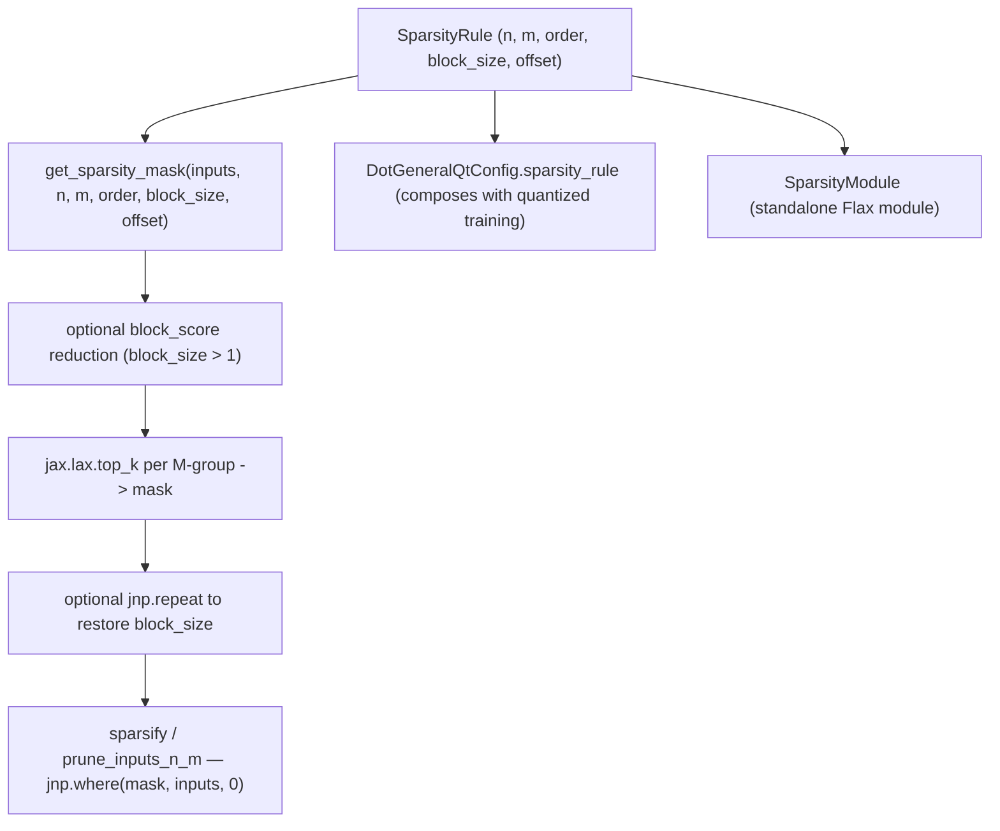

# qwix._src.core.sparsity — N:M structured pruning

## Overview

This module implements N:M structured sparsity — at most N non-zero values in every consecutive
block of M — as a mask-computation-plus-apply pair:
[`get_sparsity_mask`](../catalog/qwix/_src/core/sparsity.md#get_sparsity_mask) picks the top-N
(by magnitude) positions per M-sized group along a chosen axis, and
[`sparsify`](../catalog/qwix/_src/core/qarray.md#sparsify) (in
[qwix-_src-core-qarray](qwix-_src-core-qarray.md)) zeroes everything else via `jnp.where`.
[`SparsityRule`](../catalog/qwix/_src/core/sparsity.md#SparsityRule) is the declarative
configuration — separate `weight_sparsity_*`/`activation_sparsity_*` field groups — that both
[`DotGeneralQtConfig.sparsity_rule`](../catalog/qwix/_src/core/dot_general_qt.md#DotGeneralQtConfig.sparsity_rule)
and the standalone `SparsityModule` (in `qwix.contrib.sparsity`) consume.
[`prune_inputs_n_m`](../catalog/qwix/_src/core/sparsity.md#prune_inputs_n_m) is the
one-shot convenience wrapper combining mask computation and application.

## Diagram

## Design rationale (why it's built this way)

**Magnitude-based top-k, not a threshold, guarantees exactly N survivors per block.** Rather than
computing a global or per-block magnitude threshold (which could leave a variable count of
survivors per block if there are ties),
[`get_sparsity_mask`](../catalog/qwix/_src/core/sparsity.md#get_sparsity_mask) reshapes the input
into `(..., group, m_sparsity)` and calls `jax.lax.top_k(..., k=n_sparsity)` per group — a direct,
exact way to guarantee every M-block keeps precisely N nonzero entries, which is what makes N:M
sparsity a *structured* format hardware can exploit (versus unstructured pruning's irregular
sparsity pattern).

**`order` (`'R'` vs `'C'`) exists because weight and activation tensors have different natural
reduction axes.** The docstring is explicit: `'C'` (column-wise) suits weight tensors where the
reduction dimension is the contraction axis, while `'R'` (row-wise) suits activations — the
function handles both by transposing (`jnp.einsum('...ij->...ji', ...)`) before and after the
core top-k logic when `order='C'`, rather than duplicating the top-k logic per orientation.

**`offset` targets XLA's physical tile layout, not just a mathematical variant.** The docstring
notes that because XLA lays out tensors in lanes of 128 and sublanes of 8, "widely-separated"
N:M sparsity (`offset=128`) may better match the hardware's actual memory layout than the default
"narrowly-separated" (`offset=0`) grouping of adjacent values — this is a TPU-layout-aware knob,
not a purely algorithmic one.

**`block_size` adds a coarser pre-reduction before the fine-grained N:M selection.** When
`block_size > 1`, [`get_sparsity_mask`](../catalog/qwix/_src/core/sparsity.md#get_sparsity_mask)
first reduces each `block_size`-sized chunk to a single magnitude score
([`block_score`](../catalog/qwix/_src/core/sparsity.md#get_sparsity_mask.block_score), sum of
absolute values) via `jnp.apply_along_axis`, runs N:M selection over the *block scores*, then
expands the resulting mask back out with `jnp.repeat` — so an entire block is kept-or-pruned as a
unit, useful when the pruning granularity needs to be coarser than individual elements (e.g. to
match a kernel's tile size).

## Entry points

- [`get_sparsity_mask`](../catalog/qwix/_src/core/sparsity.md#get_sparsity_mask) — the core mask
  computation; called by [`sparsify`](../catalog/qwix/_src/core/qarray.md#sparsify) in
  [qwix-_src-core-qarray](qwix-_src-core-qarray.md) and by
  [`prune_inputs_n_m`](../catalog/qwix/_src/core/sparsity.md#prune_inputs_n_m).
- [`prune_inputs_n_m`](../catalog/qwix/_src/core/sparsity.md#prune_inputs_n_m) — the one-call
  mask-and-apply convenience wrapper.
- [`SparsityModule.__call__`](../catalog/qwix/contrib/sparsity/sparsity_module.md#SparsityModule.__call__) /
  [`.mask_update`](../catalog/qwix/contrib/sparsity/sparsity_module.md#SparsityModule.mask_update) —
  the standalone Flax module wrapping this sparsity logic for direct use outside the
  quantization-provider machinery.

## Mechanism (step-by-step)

1. **Validation.** [`get_sparsity_mask`](../catalog/qwix/_src/core/sparsity.md#get_sparsity_mask)
   asserts `n_sparsity <= m_sparsity`, validates `order in ('C', 'R')`, `offset >= 0`, and that the
   input size divides evenly by `m_sparsity` (and by `offset * m_sparsity` when `offset > 0`).
2. **Optional block reduction.** If `block_size > 1`, the input is reshaped into blocks and reduced
   via [`block_score`](../catalog/qwix/_src/core/sparsity.md#get_sparsity_mask.block_score)
   (sum of absolute values per block), transposing first if `order == 'C'`.
3. **Core top-k selection**, inside
   [`get_sparsity_mask`](../catalog/qwix/_src/core/sparsity.md#get_sparsity_mask). The (possibly
   block-reduced) input is reshaped into `(group, m_sparsity)` groups (with an extra `offset` axis
   if `offset > 0`), and `jax.lax.top_k` picks the `n_sparsity` largest-magnitude positions per
   group, producing a boolean mask via `jax.nn.one_hot` reduction.
4. **Mask reshaping back**, still inside
   [`get_sparsity_mask`](../catalog/qwix/_src/core/sparsity.md#get_sparsity_mask). The offset/block
   transformations are undone in reverse (transpose, reshape, `jnp.repeat` for block expansion) to
   produce a mask matching the original input shape.
5. **Application.** [`sparsify`](../catalog/qwix/_src/core/qarray.md#sparsify)/
   [`prune_inputs_n_m`](../catalog/qwix/_src/core/sparsity.md#prune_inputs_n_m) apply the mask via
   `jnp.where(mask, inputs, zeros_like(inputs))`.

## Key data structures

- **[`SparsityRule`](../catalog/qwix/_src/core/sparsity.md#SparsityRule)** — a frozen, keyword-only
  dataclass with parallel `weight_sparsity_*`
  ([`weight_sparsity_n`](../catalog/qwix/_src/core/sparsity.md#SparsityRule.weight_sparsity_n)/
  [`weight_sparsity_m`](../catalog/qwix/_src/core/sparsity.md#SparsityRule.weight_sparsity_m)/order/
  block_size/offset/start_step/update_step) and `activation_sparsity_*` field groups, plus
  `eval_mode` — letting weight and activation sparsity be configured completely independently.

## Dynamics (design intent)

`weight_sparsity_start_step`/`weight_sparsity_update_step` on `SparsityRule` (not exercised by the
functions in this module directly, but present on the rule) imply the intended usage pattern is a
training loop that starts pruning only after `start_step` and periodically recomputes the mask
every `update_step` — a curriculum rather than a fixed mask applied from step 0, echoed by the
`# TODO(b/493278511): Replace this with curriculum learning` comment on
[`sparsify`](../catalog/qwix/_src/core/qarray.md#sparsify) itself.

## Edge cases

- [`get_sparsity_mask`](../catalog/qwix/_src/core/sparsity.md#get_sparsity_mask) raises if the
  input size isn't evenly divisible by `m_sparsity` (or by `offset * m_sparsity` when `offset > 0`)
  — there is no partial-block fallback; the caller must ensure divisibility.
- [`get_sparsity_mask_unstructured`](../catalog/qwix/_src/core/sparsity.md) (present in source but
  outside this packet's cited subgraph) uses a percentile threshold instead of top-k, and is a
  genuinely different (unstructured) pruning algorithm living in the same module.

## Open questions

- Whether `activation_sparsity_*` fields on `SparsityRule` are consumed anywhere in the current
  codebase (this packet's subgraph shows only `weight_sparsity_n`/`weight_sparsity_m` cited from
  call sites) is not resolved here.

## See also
- [qwix-_src-core-qarray](qwix-_src-core-qarray.md) — `sparsify`, the direct consumer of
  `get_sparsity_mask`.
- [qwix-_src-core-dot_general_qt](qwix-_src-core-dot_general_qt.md) — `DotGeneralQtConfig.sparsity_rule`,
  where N:M sparsity composes with quantized training.
