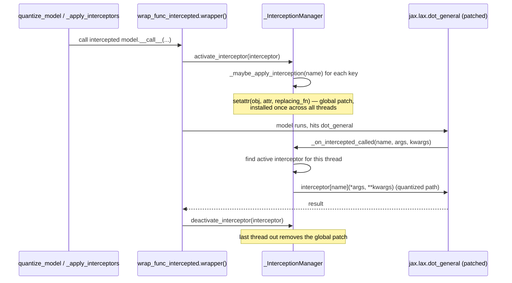

# qwix._src.interception — thread-local monkey-patching for op-level quantization

## Overview

Qwix quantizes a model **without rewriting it**: instead of requiring a model author to call
`qwix.quantize(...)` at every `dot_general`/`einsum` call site, this module monkey-patches those
functions process-wide and dispatches, at call time, to whichever quantization provider is
currently "active" for the calling thread. The core primitive is
[`Interceptor`](../catalog/qwix/_src/interception.md#Interceptor) — an immutable, hashable bundle
of `{qualified_name: replacement_fn}` — and [`wrap_func_intercepted`](../catalog/qwix/_src/interception.md#wrap_func_intercepted),
which wraps a model's forward method so that, for the duration of the call, a set of global
Python attributes are swapped for quantization-aware replacements and then swapped back. The
[`_InterceptionManager`](../catalog/qwix/_src/interception.md#_InterceptionManager._maybe_apply_interception)
singleton (surfaced through its methods
[`activate_interceptor`](../catalog/qwix/_src/interception.md#_InterceptionManager.activate_interceptor)/
[`deactivate_interceptor`](../catalog/qwix/_src/interception.md#_InterceptionManager.deactivate_interceptor))
makes this safe under threads and safe under nesting/nested nnx `scan`/`vmap` calls, which is the
hard part: naive global monkey-patching would leak across threads and re-enter infinitely once a
patched function calls itself.

## Diagram

## Design rationale (why it's built this way)

**Patch the code object, not the module attribute, when JIT must see through the call.** In
[`_preprocess_interceptor`](../catalog/qwix/_src/interception.md#_preprocess_interceptor), a plain
`FunctionType` with no closure variables is rewritten to patch `.__code__` instead of the function
object itself. This matters because JAX's tracing caches functions by identity/`PjitFunction`
pointer in places; rewriting the *bytecode* the existing function object executes (via
[`_fn_to_code`](../catalog/qwix/_src/interception.md#_fn_to_code)) changes behavior without
invalidating any cache keyed on the original function object's identity. `disable_jit=True`
additionally rewrites `PjitFunction`s to their inner `._fun`, bypassing JAX's C++ dispatch entirely
so the patch reaches the actual Python bytecode instead of a compiled trace that already resolved
the unpatched primitive.

**A stable `id` field on `Interceptor` exists purely to keep it JIT-cache-friendly.** The class
docstring is explicit: "Provides an explicit `id` to guarantee a stable hashcode during JIT traces,
even if the enclosed mapping functions are dynamically wrapped or modified." Without this,
[`Interceptor.__hash__`](../catalog/qwix/_src/interception.md#Interceptor.__hash__) would have to
hash the mapping dict's contents, which changes shape every time
[`_preprocess_interceptor`](../catalog/qwix/_src/interception.md#_preprocess_interceptor) rewrites a
key — a different hash per call would defeat `jax.jit`'s trace cache. Using `id(provider)` instead
(see [qwix-_src-model](qwix-_src-model.md)) keeps the hash constant across retraces of the same
provider.

**Non-recursive by construction, not by convention.**
[`_on_intercepted_called`](../catalog/qwix/_src/interception.md#_InterceptionManager._on_intercepted_called)
disables the interceptor it is about to invoke for the current thread *before* calling the
replacement function, and only re-enables it in a `finally` block. This is what lets a replacement
implementation call the original (now-unintercepted) primitive internally without infinite
recursion — critical because a quantized `dot_general` replacement typically still needs to call
the real `jax.lax.dot_general` on the dequantized/requantized operands.

## Entry points

- [`wrap_func_intercepted`](../catalog/qwix/_src/interception.md#wrap_func_intercepted) — the
  primary entry point; wraps a model's forward method (called by the model-quantization layer's
  `_apply_interceptors` helper, see [qwix-_src-model](qwix-_src-model.md)) so the model call itself
  installs and tears down the interception scope.
- [`_InterceptionManager.activate_interceptor`](../catalog/qwix/_src/interception.md#_InterceptionManager.activate_interceptor) —
  reached at the start of every intercepted call via
  [`wrap_func_intercepted`](../catalog/qwix/_src/interception.md#wrap_func_intercepted)'s wrapper;
  this is where the actual global monkey-patch gets installed, but only on the *first* activation
  across all threads for that interceptor id.
- [`QuantizationProvider.get_interceptors`](../catalog/qwix/_src/qconfig.md#QuantizationProvider.get_interceptors) /
  [`OdmlQatProvider.get_interceptors`](../catalog/qwix/_src/providers/odml.md#OdmlQatProvider.get_interceptors) —
  reached whenever a provider needs to supply the `{name: replacement}` mapping that becomes an
  [`Interceptor`](../catalog/qwix/_src/interception.md#Interceptor); ODML overrides this to
  install two interceptors in sequence (a low-level structural one plus the standard numerical
  one) rather than the base provider's single interceptor.

## Mechanism (step-by-step)

1. **A provider builds an [`Interceptor`](../catalog/qwix/_src/interception.md#Interceptor)** —
   an immutable `mapping` of qualified names (e.g. `"jax.lax.dot_general"`) to replacement
   callables, tagged with a stable [`id`](../catalog/qwix/_src/interception.md#Interceptor.id)
   (typically `id(provider)`).
2. **[`wrap_func_intercepted`](../catalog/qwix/_src/interception.md#wrap_func_intercepted)'s
   `wrapper` runs [`_preprocess_interceptor`](../catalog/qwix/_src/interception.md#_preprocess_interceptor)
   on every call** to rewrite the mapping's keys (`PjitFunction` → `._fun`, plain function →
   `.__code__`) so the manager patches the right underlying object for JAX-aware targets.
3. **If [`is_active`](../catalog/qwix/_src/interception.md#_InterceptionManager.is_active) reports
   this thread already has the interceptor active (or `should_intercept()` is false), the wrapper
   calls straight through** to the unwrapped `func`, avoiding any patching overhead on
   already-nested calls — this is the mechanism the docstring calls "non-recursive".
4. **Otherwise [`activate_interceptor`](../catalog/qwix/_src/interception.md#_InterceptionManager.activate_interceptor)
   marks `(thread_id, interceptor.id)` active**, and if no other thread already has this exact
   interceptor installed, it calls
   [`_maybe_apply_interception`](../catalog/qwix/_src/interception.md#_InterceptionManager._maybe_apply_interception)
   for each mapped name — this is the actual `setattr` that patches Python module/class
   attributes (or a function's `__code__`) process-wide.
5. **When the patched target is called,
   [`_on_intercepted_called`](../catalog/qwix/_src/interception.md#_InterceptionManager._on_intercepted_called)
   looks up which active interceptor (in earliest-installed-first order) should handle it for the
   current thread**, disables that interceptor for the thread (recursion guard), invokes the
   replacement, and re-enables it in a `finally`. Nested interceptors compose: a later-installed
   interceptor's replacement runs *inside* an earlier one's active scope.
6. **[`deactivate_interceptor`](../catalog/qwix/_src/interception.md#_InterceptionManager.deactivate_interceptor)
   unmarks the thread**, and once no thread references that interceptor id anymore, its patches are
   removed via `_maybe_remove_interception`, restoring the original functions/code objects.

## Key data structures

- **[`Interceptor`](../catalog/qwix/_src/interception.md#Interceptor)** — frozen dataclass,
  `Mapping[str, Function]` subclass; [`mapping`](../catalog/qwix/_src/interception.md#Interceptor.mapping)
  (name → replacement) plus [`id`](../catalog/qwix/_src/interception.md#Interceptor.id) (stable
  hash source). `__hash__` returns `id` directly, not a hash of the mapping.
- **`_InterceptionManager._original_fns`** — `dict[str, FunctionType]` of the pre-patch functions,
  keyed by the (possibly rewritten) attribute path; used both to call through and to restore state
  on teardown.
- **`_InterceptionManager._intercepted_threads`** — `dict[(thread_id, interceptor_id), bool]`, the
  thread-local activation table that both `is_active` and `_on_intercepted_called` consult.

## Dynamics (design intent)

The manager is explicitly documented as supporting "thread-local interception", "multi-thread
support" (the same interceptor installed from multiple threads shares one global patch, refcounted
by how many `(thread, id)` pairs reference it), and "nested interception" (different interceptors
stack, with the outermost-installed one wrapping the innermost). All shared mutable state
(`_original_fns`, `_interceptors`, `_intercepted_threads`) is guarded by a single `threading.Lock`
per the class docstring's note that "patching a Python module is a global state mutation" requiring
a process-wide singleton.

## Edge cases

- [`_maybe_apply_interception`](../catalog/qwix/_src/interception.md#_InterceptionManager._maybe_apply_interception)
  raises `ValueError` if two different aliases resolve to the same underlying function or code
  object — it uses `aux_data` markers (`"fn"` on a code object, `"intercepted"` on a function) to
  detect this and refuses to double-patch, since doing so silently would make teardown ambiguous
  (which alias "owns" restoring the original?).
- If registration of one name in a multi-name interceptor fails partway through
  [`activate_interceptor`](../catalog/qwix/_src/interception.md#_InterceptionManager.activate_interceptor),
  the method explicitly unwinds: it pops the thread's activation entry, pops the interceptor from
  the list, and calls `_maybe_remove_interception` for every name it *did* manage to register,
  before re-raising — a partial-activation state is never left installed.
- `disable_jit=True` changes which object gets patched (`PjitFunction._fun` instead of the
  `PjitFunction` itself); mixing providers with different `disable_jit` settings within the same
  process is therefore patching genuinely different attribute paths for what looks like the same
  target function name.

## Open questions

- Whether `_fn_to_code`'s trick of stashing the real function on the *code object* itself (so a
  replaced code object can still recover its target via `aux_data`) has any garbage-collection
  implications when many interceptors are installed and removed over a long-running process is not
  resolved by this packet's cited symbols.

## See also
- [qwix-_src-model](qwix-_src-model.md) — the Flax-facing layer that constructs interceptors from
  a provider and wraps model methods with [`wrap_func_intercepted`](../catalog/qwix/_src/interception.md#wrap_func_intercepted).
- [qwix-_src-qconfig](qwix-_src-qconfig.md) — `QuantizationProvider.get_interceptors`, the default
  single-interceptor factory most providers rely on.
- [qwix-_src-providers-odml](qwix-_src-providers-odml.md) — the provider that installs
  *two* interceptors (structural + numerical) rather than one.
