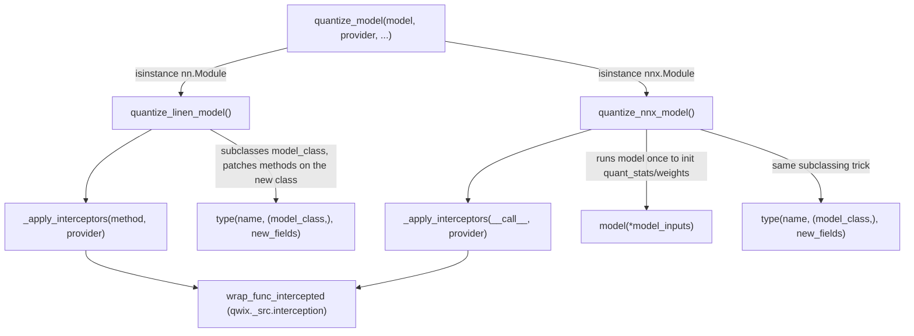

# qwix._src.model — quantizing Linen and NNX models without touching model code

## Overview

This module is the Flax-facing entry point of Qwix:
[`quantize_model`](../catalog/qwix/_src/model.md#quantize_model) takes an existing `nn.Module`
(Linen) or `nnx.Module` (NNX) instance plus a `QuantizationProvider` and returns a **new instance**
whose designated methods run under interception — no changes to the model's source. It dispatches
to [`quantize_linen_model`](../catalog/qwix/_src/model.md#quantize_linen_model) or
[`quantize_nnx_model`](../catalog/qwix/_src/model.md#quantize_nnx_model) because the two Flax APIs
have fundamentally different lifecycles: Linen methods are pure functions of `(params, inputs)`
re-invoked through `.apply()`, while NNX modules are stateful objects that must actually be *run*
once to materialize their (possibly quantized) parameter state. Both paths converge on the same
primitive from [qwix-_src-interception](qwix-_src-interception.md):
[`_apply_interceptors`](../catalog/qwix/_src/model.md#_apply_interceptors) wraps the target method
with [`wrap_func_intercepted`](../catalog/qwix/_src/interception.md#wrap_func_intercepted), giving
the provider's replacement functions control every time the wrapped method calls an intercepted op
like `dot_general`.

## Diagram

## Design rationale (why it's built this way)

**Quantization is applied by dynamic subclassing, not by monkey-patching the instance.** Both
[`quantize_linen_model`](../catalog/qwix/_src/model.md#quantize_linen_model) and
[`quantize_nnx_model`](../catalog/qwix/_src/model.md#quantize_nnx_model) do
`model.__class__ = type(model_class.__name__, (model_class,), new_fields)` rather than setting
attributes on `model` directly. For Linen, this is forced by `nn.Module.apply` internally invoking
a *copy* of the model — setting an intercepted method as an instance attribute would be discarded
on that copy, so the interception has to live on the class the copy inherits from. The module's own
comment calls this out explicitly for a VAE model where `encode`/`decode` are intercepted but
`__call__` invokes them: instance-level patching silently stops working across the internal copy.

**A `_unquantized_type` marker makes quantization idempotent and re-appliable.** Both quantize
paths check `hasattr(model_class, "_unquantized_type")` and, if already quantized, unwrap to the
original class before re-subclassing. This is what allows
[`quantize_model`](../catalog/qwix/_src/model.md#quantize_model) to be called on an
already-quantized model (e.g. to swap providers) without stacking interception layers on top of
each other indefinitely.

**NNX requires an actual forward pass because NNX modules carry live state.** The docstring on
[`quantize_nnx_model`](../catalog/qwix/_src/model.md#quantize_nnx_model) is explicit: "To fully
quantize an NNX model, Qwix needs to run the model at least once... If the model already contains
the correct original weights, this function will quantize them correctly." Unlike Linen (where
`.apply()` is always given explicit params), an NNX module's parameters are attributes of the
object itself; the only way to convert them to quantized (`QArray`) values in place is to actually
execute the intercepted `__call__` so the provider's op replacements run and rewrite the module's
own weight attributes as a side effect.

## Entry points

- [`quantize_model`](../catalog/qwix/_src/model.md#quantize_model) — the public dispatcher; the
  sole entry point most callers use, reached with either an `nn.Module` or `nnx.Module` plus a
  `QuantizationProvider`.
- [`quantize_linen_model`](../catalog/qwix/_src/model.md#quantize_linen_model) — reached from
  `quantize_model` when `model` is an `nn.Module`; also directly documents the "unwrap → intercept
  → rewrap `nn.jit`" three-step method transformation.
- [`quantize_nnx_model`](../catalog/qwix/_src/model.md#quantize_nnx_model) — reached from
  `quantize_model` when `model` is an `nnx.Module`; this is where per-module `qwix_path` and
  `qwix_rngs` attributes get set (read by
  [`module_path`](../catalog/qwix/_src/qconfig.md#QuantizationRule.module_path)-driven rule
  matching, since NNX modules have no built-in scope path).
- [`_apply_interceptors`](../catalog/qwix/_src/model.md#_apply_interceptors) — the shared
  finishing step both paths call; reached once a target method has been identified, wrapping it via
  [`wrap_func_intercepted`](../catalog/qwix/_src/interception.md#wrap_func_intercepted) with the
  provider's interceptor(s) (one for most providers, two for ODML-style providers with a separate
  structural pass).

## Mechanism (step-by-step)

1. **[`quantize_model`](../catalog/qwix/_src/model.md#quantize_model) type-dispatches** and
   validates the calling convention per model kind: Linen models must not receive `model_inputs`
   (they're method-agnostic until `.apply()`), NNX models must receive them (needed to actually run
   the model), and NNX quantization only supports a single method name.
2. **For Linen, [`quantize_linen_model`](../catalog/qwix/_src/model.md#quantize_linen_model) copies
   the model**, then for each target method name: unwraps any `nn.jit`-style wrapper
   (`method_handler_wrapped` loop), calls
   [`_apply_interceptors`](../catalog/qwix/_src/model.md#_apply_interceptors) on the unwrapped
   method with `output_transform=provider.process_model_output`, then re-wraps with
   `nn.module.wrap_method_once` if it had been wrapped — preserving whatever JIT/tracing behavior
   the original method had.
3. **[`quantize_linen_model`](../catalog/qwix/_src/model.md#quantize_linen_model) creates a new
   subclass with the intercepted methods as class attributes** (`model.__class__ = type(...)`),
   preserving `_unquantized_type` so a later re-quantization or an explicit "get me the original
   class" query can unwind it.
4. **For NNX, [`quantize_nnx_model`](../catalog/qwix/_src/model.md#quantize_nnx_model) clones the
   model** (`nnx.clone`), subclasses similarly but only for the single `call_method`, then iterates
   every submodule (`model.iter_modules()`) to set `qwix_path` (for rule matching) and
   `qwix_rngs`, and to disable `quant_stats` collection for the initializing call
   (`disable_quant_stats_update = True`).
5. **[`quantize_nnx_model`](../catalog/qwix/_src/model.md#quantize_nnx_model) invokes the model
   once** (unless `skip_nnx_init` is set) to force weight conversion and quant-stats collection to
   actually happen — this is the "at least once" requirement the docstring calls out.
6. **[`quantize_nnx_model`](../catalog/qwix/_src/model.md#quantize_nnx_model) clears
   `disable_quant_stats_update` and unsets `qwix_rngs`** across all submodules via
   `model.set_attributes(...)` so subsequent calls behave like normal forward passes (collecting
   fresh stats where static-range quantization is enabled) rather than the special init call.

## Key data structures

- **`_unquantized_type`** — a class attribute stashed on the dynamically created subclass, pointing
  back at the pre-quantization class; the mechanism both re-quantization and (implicitly)
  checkpoint code rely on to recover the base model type.
- **NNX per-module attributes** — `qwix_path` (the rule-matching key, analogous to Linen's
  `scope`), `qwix_rngs` (shared RNG source for stochastic ops like LoRA init/dropout), and
  `disable_quant_stats_update` (a flag suppressing stats collection during the one-time init call).

## Dynamics (design intent)

The Linen path's unwrap/rewrap dance around `nn.jit` exists so that interception is applied to the
method's *logical* body, executing inside a proper Linen scope — wrapping the outer `nn.jit`
directly would intercept before scope machinery runs. `_output_transform_nnx` reaches into the
calling frame (`inspect.currentframe().f_back.f_locals["args"]`) specifically so that
`flax_util.get_current_module()` (see [qwix-_src-utils-flax_util](qwix-_src-utils-flax_util.md))
still resolves correctly inside the output transform, since by that point the model may have been
cloned and the closed-over `model` reference in `quantize_nnx_model` is stale.

## Edge cases

- NNX quantization requires `len(methods) == 1` — `quantize_model` raises if more than one method
  name is requested for an NNX model, unlike Linen which can intercept an arbitrary set of methods
  in one call.
- If `skip_nnx_init=True`, quantized weights and `quant_stats` are never materialized by
  `quantize_nnx_model` itself — the caller is responsible for triggering at least one forward pass
  later, or the "quantization" is a no-op on the parameter values.
- Re-quantizing an already-quantized model works by unwrapping to `_unquantized_type` first; doing
  this manually (bypassing `quantize_model`) and forgetting the unwrap would stack interceptors
  rather than replace them.

## Open questions

- Whether calling `quantize_model` a second time with a *different* provider on an NNX model
  correctly discards the first provider's `quant_stats` collection state, or whether stale stats
  from the first pass could leak into the second, is not resolved by this packet's cited symbols.

## See also
- [qwix-_src-interception](qwix-_src-interception.md) — the monkey-patching primitive
  (`wrap_func_intercepted`, `Interceptor`) this module builds on.
- [qwix-_src-qconfig](qwix-_src-qconfig.md) — `QuantizationRule.module_path` matching, which
  depends on the `qwix_path`/scope this module establishes per-module.
- [qwix-_src-utils-flax_util](qwix-_src-utils-flax_util.md) — `get_current_module`/
  `get_current_module_path`, read during interception to resolve "where are we" for rule matching.
