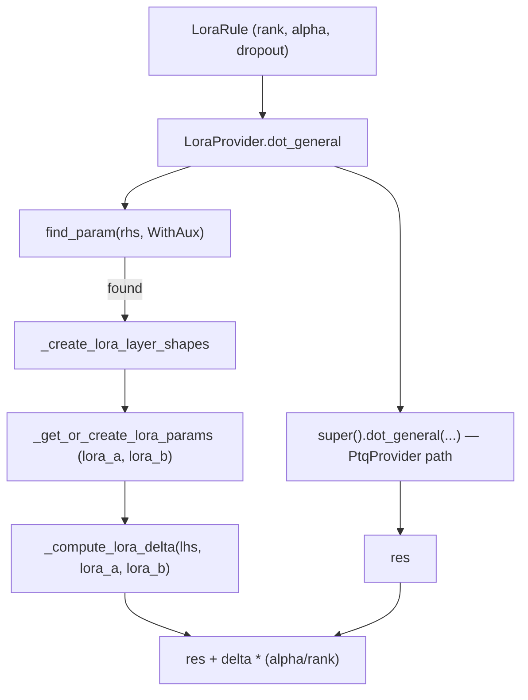

# qwix._src.providers.lora — (Q)LoRA as a delta added on top of a frozen quantized base

## Overview

`LoraProvider` inherits from [`PtqProvider`](qwix-_src-providers-ptq.md) — because during LoRA
training the base model weights are frozen (PTQ-style, quantized once) — and adds one thing on
top: for every `dot_general`/`einsum`/`conv_general_dilated` matched by a
[`LoraRule`](../catalog/qwix/_src/providers/lora.md#LoraRule), it computes a low-rank correction
`lora_a @ lora_b` and adds `delta * (alpha / rank)` to the base op's result. This makes QLoRA a
straightforward composition: `PtqProvider` handles quantizing/dequantizing the frozen base weight,
and `LoraProvider` only owns the extra low-rank math and parameter lifecycle.

## Diagram

## Design rationale (why it's built this way)

**LoRA computes the *full* base result first, then adds a correction — it never fuses into the
quantized matmul itself.** [`LoraProvider.dot_general`](../catalog/qwix/_src/providers/lora.md#LoraProvider.dot_general)'s
first line is `res = super().dot_general(...)`, delegating entirely to `PtqProvider`'s quantized
path; the LoRA-specific work only starts afterward. This keeps the quantized-matmul kernel free of
any LoRA awareness — LoRA is a pure post-hoc addition, which is why `LoraProvider` can be defined
in ~500 lines without touching [qwix-_src-core-dot_general](qwix-_src-core-dot_general.md) at all.

**LoRA params are keyed off the base weight's identity, not a separate registry.**
[`_get_or_create_lora_params`](../catalog/qwix/_src/providers/lora.md#_get_or_create_lora_params)
looks up the *boxed* base param (via `module.get_variable`/`getattr`) to read its dtype and
sharding, then derives `lora_a`'s/`lora_b`'s own sharding by transposing the base weight's
partition spec — so a sharded base weight automatically gets correctly-sharded LoRA adapters with
no extra sharding annotations from the user.

**`repeated_call=True` distinguishes "the rule already fired once this call" for stacking with
`PtqProvider`.** [`LoraProvider.dot_general`](../catalog/qwix/_src/providers/lora.md#LoraProvider.dot_general)
calls [`_get_current_rule_and_op_id`](../catalog/qwix/_src/qconfig.md#QuantizationProvider._get_current_rule_and_op_id)
a *second* time with `repeated_call=True` after the `super().dot_general()` call already consumed
one op-id increment — this reuses the same op id/rule match rather than incrementing the counter
twice for what is logically one op.

## Entry points

- [`LoraProvider.dot_general`](../catalog/qwix/_src/providers/lora.md#LoraProvider.dot_general) /
  [`einsum`](../catalog/qwix/_src/providers/lora.md#LoraProvider.einsum) /
  [`conv_general_dilated`](../catalog/qwix/_src/providers/lora.md#LoraProvider.conv_general_dilated) —
  the three intercepted ops; each first delegates to the `PtqProvider` base implementation, then
  conditionally adds the LoRA delta if the matched rule is a `LoraRule`.
- [`_get_or_create_lora_params`](../catalog/qwix/_src/providers/lora.md#_get_or_create_lora_params) —
  reached the first time a matched weight needs its LoRA A/B adapters; subsequent calls return the
  already-created params.
## Mechanism (step-by-step)

1. **Base op runs first.** [`LoraProvider.dot_general`](../catalog/qwix/_src/providers/lora.md#LoraProvider.dot_general)
   calls `super().dot_general(lhs, rhs, dimension_numbers, ...)`, executing the full `PtqProvider`
   quantized (or pass-through) path, producing `res`.
2. **Rule re-check.** A second [`_get_current_rule_and_op_id`](../catalog/qwix/_src/qconfig.md#QuantizationProvider._get_current_rule_and_op_id)`(repeated_call=True)`
   call retrieves the same rule; if it isn't a [`LoraRule`](../catalog/qwix/_src/providers/lora.md#LoraRule),
   `res` is returned unmodified.
3. **Weight identification and shape derivation.** [`find_param`](../catalog/qwix/_src/utils/flax_util.md#find_param)`(rhs,
   ptq.WithAux)` confirms `rhs` is the matched weight (returning early if not); the contracting/
   batch/remaining axes of `rhs` are used to derive `lora_a`'s and `lora_b`'s shapes
   (`(*batch, contract_dims, rank)` and `(*batch, rank, remaining_dims)` respectively).
4. **Param materialization.** [`_get_or_create_lora_params`](../catalog/qwix/_src/providers/lora.md#_get_or_create_lora_params)
   either returns already-initialized `lora_a`/`lora_b` or initializes them fresh — matching the
   base weight's dtype and deriving sharding from it, using
   [`LoraRule.lora_a_initializer`](../catalog/qwix/_src/providers/lora.md#LoraRule)/`lora_b_initializer`
   (the latter defaulting to zeros, so a freshly-initialized LoRA adapter starts as a no-op delta).
5. **Delta computation and combination.** With dropout optionally applied to `lhs` first, the
   low-rank delta is computed as two chained `dot_general`s (`lhs @ lora_a` then `@ lora_b`), and
   the final result is `res + delta * (alpha / `[`rank`](../catalog/qwix/_src/providers/lora.md#LoraRule.rank)`)`
   — the standard LoRA scaling factor.

## Key data structures

- **[`LoraRule`](../catalog/qwix/_src/providers/lora.md#LoraRule)** — `rank`, `alpha`, `dropout`,
  and the A/B initializers; extends `QuantizationRule` so a single rule both selects *which*
  weights get quantized (via inherited PTQ fields) and configures the LoRA adapter shape/scale.
- **`lora_a` / `lora_b`** — the two low-rank factor parameters, stored in the module's variable
  collection alongside the (possibly quantized) base weight, named `<weight>_lora_a`/`_lora_b`.

## Dynamics (design intent)

Because `lora_b`'s default initializer is `zeros` while `lora_a`'s is `he_uniform`, a freshly
attached LoRA adapter contributes exactly zero delta at initialization regardless of `lora_a`'s
random values (`lora_a @ zeros(lora_b) = 0`) — the standard LoRA invariant that training starts
from the frozen base model's exact behavior and only diverges as `lora_b` is trained away from
zero.

## Edge cases

- [`LoraProvider.conv_general_dilated`](../catalog/qwix/_src/providers/lora.md#LoraProvider.conv_general_dilated)
  asserts a specific dimension-number layout (`rhs_spec[0]` is the last rhs dim, `out_spec[1]` is
  the last lhs dim) and raises for anything else — LoRA-on-conv only supports one canonical
  layout, unlike `dot_general`'s more general axis handling.
- `LoraProvider.__init__` accepts either a `rules` sequence or `**kwargs` to build a single
  implicit `LoraRule(**kwargs)`, but raises if both are given — a usability shortcut for the common
  single-rule case that still keeps the general multi-rule path available.

## Open questions

- Whether `LoraProvider` composes with `QtProvider` (LoRA + quantized-gradient training rather
  than LoRA + frozen-PTQ-base) is not addressed — `LoraProvider` only inherits from `PtqProvider`
  in this codebase.

## See also
- [qwix-_src-providers-ptq](qwix-_src-providers-ptq.md) — `PtqProvider`, the base class and
  quantized-weight machinery LoRA builds on.
- [qwix-_src-core-einsum_info](qwix-_src-core-einsum_info.md) — `EinsumInfo`, used by
  `_parse_einsum_str_for_lora` to derive the LoRA einsum string and adapter shapes.
- [qwix-_src-utils-flax_util](qwix-_src-utils-flax_util.md) — `find_param`/`get_or_create_param`,
  the parameter-identity and lifecycle utilities this provider relies on.
