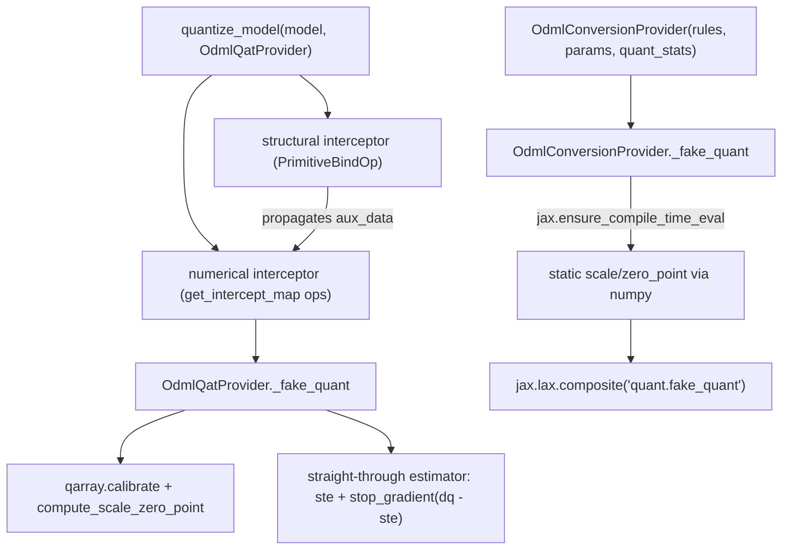

# qwix._src.providers.odml — QAT and static conversion for LiteRT/ODML targets

## Overview

[`OdmlQatProvider`](../catalog/qwix/_src/providers/odml.md#OdmlQatProvider) targets a
fundamentally different hardware model than [`PtqProvider`](qwix-_src-providers-ptq.md)/
[`QtProvider`](qwix-_src-providers-qt.md): LiteRT (TFLite) attaches quantization parameters to
**tensors** (edges in the graph), not operations, so every op that can be represented on-device —
not just `dot_general`/`einsum`/`conv` — needs interception (delegated to
[qwix-_src-providers-odml_ops](qwix-_src-providers-odml_ops.md)). `OdmlConversionProvider` extends
`OdmlQatProvider` for the final export step, replacing the QAT provider's differentiable
fake-quant with statically-computed (numpy, non-traced) scales wrapped in a `jax.lax.composite`
annotation the LiteRT converter recognizes.

## Diagram

## Design rationale (why it's built this way)

**Two interceptors, in a fixed order, because metadata propagation must precede quantization
logic.** `OdmlQatProvider` overrides the base provider's single-interceptor factory to return a
*structural* interceptor (patching `Primitive.bind` itself, tagged with `id=hash((id(self), 0))`)
before a *numerical* interceptor whose mapping comes from
[`get_intercept_map`](../catalog/qwix/_src/providers/odml.md#OdmlQatProvider.get_intercept_map)
(patching high-level ops like `dot_general`, `id=hash((id(self), 1))`) — installed in this order so
every low-level JAX primitive gets its activation/weight/fixed-range metadata tagged and propagated
*before* any high-level op decides whether to insert a fake-quant node, matching the class
docstring's explicit two-tier design.

**`weight_qtype` and `act_qtype` change meaning relative to PTQ, to match LiteRT's tensor-centric
model.** The class docstring is explicit: in `OdmlQatProvider`, `weight_qtype` still quantizes the
matched op's weight input, but `act_qtype` quantizes the matched op's **output**, not its input —
because LiteRT's fusion optimizations (e.g. Conv+ReLU) need the *edge* between ops to carry a
single quantization descriptor, not have quantization parameters tied to whichever op produced or
consumed it.

**`OdmlQatProvider` always disables JIT.** The constructor passes `disable_jit=True`
unconditionally to `super().__init__` — the docstring explains this is required because ODML
relies on Python-level interception of low-level primitives and bytecode patching of
`PjitFunction`s, both of which JAX's C++ dispatch bypasses under normal JIT compilation.

**Conversion reuses the QAT provider's op set but replaces the fake-quant implementation, not the
op-interception layer.** `OdmlConversionProvider(OdmlQatProvider)` overrides only
[`_fake_quant`](../catalog/qwix/_src/providers/odml.md#OdmlConversionProvider._fake_quant) (and
[`get_intercept_map`](../catalog/qwix/_src/providers/odml.md#OdmlQatProvider.get_intercept_map)
to additionally flatten N-D weight contractions down to 2-D before quantizing, since TFLite doesn't
support multiple quantization dimensions) —
every op-matching and metadata-propagation mechanism from
[qwix-_src-providers-odml_ops](qwix-_src-providers-odml_ops.md) is reused unchanged; only *how* a
tensor gets its scale (traced calibration vs. statically-precomputed from `params`/`quant_stats`)
differs.

## Entry points

- [`OdmlQatProvider._fake_quant`](../catalog/qwix/_src/providers/odml.md#OdmlQatProvider._fake_quant) —
  the numerical core every intercepted op in
  [qwix-_src-providers-odml_ops](qwix-_src-providers-odml_ops.md) calls back into; calibrates,
  optionally updates `quant_stats`, computes scale/zero_point, and applies a straight-through
  estimator so gradients flow through the (non-differentiable) round-trip.
- [`OdmlQatProvider.process_model_inputs`](../catalog/qwix/_src/providers/odml.md#OdmlQatProvider.process_model_inputs) /
  its `process_model_output` counterpart — where model inputs are tagged as activations (origin
  points for metadata propagation) and the final output is checked/quantized.
- [`OdmlConversionProvider._fake_quant`](../catalog/qwix/_src/providers/odml.md#OdmlConversionProvider._fake_quant) —
  the static-conversion replacement; wraps the actual quantized computation in a
  `jax.lax.composite` the LiteRT converter recognizes as an atomic fake-quant node.
- [`OdmlQatProvider.get_intercept_map`](../catalog/qwix/_src/providers/odml.md#OdmlQatProvider.get_intercept_map) —
  besides wiring every [`QuantizedOp`](../catalog/qwix/_src/providers/odml_ops.md#QuantizedOp)
  instance from [`get_all_ops`](../catalog/qwix/_src/providers/odml_ops.md#get_all_ops), this is
  also where `flax.linen.Module.param` itself is intercepted, purely to tag each weight with its
  [`AuxDataKey`](../catalog/qwix/_src/providers/odml_ops.md#AuxDataKey) `WEIGHT_NAME` aux-data key
  so downstream ops can distinguish it from an activation.

## Mechanism (step-by-step)

1. **Setup.** `OdmlQatProvider.__init__` builds its op table via
   [`get_all_ops`](../catalog/qwix/_src/providers/odml_ops.md#get_all_ops), patches the contraction
   ops (`conv_general_dilated`/`dot_general`/`einsum`/`dot`) to also accept
   `disable_per_channel_weights`/`check_activation`, and always disables JIT.
2. **Structural pass.** The `PrimitiveBindOp` interceptor (installed ahead of the
   [`get_intercept_map`](../catalog/qwix/_src/providers/odml.md#OdmlQatProvider.get_intercept_map)-built
   numerical interceptor) fires on every JAX primitive invocation, forwarding activation/weight/
   fixed-range/fusion-allowance metadata from inputs to outputs according to whether the primitive
   is value-preserving, linear-scaling, or general (documented in
   [qwix-_src-providers-odml_ops](qwix-_src-providers-odml_ops.md)).
3. **Numerical pass.** For a matched high-level op, the corresponding `QuantizedOp` subclass calls
   [`_fake_quant`](../catalog/qwix/_src/providers/odml.md#OdmlQatProvider._fake_quant) on its
   activation/weight inputs (and/or delayed output) as appropriate for that op's FQ category.
4. **`_fake_quant`'s core.** Checks for a fixed-range override (softmax/tanh/sigmoid have known
   output ranges), calibrates, optionally folds in a moving-average `quant_stat` via
   [`_update_and_get_quant_stat`](../catalog/qwix/_src/providers/odml.md#OdmlQatProvider._update_and_get_quant_stat),
   computes scale/zero_point, quantizes-then-dequantizes, and returns
   `ste_array + stop_gradient(dq_array - ste_array)` — the value is the dequantized (quantized)
   array, but the gradient behaves as if `clip_to_calibration` were the identity.
5. **Conversion path.** [`OdmlConversionProvider._fake_quant`](../catalog/qwix/_src/providers/odml.md#OdmlConversionProvider._fake_quant)
   runs under `jax.ensure_compile_time_eval()`: for a weight, it looks up the real (non-traced) float value
   from `self._flatten_params` and computes scale/zero_point in plain numpy; for a static-range
   activation, it reads the corresponding entry from `self._quant_stats`; either way, the result
   feeds a `jax.lax.composite`-wrapped fake-quant op carrying explicit `scale`/`zero_point`/
   `dtype`/`narrow_range`/`quantization_dimension` attributes for the converter.

## Key data structures

- **`OdmlQatProvider._ops`** — the per-op table from
  [`get_all_ops`](../catalog/qwix/_src/providers/odml_ops.md#get_all_ops), patched at
  construction to thread `disable_per_channel_weights`/`check_activation` into the contraction
  ops.
- **`OdmlConversionProvider._flatten_params` / `_quant_stats`** — the statically-captured float
  params and quant-stats trees used to compute scales outside of JAX tracing.

## Dynamics (design intent)

The straight-through estimator in step 4 is the entire reason QAT works at all: without it, the
`round`/`clip` inside quantization would have zero gradient almost everywhere, stalling training;
by substituting `clip_to_calibration`'s gradient in its place, the backward pass behaves as if
quantization were a clip, letting weights move meaningfully in response to the loss even though the
forward value is genuinely quantized.

## Edge cases

- [`OdmlConversionProvider._get_attributes`](../catalog/qwix/_src/providers/odml.md) raises if the
  computed scale contains NaN/Inf/zero, and only supports `int8` as an output dtype for LiteRT
  export — other qtypes fail loudly at conversion time even if they were valid during QAT.
- `OdmlConversionProvider`'s N-D-to-2-D weight flattening (installed via
  [`get_intercept_map`](../catalog/qwix/_src/providers/odml.md#OdmlQatProvider.get_intercept_map))
  only fires when the weight has `ndim > 2` and the contracting axis is exactly `(0,)` — other
  weight shapes/contraction patterns pass through to the normal
  [`dot_general`](../catalog/qwix/_src/providers/ptq.md#PtqProvider.dot_general).

## Open questions

- Whether `l2_norm` (mentioned in `odml_ops.get_all_ops`'s comments as requiring manual
  registration via the `tanh` handler) is expected to be handled by users extending `_ops`
  themselves, or is a known gap, isn't resolved by the cited source.

## See also
- [qwix-_src-providers-odml_ops](qwix-_src-providers-odml_ops.md) — the per-JAX-op interception
  classes and metadata-propagation rules this provider's `get_intercept_map` wires up.
- [qwix-_src-core-qarray](qwix-_src-core-qarray.md) — `HowToQuantize`/`QArray`/`calibrate`, the
  underlying quantization math both QAT and conversion call into.
- [qwix-_src-qconfig](qwix-_src-qconfig.md) — `QuantizationProvider`/`QuantizationRule`, the base
  class and rule type this provider specializes.
