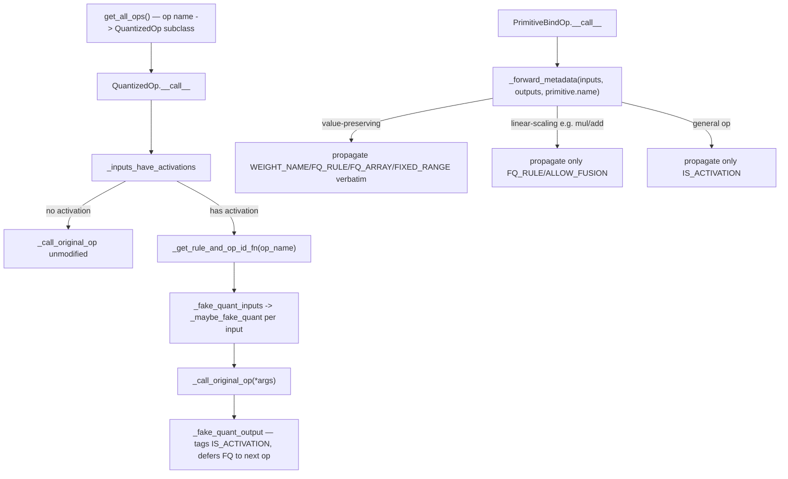

# qwix._src.providers.odml_ops — per-op fake-quant classes and metadata propagation

## Overview

This module is the ODML tensor-centric quantization model made concrete: a table (`get_all_ops`)
of every JAX/Flax function LiteRT understands, each mapped to a `QuantizedOp` subclass whose
[`__call__`](../catalog/qwix/_src/providers/odml_ops.md#QuantizedOp.__call__) encodes *which* of
its inputs/outputs carry an independent quantization scale. Because
LiteRT ties quantization to tensors, not ops, correctness depends on **metadata propagation** —
[`_forward_metadata`](../catalog/qwix/_src/providers/odml_ops.md#_forward_metadata), invoked on
every JAX primitive via [`PrimitiveBindOp`](../catalog/qwix/_src/providers/odml.md), threads an
[`AuxDataKey`](../catalog/qwix/_src/providers/odml_ops.md#AuxDataKey) bundle (activation-ness,
weight identity, pending fake-quant rule, allow-fusion) through every intermediate value so a
downstream op can decide correctly whether to insert a fake-quant node or defer to a later one.

## Diagram

## Design rationale (why it's built this way)

**Ops are categorized by *where* FQ can go, not by name.** The module's own top-of-file comment
lays out three op categories: (1) different-scale-in/out ops needing FQ on all inputs and output
(handled by the generic [`QuantizedOp.__call__`](../catalog/qwix/_src/providers/odml_ops.md#QuantizedOp.__call__)
or custom subclasses like [`DotEinsumConv`](../catalog/qwix/_src/providers/odml_ops.md#DotEinsumConv.__call__));
(2) same-scale-in/out ops needing FQ on only one side
([`OnlyInputOp`](../catalog/qwix/_src/providers/odml_ops.md#OnlyInputOp.__call__)/
[`OnlyOutputOp`](../catalog/qwix/_src/providers/odml_ops.md#OnlyOutputOp.__call__)) or none at all
(transparent ops like reshape); (3) ops with no quantized equivalent
([`NoQuantOp.__call__`](../catalog/qwix/_src/providers/odml_ops.md#NoQuantOp.__call__), e.g.
sin/cos). This taxonomy is what determines each class's
[`input_idx`](../catalog/qwix/_src/providers/odml_ops.md#QuantizedOp.input_idx) and override
behavior, not the specific op semantics.

**Delayed output quantization enables operator fusion.** [`QuantizedOp._fake_quant_output`](../catalog/qwix/_src/providers/odml_ops.md#QuantizedOp._fake_quant_output)
does *not* immediately fake-quantize an op's output — it only tags the output as an activation and
attaches an `FQ_RULE` if static-range quantization applies, deferring the actual FQ insertion to
whichever *later* op consumes it. This is why `dot_general + add + relu` can fuse cleanly on-device:
no FQ node sits between them unless a later op actually needs one.

**Value-dependent metadata only survives value-preserving ops.** [`_forward_metadata`](../catalog/qwix/_src/providers/odml_ops.md#_forward_metadata)'s
docstring spells out three propagation tiers keyed by whether the primitive is in
[`_VALUE_PRESERVING_PRIMITIVES`](../catalog/qwix/_src/providers/odml_ops.md#_VALUE_DEPENDENT_METADATA)
(reshape/transpose/slice/etc. — full metadata including
[`WEIGHT_NAME`](../catalog/qwix/_src/providers/odml_ops.md#AuxDataKey.WEIGHT_NAME)/
[`FQ_RULE`](../catalog/qwix/_src/providers/odml_ops.md#AuxDataKey.FQ_RULE)/
[`FIXED_RANGE`](../catalog/qwix/_src/providers/odml_ops.md#AuxDataKey.FIXED_RANGE)/
[`ALLOW_FUSION`](../catalog/qwix/_src/providers/odml_ops.md#AuxDataKey.ALLOW_FUSION) propagate
verbatim), a linear-arithmetic subset (mul/add/sub/div/neg — only `FQ_RULE`/`ALLOW_FUSION`
propagate, and for `div` specifically only the `activation / const` direction counts as linear),
or the general fallback (only [`IS_ACTIVATION`](../catalog/qwix/_src/providers/odml_ops.md#AuxDataKey.IS_ACTIVATION)
survives) — this stops quantization rules from leaking across a nonlinear op where they'd be
mathematically invalid.

**`DotEinsumConv` special-cases dynamic-range quantization for activation×weight.** Its
[`__call__`](../catalog/qwix/_src/providers/odml_ops.md#DotEinsumConv.__call__) checks
`lhs_is_activation and rhs_is_weight` under a non-static-scale rule specifically to allow
per-channel activation quantization (via
[`_get_how_to_quantize`](../catalog/qwix/_src/providers/odml_ops.md#DotEinsumConv._get_how_to_quantize))
— DRQ (dynamic-range quantization) is the one case where an activation's granularity can go beyond
per-tensor, because the scale is computed fresh at inference time rather than needing to be a fixed
LiteRT tensor descriptor.

## Entry points

- `get_all_ops` — called once by `OdmlQatProvider.__init__` (see
  [qwix-_src-providers-odml](qwix-_src-providers-odml.md)) to build the op-name →
  [`QuantizedOp.__call__`](../catalog/qwix/_src/providers/odml_ops.md#QuantizedOp.__call__) table.
- [`QuantizedOp.__call__`](../catalog/qwix/_src/providers/odml_ops.md#QuantizedOp.__call__) — the
  generic entry point every intercepted op instance is called through; subclasses override it only
  when the generic in/out-quantize pattern doesn't fit (e.g.
  [`BatchNorm`](../catalog/qwix/_src/providers/odml_ops.md#BatchNorm.__call__),
  [`Concatenate`](../catalog/qwix/_src/providers/odml_ops.md#Concatenate.__call__),
  [`Take`](../catalog/qwix/_src/providers/odml_ops.md#Take.__call__),
  [`Silu`](../catalog/qwix/_src/providers/odml_ops.md#Silu.__call__)).
- [`_forward_metadata`](../catalog/qwix/_src/providers/odml_ops.md#_forward_metadata) — called
  from `PrimitiveBindOp.__call__` on every intercepted JAX primitive; the propagation engine
  underlying the entire tensor-centric metadata model.
- [`QuantizedOp._maybe_fake_quant`](../catalog/qwix/_src/providers/odml_ops.md#QuantizedOp._maybe_fake_quant) —
  the per-array decision point: weight vs. activation vs. constant, cached-FQ reuse, and the actual
  call into the provider's `_fake_quant_fn`.

## Mechanism (step-by-step)

1. **An op is called.** [`QuantizedOp.__call__`](../catalog/qwix/_src/providers/odml_ops.md#QuantizedOp.__call__)
   first checks [`_inputs_have_activations`](../catalog/qwix/_src/providers/odml_ops.md#QuantizedOp._inputs_have_activations)
   using [`input_idx`](../catalog/qwix/_src/providers/odml_ops.md#QuantizedOp.input_idx); if none
   of the designated input positions carry `IS_ACTIVATION`, the original op runs unmodified
   (constant-foldable subgraphs are never quantized).
2. **Rule resolution.** [`_get_rule_and_op_id_fn`](../catalog/qwix/_src/providers/odml_ops.md#QuantizedOp._get_rule_and_op_id_fn)
   (bound to the provider's `_get_current_rule_and_op_id`) resolves the matching rule.
3. **Input FQ.** [`_fake_quant_inputs`](../catalog/qwix/_src/providers/odml_ops.md#QuantizedOp._fake_quant_inputs)
   calls [`_maybe_fake_quant`](../catalog/qwix/_src/providers/odml_ops.md#QuantizedOp._maybe_fake_quant)
   per input: weights are quantized immediately (using `act_calibration_method`, since weight
   quantization here behaves like asymmetric activation quantization); non-weight arrays reuse a
   cached `FQ_ARRAY` if the effective rule matches, or get freshly fake-quantized if static-range
   is enabled, or pass through untouched for dynamic-range (deferred to `DotEinsumConv` itself).
4. **The real op runs**, then [`_fake_quant_output`](../catalog/qwix/_src/providers/odml_ops.md#QuantizedOp._fake_quant_output)
   tags every output leaf as an activation and, only for static-range rules, attaches the pending
   `FQ_RULE` for the *next* op to consume.
5. **Structural pass runs in parallel** (via `PrimitiveBindOp`, one level below every high-level
   op): [`_forward_metadata`](../catalog/qwix/_src/providers/odml_ops.md#_forward_metadata)
   forwards the appropriate metadata tier for reshape/transpose/mul/add/etc., keeping the
   `IS_ACTIVATION`/`WEIGHT_NAME`/`FQ_RULE` chain intact across ops the numerical interceptor never
   directly sees.

## Key data structures

- **[`AuxDataKey`](../catalog/qwix/_src/providers/odml_ops.md#AuxDataKey)** — the enum of
  per-array metadata keys ([`FQ_RULE`](../catalog/qwix/_src/providers/odml_ops.md#AuxDataKey.FQ_RULE),
  [`FQ_ARRAY`](../catalog/qwix/_src/providers/odml_ops.md#AuxDataKey.FQ_ARRAY),
  [`ALLOW_FUSION`](../catalog/qwix/_src/providers/odml_ops.md#AuxDataKey.ALLOW_FUSION),
  [`IS_ACTIVATION`](../catalog/qwix/_src/providers/odml_ops.md#AuxDataKey.IS_ACTIVATION),
  [`WEIGHT_NAME`](../catalog/qwix/_src/providers/odml_ops.md#AuxDataKey.WEIGHT_NAME),
  [`FIXED_RANGE`](../catalog/qwix/_src/providers/odml_ops.md#AuxDataKey.FIXED_RANGE)) stored via
  the `aux_data` module keyed by array object identity.
- **[`_VALUE_DEPENDENT_METADATA`](../catalog/qwix/_src/providers/odml_ops.md#_VALUE_DEPENDENT_METADATA)** —
  the subset of `AuxDataKey` that only survives value-preserving ops.
- **[`QuantizedOp.input_idx`](../catalog/qwix/_src/providers/odml_ops.md#QuantizedOp.input_idx)** —
  per-class configuration of which positional args are considered "inputs" for FQ purposes.

## Dynamics (design intent)

`_copy_for_isolation` exists specifically for shared-branch scenarios (e.g. residual connections):
when a tensor with quantization metadata flows into two different downstream branches that would
otherwise apply *different* fake-quant rules to "the same" array, the array is copied and its
value-dependent metadata (`FQ_RULE`/`FQ_ARRAY`) is stripped from the copy, preventing one branch's
quantization decision from silently leaking into the other's.

## Edge cases

- [`UfuncCall._fake_quant_inputs`](../catalog/qwix/_src/providers/odml_ops.md#UfuncCall._fake_quant_inputs)
  special-cases `add`/`sub`/`mul`/`truediv` with a constant second operand under
  `ALLOW_FUSION` — skipping FQ entirely and marking the output as still fusible, since e.g. adding
  a bias constant to an already-fusible conv output shouldn't force a fake-quant boundary.
- [`Take.__call__`](../catalog/qwix/_src/providers/odml_ops.md#Take.__call__) sets a default
  `fill_value=0` for quantized gather ops specifically because an unfilled `nan` would break
  LiteRT conversion — a correctness patch with no analogue in the float path.

## Open questions

- Whether every `AuxDataKey`-tagged array's aux-data entry is reliably garbage-collected once the
  array itself is (since `aux_data` keys by object identity) is not addressed in this packet's
  subgraph.

## See also
- [qwix-_src-providers-odml](qwix-_src-providers-odml.md) — `OdmlQatProvider`/`OdmlConversionProvider`,
  which own the `_fake_quant_fn` callback these op classes invoke.
- [qwix-_src-core-qarray](qwix-_src-core-qarray.md) — `HowToQuantize`, constructed per-op by
  `DotEinsumConv._get_how_to_quantize`.
- [qwix-_src-core-einsum_info](qwix-_src-core-einsum_info.md) — `EinsumInfo`, used to determine
  `DotEinsumConv`'s contraction axes for the `einsum` case.
