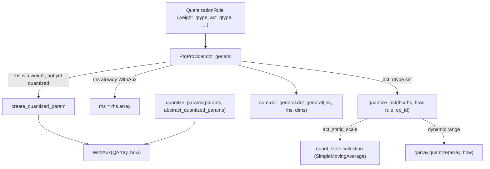

# qwix._src.providers.ptq — the PTQ inference provider and WithAux param wrapper

## Overview

[`PtqProvider`](../catalog/qwix/_src/providers/ptq.md#PtqProvider) is the reference
`QuantizationProvider` implementation: it intercepts `jax.lax.dot_general`, `jax.numpy.einsum`,
and `jax.lax.conv_general_dilated` and replaces their weight/activation operands with
[`QArray`](../catalog/qwix/_src/core/qarray.md#QArray)s built on the fly from a matched
[`QuantizationRule`](../catalog/qwix/_src/qconfig.md#QuantizationRule). Its central trick is
[`WithAux`](../catalog/qwix/_src/providers/ptq.md#WithAux) — a thin wrapper that stores an
unquantized *or* quantized array alongside its [`HowToQuantize`](../catalog/qwix/_src/core/qarray.md#HowToQuantize)
recipe inside the param pytree itself, so `quantize_params` can later quantize an entire
parameter tree offline without re-running the model. `PtqProvider` is also the base class every
other inference-time provider in the repo (`LoraProvider`, `AwqInferenceProvider`,
`SqInferenceProvider`) inherits from.

## Diagram

## Design rationale (why it's built this way)

**Weights stay unquantized at `init` time; quantization happens at first call.** `PtqProvider`'s
own docstring explains the trick: Flax's `module.init` runs both `setup()` and `__call__()`, so
if quantization only happened inside `__call__`'s intercepted [`dot_general`](../catalog/qwix/_src/providers/ptq.md#PtqProvider.dot_general),
the *stored* param after `init` would still be the original float weight — `create_quantized_param`
is what physically replaces it with a [`WithAux`](../catalog/qwix/_src/providers/ptq.md#WithAux)-boxed
[`QArray`](../catalog/qwix/_src/core/qarray.md#QArray) in the module's variable collection during
that very first call.

**`WithAux` makes a `QArray` self-describing for offline quantization.** [`quantize_params`](../catalog/qwix/_src/providers/ptq.md#quantize_params)
quantizes a raw float param tree *without running the model* by reading the `how` field already
embedded in the `WithAux`-wrapped `abstract_quantized_params` tree (built once via `jax.eval_shape`
on the model) — the model architecture only needs to be traced once to learn "what quantization
recipe applies to path X", after which weights can be swapped in bulk.

**Weight vs. activation vs. constant is disambiguated by identity, not by position.**
[`PtqProvider.dot_general`](../catalog/qwix/_src/providers/ptq.md#PtqProvider.dot_general) checks
`isinstance(rhs, WithAux)` first (already-quantized weight), then
[`find_param`](../catalog/qwix/_src/utils/flax_util.md#find_param)`(rhs)` (unquantized weight,
identified by tracing rhs back to a live module parameter), and only then falls to `rule.act_qtype`
(activation). This means the *same* `dot_general` call site handles weight-times-activation,
activation-times-activation, and pass-through uniformly, driven entirely by what `rhs` resolves to
at trace time.

**Static-range quantization reuses the same moving-average machinery as QT's backward pass.**
[`quantize_act`](../catalog/qwix/_src/providers/ptq.md#quantize_act) branches on
`act_static_scale`: if unset, it just calls
[`quantize`](../catalog/qwix/_src/core/qarray.md#quantize) fresh every call (dynamic-range); if
set, it reads a previously-collected `quant_stats` variable (built with a moving-average
accumulator) to get a *fixed* scale/zero_point pair usable across all future calls, letting a PTQ
model converted from a QAT model reuse the QAT run's collected statistics.

## Entry points

- [`PtqProvider.dot_general`](../catalog/qwix/_src/providers/ptq.md#PtqProvider.dot_general) /
  [`einsum`](../catalog/qwix/_src/providers/ptq.md#PtqProvider.einsum) /
  [`conv_general_dilated`](../catalog/qwix/_src/providers/ptq.md#PtqProvider.conv_general_dilated) —
  reached whenever a matched `QuantizationRule` applies to the corresponding JAX primitive; the
  three entry points that actually perform quantized computation.
- `create_quantized_param` — reached the first time a weight is seen unquantized; physically
  replaces the module's stored variable with a
  [`WithAux`](../catalog/qwix/_src/providers/ptq.md#WithAux)-boxed `QArray`.
- [`quantize_act`](../catalog/qwix/_src/providers/ptq.md#quantize_act) — reached for every
  activation quantization decision, dynamic or static-range.
- [`quantize_params`](../catalog/qwix/_src/providers/ptq.md#quantize_params) — the offline,
  no-forward-pass entry point for bulk-quantizing a param tree using an `abstract_quantized_params`
  template (also reused directly by [`qep.quantize_params`](../catalog/qwix/contrib/qep.md#quantize)
  and [`smooth_quant.quantize_params`](../catalog/qwix/contrib/smooth_quant.md#quantize_params)
  for their PTQ-fallback path on non-algorithm-matched params).

## Mechanism (step-by-step)

1. **A `dot_general`/`einsum`/`conv_general_dilated` call is intercepted.**
   [`_get_current_rule_and_op_id`](../catalog/qwix/_src/qconfig.md#QuantizationProvider._get_current_rule_and_op_id)
   resolves the matching [`QuantizationRule`](../catalog/qwix/_src/qconfig.md#QuantizationRule);
   if none matches or `weight_qtype` is unset, the original JAX primitive runs unmodified.
2. **RHS (weight) preparation.** If `rhs` is already a
   [`WithAux`](../catalog/qwix/_src/providers/ptq.md#WithAux), unwrap its `array`; else if
   [`find_param`](../catalog/qwix/_src/utils/flax_util.md#find_param) identifies it as an
   unquantized weight, `create_quantized_param` quantizes and stores it; else (an activation on
   the RHS side) [`quantize_act`](../catalog/qwix/_src/providers/ptq.md#quantize_act) applies.
3. **LHS (activation) preparation.** If `rule.`[`act_qtype`](../catalog/qwix/_src/qconfig.md#QuantizationRule.act_qtype)
   is set, [`quantize_act`](../catalog/qwix/_src/providers/ptq.md#quantize_act) quantizes `lhs`
   using [`HowToQuantize`](../catalog/qwix/_src/core/qarray.md#HowToQuantize) derived from
   [`get_how_to_quantize`](../catalog/qwix/_src/core/dot_general.md#get_how_to_quantize) (or the
   `einsum`-specific equivalent) with
   [`tile_size`](../catalog/qwix/_src/qconfig.md#QuantizationRule.tile_size) from the rule.
4. **The actual math.** The prepared `lhs`/`rhs` (each possibly a `QArray`) are handed to the core
   [`dot_general`](../catalog/qwix/_src/core/dot_general.md#dot_general)/`einsum`/
   `conv_general_dilated` implementation, which picks the fast-or-slow quantized path.
5. **Bulk offline quantization (alternate path).** [`quantize_params`](../catalog/qwix/_src/providers/ptq.md#quantize_params)
   walks a flattened float param tree, looks up the matching `WithAux`-boxed entry in
   `abstract_quantized_params` for its `how`, calls [`quantize`](../catalog/qwix/_src/core/qarray.md#quantize)
   directly (no forward pass), and additionally resolves `quant_stats`-derived scale/zero_point for
   any static-range activation scale params found in the tree.

## Key data structures

- **[`WithAux`](../catalog/qwix/_src/providers/ptq.md#WithAux)** — `array` (a `jax.Array` or
  [`QArray`](../catalog/qwix/_src/core/qarray.md#QArray)) plus `how`
  ([`HowToQuantize`](../catalog/qwix/_src/core/qarray.md#HowToQuantize), non-pytree field);
  registered as an NNX data type so it can live directly as a module attribute.
- **`abstract_quantized_params`** — a `jax.eval_shape`-produced param tree with `WithAux` leaves
  carrying only shape/dtype/`how` metadata, no real array data — the template
  [`quantize_params`](../catalog/qwix/_src/providers/ptq.md#quantize_params) matches real params
  against.

## Dynamics (design intent)

The weight-quantization side-effect inside `dot_general` (mutating the module's stored variable
via `put_variable`/`setattr`) only fires when the module `is_initializing()` (checked in
`create_quantized_param`) — so subsequent `apply()` calls after `init()` see the already-quantized
`WithAux` and take the "already quantized" branch, never re-quantizing on every forward pass.

## Edge cases

- `promote_dtype` is also intercepted (per the earlier full read of `ptq.py`) specifically to
  skip `WithAux`-boxed values before calling `flax.linen.dtypes.promote_dtype`, since that utility
  cannot handle a custom pytree wrapper.
- `asarray` interception exists purely because `jax.numpy.asarray` on an `nnx.State` containing
  `QArray` components would otherwise crash — a defensive interception layer with no analogous
  math.

## Open questions

- Whether `_qwix_dot_general`/injected-callable parameters on `dot`/`dot_general` (used to let
  subclasses like `LoraProvider` call back into the base implementation for the "quantized part"
  while adding their own delta) are documented as a stable extension point, or an internal
  implementation detail, isn't settled by this packet's subgraph alone.

## See also
- [qwix-_src-core-qarray](qwix-_src-core-qarray.md) — `QArray`/`HowToQuantize`, the data this
  provider produces and consumes.
- [qwix-_src-qconfig](qwix-_src-qconfig.md) — `QuantizationRule`/`QuantizationProvider`, the base
  class and rule-matching machinery.
- [qwix-_src-providers-lora](qwix-_src-providers-lora.md) — `LoraProvider`, which subclasses
  `PtqProvider` to add a low-rank delta on top of the same quantized base weights.
