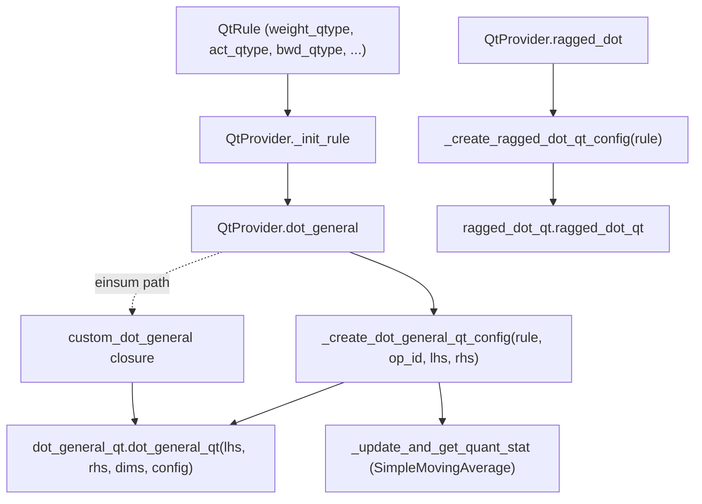

# qwix._src.providers.qt — Quantized Training (QT) with quantized backward pass

## Overview

Where [`PtqProvider`](qwix-_src-providers-ptq.md) only quantizes the forward pass for inference,
`QtProvider` quantizes *training*: forward activations/weights **and** the gradients flowing
through `dot_general`/`einsum`/`conv_general_dilated`/`ragged_dot` during backpropagation. It does
this by building a config object per intercepted op —
[`DotGeneralQtConfig`](../catalog/qwix/_src/core/dot_general_qt.md#DotGeneralQtConfig),
[`ConvGeneralQtConfig`](../catalog/qwix/_src/core/conv_general_qt.md#ConvGeneralQtConfig), or
[`RaggedDotQtConfig`](../catalog/qwix/_src/core/ragged_dot_qt.md#RaggedDotQtConfig) — from a
[`QtRule`](../catalog/qwix/_src/providers/qt.md#QtRule) (which extends
[`QuantizationRule`](../catalog/qwix/_src/qconfig.md#QuantizationRule) with backward-pass-specific
fields), and delegating to the corresponding `_qt` kernel in
[qwix-_src-core-dot_general_qt](qwix-_src-core-dot_general_qt.md)/
[qwix-_src-core-conv_general_qt](qwix-_src-core-conv_general_qt.md), which implement a
`jax.custom_vjp` with independently-configurable forward and backward quantization.

## Diagram

## Design rationale (why it's built this way)

**Forward and backward quantization are independently configured, not coupled.**
[`DotGeneralQtConfig`](../catalog/qwix/_src/core/dot_general_qt.md#DotGeneralQtConfig) carries
separate [`lhs_qtype`](../catalog/qwix/_src/core/dot_general_qt.md#DotGeneralQtConfig.lhs_qtype)/
[`rhs_qtype`](../catalog/qwix/_src/core/dot_general_qt.md#DotGeneralQtConfig.rhs_qtype) (forward)
and [`dlhs_grad_qtype`](../catalog/qwix/_src/core/dot_general_qt.md#DotGeneralQtConfig.dlhs_grad_qtype)/
[`drhs_grad_qtype`](../catalog/qwix/_src/core/dot_general_qt.md#DotGeneralQtConfig.drhs_grad_qtype)
(backward) fields, mirrored on [`QtRule`](../catalog/qwix/_src/providers/qt.md#QtRule) by
[`bwd_qtype`](../catalog/qwix/_src/providers/qt.md#QtRule.bwd_qtype) as one knob for both gradient
directions. This lets a user quantize the forward pass aggressively (e.g. int8) while keeping the
backward pass in a different precision, or vice versa — a direct lever for the classic "training
is more precision-sensitive than inference" TPU tradeoff.

**Weight-vs-activation role is determined once per op, then baked into a config object.**
[`_create_dot_general_qt_config`](../catalog/qwix/_src/providers/qt.md#QtProvider._create_dot_general_qt_config)
uses [`find_param`](../catalog/qwix/_src/utils/flax_util.md#find_param) to classify `lhs`/`rhs` as
weight-or-activation *once*, then assigns `qtype`/calibration method/tile size accordingly
(asserting exactly one side is the weight) — the resulting `DotGeneralQtConfig` is then a static
(non-traced) argument threaded through the `custom_vjp`-based kernel, keeping the role decision
out of the hot path.

**Einsum reuses `dot_general_qt` rather than a separate quantized-einsum kernel.**
[`QtProvider.dot_general`](../catalog/qwix/_src/providers/qt.md#QtProvider.dot_general)'s
[`custom_dot_general`](../catalog/qwix/_src/providers/qt.md#QtProvider.custom_dot_general) closure
is passed as `jnp.einsum`'s `_dot_general=` callback (under `jax.disable_jit()`, since einsum's
internal dispatch to a custom `_dot_general` needs eager evaluation to resolve shapes) — so einsum
gets QT support "for free" by lowering to the same quantized `dot_general_qt` kernel.

**Static-range activation stats reuse the same moving-average machinery as PTQ.**
[`_update_and_get_quant_stat`](../catalog/qwix/_src/providers/qt.md#QtProvider._update_and_get_quant_stat)
wraps [`SimpleMovingAverage`](../catalog/qwix/_src/averaging.md#SimpleMovingAverage) exactly like
[`quantize_act`](qwix-_src-providers-ptq.md) does — `lhs_collect_quant_stat`/`rhs_collect_quant_stat`
callbacks on the config are only set when `rule.`[`act_static_scale`](../catalog/qwix/_src/qconfig.md#QuantizationRule.act_static_scale)
is true, letting the same infrastructure serve both training-time SRQ collection and PTQ inference.

## Entry points

- [`QtProvider.dot_general`](../catalog/qwix/_src/providers/qt.md#QtProvider.dot_general) /
  [`conv_general_dilated`](../catalog/qwix/_src/providers/qt.md#QtProvider.conv_general_dilated) /
  [`ragged_dot`](../catalog/qwix/_src/providers/qt.md#QtProvider.ragged_dot) — the three
  intercepted primitives; each falls back to the plain `jax.lax` op when no matching
  [`QtRule`](../catalog/qwix/_src/providers/qt.md#QtRule) with `weight_qtype` set applies.
- [`_init_rule`](../catalog/qwix/_src/providers/qt.md#QtProvider._init_rule) — upgrades any plain
  `QuantizationRule` passed by the user into a full `QtRule` (via `dataclasses.asdict` +
  reconstruction), so `QtProvider` always has QT-specific defaults available.
- [`_create_dot_general_qt_config`](../catalog/qwix/_src/providers/qt.md#QtProvider._create_dot_general_qt_config) /
  [`_create_conv_general_qt_config`](../catalog/qwix/_src/providers/qt.md#QtProvider._create_conv_general_qt_config) /
  [`_create_ragged_dot_qt_config`](../catalog/qwix/_src/providers/qt.md#QtProvider._create_ragged_dot_qt_config) —
  where a `QtRule` is translated into the op-specific config dataclass the `_qt` kernels expect.

## Mechanism (step-by-step)

1. **Rule resolution and upgrade.** On construction, every rule passed to `QtProvider` is upgraded
   to a [`QtRule`](../catalog/qwix/_src/providers/qt.md#QtRule) via
   [`_init_rule`](../catalog/qwix/_src/providers/qt.md#QtProvider._init_rule) if it isn't one
   already.
2. **A `dot_general` call is intercepted.** If no rule matches or
   [`weight_qtype`](../catalog/qwix/_src/qconfig.md#QuantizationRule.weight_qtype) is unset, the
   plain `jax.lax.dot_general` runs.
3. **Config construction.** [`_create_dot_general_qt_config`](../catalog/qwix/_src/providers/qt.md#QtProvider._create_dot_general_qt_config)
   classifies `lhs`/`rhs` via [`find_param`](../catalog/qwix/_src/utils/flax_util.md#find_param),
   assigns per-side `qtype`/calibration method (with
   [`act_static_scale`](../catalog/qwix/_src/qconfig.md#QuantizationRule.act_static_scale) wiring
   in [`_update_and_get_quant_stat`](../catalog/qwix/_src/providers/qt.md#QtProvider._update_and_get_quant_stat)),
   and populates the backward-pass fields from `rule.`[`bwd_qtype`](../catalog/qwix/_src/providers/qt.md#QtRule.bwd_qtype)
   — including building a stochastic-rounding noise function via
   [`get_noise_fn`](../catalog/qwix/_src/core/stochastic_rounding.md#get_noise_fn) if
   `bwd_stochastic_rounding` is set.
4. **Delegation.** The resulting [`DotGeneralQtConfig`](../catalog/qwix/_src/core/dot_general_qt.md#DotGeneralQtConfig)
   is passed to `dot_general_qt.dot_general_qt`, whose `custom_vjp` forward/backward rules apply
   quantization independently per direction (see
   [qwix-_src-core-dot_general_qt](qwix-_src-core-dot_general_qt.md)).
5. **Einsum path.** [`QtProvider.einsum`](../catalog/qwix/_src/providers/qt.md#QtProvider.dot_general)
   builds a `custom_dot_general` closure over the resolved rule/op_id and passes it to `jnp.einsum`
   as `_dot_general=`, running the einsum under `jax.disable_jit()` so the custom dot_general
   callback is actually invoked at trace time rather than short-circuited by JIT's op fusion.

## Key data structures

- **[`QtRule`](../catalog/qwix/_src/providers/qt.md#QtRule)** — extends `QuantizationRule` with
  [`bwd_qtype`](../catalog/qwix/_src/providers/qt.md#QtRule.bwd_qtype),
  [`disable_channelwise_axes`](../catalog/qwix/_src/providers/qt.md#QtRule.disable_channelwise_axes),
  stochastic-rounding config, and `additional_qt_config` (an escape hatch to override any
  `DotGeneralQtConfig`/`ConvGeneralQtConfig` field directly, explicitly documented as
  "highly experimental").
- **[`DotGeneralQtConfig`](../catalog/qwix/_src/core/dot_general_qt.md#DotGeneralQtConfig)** —
  the fully-resolved, op-specific configuration a single `dot_general_qt` call receives; separates
  fwd (`lhs_qtype`/`rhs_qtype`/[`tile_size`](../catalog/qwix/_src/core/dot_general_qt.md#DotGeneralQtConfig.tile_size))
  from bwd (`dlhs_grad_qtype`/[`drhs_grad_qtype`](../catalog/qwix/_src/core/dot_general_qt.md#DotGeneralQtConfig.drhs_grad_qtype)/
  [`drhs_tile_size`](../catalog/qwix/_src/core/dot_general_qt.md#DotGeneralQtConfig.drhs_tile_size))
  fields explicitly.

## Dynamics (design intent)

Because config construction happens *inside* the intercepted call (not once at provider
construction), the same `QtRule` can produce a different config per call site depending on
whether `lhs` or `rhs` resolves to the weight — the provider itself stays stateless with respect
to op role assignment; all the role logic lives in
[`find_param`](../catalog/qwix/_src/utils/flax_util.md#find_param) plus the config builders.

## Edge cases

- [`ragged_dot`](../catalog/qwix/_src/providers/qt.md#QtProvider.ragged_dot) has no tile-size
  support in its config — [`_create_ragged_dot_qt_config`](../catalog/qwix/_src/providers/qt.md#QtProvider._create_ragged_dot_qt_config)
  assumes LHS is always the activation and RHS always the weight (MoE-style grouped matmul),
  unlike `dot_general`/`conv_general_dilated` which infer roles dynamically.
- [`conv_general_dilated`](../catalog/qwix/_src/providers/qt.md#QtProvider.conv_general_dilated)
  explicitly raises if `rule.tile_size` is set — subchannel/tiled quantization is not supported for
  convolution in QT mode.

## Open questions

- Whether `additional_qt_config`'s "no backward compatibility guarantees" caveat means it is
  expected to be replaced by first-class `QtRule` fields over time, or is meant to remain a
  permanent escape hatch, is not stated in the source seen here.

## See also
- [qwix-_src-core-dot_general_qt](qwix-_src-core-dot_general_qt.md) — the `custom_vjp` kernel this
  provider configures and dispatches to.
- [qwix-_src-providers-ptq](qwix-_src-providers-ptq.md) — the inference-only sibling this
  provider's forward-pass logic parallels.
- [qwix-_src-core-sparsity](qwix-_src-core-sparsity.md) — `SparsityRule`, composable with QT via
  `DotGeneralQtConfig.sparsity_rule`.
