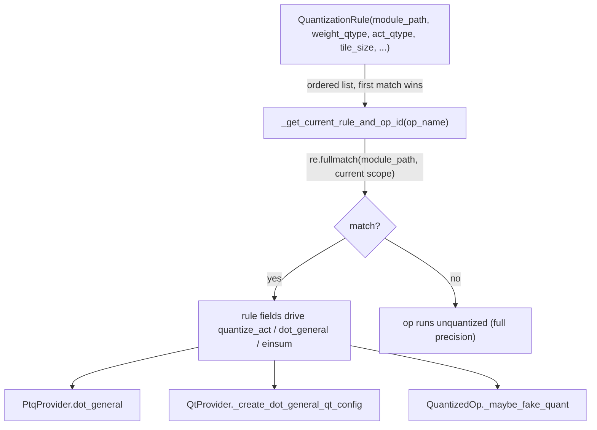

# qwix._src.qconfig — the QuantizationRule DSL and rule-matching engine

## Overview

[`QuantizationRule`](../catalog/qwix/_src/qconfig.md#QuantizationRule) is Qwix's single declarative
unit of configuration: a frozen dataclass that bundles a **matcher** (
[`module_path`](../catalog/qwix/_src/qconfig.md#QuantizationRule.module_path) regex + `op_names`)
with a **behavior** ([`weight_qtype`](../catalog/qwix/_src/qconfig.md#QuantizationRule.weight_qtype),
[`act_qtype`](../catalog/qwix/_src/qconfig.md#QuantizationRule.act_qtype), tile size, calibration
method). A model is quantized by handing an ordered list of these rules to a
`QuantizationProvider`; at every intercepted op the provider walks the list, finds the first rule
whose `module_path` regex matches the current Flax module scope, and uses that rule's fields to
decide *whether* and *how* to quantize the operands. This module is deliberately data-only — it
defines *what a rule looks like* and the matching primitive
([`_get_current_rule_and_op_id`](../catalog/qwix/_src/qconfig.md#QuantizationProvider._get_current_rule_and_op_id))
that every provider subclass (PTQ, QT, LoRA, ODML, SmoothQuant, AWQ, GPTQ, QEP — see
[qwix-_src-providers-ptq](qwix-_src-providers-ptq.md), [qwix-_src-providers-qt](qwix-_src-providers-qt.md))
builds its actual quantized-op logic on top of.

## Diagram

## Design rationale (why it's built this way)

**One matcher shape serves every provider.** `weight_qtype` and `act_qtype` alone are enough to
express weight-only PTQ, dynamic-range quantization, and quantization-aware training uniformly —
[`QtProvider._create_dot_general_qt_config`](../catalog/qwix/_src/providers/qt.md#QtProvider._create_dot_general_qt_config)
and
[`QtProvider._create_conv_general_qt_config`](../catalog/qwix/_src/providers/qt.md#QtProvider._create_conv_general_qt_config)
read exactly the same
[`weight_qtype`](../catalog/qwix/_src/qconfig.md#QuantizationRule.weight_qtype)/
[`act_qtype`](../catalog/qwix/_src/qconfig.md#QuantizationRule.act_qtype) fields that
[`PtqProvider.dot_general`](../catalog/qwix/_src/providers/ptq.md#PtqProvider.dot_general) reads,
just to build a richer `*QtConfig` for the backward pass instead of a `HowToQuantize` for a single
forward op. A single `QuantizationRule` is even reused as the base class for provider-specific rule
types ([`QtRule`](../catalog/qwix/_src/providers/qt.md#QtRule) subclasses `QuantizationRule` and
adds QT-only fields like `bwd_qtype`), so a caller can pass a plain `QuantizationRule` almost
anywhere a `QtRule` is accepted and get PTQ-equivalent behavior for the fields the base class
defines.

**Matching is regex-on-module-path, not a structural walk of the model tree.** The rule's
[`module_path`](../catalog/qwix/_src/qconfig.md#QuantizationRule.module_path) is matched with
`re.fullmatch` against the current Flax scope path joined with `/` — this means the provider
never needs to inspect the model class or its submodule structure ahead of time; it just needs
whatever string identifies "where am I right now" at interception time. This is what lets the same
matching logic serve both `nn.Module` (Linen, has `.scope`) and `nnx.Module` (has a manually-set
`qwix_path`) — see [qwix-_src-model](qwix-_src-model.md) for how each sets that path up before
interception fires.

**Rule-usage tracking is opt-in bookkeeping, not enforcement.** `QuantizationProvider` counts how
many times each rule index matched (`self._rule_matches`); `get_unused_rules()` — not itself part
of this packet's subgraph but visible in the surrounding class — surfaces rules that never fired,
letting a caller catch a typo'd `module_path` regex that silently quantized nothing. The matching
function itself does not raise on a zero-match rule; catching that is left to a separate, explicit
post-hoc check.

## Entry points

- [`_get_current_rule_and_op_id`](../catalog/qwix/_src/qconfig.md#QuantizationProvider._get_current_rule_and_op_id) —
  the runtime entry point every provider's intercepted op handler calls first. It is documented as
  "returns the quantization rule and a unique op id for given op", and is reached from
  [`PtqProvider.dot_general`](../catalog/qwix/_src/providers/ptq.md#PtqProvider.dot_general),
  [`PtqProvider.einsum`](../catalog/qwix/_src/providers/ptq.md#PtqProvider.einsum),
  [`PtqProvider.conv_general_dilated`](../catalog/qwix/_src/providers/ptq.md#PtqProvider.conv_general_dilated),
  and [`SqCalibrationProvider.compute_stats`](../catalog/qwix/contrib/smooth_quant.md#SqCalibrationProvider.compute_stats)
  before any of them touch quantization math.
- [`QuantizationRule`](../catalog/qwix/_src/qconfig.md#QuantizationRule) construction — reached
  anywhere a caller builds a quantization policy, e.g. directly by
  [`_build_linear_reference`](../catalog/tests/_src/utils/checkpoint_util_test.md#_build_linear_reference)
  when setting up a reference model for a checkpoint round-trip test, or via the provider-specific
  subclass [`QtRule`](../catalog/qwix/_src/providers/qt.md#QtRule) for QT-only configuration.
- [`QtProvider._create_dot_general_qt_config`](../catalog/qwix/_src/providers/qt.md#QtProvider._create_dot_general_qt_config) /
  [`_create_conv_general_qt_config`](../catalog/qwix/_src/providers/qt.md#QtProvider._create_conv_general_qt_config) /
  [`_create_ragged_dot_qt_config`](../catalog/qwix/_src/providers/qt.md#QtProvider._create_ragged_dot_qt_config) —
  reached once a rule has already been matched, to translate the matched
  [`QuantizationRule`](../catalog/qwix/_src/qconfig.md#QuantizationRule)'s `weight_qtype`/`act_qtype`
  pair into the specific per-op config type QT's backward-pass machinery expects.

## Mechanism (step-by-step)

1. **A caller assembles an ordered `Sequence[QuantizationRule]`.** Order matters: the provider
   uses first-match-wins semantics, so more specific `module_path` patterns must precede more
   general ones (e.g. a catch-all `'.*'` rule, as seen in
   [`test_coverage`](../catalog/integration_tests/coverage_test.md#CoverageTest.test_coverage),
   must come last if narrower per-layer rules exist).
2. **The provider is constructed** with that
   [`QuantizationRule`](../catalog/qwix/_src/qconfig.md#QuantizationRule) list; each rule passes
   through `_init_rule` (not itself in this packet's subgraph) which fills in `act_static_scale`
   and `act_calibration_method` defaults so downstream code never has to special-case `None`.
3. **At every intercepted op**,
   [`_get_current_rule_and_op_id`](../catalog/qwix/_src/qconfig.md#QuantizationProvider._get_current_rule_and_op_id)
   joins the current module path components with `/` and does `re.fullmatch(rule.`[`module_path`](../catalog/qwix/_src/qconfig.md#QuantizationRule.module_path)`, module_path)`
   against each rule in order, stopping at the first match (or `op_names` mismatch skip).
4. **The matched rule's fields feed provider-specific logic.** For PTQ,
   [`weight_qtype`](../catalog/qwix/_src/qconfig.md#QuantizationRule.weight_qtype)/
   [`act_qtype`](../catalog/qwix/_src/qconfig.md#QuantizationRule.act_qtype) go straight into a
   `HowToQuantize` (see [qwix-_src-core-qarray](qwix-_src-core-qarray.md)). For QT, the same fields
   are translated by
   [`_create_dot_general_qt_config`](../catalog/qwix/_src/providers/qt.md#QtProvider._create_dot_general_qt_config) /
   [`_create_conv_general_qt_config`](../catalog/qwix/_src/providers/qt.md#QtProvider._create_conv_general_qt_config) /
   [`_create_ragged_dot_qt_config`](../catalog/qwix/_src/providers/qt.md#QtProvider._create_ragged_dot_qt_config)
   into a richer config object that also carries `bwd_qtype`-driven backward-pass settings. For
   ODML,
   [`QuantizedOp._maybe_fake_quant`](../catalog/qwix/_src/providers/odml_ops.md#QuantizedOp._maybe_fake_quant) /
   [`_fake_quant_output`](../catalog/qwix/_src/providers/odml_ops.md#QuantizedOp._fake_quant_output)
   branch on whether the rule (if any) sets `weight_qtype`/`act_qtype` to decide whether to fake-quantize
   at all.
5. **If no rule matches**, the op runs at full precision — `_get_current_rule_and_op_id` returns
   `(None, op_id)` and every provider's op handler treats a `None` rule as "pass through
   unquantized" (see e.g.
   [`PtqProvider.dot_general`](../catalog/qwix/_src/providers/ptq.md#PtqProvider.dot_general)'s
   early-return branch).

## Key data structures

- **[`QuantizationRule`](../catalog/qwix/_src/qconfig.md#QuantizationRule)** — frozen, `kw_only`
  dataclass; matcher fields
  ([`module_path`](../catalog/qwix/_src/qconfig.md#QuantizationRule.module_path), `op_names`) plus
  behavior fields
  ([`weight_qtype`](../catalog/qwix/_src/qconfig.md#QuantizationRule.weight_qtype),
  [`act_qtype`](../catalog/qwix/_src/qconfig.md#QuantizationRule.act_qtype), `tile_size`,
  `act_static_scale`, `weight_calibration_method`, `act_calibration_method`, `act_batch_axes`).
  Provider-specific subclasses like
  [`QtRule`](../catalog/qwix/_src/providers/qt.md#QtRule) add fields (`bwd_qtype`,
  `disable_channelwise_axes`) without changing the base matcher shape.
- **Per-provider matching state** — `self._rules` (the validated/defaulted rule list) and
  `self._rule_matches` (a parallel hit-count list), both private to the base provider and consulted
  by `_get_current_rule_and_op_id`.

## Dynamics (design intent)

`QuantizationRule` being frozen means a provider can hold rules across `jax.jit` traces without
worrying about mutation invalidating a compiled cache; the mutable state (`_rule_matches`,
`_logged_ops`) lives on the *provider* instance, not the rule, and is plain Python bookkeeping that
executes outside the traced computation (it runs once per Python-level op dispatch, not once per
compiled step).

## Edge cases

- Rule order is significant and unchecked: two rules with overlapping `module_path` patterns
  silently resolve to whichever is listed first, with no warning at construction time — the only
  after-the-fact signal is `get_unused_rules()` reporting a rule with zero matches.
- A rule's `op_names`, if set, further restricts which intercepted ops it applies to *within* an
  already-matched module — the matcher requires both the path regex AND (if present) an `op_names`
  membership check to pass, tested explicitly for the `dot_general`-only case in
  [`test_dot_general_simple`](../catalog/tests/contrib/padded_ptq_test.md#PaddedPtqTest.test_dot_general_simple)
  and [`test_einsum_simple`](../catalog/tests/contrib/padded_ptq_test.md#PaddedPtqTest.test_einsum_simple).

## Open questions

- Whether `_init_rule`'s validation (e.g. rejecting `act_static_scale` set without `act_qtype`) is
  meant to be the only place rule well-formedness is checked, or whether providers are expected to
  add their own subclass-level validation, is not settled by this packet's cited symbols — only the
  base-class behavior is groundable here.

## See also
- [qwix-_src-providers-ptq](qwix-_src-providers-ptq.md) — the provider that reads
  `QuantizationRule` fields most directly (dynamic/static-range PTQ).
- [qwix-_src-providers-qt](qwix-_src-providers-qt.md) — translates the same rule fields into
  richer QT-specific configs for the backward pass.
- [qwix-_src-core-qarray](qwix-_src-core-qarray.md) — `HowToQuantize`, the structure a matched
  rule is ultimately converted into for a single quantize call.
- [qwix-_src-model](qwix-_src-model.md) — how the "current module path" that
  `_get_current_rule_and_op_id` reads is established for Linen vs. NNX models.
