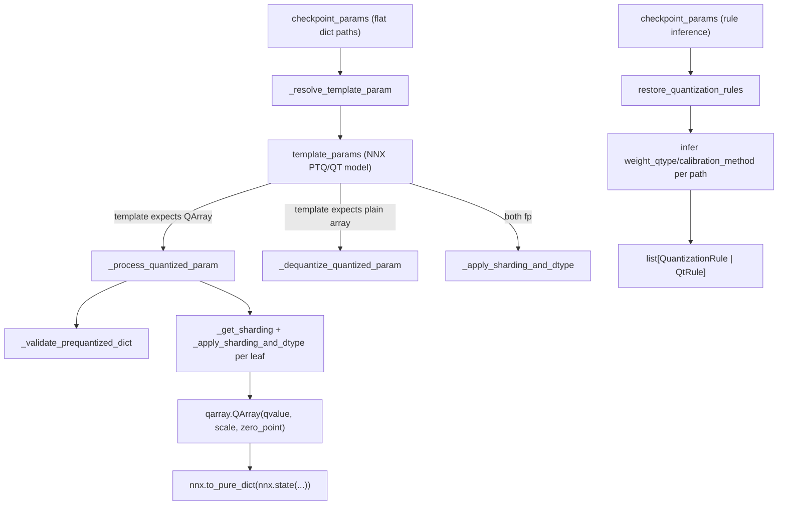

# qwix._src.utils.checkpoint_util — loading prequantized checkpoints and rule reconstruction

## Overview

This module solves the "load a checkpoint that was quantized somewhere else" problem, in both
directions: [`process_prequantized_params`](../catalog/qwix/_src/utils/checkpoint_util.md#process_prequantized_params)
converts an external `{'qvalue':..., 'scale':..., 'zero_point':...}` dict tree into either a real
[`QArray`](../catalog/qwix/_src/core/qarray.md#QArray) (if the live NNX template expects one) or a
dequantized [`jax.Array`](../catalog/qwix/_src/core/numerics.md#convert_from) (if the template is
full-precision), reconciling sharding/dtype/shape along the way; and
[`restore_quantization_rules`](../catalog/qwix/_src/utils/checkpoint_util.md#restore_quantization_rules)
goes the other direction, *inferring* a plausible [`QuantizationRule`](../catalog/qwix/_src/qconfig.md#QuantizationRule)/
[`QtRule`](../catalog/qwix/_src/providers/qt.md#QtRule) list purely from a checkpoint's stored
`qvalue`/`zero_point` dtypes, so a model can be reconstructed without knowing its original
quantization config.

## Diagram

## Design rationale (why it's built this way)

**Three parameter cases are handled by dtype/type inspection, not by a caller-supplied flag.**
[`process_prequantized_params`](../catalog/qwix/_src/utils/checkpoint_util.md#process_prequantized_params)'s
per-leaf loop distinguishes "checkpoint is quantized, template is quantized" (real `QArray` build
via [`_process_quantized_param`](../catalog/qwix/_src/utils/checkpoint_util.md#_process_quantized_param)),
"checkpoint is quantized, template is float" (dequantize via
[`_dequantize_quantized_param`](../catalog/qwix/_src/utils/checkpoint_util.md#_dequantize_quantized_param)),
and "both float" ([`_apply_sharding_and_dtype`](../catalog/qwix/_src/utils/checkpoint_util.md#_apply_sharding_and_dtype)
alone) purely from `isinstance` checks on the checkpoint value and the resolved template value —
the caller never has to say which case applies per parameter.

**Abstract sharding is resolved to a concrete mesh at load time, not baked into the checkpoint.**
[`_get_sharding`](../catalog/qwix/_src/utils/checkpoint_util.md#_get_sharding) explicitly checks
for a `NamedSharding` whose mesh is an `AbstractMesh`, and if so, calls `jax.sharding.get_mesh()`
to resolve it against whatever mesh context is *currently active*, raising if none is —
this lets one abstract PTQ/QT model template be loaded correctly under different concrete device
meshes without needing per-mesh checkpoint variants.

**Scale/zero_point tolerate shape broadcasting; `qvalue` does not.**
[`_apply_sharding_and_dtype`](../catalog/qwix/_src/utils/checkpoint_util.md#_apply_sharding_and_dtype)'s
`allow_broadcast` flag is set for scale/zero_point (via
[`qarray.broadcast_to`](../catalog/qwix/_src/core/qarray.md#broadcast_to)) but not for `qvalue` —
this matches subchannel quantization's actual invariant (scale can be tiled/smaller than qvalue,
qvalue must match the template's real shape exactly), and lets a 2D-blocksize checkpoint's scale be
reshaped into whatever tiling the live template expects.

**Rule inference is intentionally approximate — a starting point, not a guarantee.**
[`restore_quantization_rules`](../catalog/qwix/_src/utils/checkpoint_util.md#restore_quantization_rules)
converts numeric path indices to a regex wildcard (`'[^/]+'`) so one inferred rule matches every
layer of a repeated block, and warns (rather than erroring) on conflicting inferred rules for the
same path — since dtype/zero_point presence alone cannot fully determine the original
`calibration_method`/`tile_size`/`act_qtype` that produced a checkpoint, callers can override any
inferred field via `**kwargs`.

## Entry points

- [`process_prequantized_params`](../catalog/qwix/_src/utils/checkpoint_util.md#process_prequantized_params) —
  the primary entry point; converts a checkpoint dict into an `nnx.update`-ready pure dict against
  an NNX PTQ/QT model template.
- [`restore_quantization_rules`](../catalog/qwix/_src/utils/checkpoint_util.md#restore_quantization_rules) —
  the rule-inference entry point, given only the checkpoint (no original config).
- [`_process_quantized_param`](../catalog/qwix/_src/utils/checkpoint_util.md#_process_quantized_param) /
  [`_dequantize_quantized_param`](../catalog/qwix/_src/utils/checkpoint_util.md#_dequantize_quantized_param) —
  the two per-leaf conversion paths `process_prequantized_params` dispatches to.

## Mechanism (step-by-step)

1. **Flatten both trees.** `process_prequantized_params` flattens `checkpoint_params` (using
   [`_is_leaf`](../catalog/qwix/_src/utils/checkpoint_util.md) to stop descending at any dict
   containing a `'qvalue'` key) and, per path, calls
   [`_resolve_template_param`](../catalog/qwix/_src/utils/checkpoint_util.md#_resolve_template_param)
   to find the corresponding template entry — handling the case where QT models omit the `'array'`
   path suffix that WithAux-wrapped PTQ models have.
2. **Case dispatch and per-leaf conversion.** Based on whether the checkpoint leaf is a dict and
   whether the template leaf is a `QArray`/dict, one of the three conversion functions runs (see
   Diagram), each internally calling
   [`_validate_prequantized_dict`](../catalog/qwix/_src/utils/checkpoint_util.md#_validate_prequantized_dict)
   and [`_apply_sharding_and_dtype`](../catalog/qwix/_src/utils/checkpoint_util.md#_apply_sharding_and_dtype)
   per component (`qvalue`/`scale`/`zero_point`).
3. **Reassembly.** [`process_prequantized_params`](../catalog/qwix/_src/utils/checkpoint_util.md#process_prequantized_params)
   unflattens the flat dict of processed leaves and converts it via
   `nnx.to_pure_dict(nnx.state(...))` into the exact pure-dict shape `nnx.update` expects.
4. **Rule inference (separate path).**
   [`restore_quantization_rules`](../catalog/qwix/_src/utils/checkpoint_util.md#restore_quantization_rules)
   flattens the checkpoint, filters to only quantized leaves, converts each path into a wildcarded
   `module_path` regex,
   infers `weight_qtype` from the stored `qvalue.dtype` and `weight_calibration_method` from
   whether `zero_point` is present (`'minmax'` if so, else `'absmax'`), and constructs one
   `rule_type(...)` instance per unique inferred module path.

## Key data structures

- **`_PREQUANTIZED_ARRAY_LEAF_NAMES`** — the frozenset `{'qvalue', 'scale', 'zero_point'}` that
  defines what counts as a "prequantized leaf" dict throughout this module.
- **`_DEFAULT_ACT_QTYPE`** — a sentinel object (not `None`) used to distinguish "the caller didn't
  specify `act_qtype`, infer it from the weight" from "the caller explicitly wants no activation
  quantization" in `restore_quantization_rules`.

## Dynamics (design intent)

Because [`_resolve_template_param`](../catalog/qwix/_src/utils/checkpoint_util.md#_resolve_template_param)
falls back to stripping a trailing `'array'` path segment only when the direct lookup returns
`None`, PTQ (`WithAux`-wrapped, `.../weight/array/qvalue`) and QT (bare
`.../weight/qvalue`) checkpoints are both handled by the same
[`process_prequantized_params`](../catalog/qwix/_src/utils/checkpoint_util.md#process_prequantized_params)
entry point without the caller needing to specify which provider type produced the checkpoint.

## Edge cases

- [`_apply_sharding_and_dtype`](../catalog/qwix/_src/utils/checkpoint_util.md#_apply_sharding_and_dtype)
  raises `TypeError` if the *template* value isn't a `jax.Array`/`jax.ShapeDtypeStruct` after
  unboxing — a malformed or unsupported template shape fails immediately rather than silently
  coercing.
- [`process_prequantized_params`](../catalog/qwix/_src/utils/checkpoint_util.md#process_prequantized_params)
  requires `template_params` to be an `nnx.Module` and raises `TypeError` otherwise — Linen
  templates are explicitly unsupported for this path.

## Open questions

- Whether `restore_quantization_rules`' conflicting-rule warning (rather than a hard error) is
  intended to be treated as always benign by callers, or whether some conflicts should actually
  block loading, is not resolved in the source seen here.

## See also
- [qwix-_src-core-qarray](qwix-_src-core-qarray.md) — `QArray`, the target type this module
  reconstructs from raw checkpoint dicts.
- [qwix-_src-utils-flax_util](qwix-_src-utils-flax_util.md) — `get_value_from_path`/`unbox`, the
  tree-traversal utilities this module builds on.
- [qwix-_src-providers-qt](qwix-_src-providers-qt.md) — `QtRule`, one of the two rule types
  `restore_quantization_rules` can produce.
