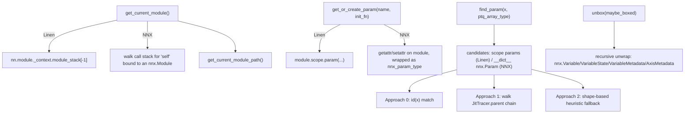

# qwix._src.utils.flax_util — the Linen/NNX abstraction layer every provider builds on

## Overview

Every quantization provider in Qwix needs the same handful of Flax operations to work
identically whether the underlying model is `flax.linen` or `flax.nnx` — get the current module,
create or fetch a parameter/variable, unbox metadata wrappers, and identify whether a given array
*is* a specific module's parameter. This module is where that dual-API abstraction lives:
[`get_current_module`](../catalog/qwix/_src/utils/flax_util.md#get_current_module),
[`get_or_create_param`](../catalog/qwix/_src/utils/flax_util.md#get_or_create_param)/
[`get_or_create_variable`](../catalog/qwix/_src/utils/flax_util.md#get_or_create_variable),
[`unbox`](../catalog/qwix/_src/utils/flax_util.md#unbox), and
[`find_param`](../catalog/qwix/_src/utils/flax_util.md#find_param) are each implemented once, with
an internal `match module: case nn.Module(): ... case nnx.Module(): ...` branch, so every provider
([`PtqProvider`](qwix-_src-providers-ptq.md), [`LoraProvider`](qwix-_src-providers-lora.md),
[`QtProvider`](qwix-_src-providers-qt.md), calibration providers) calls the same function
regardless of which Flax API the intercepted model uses.

## Diagram

## Design rationale (why it's built this way)

**`get_current_module` for NNX walks the Python call stack, because NNX has no module-stack
context manager like Linen does.** [`get_current_module`](../catalog/qwix/_src/utils/flax_util.md#get_current_module)
first checks Linen's `nn.module._context.module_stack`; if empty, it walks `inspect.currentframe()`
frames looking for a local variable named `self` that is an `nnx.Module` instance — a deliberately
introspective fallback specific to NNX's "just Python objects" design, where there is no ambient
context object to consult.

**`find_param` is a three-tier fallback, from exact to heuristic, because a weight can arrive
transformed in several ways.** [`find_param`](../catalog/qwix/_src/utils/flax_util.md#find_param)'s
own docstring lists the supported transformations: dtype-promoted (astype), sharding-constrained
(`with_sharding_constraint`), or reshaped. Approach 0 is exact object-identity match; Approach 1
walks a `jax.core.Tracer`'s `.parent` chain backward through unary primitives (reshape, astype,
sharding constraints) to find the original param, explicitly stopping if a primitive isn't unary
(more than one input tracer); Approach 2 falls back to a shape-based heuristic (raising if more
than one candidate shares that shape) only when the first two fail — each tier trades precision
for robustness, in that order.

**`unbox` recurses through nested metadata wrappers deliberately, per its own comment.** The
NNX Bridge case — where `NNXMeta` (an `AxisMetadata` subclass) wraps an `nnx.Variable` — is called
out explicitly: without recursion, [`unbox`](../catalog/qwix/_src/utils/flax_util.md#unbox) would
stop at the `Variable` layer and never reach the underlying `jax.Array`, so `fn` calls `unbox`
again on whatever it unwraps rather than returning immediately.

**`get_or_create_param`/`get_or_create_variable` bypass the "normal" Linen param/variable-creation
API in favor of `module.scope.param`/`.scope.variable`.** The comment is explicit: this is "to
allow us to create variables/params in non-compact modules" — Linen's ordinary `self.param(...)`
API only works inside `@nn.compact`-decorated methods, but Qwix's providers intercept and inject
params/variables from arbitrary call sites, so they must go through the lower-level `scope` API
directly.

## Entry points

- [`get_current_module`](../catalog/qwix/_src/utils/flax_util.md#get_current_module) /
  [`get_current_module_path`](../catalog/qwix/_src/utils/flax_util.md#get_current_module_path) —
  called from essentially every provider method that needs to know "what module/path am I
  currently inside" (rule matching, param creation, RNG lookup).
- [`find_param`](../catalog/qwix/_src/utils/flax_util.md#find_param) — called from
  [`PtqProvider.dot_general`](../catalog/qwix/_src/providers/ptq.md#PtqProvider.dot_general)/
  [`conv_general_dilated`](../catalog/qwix/_src/providers/ptq.md#PtqProvider.conv_general_dilated),
  [`LoraProvider.dot_general`](../catalog/qwix/_src/providers/lora.md#LoraProvider.dot_general)/
  [`einsum`](../catalog/qwix/_src/providers/lora.md#LoraProvider.einsum)/
  [`conv_general_dilated`](../catalog/qwix/_src/providers/lora.md#LoraProvider.conv_general_dilated),
  and [`CalibrationProvider.dot_general`](../catalog/qwix/contrib/calibration.md#CalibrationProvider.dot_general) —
  every op-interception path that needs to know "is this operand a weight?".
- [`unbox`](../catalog/qwix/_src/utils/flax_util.md#unbox) — called wherever a possibly-metadata-wrapped
  value needs to become a plain array, e.g. inside
  [`WithAux.value`](../catalog/qwix/_src/providers/ptq.md#WithAux.value)/`shape`/`ndim`/`dtype`
  properties.
- [`get_or_create_param`](../catalog/qwix/_src/utils/flax_util.md#get_or_create_param) /
  [`get_or_create_variable`](../catalog/qwix/_src/utils/flax_util.md#get_or_create_variable) —
  called from [`_get_or_create_lora_params`](../catalog/qwix/_src/providers/lora.md#_get_or_create_lora_params)
  and quant-stat collection code paths respectively.
- [`should_update_quant_stats`](../catalog/qwix/_src/utils/flax_util.md#should_update_quant_stats) —
  called by every provider's stat-collection code (
  [`SqCalibrationProvider.compute_stats`](../catalog/qwix/contrib/smooth_quant.md#SqCalibrationProvider.compute_stats)
  and the `_update_and_get_quant_stat` methods across providers) to decide whether a moving-average
  update should actually run this call.

## Mechanism (step-by-step)

1. **Module identity resolution.** [`get_current_module`](../catalog/qwix/_src/utils/flax_util.md#get_current_module)
   checks Linen's context stack first, falling back to a frame walk for NNX;
   [`get_current_module_path`](../catalog/qwix/_src/utils/flax_util.md#get_current_module_path)
   reads `.path` (Linen) or `.qwix_path` (NNX, set during [`quantize_nnx_model`](qwix-_src-model.md)).
2. **Weight identification.** [`find_param`](../catalog/qwix/_src/utils/flax_util.md#find_param)
   builds a `candidates` dict from either `module.scope._collection('params')` (Linen) or
   `module.__dict__`'s `nnx.Param` entries (NNX), unboxes each, and also indexes any `WithAux.array`
   sub-value by id — then tries the three fallback tiers against the query array `x` (itself
   unwrapped from `WithAux` first if needed).
3. **Param/variable creation.** [`get_or_create_param`](../catalog/qwix/_src/utils/flax_util.md#get_or_create_param)/
   [`get_or_create_variable`](../catalog/qwix/_src/utils/flax_util.md#get_or_create_variable) check
   `hasattr(module, name)` (NNX) or use `module.scope.param`/`.variable` (Linen); for NNX, a
   fresh param is only created if absent, validated via
   [`_check_shape`](../catalog/qwix/_src/utils/flax_util.md#_check_shape) if already present.
4. **Unboxing.** [`unbox`](../catalog/qwix/_src/utils/flax_util.md#unbox) tree-maps a recursive
   `fn` over the value, treating `nnx.Variable`/`VariableState`/`VariableMetadata`/
   `nn.meta.AxisMetadata` as the "leaf" types to recurse through (via `is_leaf=`), stopping only at
   genuinely raw values.
5. **Quant-stat update gating.** [`should_update_quant_stats`](../catalog/qwix/_src/utils/flax_util.md#should_update_quant_stats)
   checks `module.is_initializing()`/`is_mutable_collection('quant_stats')` for Linen, or
   `not module.disable_quant_stats_update` for NNX — the NNX flag being explicitly set to `True`
   during [`quantize_nnx_model`](qwix-_src-model.md)'s first (initializing) call and then cleared.

## Key data structures

- No new persistent data structures — this module is entirely functions operating on `nn.Module`/
  `nnx.Module` state; the "state" it manipulates lives in Flax's own scope/module-attribute
  machinery.

## Dynamics (design intent)

`find_param`'s Approach 1 (Tracer-parent walking) only works during active JAX tracing (a
concrete, non-traced value has no `.parent`) — this means `find_param`'s accuracy is
context-dependent: called eagerly outside a trace, only Approaches 0 and 2 are available, while
inside a `jax.jit`-traced forward pass, the tracer-chain walk gives an exact answer even through
several unary transformations.

## Edge cases

- `find_param`'s Approach 2 (shape heuristic) raises `ValueError` if more than 2 (not more than 1,
  per the actual code condition `len(candidates) > 2`) candidates share the queried shape — a
  looser bound than "exactly one candidate" might suggest, worth noting when debugging an
  ambiguous-weight-identification failure.
- `should_update_quant_stats` returns `False` unconditionally during Linen `module.is_initializing()`
  — the very first (init) call never updates moving-average stats, only subsequent `apply()` calls
  do.

## Open questions

- Whether `find_param`'s Approach 1 tracer-walk is exercised under `jax.checkpoint`/`remat`
  boundaries (which can wrap tracers in ways that might break the `.parent` chain assumption) isn't
  addressed by this packet's cited subgraph.

## See also
- [qwix-_src-providers-ptq](qwix-_src-providers-ptq.md) — `PtqProvider`, the primary consumer of
  `find_param`/`get_or_create_param`.
- [qwix-_src-providers-lora](qwix-_src-providers-lora.md) — `_get_or_create_lora_params`, which
  relies on `unbox`/`update_boxed`/`update_sharding` (this module) to derive LoRA adapter sharding.
- [qwix-_src-utils-checkpoint_util](qwix-_src-utils-checkpoint_util.md) — `get_value_from_path`,
  the tree-traversal helper defined alongside these Flax utilities.
