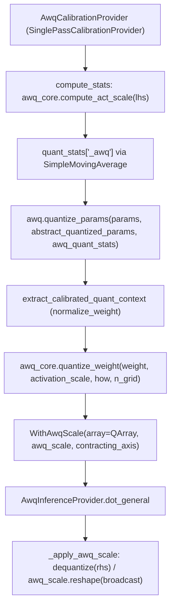

# qwix.contrib.awq — Activation-aware Weight Quantization

## Overview

AWQ's core insight is that a small subset of weight channels are "salient" because they
consistently multiply large-magnitude activations, and quantization error on those channels
matters disproportionately — so AWQ rescales weights *before* quantizing them (dividing salient
channels' error by pre-scaling them up, then compensating by scaling the corresponding activation
down at inference). `AwqCalibrationProvider` collects per-channel activation magnitude statistics;
[`quantize_params`](../catalog/qwix/contrib/awq.md#quantize_params) searches for the best AWQ scale
and produces [`WithAwqScale`](../catalog/qwix/contrib/awq.md#WithAwqScale)-wrapped weights; and
`AwqInferenceProvider` (not `PtqProvider` directly, via its
[`dot_general`](../catalog/qwix/contrib/awq.md#AwqInferenceProvider.dot_general)) applies the
per-channel scale compensation at inference time.

## Diagram

## Design rationale (why it's built this way)

**Calibration and inference are two entirely separate providers, unlike PTQ where one provider
does both.** `AwqCalibrationProvider` never performs quantized computation — it inherits
`SinglePassCalibrationProvider` purely to *observe* activation statistics via its own
`compute_stats` override (reusing the exact same interception machinery
[GPTQ's calibration provider](qwix-contrib-calibration.md) uses). Only afterward, in a completely
separate offline step, does [`quantize_params`](../catalog/qwix/contrib/awq.md#quantize_params)
actually compute AWQ scales and quantize weights — and only `AwqInferenceProvider` (explicitly
*not* the plain [`PtqProvider`](qwix-_src-providers-ptq.md)), through its
[`dot_general`](../catalog/qwix/contrib/awq.md#AwqInferenceProvider.dot_general), knows how to
apply the resulting per-channel compensation.

**`WithAwqScale` stores the compensation scale separately from the `QArray`, rather than folding
it into the scale field.** [`WithAwqScale`](../catalog/qwix/contrib/awq.md#WithAwqScale) extends
[`WithAux[QArray]`](../catalog/qwix/_src/providers/ptq.md#WithAux) with its own
`awq_scale`/`contracting_axis` fields rather than pre-multiplying the AWQ scale into the weight's
quantization scale — because the AWQ scale must also be applied (inversely) to the *activation* at
inference time, keeping it as a separate, explicit field lets
[`AwqInferenceProvider._apply_awq_scale`](../catalog/qwix/contrib/awq.md#AwqInferenceProvider._apply_awq_scale)
divide the dequantized weight by it directly, with the shape/broadcast logic self-contained.

**`AwqInferenceProvider` subclasses `PtqProvider` and only intercepts the AWQ-specific unwrap
step.** [`AwqInferenceProvider.dot_general`](../catalog/qwix/contrib/awq.md#AwqInferenceProvider.dot_general) checks
`isinstance(rhs, WithAwqScale)` first — if so, it dequantizes and divides by the AWQ scale to
recover an ordinary (float) weight, then delegates to `super().dot_general(...)` for everything
else (including re-quantizing that weight if the rule still specifies a `weight_qtype`) — so
non-AWQ weights in the same model (handled by ordinary `WithAux`) pass through
`PtqProvider`'s logic completely unmodified.

## Entry points

- `AwqCalibrationProvider.compute_stats` — the per-batch statistics collector, computing
  per-channel mean-absolute activation via `awq_core.compute_act_scale`; its output is what
  [`quantize_params`](../catalog/qwix/contrib/awq.md#quantize_params) later consumes offline.
- [`quantize_params`](../catalog/qwix/contrib/awq.md#quantize_params) — the offline weight
  quantization entry point, consuming the collected `awq_quant_stats`.
- [`AwqInferenceProvider.dot_general`](../catalog/qwix/contrib/awq.md#AwqInferenceProvider.dot_general) /
  `einsum` — the inference-time entry points that unwrap `WithAwqScale` before delegating to
  `PtqProvider`.

## Mechanism (step-by-step)

1. **Calibration.** During a calibration forward pass with `AwqCalibrationProvider`, the shared
   `CalibrationProvider` base reshapes the matched LHS activation to `(ca, rest)` and calls
   `compute_stats`, which is accumulated per weight into a `<weight>_awq` moving average later read
   back by [`quantize_params`](../catalog/qwix/contrib/awq.md#quantize_params).
2. **Offline quantization.** [`quantize_params`](../catalog/qwix/contrib/awq.md#quantize_params)'s
   `_quantize` closure retrieves the averaged `act_scale` via
   [`extract_calibrated_quant_context`](../catalog/qwix/contrib/calibration.md#extract_calibrated_quant_context)
   (which normalizes the weight to `(rows, columns)` format), calls
   `awq_core.quantize_weight(weight, activation_scale, how, n_grid)` (an internal grid search over
   scale candidates, presumably minimizing reconstruction error — implemented outside this
   packet's cited subgraph in `awq_core`), and wraps the result as
   `WithAwqScale(array=restored_shape_qarray, awq_scale=scales.squeeze(0), contracting_axis=...)`.
3. **Inference.** `AwqInferenceProvider.dot_general` checks if `rhs` is `WithAwqScale`; if so,
   [`_apply_awq_scale`](../catalog/qwix/contrib/awq.md#AwqInferenceProvider._apply_awq_scale)
   dequantizes `rhs.array` and divides by `rhs.awq_scale` reshaped to broadcast along
   `rhs.contracting_axis`, producing an ordinary float weight that `super().dot_general(...)`
   (PTQ) then processes normally (including re-quantizing if the active rule still specifies
   `weight_qtype`).

## Key data structures

- **[`WithAwqScale`](../catalog/qwix/contrib/awq.md#WithAwqScale)** — `array` (inherited from
  `WithAux`, a `QArray`), `awq_scale` (1D, `(in_features,)`), `contracting_axis` (non-pytree field)
  — self-describing enough that `AwqInferenceProvider` needs no external metadata to apply the
  compensation.
- **`AwqRule`** — extends [`QuantizationRule`](../catalog/qwix/_src/qconfig.md#QuantizationRule)
  with just `n_grid` (default 20), the number of scale-search grid points AWQ tries per weight.

## Dynamics (design intent)

Because `WithAwqScale` is registered as an NNX data type and is a `flax.struct.dataclass`, it can
be swapped in for an ordinary `WithAux`-boxed weight in an NNX param tree without any special
handling in the surrounding model code — the whole AWQ mechanism is opaque to the model definition
itself, only visible at the provider layer.

## Edge cases

- `AwqInferenceProvider._apply_awq_scale` raises no error if `rhs` is a plain `WithAux` (non-AWQ)
  weight — it simply doesn't match the `isinstance(rhs, WithAwqScale)` check and falls straight
  through to the base `PtqProvider` path, so mixed AWQ/PTQ models within one rule set work without
  extra configuration.

## Open questions

- Whether the `n_grid` scale-search actually optimizes for minimum quantization error or some
  other objective (e.g. matching a target activation range) is implemented in `awq_core`, outside
  this packet's cited subgraph.

## See also
- [qwix-contrib-calibration](qwix-contrib-calibration.md) — `SinglePassCalibrationProvider`/
  `CalibratedQuantContext`, the shared calibration framework AWQ builds on.
- [qwix-_src-providers-ptq](qwix-_src-providers-ptq.md) — `PtqProvider`, the base class
  `AwqInferenceProvider` delegates to for everything except AWQ-scale unwrapping.
- [qwix-contrib-smooth_quant](qwix-contrib-smooth_quant.md) — `WithSqScale`, a structurally similar
  per-channel-scale wrapper for a different rescaling algorithm.
