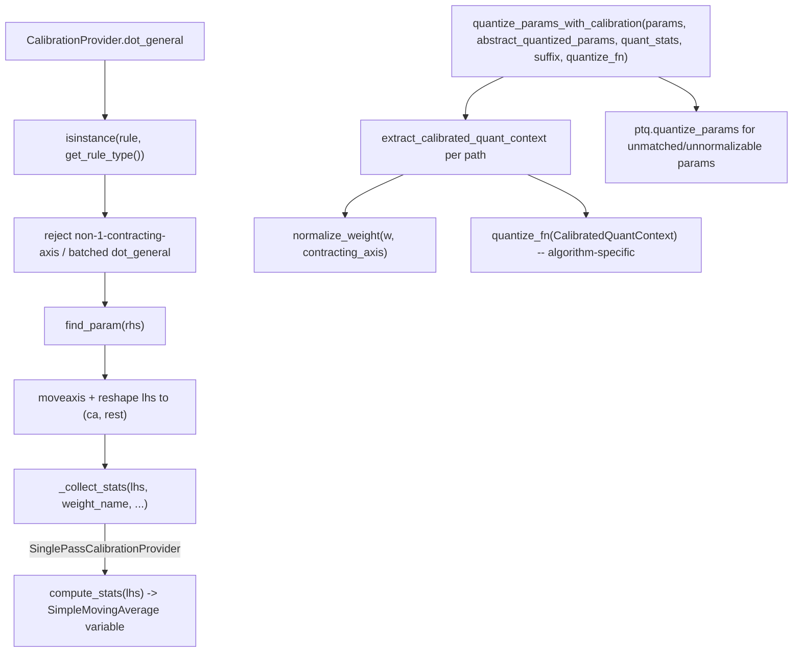

# qwix.contrib.calibration — shared calibration-provider framework for GPTQ/AWQ/SQ/QEP

## Overview

Every offline weight-quantization algorithm in `qwix.contrib` — GPTQ, AWQ, Smooth Quant, QEP —
needs the same two-phase workflow: intercept `dot_general`/`einsum` during a calibration forward
pass to collect algorithm-specific statistics per weight, then later quantize the weight tree
using those statistics. [`CalibrationProvider`](../catalog/qwix/contrib/calibration.md) factors out
everything *except* the algorithm-specific math: rule-type checking, dimension-number validation,
weight identification, and LHS reshaping to `(contracting_dim, rest)`. Subclasses implement only
[`_collect_stats`](../catalog/qwix/contrib/calibration.md#SinglePassCalibrationProvider._collect_stats)
(or, via the further-specialized [`SinglePassCalibrationProvider`](../catalog/qwix/contrib/calibration.md),
just [`compute_stats`](../catalog/qwix/contrib/calibration.md#SinglePassCalibrationProvider.compute_stats)).
[`quantize_params_with_calibration`](../catalog/qwix/contrib/calibration.md#quantize_params_with_calibration)
is the parallel shared framework for the quantization-from-stats side.

## Diagram

## Design rationale (why it's built this way)

**`dot_general` interception is generic; `einsum` is implemented by lowering to it.**
[`CalibrationProvider.einsum`](../catalog/qwix/contrib/calibration.md#CalibrationProvider.dot_general)
builds a `stats_dot_general` closure that calls `self.dot_general` with the resolved rule/op_id
pre-supplied (so calibration isn't double-counted per einsum call), and passes it to `jnp.einsum`
as `_dot_general=` under `jax.disable_jit()` — the same pattern
[`QtProvider.einsum`](qwix-_src-providers-qt.md) uses, letting every algorithm share one
`dot_general`-level statistics-collection implementation regardless of whether the model code
calls `dot_general` or `einsum` directly.

**Only the single-contracting-axis, non-batched case is supported, and unsupported patterns are
silently skipped rather than erroring.** [`CalibrationProvider.dot_general`](../catalog/qwix/contrib/calibration.md#CalibrationProvider.dot_general)
explicitly checks `lhs_ba or rhs_ba or len(lhs_ca) != 1 or len(rhs_ca) != 1` and returns the
uncalibrated result if so — a deliberate scope limitation (documented as "for now") that lets
calibration silently no-op on ops it doesn't understand rather than crash a forward pass that
happens to contain a batched matmul.

**`SinglePassCalibrationProvider` is the common case; the abstract `_collect_stats` exists for
QEP's more complex needs.** Most algorithms (GPTQ's Hessian, AWQ's activation scale, SQ's combined
weight/activation scale) fit the "compute one stats dict per batch, accumulate via
[`SimpleMovingAverage`](qwix-_src-averaging.md)" pattern exactly —
[`SinglePassCalibrationProvider._collect_stats`](../catalog/qwix/contrib/calibration.md#SinglePassCalibrationProvider._collect_stats)
implements that pattern once. QEP's own `_CaptureProvider` (in
[qwix-contrib-qep](qwix-contrib-qep.md)) instead subclasses the more general
`CalibrationProvider` directly and overrides `_collect_stats` itself, because QEP needs to *record*
op identities/LHS object references during discovery, not just accumulate a running average.

**`normalize_weight` reshapes to `(rows, columns)` because every downstream algorithm (GPTQ's
Hessian inversion, AWQ's per-channel scale search) is naturally expressed as a 2D matrix
operation.** [`normalize_weight`](../catalog/qwix/contrib/calibration.md#normalize_weight) moves
the contracting axis to the last position and flattens everything else, returning a `restore_shape`
closure to undo the transformation afterward — this lets every algorithm-specific `quantize_fn`
operate on a simple 2D array regardless of the weight's original rank or which axis was
contracting.

## Entry points

- [`CalibrationProvider.dot_general`](../catalog/qwix/contrib/calibration.md#CalibrationProvider.dot_general) /
  [`einsum`](../catalog/qwix/contrib/calibration.md#CalibrationProvider.dot_general) — the shared
  interception entry points every calibration algorithm reuses.
- [`extract_calibrated_quant_context`](../catalog/qwix/contrib/calibration.md#extract_calibrated_quant_context) —
  called by every algorithm's `quantize_params` (GPTQ, AWQ, SQ, QEP) to build a normalized,
  ready-to-quantize weight context from a raw param + its abstract template + its collected stats.
- [`quantize_params_with_calibration`](../catalog/qwix/contrib/calibration.md#quantize_params_with_calibration) —
  the shared param-tree-quantization driver, parameterized by a `quantize_fn` callback; called
  directly by [GPTQ's](qwix-contrib-gptq.md) and [AWQ's](qwix-contrib-awq.md)
  `quantize_params`.

## Mechanism (step-by-step)

1. **Interception and validation.** [`CalibrationProvider.dot_general`](../catalog/qwix/contrib/calibration.md#CalibrationProvider.dot_general)
   resolves the current rule (or accepts one passed in via `rule=`/`op_id=` from the `einsum`
   wrapper), checks it's an instance of `self.get_rule_type()`, and validates the dimension-number
   shape (exactly one contracting axis per side, no batch axes).
2. **Weight identification and LHS reshape.** [`find_param`](../catalog/qwix/_src/utils/flax_util.md#find_param)
   identifies `rhs` as a named weight (skipping calibration if not found); `lhs` is
   `jnp.moveaxis`'d so the contracting axis is first, then reshaped to `(contracting_dim, -1)`.
3. **Stats collection.** [`_collect_stats`](../catalog/qwix/contrib/calibration.md#SinglePassCalibrationProvider._collect_stats)`(lhs,
   weight_name, module_path=..., op_name=..., op_id=..., lhs_id=id(lhs))` is called — for
   `SinglePassCalibrationProvider`, this computes `compute_stats(lhs)` and folds it into a
   `<weight><suffix>` moving-average variable via
   [`get_or_create_variable`](../catalog/qwix/_src/utils/flax_util.md#get_or_create_variable).
4. **Offline quantization.** [`quantize_params_with_calibration`](../catalog/qwix/contrib/calibration.md#quantize_params_with_calibration)
   flattens `params`, looks up each path's `abs_w`/stats, calls
   [`extract_calibrated_quant_context`](../catalog/qwix/contrib/calibration.md#extract_calibrated_quant_context)
   (which infers the single contracting axis from `abs_w.how.channelwise_axes`, normalizes the
   weight, and averages the raw stats via `SimpleMovingAverage.get_calibration`), and calls the
   caller-supplied `quantize_fn(ctx)` — falling back to
   [`ptq.quantize_params`](qwix-_src-providers-ptq.md#quantize_params) for any path with no
   matching abstract `WithAux`/stats or an ambiguous contracting axis.

## Key data structures

- **[`CalibratedQuantContext`](../catalog/qwix/contrib/calibration.md#extract_calibrated_quant_context)** —
  `weight` (normalized 2D), `how` (with `channelwise_axes=[0]`), `calibration_stats` (averaged),
  `abs_w` (original `WithAux` for metadata), `contracting_axis`, `restore_shape`, `path` — the
  single object every algorithm's `quantize_fn` receives.

## Dynamics (design intent)

Because `extract_calibrated_quant_context` derives the contracting axis by assuming *all*
non-channelwise axes are the (single) contracting axis, any weight whose `HowToQuantize` has more
than one non-channelwise axis returns `None` and falls back to plain PTQ — this is a structural
limitation shared by every algorithm built on this framework (GPTQ/AWQ/SQ/QEP), not something any
individual algorithm chose independently.

## Edge cases

- `CalibrationProvider.dot_general` silently returns the uncalibrated result for any dot_general
  with batch axes — algorithms built on this framework simply don't see batched matmuls at all,
  which matters for models using vmapped/batched linear layers.

## Open questions

- Whether extending calibration support to batched `dot_general` (e.g. for per-expert MoE weights)
  is planned, or considered out of scope for calibration-based algorithms entirely, is not
  addressed in the source seen here.

## See also
- [qwix-contrib-gptq](qwix-contrib-gptq.md) / [qwix-contrib-awq](qwix-contrib-awq.md) /
  [qwix-contrib-smooth_quant](qwix-contrib-smooth_quant.md) / [qwix-contrib-qep](qwix-contrib-qep.md) —
  the four algorithms built on this shared framework.
- [qwix-_src-averaging](qwix-_src-averaging.md) — `SimpleMovingAverage`, the accumulation
  primitive `SinglePassCalibrationProvider._collect_stats` uses.
- [qwix-_src-providers-ptq](qwix-_src-providers-ptq.md) — `ptq.quantize_params`, the fallback path
  for params this framework can't handle.
