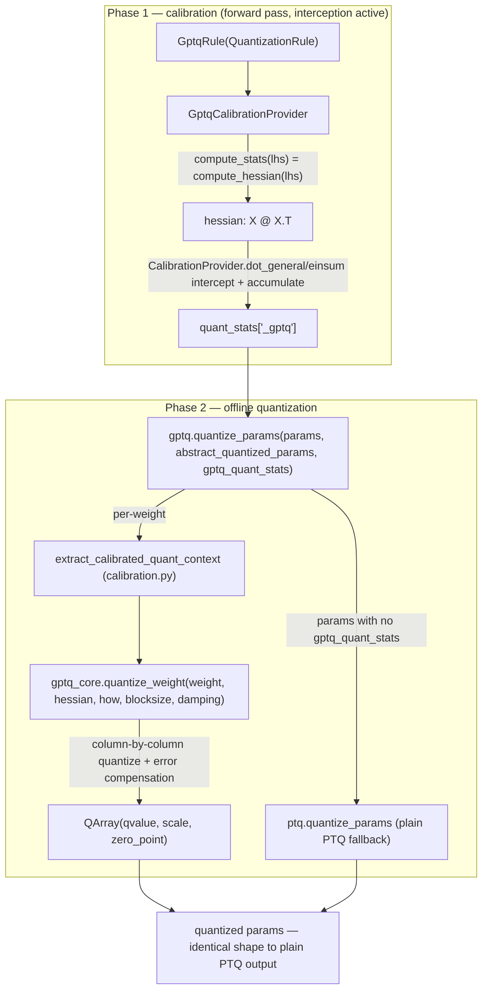

# qwix.contrib.gptq — post-training GPTQ layered on the calibration framework

## Overview

GPTQ in Qwix is a two-phase algorithm plugged into the generic calibration scaffolding shared with
AWQ and QEP (see [qwix-contrib-calibration](qwix-contrib-calibration.md)). Phase one,
[`GptqCalibrationProvider`](../catalog/qwix/contrib/gptq.md#GptqCalibrationProvider), runs a normal
forward pass with interception active and accumulates a per-weight Hessian
(`X @ X.T` of the layer's input activations) into a `quant_stats` collection — it performs *no*
quantization itself. Phase two,
[`quantize_params`](../catalog/qwix/contrib/gptq.md#quantize_params), consumes those Hessians
after the fact and runs the actual GPTQ column-by-column quantization-with-error-compensation
algorithm (`qwix.contrib.gptq_core`), producing params in the exact same `QArray`-based shape that
plain PTQ (see [qwix-_src-providers-ptq](qwix-_src-providers-ptq.md)) would produce — the module's
own docstring states this directly: "the quantized params tree will look exactly the same as
PTQ's." That equivalence is what lets a GPTQ-quantized checkpoint be loaded and served by ordinary
PTQ inference code with no special-casing.

## Diagram

## Design rationale (why it's built this way)

**Calibration and quantization are split into two independent passes because GPTQ needs the
*joint* statistics of an entire layer's inputs before it can quantize any single weight.** Unlike
dynamic-range PTQ (which quantizes each weight independently from its own values), GPTQ's
column-by-column update in
[`quantize_weight`](../catalog/qwix/contrib/gptq_core.md#quantize_weight) explicitly compensates
each subsequent column using the Hessian computed from a full pass over calibration data — that
Hessian cannot be known until calibration has actually run. Splitting the phases lets calibration
run under the standard interception mechanism (as an ordinary, cheap forward pass) while the
expensive GPTQ solve runs once, offline, over the accumulated stats.

**Reusing [`CalibrationProvider`](../catalog/qwix/contrib/calibration.md#CalibrationProvider)
instead of writing a bespoke interceptor keeps GPTQ, AWQ, and QEP structurally identical from the
rule-matching side.** [`GptqCalibrationProvider`](../catalog/qwix/contrib/gptq.md#GptqCalibrationProvider)
implements only `get_rule_type` (returning
[`GptqRule`](../catalog/qwix/contrib/gptq.md#GptqRule)), `compute_stats`, and
`get_stats_suffix` — all of the dimension-number validation, weight-name lookup, and LHS reshaping
to `(contracting_dim, rest)` live once in the shared base class. This is the same pattern
[qwix-contrib-smooth_quant](qwix-contrib-smooth_quant.md) and
[qwix-contrib-awq](qwix-contrib-awq.md) both follow.

**`quantize_params_with_calibration` bakes in a PTQ fallback so partial calibration coverage is
never a hard failure.**
[`quantize_params`](../catalog/qwix/contrib/gptq.md#quantize_params)'s inner `_quantize` closure is
handed to
[`quantize_params_with_calibration`](../catalog/qwix/contrib/calibration.md#quantize_params_with_calibration),
which quantizes every param that *has* a matching `gptq_quant_stats` entry via GPTQ, and silently
routes every other param through
[`ptq.quantize_params`](../catalog/qwix/_src/providers/ptq.md#quantize_params) — the docstring on
`gptq.quantize_params` states this explicitly: "For params with no gptq_quant_stats, they will be
quantized with the default PTQ algorithm."

## Entry points

- [`GptqCalibrationProvider`](../catalog/qwix/contrib/gptq.md#GptqCalibrationProvider) — the
  interception-time entry point; installed as an ordinary
  [`QuantizationProvider`](../catalog/qwix/_src/qconfig.md#QuantizationProvider) (via
  [qwix-_src-model](qwix-_src-model.md)'s `quantize_model`) so calibration happens as a side effect
  of a normal forward pass over calibration data.
- [`quantize_params`](../catalog/qwix/contrib/gptq.md#quantize_params) — the offline entry point,
  called once calibration is complete, with the collected `gptq_quant_stats` and an
  `abstract_quantized_params` tree (produced by running the model once under a plain PTQ provider
  to get the target `HowToQuantize` shapes per weight via
  [`quantize_params`](../catalog/qwix/_src/providers/ptq.md#quantize_params)).
- [`quantize_params._quantize`](../catalog/qwix/contrib/gptq.md#quantize_params._quantize) — the
  per-weight closure passed into
  [`quantize_params_with_calibration`](../catalog/qwix/contrib/calibration.md#quantize_params_with_calibration);
  this is where a [`CalibratedQuantContext`](../catalog/qwix/contrib/calibration.md#CalibratedQuantContext)
  becomes an actual GPTQ-quantized `QArray`.

## Mechanism (step-by-step)

1. **Calibration forward pass.** A model is quantized with
   [`GptqRule`](../catalog/qwix/contrib/gptq.md#GptqRule)s and run under
   [`GptqCalibrationProvider`](../catalog/qwix/contrib/gptq.md#GptqCalibrationProvider), which
   inherits its `dot_general`/`einsum` interception from
   [`CalibrationProvider`](../catalog/qwix/contrib/calibration.md#CalibrationProvider)
   (reshapes LHS to `(contracting_dim, rest)`, identifies the weight via `flax_util.find_param`) and
   supplies only `compute_stats` → `gptq_core.compute_hessian(lhs)`, accumulated via
   [`SimpleMovingAverage`](../catalog/qwix/_src/averaging.md#SimpleMovingAverage) (see
   [qwix-_src-averaging](qwix-_src-averaging.md)) into `quant_stats['<weight>_gptq']`.
2. **Building the abstract target shape.** Separately, running the model once under a plain PTQ
   provider with the *same* rules (
   [`GptqRule`](../catalog/qwix/contrib/gptq.md#GptqRule) subclasses `QuantizationRule` so it works
   as a PTQ rule too) produces `abstract_quantized_params` — a param tree of
   [`WithAux`](../catalog/qwix/_src/providers/ptq.md#WithAux)-wrapped weights carrying each
   weight's target [`HowToQuantize`](../catalog/qwix/_src/core/qarray.md#HowToQuantize).
3. **[`quantize_params`](../catalog/qwix/contrib/gptq.md#quantize_params) walks every param.** For
   each one with a matching `gptq_quant_stats` entry,
   [`extract_calibrated_quant_context`](../catalog/qwix/contrib/calibration.md#extract_calibrated_quant_context)
   normalizes the weight to `(rows, columns)` format (contracting axis last) and packages it with
   its Hessian into a [`CalibratedQuantContext`](../catalog/qwix/contrib/calibration.md#CalibratedQuantContext).
4. **`_quantize` asserts the Hessian shape matches the contracting dimension**, then calls
   [`gptq_core.quantize_weight`](../catalog/qwix/contrib/gptq_core.md#quantize_weight) with the
   configurable `gptq_block_size` (default 128) and `gptq_damping_factor` (default 0.01). Internally
   this dampens the Hessian diagonal, Cholesky-inverts it, and processes the weight matrix in
   column blocks: quantize one column
   ([`qarray.quantize_with_scale_zero_point`](../catalog/qwix/_src/core/qarray.md#quantize_with_scale_zero_point)),
   then subtract the quantization error (scaled by the inverse-Hessian row) from every
   *not-yet-quantized* column in the same and later blocks — this is GPTQ's signature error
   compensation step.
5. **The result is reshaped back** (`ctx.restore_shape(w)`) and wrapped into
   `ctx.`[`abs_w`](../catalog/qwix/contrib/calibration.md#CalibratedQuantContext.abs_w)`.replace(array=w)`,
   producing a `WithAux[QArray]` in exactly the shape PTQ inference expects.
6. **Params with no `gptq_quant_stats`** (e.g. layers not covered by any `GptqRule`, or ones the
   base `CalibrationProvider.dot_general`'s dimension-number check rejected) fall through to
   [`ptq.quantize_params`](../catalog/qwix/_src/providers/ptq.md#quantize_params) unchanged.

## Key data structures

- **[`GptqRule`](../catalog/qwix/contrib/gptq.md#GptqRule)** — a `QuantizationRule` subclass with
  no additional fields; its only role is to be a distinguishable type so
  [`GptqCalibrationProvider.get_rule_type`](../catalog/qwix/contrib/gptq.md#GptqCalibrationProvider) can
  gate calibration onto ops whose matched rule is specifically GPTQ-flavored.
- **[`CalibratedQuantContext`](../catalog/qwix/contrib/calibration.md#CalibratedQuantContext)** —
  the shared handoff object between the generic calibration-quantize framework and each
  algorithm's `_quantize` closure: normalized weight, adjusted `how`, averaged calibration stats
  (the Hessian, for GPTQ), the original `abs_w` wrapper, and a `restore_shape` callback.
- **`quant_stats['<weight>_gptq']`** — the Flax variable collection entry holding the running
  Hessian average for one weight, keyed by the weight's path plus the `_gptq` suffix from
  [`GptqCalibrationProvider.get_stats_suffix`](../catalog/qwix/contrib/gptq.md#GptqCalibrationProvider).

## Dynamics (design intent)

Because Hessian accumulation goes through
[`SimpleMovingAverage`](../catalog/qwix/_src/averaging.md#SimpleMovingAverage), multiple calibration
batches can be run (multiple forward passes over different calibration examples) and the Hessian
converges towards the full-dataset second-moment estimate before phase two ever runs — GPTQ's
quality depends on the Hessian reflecting realistic activation statistics, so more calibration
passes (up to some point of diminishing returns) improve the result.

## Edge cases

- [`gptq_core.quantize_weight`](../catalog/qwix/contrib/gptq_core.md#quantize_weight) treats any
  weight whose Hessian diagonal entry is exactly zero as "dead" — it substitutes `1.0` on that
  diagonal and zeroes the corresponding weight row before proceeding, avoiding a singular Cholesky
  factorization at the cost of quantizing that weight to zero.
- `_quantize`'s shape assertion (`hessian.shape[0] == ctx.weight.shape[1]`) will hard-fail if a
  weight's calibration stats were collected with a different contracting-axis convention than the
  one `extract_calibrated_quant_context` normalized to — this is a correctness guard, not a
  recoverable fallback path.
- `groupsize` for per-group scale/zero_point recomputation defaults to the *entire* column count
  (`how.tiled_axes.get(1, columns)`) — i.e. GPTQ is per-channel by default and only becomes
  sub-channel/grouped if `tiled_axes` explicitly sets a smaller tile at axis 1.

## Open questions

- Whether GPTQ's calibration/quantization split supports static-range activation quantization
  (`act_static_scale`) end-to-end, or is scoped to weight-only quantization, is not settled by this
  packet's cited symbols — the base `CalibrationProvider.dot_general` only handles the LHS-as-
  activation, RHS-as-weight case explicitly.

## See also
- [qwix-contrib-calibration](qwix-contrib-calibration.md) — the shared
  `CalibrationProvider`/`quantize_params_with_calibration` scaffolding GPTQ, AWQ, and QEP all sit on.
- [qwix-_src-providers-ptq](qwix-_src-providers-ptq.md) — the PTQ fallback path and the `QArray`
  shape GPTQ output must match.
- [qwix-_src-core-qarray](qwix-_src-core-qarray.md) — `HowToQuantize`/`QArray`, the types GPTQ's
  output is expressed in.
- [qwix-_src-averaging](qwix-_src-averaging.md) — `SimpleMovingAverage`, used to accumulate the
  Hessian across calibration batches.
