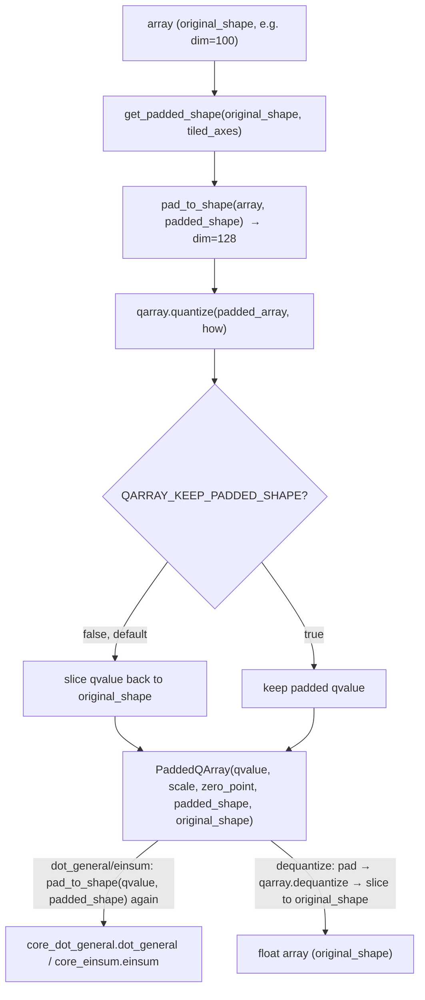

# qwix.contrib.padded_ptq — subchannel quantization when the axis doesn't divide evenly

## Overview

Standard subchannel (tiled) quantization in [qwix-_src-core-qarray](qwix-_src-core-qarray.md)
requires the tiled axis to divide evenly by the tile size. `padded_ptq` removes that constraint:
[`PaddedQArray`](../catalog/qwix/contrib/padded_ptq.md#PaddedQArray) extends
[`QArray`](../catalog/qwix/_src/core/qarray.md#QArray) with a remembered `padded_shape`/
`original_shape` pair, and its
[`quantize`](../catalog/qwix/contrib/padded_ptq.md#quantize)/[`dequantize`](../catalog/qwix/contrib/padded_ptq.md#dequantize)/
[`dot_general`](../catalog/qwix/contrib/padded_ptq.md#dot_general)/[`einsum`](../catalog/qwix/contrib/padded_ptq.md#einsum)
wrappers transparently zero-pad an array up to the next tile-size multiple before quantizing or
contracting, and un-pad the result back to the caller's original shape. It exists so that a weight
whose contraction dimension is, say, 100 with tile size 32 can still be tiled-quantized (as if
padded to 128) without the caller ever seeing the padding.

## Diagram

## Design rationale (why it's built this way)

**Padding is applied twice — once at quantize time, once at contraction time — because the
*stored* `qvalue` is kept unpadded by default.** `QARRAY_KEEP_PADDED_SHAPE` is `False` by default,
so [`quantize`](../catalog/qwix/contrib/padded_ptq.md#quantize) strips the padding back off
immediately after calling [`qarray.quantize`](../catalog/qwix/_src/core/qarray.md#quantize) — the
`PaddedQArray` that gets stored (e.g. in a checkpoint) looks exactly like an ordinary unpadded
`QArray` plus two extra shape fields. This means storage cost isn't inflated by padding, at the
cost of having to re-derive the padded array (`_pad_operand_if_qarray`) every time
[`dot_general`](../catalog/qwix/contrib/padded_ptq.md#dot_general) or
[`einsum`](../catalog/qwix/contrib/padded_ptq.md#einsum) actually needs to contract against it —
padding is cheap (a `jnp.pad` call) relative to the matmul it precedes, so recomputing it per-call
is the right trade against storing dead zeros permanently.

**Both operands are padded to match, not just the `PaddedQArray` one.** In
[`dot_general`](../catalog/qwix/contrib/padded_ptq.md#dot_general), if only one operand is a
`PaddedQArray`, the *other* (regular) operand is padded along its contraction axis to match —
`target_shape[rhs_axis] = lhs.shape[lhs_axis]` walks the dimension-number pairs explicitly. This
is necessary because contraction axes on both sides of a `dot_general`/`einsum` must agree in
size; if the weight was padded from 100→128 but the activation wasn't, the shapes would no longer
be contractible at all.

**Wrapping rather than modifying `qarray.quantize`/`dot_general` keeps padding fully opt-in.**
`padded_ptq`'s [`dot_general`](../catalog/qwix/contrib/padded_ptq.md#dot_general) and
[`einsum`](../catalog/qwix/contrib/padded_ptq.md#einsum) delegate to
[`core_dot_general.dot_general`](../catalog/qwix/_src/core/dot_general.md#dot_general) /
[`core_einsum.einsum`](../catalog/qwix/_src/core/einsum.md#einsum) (see
[qwix-_src-core-dot_general](qwix-_src-core-dot_general.md)) after padding, and
[`PaddedPtqProvider`](../catalog/qwix/contrib/padded_ptq.md#PaddedPtqProvider) is built as a
`functools.partial` over the ordinary PTQ provider (re-exported into this module as `PtqProvider`)
with only the `_qarray_module`, `_dot_general_fn`, and `_einsum_fn` swapped in — this module's own
[`dot_general`](../catalog/qwix/contrib/padded_ptq.md#dot_general)/
[`einsum`](../catalog/qwix/contrib/padded_ptq.md#einsum)/
[`quantize`](../catalog/qwix/contrib/padded_ptq.md#quantize) functions. No PTQ logic is
duplicated; only the array-shape plumbing around it changes.

## Entry points

- [`quantize`](../catalog/qwix/contrib/padded_ptq.md#quantize) — reached wherever a weight with a
  non-tile-aligned contraction dimension needs subchannel quantization; the primary way a
  `PaddedQArray` is created from a float array.
- [`dot_general`](../catalog/qwix/contrib/padded_ptq.md#dot_general) /
  [`einsum`](../catalog/qwix/contrib/padded_ptq.md#einsum) — reached from
  [`PaddedPtqProvider`](../catalog/qwix/contrib/padded_ptq.md#PaddedPtqProvider)'s intercepted ops
  whenever a matmul-shaped op has a `PaddedQArray` (or plain array needing to match one) operand.
- [`dequantize`](../catalog/qwix/contrib/padded_ptq.md#dequantize) — reached wherever a
  `PaddedQArray` must be materialized back to a plain float array at its *original*, unpadded
  shape.

## Mechanism (step-by-step)

1. **[`quantize`](../catalog/qwix/contrib/padded_ptq.md#quantize) computes the padded target
   shape** via `get_padded_shape(array.shape, how.tiled_axes)` — for each tiled axis, rounds the
   dimension up to the next multiple of that axis's tile size (or, if the tile spec is a float
   fraction, `round(dim * tile)` first, following the same convention as
   [`HowToQuantize`](../catalog/qwix/_src/core/qarray.md#HowToQuantize)'s tile-fraction handling).
2. **The array is zero-padded** (`pad_to_shape`) to that shape, then handed to
   [`qarray.quantize`](../catalog/qwix/_src/core/qarray.md#quantize) as normal — calibration and
   scale/zero-point computation happen entirely in the padded domain, so the zero-padding
   contributes zero-valued elements to the calibration statistics wherever tile-boundary padding
   was added.
3. **Unless `QARRAY_KEEP_PADDED_SHAPE` is set, the resulting `qvalue` is sliced back** to
   `original_shape` before being wrapped in a
   [`PaddedQArray`](../catalog/qwix/contrib/padded_ptq.md#PaddedQArray) that remembers both
   `padded_shape` and `original_shape` for later reconstruction.
4. **At contraction time,**
   [`_pad_operand_if_qarray`](../catalog/qwix/contrib/padded_ptq.md#_pad_operand_if_qarray)
   re-pads any `PaddedQArray` operand's `qvalue` back to `padded_shape`, and
   [`dot_general`](../catalog/qwix/contrib/padded_ptq.md#dot_general) computes the matching padded
   target shape for whichever operand is *not* a `PaddedQArray`, using the `dimension_numbers`
   contraction-axis pairs to align the two operands' padded sizes.
   [`einsum`](../catalog/qwix/contrib/padded_ptq.md#einsum) does the analogous alignment using
   `EinsumInfo.parse` (see [qwix-_src-core-einsum_info](qwix-_src-core-einsum_info.md)) to map
   einsum-string characters to axis positions instead of numeric dimension numbers.
5. **The padded operands are handed to the ordinary core kernels**
   ([`core_dot_general.dot_general`](../catalog/qwix/_src/core/dot_general.md#dot_general) /
   [`core_einsum.einsum`](../catalog/qwix/_src/core/einsum.md#einsum)), which see only
   tile-aligned shapes and never need to know padding happened.
6. **[`dequantize`](../catalog/qwix/contrib/padded_ptq.md#dequantize) reverses the process**:
   pads `qvalue` back to `padded_shape`, calls
   [`qarray.dequantize`](../catalog/qwix/_src/core/qarray.md#dequantize), then slices the float
   result back down to `original_shape` if it doesn't already match.

## Key data structures

- **[`PaddedQArray`](../catalog/qwix/contrib/padded_ptq.md#PaddedQArray)** — a `flax.struct.dataclass`
  subclassing [`QArray`](../catalog/qwix/_src/core/qarray.md#QArray), adding
  [`padded_shape`](../catalog/qwix/contrib/padded_ptq.md#PaddedQArray) and
  [`original_shape`](../catalog/qwix/contrib/padded_ptq.md#PaddedQArray.original_shape) as
  non-pytree (`pytree_node=False`) static metadata fields — they participate in JIT tracing as
  static shape info, not as traced array data. Registered with `nnx.register_data_type` so it can
  live directly as an `nnx.Module` attribute.
- **`QARRAY_KEEP_PADDED_SHAPE`** — a module-level toggle (default `False`) controlling whether the
  stored `qvalue` keeps its padded shape or is sliced back to `original_shape` immediately after
  quantization.

## Dynamics (design intent)

Padding round-trips are pure array ops (`jnp.pad`, slicing) with no data dependence on prior calls,
so they compose cleanly with `jax.jit` — every padded shape is a function of static shape metadata
(`original_shape`, `tiled_axes`) known at trace time, not a runtime value, so XLA can constant-fold
the padding shapes during compilation.

## Edge cases

- If `array.shape == target_shape` already (no padding needed), `pad_to_shape` returns the array
  unmodified rather than calling `jnp.pad` with a zero-width pad — an explicit fast path for the
  already-aligned case.
- A tile size of `0` or negative (`tile_size <= 0`) causes `get_padded_shape` to skip padding that
  axis entirely (`continue`), silently leaving it unpadded rather than raising.
- [`dot_general`](../catalog/qwix/contrib/padded_ptq.md#dot_general) and
  [`einsum`](../catalog/qwix/contrib/padded_ptq.md#einsum) only pad the *non*-`PaddedQArray`
  operand along axes that are contraction axes for the other operand — batch and non-contracted
  axes of a plain-array operand are never padded, so a shape mismatch there is a genuine caller
  error, not something this module tries to reconcile.

## Open questions

- Whether zero-padding a weight's contraction dimension before absmax/minmax calibration
  systematically biases the computed scale (since the padded zeros are included in whatever
  reduction [`qarray.calibrate`](../catalog/qwix/_src/core/qarray.md#calibrate) performs, unless the
  calibration axis excludes them) is not addressed by this packet's cited symbols.

## See also
- [qwix-_src-core-qarray](qwix-_src-core-qarray.md) — the base `QArray`/`HowToQuantize`
  machinery `PaddedQArray` extends.
- [qwix-_src-providers-ptq](qwix-_src-providers-ptq.md) — the `PtqProvider` this module's
  `PaddedPtqProvider` wraps via `functools.partial`.
- [qwix-_src-core-einsum_info](qwix-_src-core-einsum_info.md) — `EinsumInfo.parse`, used to align
  padded shapes across an einsum's LHS/RHS/output axes.
