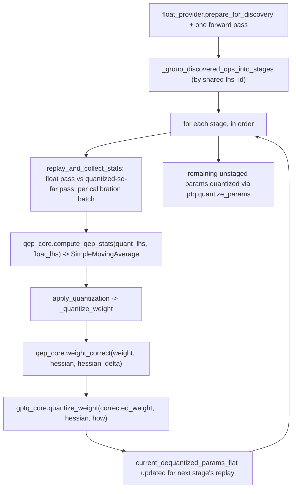

# qwix.contrib.qep — Quantization Error Propagation (stagewise input-compensated GPTQ)

## Overview

Standard [GPTQ](qwix-contrib-gptq.md) quantizes each layer independently, assuming its input
activations are still float-precision — but in a real quantized model, every layer after the first
actually sees activations that have already accumulated quantization noise from earlier layers.
QEP corrects for this: [`quantize`](../catalog/qwix/contrib/qep.md#quantize) sweeps a model
stage-by-stage (grouping ops that share the same input activation, e.g. parallel attention heads),
replays the calibration set through both a pure-float and a partially-already-quantized copy of
the model to measure the actual noise a stage's inputs have accumulated, and feeds that into
[`_quantize_weight`](../catalog/qwix/contrib/qep.md#_quantize_weight) — which applies a weight
correction before handing off to [GPTQ's own](qwix-contrib-gptq.md) Hessian-based quantization.
[`QepRule`](../catalog/qwix/contrib/qep.md#QepRule) extends
[`GptqRule`](../catalog/qwix/contrib/gptq.md#GptqRule) with the correction hyperparameters.

## Diagram

## Design rationale (why it's built this way)

**Stages group ops by shared input identity, not by layer depth.** [`_group_discovered_ops_into_stages`](../catalog/qwix/contrib/qep.md#_group_discovered_ops_into_stages)
groups [`_MatchedOp`](../catalog/qwix/contrib/qep.md) records by their `lhs_id` (the Python
`id()` of the LHS activation array at discovery time) — parallel operations reading the exact same
activation tensor (e.g. Q/K/V projections in one attention block) are bundled into one stage,
processed and error-corrected together, because they experience identical upstream quantization
noise and should be corrected against the same measured error, not independently.

**Two model copies (float and quantized-so-far), replayed per stage, is how the "actual noise"
gets measured — not a closed-form propagation formula.** [`quantize`](../catalog/qwix/contrib/qep.md#quantize)'s
`replay_and_collect_stats` inner function runs the *entire* calibration set through both
`float_model` (always full-precision) and `quant_model` (with `current_dequantized_params`,
progressively updated as earlier stages get quantized) for every stage — an O(stages × calibration
set) cost, explicitly documented as the "very large production pipelines" complexity concern in
`quantize_params`'s docstring, in exchange for measuring the *true* accumulated error rather than
approximating it analytically.

**Weight correction happens before GPTQ, not instead of it.**
[`_quantize_weight`](../catalog/qwix/contrib/qep.md#_quantize_weight) calls
`qep_core.weight_correct(weight, hessian, hessian_delta, correction_factor, damping_factor)` first
(only if [`QepRule.apply_correction`](../catalog/qwix/contrib/qep.md#QepRule)), then hands the
*corrected* weight into
[`gptq_core.quantize_weight`](../catalog/qwix/contrib/gptq_core.md#quantize_weight) unchanged —
QEP is explicitly a pre-processing step layered on top of GPTQ's existing algorithm, not a
competing quantization method, so `correction_factor=0.0` degenerates exactly to plain GPTQ.

**Non-QEP-matched params fall back to plain PTQ, not an error.** After all discovered stages are
quantized, any remaining flat params not covered by a stage are quantized via
[`ptq.quantize_params`](../catalog/qwix/_src/providers/ptq.md#quantize_params) — QEP only needs to
apply to the layers its rules actually match, and everything else degrades gracefully to ordinary
PTQ rather than failing.

## Entry points

- [`quantize`](../catalog/qwix/contrib/qep.md#quantize) — the full pipeline: discovery, stage
  grouping, stagewise replay-and-quantize, PTQ fallback for the rest.
- [`quantize_params`](../catalog/qwix/contrib/qep.md) — the offline variant, consuming
  pre-computed `_qep`-suffixed stats (from a distributed collection pipeline) rather than tracing
  the model itself; delegates to the shared calibration-quantize driver (see
  [qwix-contrib-calibration](qwix-contrib-calibration.md)) with a
  [`_quantize`](../catalog/qwix/contrib/qep.md#quantize_params._quantize) closure.
- [`_quantize_weight`](../catalog/qwix/contrib/qep.md#_quantize_weight) — the per-weight
  correction-then-GPTQ step both `quantize` and `quantize_params` funnel through.

## Mechanism (step-by-step)

1. **Discovery pass.** `float_provider.prepare_for_discovery()` followed by one forward pass
   through `float_model` records every matched op's `(op_key, path, lhs_id, rule)` via
   [`_CaptureProvider._collect_stats`](../catalog/qwix/contrib/qep.md#_CaptureProvider._collect_stats).
2. **Stage grouping.** [`_group_discovered_ops_into_stages`](../catalog/qwix/contrib/qep.md#_group_discovered_ops_into_stages)
   groups the discovered ops by shared `lhs_id`, raising if the same param path would be quantized
   across multiple stages.
3. **Per-stage replay.** For each stage, `replay_and_collect_stats` iterates the entire calibration
   set, running both `float_model` (original params) and `quant_model` (params quantized by
   *previous* stages only) forward, capturing each stage member's LHS activation from both runs,
   and accumulating `qep_core.compute_qep_stats(quant_lhs, float_lhs)` via
   [`_update_flat_stats_with_moving_average`](../catalog/qwix/contrib/qep.md#_update_flat_stats_with_moving_average).
4. **Per-stage quantization.** `apply_quantization` extracts a
   [`CalibratedQuantContext`](../catalog/qwix/contrib/calibration.md#extract_calibrated_quant_context)
   for each stage member's weight, calls [`_quantize_weight`](../catalog/qwix/contrib/qep.md#_quantize_weight),
   and updates `current_dequantized_params_flat` so the *next* stage's replay sees this stage's
   quantized (then dequantized) weights.
5. **Fallback and assembly.** Remaining unstaged params go through
   [`ptq.quantize_params`](../catalog/qwix/_src/providers/ptq.md#quantize_params); the final
   [`QepResult`](../catalog/qwix/contrib/qep.md) bundles the model, quantized params, quant stats,
   and per-stage metadata.

## Key data structures

- **[`QepRule`](../catalog/qwix/contrib/qep.md#QepRule)** — extends
  [`GptqRule`](../catalog/qwix/contrib/gptq.md#GptqRule) with `correction_factor` (0=no
  correction/plain GPTQ, 1=full correction, default 0.5 per the QEP paper),
  `damping_factor` (Hessian-inversion stabilizer), and `apply_correction` (an escape hatch for the
  first stage, which has no preceding noise to correct for).
- **`QepStage`** — public metadata: `index`, `param_paths`, `module_paths` — the user-facing
  record of which parameters were grouped and quantized together.
- **`_MatchedOp`** / **`_StageSpec`** — internal tracking structures binding an op's identity,
  path, and shared-activation `lhs_id` before/after grouping into stages.

## Dynamics (design intent)

`current_dequantized_params_flat` being threaded stage-to-stage (rather than recomputed from
scratch each time) is what makes the "cascading noise" measurement actually cascade: stage N's
replay sees the *real* dequantized output of stages 1..N-1's quantization, not an idealized
approximation, so the measured noise genuinely reflects what a fully-quantized model would
experience by the time it reaches stage N.

## Edge cases

- [`quantize`](../catalog/qwix/contrib/qep.md#quantize) raises immediately if `calibration_data` is
  a plain iterator (not reiterable) and not a zero-arg callable — since the algorithm needs to
  replay the *entire* calibration set once per stage, a single-pass iterator would silently exhaust
  after the first stage.
- [`_group_discovered_ops_into_stages`](../catalog/qwix/contrib/qep.md#_group_discovered_ops_into_stages)
  raises if zero ops were discovered at all — a `QepRule` that matches nothing is an error, not a
  silent no-op.

## Open questions

- Whether QEP's stagewise replay cost (documented as expensive enough to warrant a fully offline
  `quantize_params` variant) has been benchmarked against plain GPTQ's single-pass calibration cost
  isn't included in this packet's cited subgraph.

## See also
- [qwix-contrib-gptq](qwix-contrib-gptq.md) — `GptqRule`/`gptq_core.quantize_weight`, the base
  algorithm QEP's correction step feeds into.
- [qwix-contrib-calibration](qwix-contrib-calibration.md) — `CalibrationProvider`/
  `CalibratedQuantContext`, the shared calibration-provider framework QEP's `_CaptureProvider`
  extends.
- [qwix-_src-averaging](qwix-_src-averaging.md) — `SimpleMovingAverage`, used to accumulate QEP
  stats across the calibration set.
