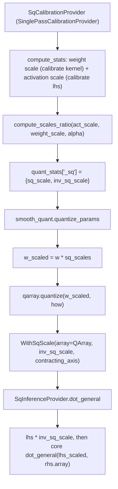

# qwix.contrib.smooth_quant — Smooth Quantization by migrating difficulty from activations to weights

## Overview

Smooth Quant ([arXiv:2211.10438](https://arxiv.org/abs/2211.10438)) addresses activation
outliers — the reason activation quantization is often harder than weight quantization — by
migrating quantization difficulty from activations to weights: each channel is scaled down on the
activation side and up on the weight side by the same per-channel factor, computed from both
sides' calibrated ranges via `compute_scales_ratio`
(`scale = act_stats^alpha / weight_stats^(1-alpha)`). Unlike [AWQ](qwix-contrib-awq.md) (weight-only
rescaling) or [GPTQ](qwix-contrib-gptq.md) (Hessian-based weight correction), SQ explicitly
rebalances the *joint* difficulty between both operands of the matmul, with `alpha` controlling how
much of the burden shifts to the weight side.

## Diagram

## Design rationale (why it's built this way)

**Calibration directly reads the live weight from module state, not from an abstract template.**
[`SqCalibrationProvider.compute_stats`](../catalog/qwix/contrib/smooth_quant.md#SqCalibrationProvider.compute_stats)
pulls `module.scope._collection("params")["kernel"]` (Linen) or `module.kernel.get_value()` (NNX)
*during the calibration forward pass itself*, rather than waiting for the later offline
`quantize_params` call — because computing the SQ scale requires *both* the weight's calibration
and the activation's calibration together (`compute_scales_ratio` needs both), and the activation
side is only observable during a live forward pass.

**Zero-point is explicitly disallowed for both weight and activation calibration.** Both
calibration branches in [`SqCalibrationProvider.compute_stats`](../catalog/qwix/contrib/smooth_quant.md#SqCalibrationProvider.compute_stats)
assert `zero_point is None` with the message "SQ does not support zero-points. Select a symmetric
quantization scheme" — because the scale-ratio migration only makes mathematical sense for
symmetric (scale-only) quantization; an asymmetric zero-point would need its own migration term SQ
doesn't compute.

**`inv_sq_scale` is stored, not `sq_scale`, because inference needs to *divide* the activation.**
[`WithSqScale`](../catalog/qwix/contrib/smooth_quant.md#WithSqScale) stores the *inverse* scale
specifically so [`SqInferenceProvider.dot_general`](../catalog/qwix/contrib/smooth_quant.md#SqInferenceProvider.dot_general)
can multiply the activation by it directly (`lhs * inv_sq_scale`) rather than dividing by
`sq_scale` at every inference call — a minor but deliberate precomputation of the reciprocal at
quantization-time rather than at every forward pass.

**`SqInferenceProvider` bypasses the quantized fast/slow dispatch for its own dot_general.** Unlike
[`AwqInferenceProvider`](qwix-contrib-awq.md), which delegates to `PtqProvider.dot_general`
after unwrapping, [`SqInferenceProvider.dot_general`](../catalog/qwix/contrib/smooth_quant.md#SqInferenceProvider.dot_general)
calls [`dot_general.dot_general`](../catalog/qwix/_src/core/dot_general.md#dot_general) (the core
function) directly after unwrapping `rhs.array` and scaling `lhs` — since the weight is already a
`QArray` and the activation is always full-precision after SQ's rescaling, there's no need to
route back through `PtqProvider`'s weight-vs-activation identification logic.

## Entry points

- [`SqCalibrationProvider.compute_stats`](../catalog/qwix/contrib/smooth_quant.md#SqCalibrationProvider.compute_stats) —
  computes both weight and activation calibration and their SQ scale ratio in one call.
- [`quantize_params`](../catalog/qwix/contrib/smooth_quant.md#quantize_params) — the offline
  weight-scaling-and-quantizing entry point.
- [`SqInferenceProvider.dot_general`](../catalog/qwix/contrib/smooth_quant.md#SqInferenceProvider.dot_general) —
  the inference-time entry point applying the activation-side scale compensation.

## Mechanism (step-by-step)

1. **Calibration.** For a matched `dot_general`, [`compute_stats`](../catalog/qwix/contrib/smooth_quant.md#SqCalibrationProvider.compute_stats)
   builds a channelwise `HowToQuantize` for the weight (`weight_qtype`,
   `weight_calibration_method`), calibrates the live kernel, and separately builds a channelwise
   `HowToQuantize` for the activation (`act_qtype`, `act_calibration_method`), calibrating the
   already-reshaped `lhs`; both produce a per-channel scale via `qarray.compute_scale_zero_point`.
2. **Scale ratio.** `compute_scales_ratio` (called from
   [`compute_stats`](../catalog/qwix/contrib/smooth_quant.md#SqCalibrationProvider.compute_stats))
   combines the two scales into `sq_scale = act_scale**alpha / weight_scale**(1-alpha)`, clipped to
   a small minimum to avoid division-by-zero downstream; both `sq_scale` and its reciprocal are
   returned and accumulated into a `<weight>_sq` moving average.
3. **Offline quantization.** [`quantize_params`](../catalog/qwix/contrib/smooth_quant.md#quantize_params)
   normalizes each weight to `(rows, columns)`, retrieves the averaged `sq_scale`, scales the weight
   up (`w * sq_scales`), quantizes the *scaled* weight via
   [`qarray.quantize`](../catalog/qwix/_src/core/qarray.md#quantize), and wraps the result plus
   `inv_sq_scale`/`contracting_axis` in [`WithSqScale`](../catalog/qwix/contrib/smooth_quant.md#WithSqScale).
4. **Inference.** [`SqInferenceProvider.dot_general`](../catalog/qwix/contrib/smooth_quant.md#SqInferenceProvider.dot_general)
   checks if `rhs` is `WithSqScale`; if so, scales `lhs` down by `inv_sq_scale` (undoing the
   forward-migrated difficulty on the activation side) and unwraps `rhs` to its `QArray`, then
   calls the core [`dot_general`](../catalog/qwix/_src/core/dot_general.md#dot_general) directly.

## Key data structures

- **[`WithSqScale`](../catalog/qwix/contrib/smooth_quant.md#WithSqScale)** — extends
  `WithAux[QArray]` with `inv_sq_scale` (1D, `(in_features,)`) and `contracting_axis` — structurally
  identical to [`WithAwqScale`](qwix-contrib-awq.md#WithAwqScale) but storing the inverse scale.
- **[`SqRule`](../catalog/qwix/contrib/smooth_quant.md#SqRule)** — extends `QuantizationRule` with
  just `alpha` (default 0.5), the balance point between activation- and weight-side difficulty
  migration.

## Dynamics (design intent)

Because `alpha=0.5` is the default and the formula is symmetric in `act_stats`/`weight_stats`
around that value, `alpha` acts as a direct dial: values closer to 1 push more of the
quantization burden onto the weight (favoring easier activation quantization), values closer to 0
do the reverse — the same tunable tradeoff the original Smooth Quant paper describes.

## Edge cases

- [`SqInferenceProvider.dot_general`](../catalog/qwix/contrib/smooth_quant.md#SqInferenceProvider.dot_general)'s
  activation-scaling helper raises `NotImplementedError` if `lhs` is already a `QArray` — SQ's
  activation scaling is only implemented for a full-precision incoming activation, not one already
  quantized upstream.
- [`quantize_params`](../catalog/qwix/contrib/smooth_quant.md#quantize_params) falls back to plain
  PTQ for any weight where the contracting axis can't be uniquely identified from
  `channelwise_axes` — the same structural limitation shared with
  [qwix-contrib-calibration](qwix-contrib-calibration.md)'s `extract_calibrated_quant_context`.

## Open questions

- Whether SQ composes with subchannel/tiled quantization (its own `quantize_params` implementation
  duplicates rather than reuses `calibration.extract_calibrated_quant_context`, per the source) is
  not addressed by this packet's cited subgraph.

## See also
- [qwix-contrib-awq](qwix-contrib-awq.md) — `WithAwqScale`, a structurally parallel per-channel
  scale wrapper for a different (weight-only) rescaling strategy.
- [qwix-contrib-calibration](qwix-contrib-calibration.md) — `SinglePassCalibrationProvider`, the
  shared calibration-provider base `SqCalibrationProvider` extends.
- [qwix-_src-core-dot_general](qwix-_src-core-dot_general.md) — the core `dot_general` SQ's
  inference provider calls directly after scale compensation.
