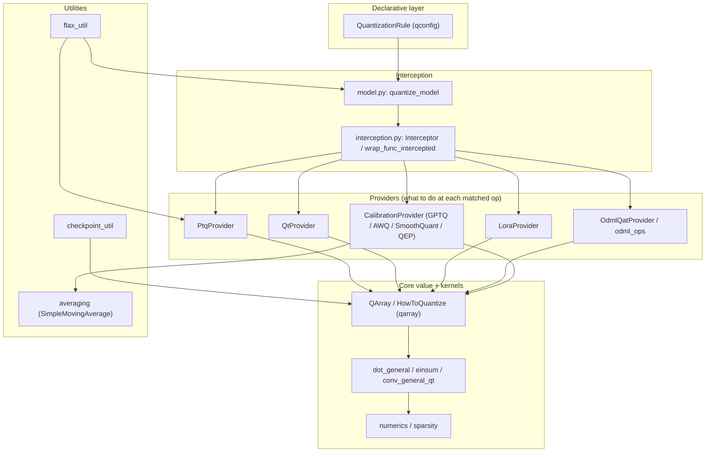

# qwix — what it is and how it fits together

## In one paragraph

Qwix is a JAX/Flax quantization library that quantizes a model **without rewriting its source
code**. It works by process-wide monkey-patching (interception) of primitives like
`jax.lax.dot_general`: when a model is "quantized" via `quantize_model`, its forward method is
wrapped so that, for the duration of the call, matched ops are dispatched to a
`QuantizationProvider` instead of the raw JAX primitive. Which ops get quantized, and how, is
driven entirely by a declarative `QuantizationRule` list (regex module-path matcher + `qtype`/tile
knobs) — the same rule shape serves inference-time PTQ, quantized training (QT/QLoRA), on-device
export (ODML/LiteRT), and every offline calibration-based algorithm (GPTQ, AWQ, Smooth Quant, QEP).
All of these providers bottom out in one shared value representation,
`QArray`, and one shared pair of quantization-aware kernels, `dot_general`/`einsum`.

## Core architecture

## Main concepts

**The rule → provider → op-replacement pipeline.** A `QuantizationRule`
([qwix-_src-qconfig](concepts/qwix-_src-qconfig.md)) is a declarative `(module_path regex,
weight_qtype, act_qtype, tile_size, ...)` tuple; a `QuantizationProvider` walks an ordered rule
list at every intercepted op and picks the first match. Every provider in the codebase —
PTQ, QT, LoRA, ODML, and every calibration-based algorithm — is built on this same matching
primitive, which is what lets one rule DSL configure entirely different quantization regimes.

**Interception: monkey-patching as the "no source changes" mechanism.**
[qwix-_src-interception](concepts/qwix-_src-interception.md) is the low-level machinery
(thread-local, non-recursive, nesting-safe global `setattr` patching of JAX primitives) that makes
quantization transparent to model code.
[qwix-_src-model](concepts/qwix-_src-model.md) is the Flax-facing layer on top: it dynamically
subclasses a `nn.Module`/`nnx.Module` so its target methods run wrapped in an interception scope,
handling Linen's copy-on-apply semantics and NNX's need-to-actually-run-once-to-materialize-state
semantics differently.

**QArray: one quantized-value representation for every regime.**
[qwix-_src-core-qarray](concepts/qwix-_src-core-qarray.md) is the `qvalue`/`scale`/`zero_point`/
`qtype` bundle (with built-in subchannel/tiled-scale support) that every provider produces or
consumes. `HowToQuantize` is the declarative recipe a rule gets converted into to actually build a
`QArray`. Because every algorithm — offline PTQ, GPTQ's Hessian-corrected weights, AWQ's
pre-scaled weights — ultimately emits a `QArray` in the same shape, a quantized checkpoint from any
of them is loadable by the same PTQ inference path.

**Quantization-aware kernels: fast/slow dispatch plus differentiable variants for training.**
[qwix-_src-core-dot_general](concepts/qwix-_src-core-dot_general.md) is the drop-in
`jax.lax.dot_general` replacement every provider calls, picking a fast (compute-in-quantized-types)
or slow (dequantize-first) path depending on operand types.
[qwix-_src-core-dot_general_qt](concepts/qwix-_src-core-dot_general_qt.md) and
[qwix-_src-core-conv_general_qt](concepts/qwix-_src-core-conv_general_qt.md) extend this with
`jax.custom_vjp`-defined forward *and backward* quantization for quantized training. Numeric-format
mechanics (representable ranges, float↔int conversion) live one layer down in
[qwix-_src-core-numerics](concepts/qwix-_src-core-numerics.md), and N:M structured sparsity
([qwix-_src-core-sparsity](concepts/qwix-_src-core-sparsity.md)) is a parallel mask-based transform
over the same value types.

**Inference vs. training vs. on-device: three provider families over one substrate.**
[qwix-_src-providers-ptq](concepts/qwix-_src-providers-ptq.md) is the reference
inference-time provider (weight-only or dynamic/static-range activation quantization).
[qwix-_src-providers-qt](concepts/qwix-_src-providers-qt.md) extends the same rule shape to
quantize *training* — both forward and backward-pass gradients.
[qwix-_src-providers-lora](concepts/qwix-_src-providers-lora.md) composes with PTQ for QLoRA (frozen
quantized base weights + trainable low-rank correction).
[qwix-_src-providers-odml](concepts/qwix-_src-providers-odml.md) and
[qwix-_src-providers-odml_ops](concepts/qwix-_src-providers-odml_ops.md) target LiteRT/TFLite's
tensor-centric (not op-centric) quantization model, requiring metadata propagation through every
JAX primitive, not just matmul-shaped ones.

**Calibration-based offline algorithms: one shared two-phase framework.**
[qwix-contrib-calibration](concepts/qwix-contrib-calibration.md) factors out the common
"intercept during a calibration pass, then quantize offline using the collected stats" workflow
shared by [GPTQ](concepts/qwix-contrib-gptq.md) (Hessian-based error compensation),
[AWQ](concepts/qwix-contrib-awq.md) (salient-channel rescaling),
[Smooth Quant](concepts/qwix-contrib-smooth_quant.md) (activation-to-weight difficulty migration),
and [QEP](concepts/qwix-contrib-qep.md) (stage-by-stage quantization-noise-aware calibration, which
explicitly builds on GPTQ). All four converge on the same `QArray` output shape via
`quantize_params_with_calibration`, with a PTQ fallback for anything not covered by calibration
stats.

**Padding as a orthogonal extension to subchannel quantization.**
[qwix-contrib-padded_ptq](concepts/qwix-contrib-padded_ptq.md) removes the constraint that a tiled
axis must divide evenly by the tile size, by transparently zero-padding around
`quantize`/`dot_general`/`einsum` calls and un-padding the results — a self-contained wrapper layer
over the core PTQ provider and kernels, not a new algorithm.

**Cross-cutting utilities.** [qwix-_src-utils-flax_util](concepts/qwix-_src-utils-flax_util.md)
abstracts over Linen vs. NNX for "get current module", "get/create a parameter", and "is this array
a parameter" — every provider depends on it to work identically across both Flax APIs.
[qwix-_src-utils-checkpoint_util](concepts/qwix-_src-utils-checkpoint_util.md) handles loading
externally-quantized or full-precision checkpoints into whatever shape the live model template
expects. [qwix-_src-averaging](concepts/qwix-_src-averaging.md) (`SimpleMovingAverage`) is the one
statistics-accumulation primitive every calibration/static-range code path uses to average stats
across multiple batches.

## How a request flows

A typical PTQ deployment: a caller builds an ordered list of `QuantizationRule`s → calls
`quantize_model(model, PtqProvider(rules))` → [qwix-_src-model](concepts/qwix-_src-model.md)
subclasses the model and wraps its forward method via
[qwix-_src-interception](concepts/qwix-_src-interception.md) → at each matched `dot_general`, the
provider resolves the active rule ([qwix-_src-qconfig](concepts/qwix-_src-qconfig.md)), builds a
`HowToQuantize`, and quantizes the operand into a
[`QArray`](concepts/qwix-_src-core-qarray.md) → the quantized op runs through
[qwix-_src-core-dot_general](concepts/qwix-_src-core-dot_general.md)'s fast/slow-path dispatch. A
GPTQ/AWQ/SQ/QEP deployment inserts an extra offline phase before this: a calibration pass under
[qwix-contrib-calibration](concepts/qwix-contrib-calibration.md)'s provider family collects stats,
then an algorithm-specific `quantize_params` call produces the same `QArray`-shaped params PTQ
inference expects.

## Map of the wiki

- **"What rule fields exist and how does matching work?"** → [qwix-_src-qconfig](concepts/qwix-_src-qconfig.md)
- **"How does quantization apply to a model with zero source changes?"** →
  [qwix-_src-interception](concepts/qwix-_src-interception.md) +
  [qwix-_src-model](concepts/qwix-_src-model.md)
- **"What does a quantized value actually look like?"** → [qwix-_src-core-qarray](concepts/qwix-_src-core-qarray.md)
- **"How is the actual matmul/conv done, and how does training-time (backward) quantization work?"** →
  [qwix-_src-core-dot_general](concepts/qwix-_src-core-dot_general.md),
  [qwix-_src-core-dot_general_qt](concepts/qwix-_src-core-dot_general_qt.md),
  [qwix-_src-core-conv_general_qt](concepts/qwix-_src-core-conv_general_qt.md)
- **"Which provider do I want — inference, training, LoRA, or on-device export?"** →
  [qwix-_src-providers-ptq](concepts/qwix-_src-providers-ptq.md),
  [qwix-_src-providers-qt](concepts/qwix-_src-providers-qt.md),
  [qwix-_src-providers-lora](concepts/qwix-_src-providers-lora.md),
  [qwix-_src-providers-odml](concepts/qwix-_src-providers-odml.md)
- **"How do the offline calibration algorithms (GPTQ/AWQ/SQ/QEP) work and relate to each other?"** →
  [qwix-contrib-calibration](concepts/qwix-contrib-calibration.md) as the entry point, then the
  algorithm-specific pages.
- **"How do checkpoints round-trip, and how does the Linen/NNX abstraction work?"** →
  [qwix-_src-utils-checkpoint_util](concepts/qwix-_src-utils-checkpoint_util.md),
  [qwix-_src-utils-flax_util](concepts/qwix-_src-utils-flax_util.md)

For the exhaustive per-symbol index (every function/class signature, defining file:line, and
caller graph), see `catalog/` — one page per source module. For the flat list of every concept
page with its one-line description, see `index.md`.
