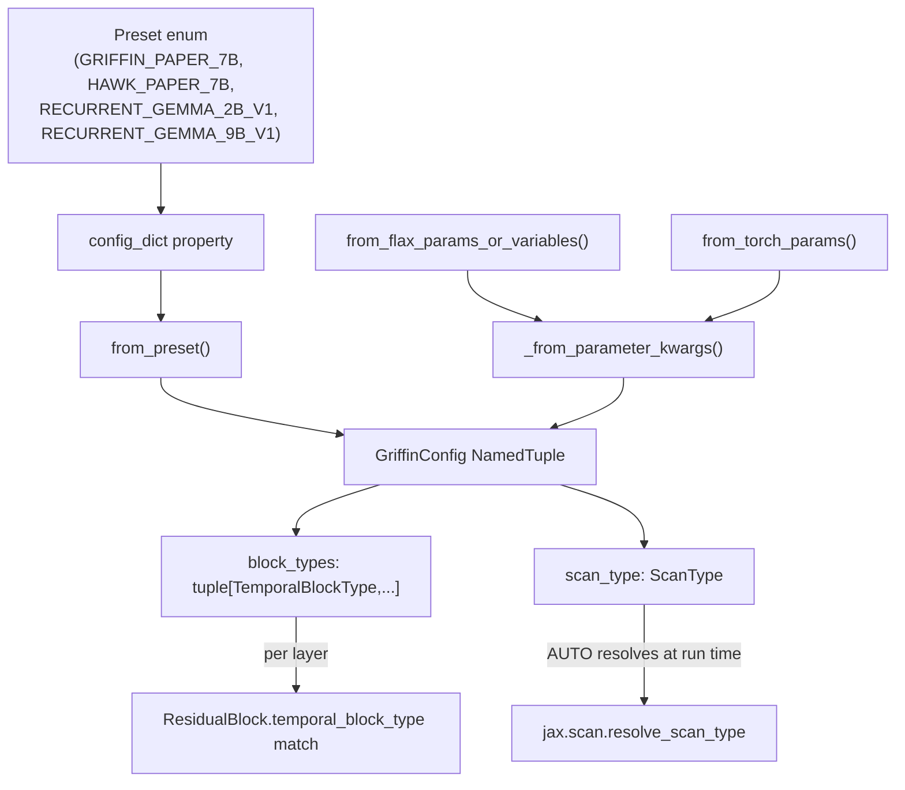

# recurrentgemma.common — model configuration and the scan-backend switch

## Overview

`recurrentgemma/common.py` is the single source of truth shared by the JAX and PyTorch
implementations: it defines the [`TemporalBlockType`](../catalog/recurrentgemma/common.md#TemporalBlockType)
enum (recurrent-vs-attention per layer), the [`ScanType`](../catalog/recurrentgemma/common.md#ScanType)
enum (which backend computes the RG-LRU recurrence), the [`Preset`](../catalog/recurrentgemma/common.md#Preset)
enum of published model sizes, and the [`GriffinConfig`](../catalog/recurrentgemma/common.md#Preset.config_dict)
NamedTuple that both `recurrentgemma.jax.griffin.Griffin` and `recurrentgemma.torch.griffin.Griffin`
consume identically. Because both lanes import from this one module (`recurrentgemma.jax.__init__`
and `recurrentgemma.torch.__init__` simply re-export
[`TemporalBlockType`](../catalog/recurrentgemma/jax/__init__.md#TemporalBlockType) /
[`ScanType`](../catalog/recurrentgemma/jax/__init__.md#ScanType) from here), a config value — in
particular `scan_type` — has exactly one meaning across both frameworks, which is what makes
cross-framework numerical-equivalence testing (see the `test_numerically_to_jax` family) possible.

## Diagram

## Design rationale (why it's built this way)

**`block_types` is data, not a hyperparameter tuple guess.** Rather than storing "N recurrent
layers followed by M attention layers," `GriffinConfig`
stores the literal per-layer sequence as
[`block_types`](../catalog/recurrentgemma/common.md#GriffinConfig.block_types)`: tuple[TemporalBlockType, ...]`.
Every published preset's [`config_dict`](../catalog/recurrentgemma/common.md#Preset.config_dict)
builds this by cycling a fixed 2-recurrent-then-1-attention pattern
(`itertools.cycle([RECURRENT, RECURRENT, ATTENTION])`) and slicing it to `num_layers` — so the
architecture literally *is* the tuple, and a model with a non-standard interleaving is just a
different tuple, no new code path needed.

**`ScanType.AUTO` defers the TPU-vs-everything-else decision to run time, not config time.**
[`ScanType`](../catalog/recurrentgemma/common.md#ScanType)'s docstring is explicit: "On TPUs Pallas
is faster, hence when using `AUTO` the code will pick Pallas automatically... otherwise fallback to
the NATIVE Jax for loop." Every preset's `config_dict` sets `scan_type=`[`AUTO`](../catalog/recurrentgemma/common.md#ScanType.AUTO)
rather than hardcoding [`LINEAR_PALLAS`](../catalog/recurrentgemma/jax/layers.md#RGLRU.scan_type) —
so the same `GriffinConfig` object is portable across a TPU pod and a CPU debugging session without
edits; the actual dispatch happens per-call in `resolve_scan_type` (see
[recurrentgemma-jax-pallas](recurrentgemma-jax-pallas.md)).

**Three independent config constructors converge on one private path.**
[`from_preset`](../catalog/recurrentgemma/common.md#GriffinConfig.from_preset),
[`from_flax_params_or_variables`](../catalog/recurrentgemma/common.md#GriffinConfig.from_flax_params_or_variables),
and [`from_torch_params`](../catalog/recurrentgemma/common.md#GriffinConfig.from_torch_params) all
funnel through [`_from_parameter_kwargs`](../catalog/recurrentgemma/common.md#GriffinConfig._from_parameter_kwargs),
which cross-checks any explicitly supplied hyperparameter against the preset's own
[`config_dict`](../catalog/recurrentgemma/common.md#Preset.config_dict) and raises `ValueError` on
mismatch. This means loading a checkpoint's raw parameter dict (JAX or PyTorch state-dict layout —
the two methods parse different key naming, e.g. `"blocks.0"` dict nesting vs.
`"blocks.0.recurrent_block.rg_lru.a_gate.w"` flat strings) can *recover* a full `GriffinConfig`,
including `block_types`, purely by pattern-matching which sub-keys (`"recurrent_block"` vs
`"attention_block"`) are present per layer — the config is redundant with the checkpoint shape by
design, useful for loading foreign checkpoints without a config file.

> [!inferred] `max_cache_length` is defined as exactly `attention_window_size` (a property on
> `GriffinConfig`, not in this packet's subgraph) — meaning the KV-cache and the RG-LRU/Conv1D cache
> share no length parameter; the recurrent state is O(1) already, so only the attention window
> bounds cache size.

## Entry points

- [`from_preset`](../catalog/recurrentgemma/common.md#GriffinConfig.from_preset) — the path every
  example script uses (see `examples/simple_run_jax.py`'s and `simple_run_pytorch.py`'s
  [`main`](../catalog/examples/simple_run_jax.md#main)): pick a
  [`Preset`](../catalog/recurrentgemma/common.md#Preset), get a fully-populated `GriffinConfig`.
- [`from_flax_params_or_variables`](../catalog/recurrentgemma/common.md#GriffinConfig.from_flax_params_or_variables) /
  [`from_torch_params`](../catalog/recurrentgemma/common.md#GriffinConfig.from_torch_params) — reached
  when only a checkpoint (no config) is available; both are pure functions of the parameter pytree's
  key structure.
- [`ResidualBlock.temporal_block_type`](../catalog/recurrentgemma/jax/modules.md#ResidualBlock.temporal_block_type)
  (and its torch mirror) — every block reads one entry of
  [`block_types`](../catalog/recurrentgemma/common.md#GriffinConfig.block_types) at construction and
  never revisits it; this is where the config tuple becomes concrete layer objects (see
  [recurrentgemma-jax-modules](recurrentgemma-jax-modules.md)).

## Mechanism (step-by-step)

1. **Preset selection produces a plain dict.** [`config_dict`](../catalog/recurrentgemma/common.md#Preset.config_dict)
   is a `@property` on [`Preset`](../catalog/recurrentgemma/common.md#Preset) that pattern-matches
   `self` against the four published presets (`GRIFFIN_PAPER_7B`, `HAWK_PAPER_7B`,
   `RECURRENT_GEMMA_2B_V1`, `RECURRENT_GEMMA_9B_V1`) and returns a `dict[str, Any]` of every
   `GriffinConfig` field except `vocab_size`.
2. **`from_preset` merges in `vocab_size` and optionally clamps the attention window.**
   [`from_preset`](../catalog/recurrentgemma/common.md#GriffinConfig.from_preset) takes the
   `config_dict`, and if `max_sequence_length` is given and smaller than the preset's
   `attention_window_size`, shrinks the window — this is the one piece of config that is derived
   from the caller's *usage*, not the architecture.
3. **Checkpoint-driven construction walks the parameter tree layer by layer.**
   [`from_flax_params_or_variables`](../catalog/recurrentgemma/common.md#GriffinConfig.from_flax_params_or_variables)
   and [`from_torch_params`](../catalog/recurrentgemma/common.md#GriffinConfig.from_torch_params)
   both loop `i = 0, 1, 2, ...` while `f"blocks.{i}"` (or its PyTorch flat-key equivalent) exists,
   inspect whether that block's params contain a `recurrent_block` or `attention_block` sub-tree,
   and append the corresponding [`TemporalBlockType`](../catalog/recurrentgemma/common.md#TemporalBlockType)
   ([`RECURRENT`](../catalog/recurrentgemma/common.md#TemporalBlockType.RECURRENT) or
   [`ATTENTION`](../catalog/recurrentgemma/common.md#TemporalBlockType.ATTENTION)) to a running
   `block_types` list, additionally back-computing `num_heads`/`lru_width` from the gate weight
   shapes.
4. **`_from_parameter_kwargs` reconciles inferred kwargs against an optional preset.**
   [`_from_parameter_kwargs`](../catalog/recurrentgemma/common.md#GriffinConfig._from_parameter_kwargs)
   is the funnel point: if a `preset` was also passed, every inferred key is checked equal to that
   preset's own [`config_dict`](../catalog/recurrentgemma/common.md#Preset.config_dict) value (except
   `vocab_size`), raising on any disagreement — a cheap but effective checkpoint/config consistency
   check.
5. **Downstream, `block_types` and `scan_type` are read exactly once per model instance.** Both
   `Griffin.setup` (jax) and
   its torch mirror iterate `config.`[`block_types`](../catalog/recurrentgemma/common.md#GriffinConfig.block_types)
   to build one [`ResidualBlock`](../catalog/recurrentgemma/jax/modules.md#ResidualBlock.recurrent_block)
   (or its torch equivalent) per entry, threading `config.scan_type` down into every
   [`RecurrentBlock`](../catalog/recurrentgemma/jax/modules.md#RecurrentBlock.scan_type); see
   [recurrentgemma-jax-griffin](recurrentgemma-jax-griffin.md).

## Key data structures

- **[`GriffinConfig`](../catalog/recurrentgemma/common.md#Preset.config_dict)** (`typing.NamedTuple`)
  — immutable, hashable (usable as a static/hashable argument to `jax.jit`), the complete
  architecture description: `vocab_size`, `width`, `mlp_expanded_width`, `num_heads`,
  [`block_types`](../catalog/recurrentgemma/common.md#GriffinConfig.block_types),
  `embeddings_scale_by_sqrt_dim`, `attention_window_size`, `logits_soft_cap`, `lru_width`,
  [`scan_type`](../catalog/recurrentgemma/common.md#GriffinConfig.scan_type).
- **[`Preset`](../catalog/recurrentgemma/common.md#Preset)** — enum of the four published
  configurations ([`GRIFFIN_PAPER_7B`](../catalog/recurrentgemma/common.md#Preset.GRIFFIN_PAPER_7B),
  [`HAWK_PAPER_7B`](../catalog/recurrentgemma/common.md#Preset.HAWK_PAPER_7B),
  [`RECURRENT_GEMMA_2B_V1`](../catalog/recurrentgemma/common.md#Preset.RECURRENT_GEMMA_2B_V1),
  [`RECURRENT_GEMMA_9B_V1`](../catalog/recurrentgemma/common.md#Preset.RECURRENT_GEMMA_9B_V1)); Hawk is
  pure-recurrent (`block_types = (RECURRENT,) * 32`), Griffin interleaves attention every third
  layer.

## Dynamics (design intent)

`GriffinConfig` being a `NamedTuple` (not a dataclass or Flax struct) is deliberate: it is hashable
and usable directly as a static field on Flax modules (`config: common.GriffinConfig` appears as a
plain dataclass-style attribute on `Griffin`), so the whole config participates in JAX's
tracing/caching as a static (non-traced) value — changing any field forces a JIT recompile, which is
correct since `block_types`/`scan_type` are structural, not numeric, choices.

## Edge cases

- [`_from_parameter_kwargs`](../catalog/recurrentgemma/common.md#GriffinConfig._from_parameter_kwargs)'s
  consistency check explicitly skips `vocab_size` — this is intentional, since checkpoints often
  pad the vocab to a hardware-friendly multiple while the preset's canonical `vocab_size` reflects
  the tokenizer.
- `max_sequence_length`-based window clamping happens identically in
  [`from_preset`](../catalog/recurrentgemma/common.md#GriffinConfig.from_preset) and inside
  [`_from_parameter_kwargs`](../catalog/recurrentgemma/common.md#GriffinConfig._from_parameter_kwargs)
  — callers going through the checkpoint-inference path get the same clamp for free.

## Open questions

- The `BLOCK_TYPES` constant referenced from `conversion_test.py` (used to numerically compare a
  fixed jax/torch pair) is a test fixture, not part of the public config surface — its presence in
  this packet suggests the test suite hardcodes a canonical `block_types` value for equivalence
  testing rather than parameterizing over all four presets.

## See also
- [recurrentgemma-jax-griffin](recurrentgemma-jax-griffin.md) — where `GriffinConfig` is consumed to
  build the model.
- [recurrentgemma-jax-modules](recurrentgemma-jax-modules.md) — where `block_types`/`scan_type`
  become per-layer dispatch.
- [recurrentgemma-jax-pallas](recurrentgemma-jax-pallas.md) — where `ScanType.AUTO` is resolved to a
  concrete backend.
