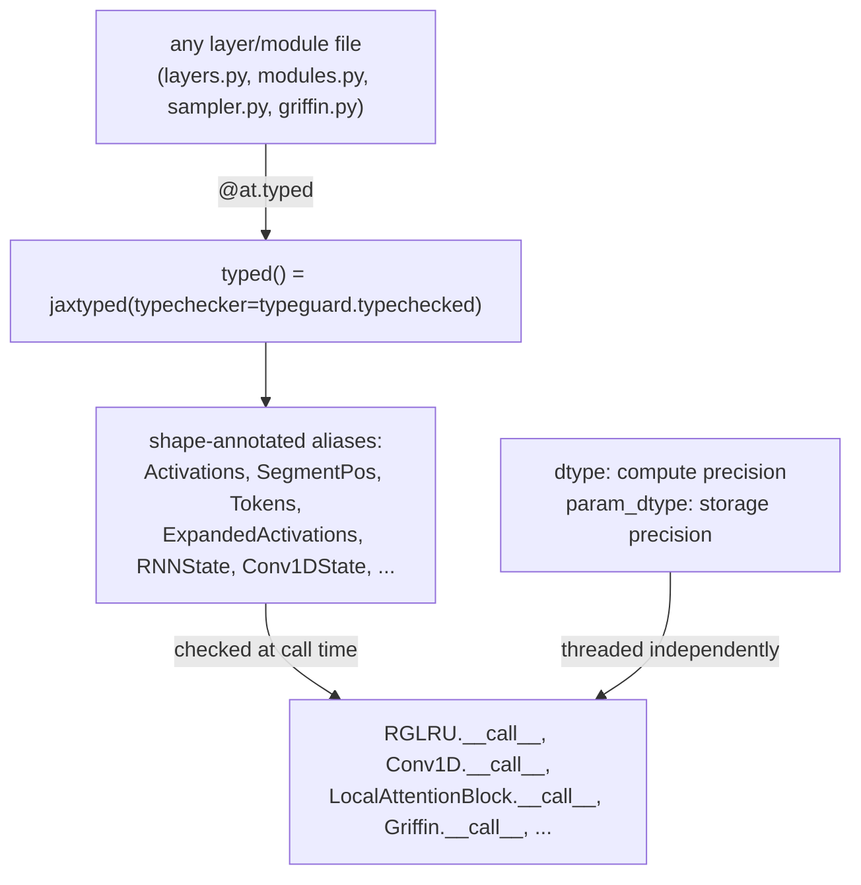

# recurrentgemma.jax.array_typing — runtime shape checking and the dtype/param_dtype split

## Overview

This small module (67 lines) defines two things every other JAX module in the repo depends on: the
[`typed`](../catalog/recurrentgemma/jax/array_typing.md#typed) decorator — `jaxtyping.jaxtyped(...,
typechecker=typeguard.typechecked)` — which turns ordinary type annotations into *runtime-checked*
shape/dtype assertions, and a vocabulary of shape-annotated type aliases
([`Activations`](../catalog/recurrentgemma/jax/array_typing.md#Activations),
[`SegmentPos`](../catalog/recurrentgemma/jax/array_typing.md#SegmentPos),
[`ExpandedActivations`](../catalog/recurrentgemma/jax/modules.md), etc., each a `jaxtyping.Float`/`Integer`/`Bool`
annotation with an einops-style axis-letter shape string) that every `__call__` across
[`RGLRU`](../catalog/recurrentgemma/jax/layers.md#RGLRU),
[`Conv1D`](../catalog/recurrentgemma/jax/layers.md#Conv1D),
[`LocalAttentionBlock`](../catalog/recurrentgemma/jax/modules.md#LocalAttentionBlock), etc. is
annotated with. Nearly every function in the codebase carries the `@at.typed` decorator, so a shape
mismatch anywhere (e.g. passing a `[batch, seq]` array where `[batch, seq, dim]` was expected) raises
immediately at the call site rather than surfacing as a cryptic shape error deep inside a matmul.

## Diagram

## Design rationale (why it's built this way)

**Shape checking is opt-in per function via a decorator, not global — and it is applied almost
everywhere.** [`typed`](../catalog/recurrentgemma/jax/array_typing.md#typed) is a thin wrapper:
`jt.jaxtyped(function, typechecker=typeguard.typechecked)`. Because it's a decorator rather than a
global flag, individual hot-path functions could in principle opt out for performance — but in
practice essentially every `__call__` in this packet's subgraph (
[`RGLRU.__call__`](../catalog/recurrentgemma/jax/layers.md#RGLRU.__call__),
[`Conv1D.__call__`](../catalog/recurrentgemma/jax/layers.md#Conv1D.__call__),
[`LocalAttentionBlock.__call__`](../catalog/recurrentgemma/jax/modules.md#LocalAttentionBlock.__call__),
[`ResidualBlock.__call__`](../catalog/recurrentgemma/jax/modules.md#ResidualBlock.__call__),
[`RecurrentBlock.__call__`](../catalog/recurrentgemma/jax/modules.md#RecurrentBlock.__call__),
[`MLPBlock.__call__`](../catalog/recurrentgemma/jax/modules.md#MLPBlock.__call__),
[`Einsum.__call__`](../catalog/recurrentgemma/jax/layers.md#Einsum.__call__),
[`Griffin.__call__`](../catalog/recurrentgemma/jax/griffin.md#Griffin.__call__),
[`Embedder.encode`](../catalog/recurrentgemma/jax/modules.md#Embedder.encode)/
[`decode`](../catalog/recurrentgemma/jax/modules.md#Embedder.decode), and the sampler's
[`apply_model`](../catalog/recurrentgemma/jax/sampler.md#Sampler.apply_model)/
[`_sample_step`](../catalog/recurrentgemma/jax/sampler.md#Sampler._sample_step)/
[`_sample_fn`](../catalog/recurrentgemma/jax/sampler.md#Sampler._sample_fn) — carries it, making
shape correctness a pervasive, checked invariant rather than an assumption.

**Axis letters are a fixed, shared vocabulary documented once at the top of the file, so every
alias's shape string is mutually consistent across the whole codebase.** The module's own comment
block fixes the notation (`b`=batch, `t`=tokens, `d`=model dim, `e`=expanded recurrent dim,
`w`=conv window, `v`=vocab, `n`=heads, `s`=keys/values count, `h`=head dim) — so
[`Activations`](../catalog/recurrentgemma/jax/array_typing.md#Activations) `= Float[Array, "*b t
d"]` and [`ExpandedActivations`](../catalog/recurrentgemma/jax/modules.md) `= Float[Array, "*b t
e"]` are visibly related (same axes, different last-dim semantic) purely by reading the letters, not
by cross-referencing definitions.

**`dtype` and `param_dtype` are two independently-threaded fields on nearly every module, not one
combined precision setting.** Every layer class in this packet's subgraph carries both a `dtype:
at.dtype | None` (compute precision, defaulting to `None` meaning "infer from inputs") and a
`param_dtype: at.dtype = jnp.float32` (storage/initialization precision, always defaulting to
fp32) — visible on
[`RGLRU`](../catalog/recurrentgemma/jax/layers.md#RGLRU.dtype)/[`param_dtype`](../catalog/recurrentgemma/jax/layers.md#RGLRU.param_dtype),
[`Conv1D`](../catalog/recurrentgemma/jax/layers.md#Conv1D.param_dtype),
[`BlockDiagonalLinear`](../catalog/recurrentgemma/jax/layers.md#BlockDiagonalLinear.param_dtype),
[`Einsum`](../catalog/recurrentgemma/jax/layers.md#Einsum.param_dtype),
[`RMSNorm`](../catalog/recurrentgemma/jax/layers.md#RMSNorm.param_dtype),
[`LocalAttentionBlock`](../catalog/recurrentgemma/jax/modules.md#LocalAttentionBlock.param_dtype),
[`RecurrentBlock`](../catalog/recurrentgemma/jax/modules.md#RecurrentBlock.param_dtype)/
[`dtype`](../catalog/recurrentgemma/jax/modules.md#RecurrentBlock.dtype),
[`ResidualBlock`](../catalog/recurrentgemma/jax/modules.md#ResidualBlock.dtype)/
[`param_dtype`](../catalog/recurrentgemma/jax/modules.md#ResidualBlock.param_dtype),
[`MLPBlock`](../catalog/recurrentgemma/jax/modules.md#MLPBlock.param_dtype), and
[`Griffin`](../catalog/recurrentgemma/jax/griffin.md#Griffin.param_dtype). This is what lets a model
store fp32 parameters (numerically stable optimizer state) while computing every matmul in bf16 —
`nn.dtypes.promote_dtype(x, param, dtype=self.dtype)` (visible in every layer's `__call__` body, not
itself in this packet's subgraph) is the actual cast point.

> [!inferred] The torch mirror ([recurrentgemma-torch-array_typing](recurrentgemma-torch-array_typing.md))
> deliberately makes `typed` a **no-op** (`return function`, with a comment "breaks torch.compile") —
> meaning shape checking is a JAX-lane-only safety net; the torch lane relies on `torch.compile`'s own
> shape specialization instead and gets no equivalent runtime shape assertions.

## Entry points

- [`typed`](../catalog/recurrentgemma/jax/array_typing.md#typed) — imported as `at.typed` and applied
  as `@at.typed` at the top of essentially every function signature in the JAX lane; this is the one
  symbol every other module in the packet depends on.
- [`Activations`](../catalog/recurrentgemma/jax/array_typing.md#Activations)/
  [`SegmentPos`](../catalog/recurrentgemma/jax/array_typing.md#SegmentPos) — the two most-used
  aliases, appearing in nearly every layer's `__call__` signature as the primary input types.

## Mechanism (step-by-step)

1. **A function is annotated with shape-typed aliases and decorated with `@at.typed`.** E.g.
   [`RGLRU.__call__`](../catalog/recurrentgemma/jax/layers.md#RGLRU.__call__)`(self, x:
   ExpandedActivations, segment_pos: SegmentPos, ...)`.
2. **[`typed`](../catalog/recurrentgemma/jax/array_typing.md#typed) wraps the call so every
   argument's runtime shape/dtype is checked against its annotation before the function body runs**,
   via `typeguard.typechecked` — a failure raises a `TypeCheckError` naming the offending argument
   and the expected vs. actual shape.
3. **Downstream code composes aliases rather than re-deriving shapes.** `AttentionBlockCache`'s
   `keys`/`values` fields (`CachedKeys`/`CachedValues`, not in this packet's own subgraph but
   defined via the same alias table) and
   [`RecurrentBlockCache.conv1d_state`](../catalog/recurrentgemma/jax/modules.md#RecurrentBlockCache.conv1d_state)
   (`Conv1DState`) all reuse the same alias vocabulary this module defines, so a cache's shape
   contract is legible from its type annotation alone.
4. **[`dtype`](../catalog/recurrentgemma/jax/array_typing.md#dtype)/`param_dtype` are read at module
   `setup()`/param-creation time and at call time independently** — parameters are always created at
   `param_dtype` (e.g. `RGLRU`'s own `a_real_param` via `self.param(..., self.param_dtype)`), while
   `nn.dtypes.promote_dtype(..., dtype=self.dtype)` casts to the compute dtype right before use in
   every `__call__`.

## Key data structures

- **The alias table** (from the module's own axis-letter legend): `Activations` (`*b t d`),
  `SegmentPos`/`Tokens` (`*b t`), `TokenLogits` (`*b t v`), `Queries` (`*b t n h`), `Keys`/`Values`
  (`*b t 1 h` — note the hardcoded `1`, reflecting the single-KV-head design in
  [recurrentgemma-jax-modules](recurrentgemma-jax-modules.md)), `CachedKeys`/`CachedValues` (`*b s 1
  h`), `ExpandedActivations` (`*b t e`), `RNNDiagonal` (`e`), `RNNState` (`*b e`), `Conv1DState` (`*b
  w e`).
- **`dtype = str | type(jnp.float64)`** — the module's own type alias for a dtype value, used as the
  annotation on every `dtype`/`param_dtype` field across the codebase.

## Dynamics (design intent)

Because `@at.typed` performs a real runtime check on every call (not just at trace time), it runs
once per unique `jax.jit` trace (Python-level tracing happens once per shape signature) — so its
runtime cost is amortized across the compiled program's many actual invocations, not paid per step.

## Edge cases

- The hardcoded `1` in [`Keys`](../catalog/recurrentgemma/jax/array_typing.md)/`Values`'s shape
  string is itself a type-level assertion of the single-KV-head design — a code change introducing
  multi-head KV would need to update this alias (and every signature using it) or the runtime check
  would start failing.

## Open questions

- Whether `typeguard`'s runtime overhead is measurable in a real training step (vs. purely
  trace-time, amortized away by `jit`) isn't discussed in this packet's grounding.

## See also
- [recurrentgemma-torch-array_typing](recurrentgemma-torch-array_typing.md) — the torch mirror, where
  `typed` is a no-op for `torch.compile` compatibility.
- [recurrentgemma-jax-layers](recurrentgemma-jax-layers.md) /
  [recurrentgemma-jax-modules](recurrentgemma-jax-modules.md) — the primary consumers of this
  module's aliases and decorator.
