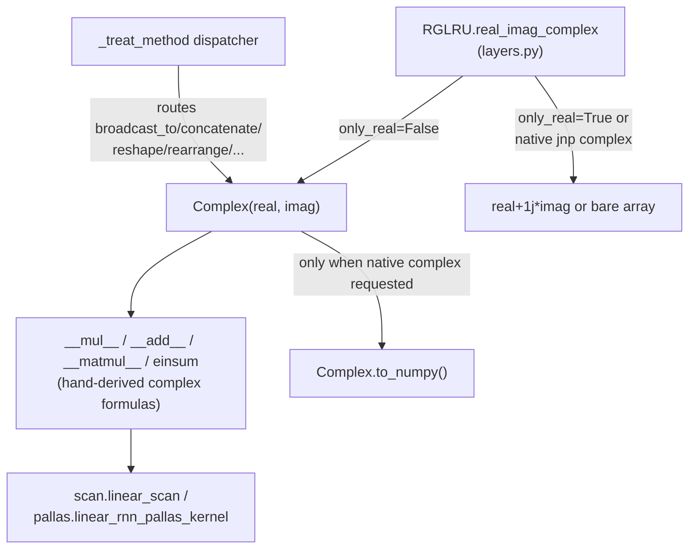

# recurrentgemma.jax.complex_lib — a bf16-safe complex number wrapper

## Overview

JAX's native complex dtype is always 64-bit (32-bit real + 32-bit imaginary), which is unusable
inside a `bfloat16`-precision TPU training step or a Pallas kernel (Pallas/Mosaic has no native
complex-number lowering at all). [`Complex`](../catalog/recurrentgemma/jax/complex_lib.md#Complex)
sidesteps both problems by representing a complex number as a pair of separate real arrays
([`real`](../catalog/recurrentgemma/jax/complex_lib.md#Complex.real) /
[`imag`](../catalog/recurrentgemma/jax/complex_lib.md#Complex.imag), each any real dtype including
`bfloat16`) wrapped in a `flax.struct.dataclass` — a JAX pytree — and reimplementing just the
arithmetic operators the RG-LRU recurrence actually needs
([`__mul__`](../catalog/recurrentgemma/jax/complex_lib.md#Complex.__mul__),
[`__add__`](../catalog/recurrentgemma/jax/complex_lib.md#Complex.__add__),
[`einsum`](../catalog/recurrentgemma/jax/complex_lib.md#einsum),
[`exp`](../catalog/recurrentgemma/jax/complex_lib.md#exp),
[`log`](../catalog/recurrentgemma/jax/complex_lib.md#log), ...) by hand using real-valued formulas.
This module is the reason `RGLRU` (via its
[`real_imag_complex`](../catalog/recurrentgemma/jax/layers.md#RGLRU.real_imag_complex)) can optionally run
its recurrence with a genuinely complex diagonal state at TPU-friendly precision and inside a Pallas
kernel — something `jax.numpy`'s complex dtype cannot do.

## Diagram

## Design rationale (why it's built this way)

**Arithmetic is hand-derived, not delegated to `jax.numpy` complex ops.**
[`__matmul__`](../catalog/recurrentgemma/jax/complex_lib.md#Complex.__matmul__) implements complex
matrix multiplication via the Karatsuba-style 3-multiply trick (`tmp = (a.real+a.imag) @ (b.real+b.imag)`,
then two more real matmuls) rather than the naive 4-multiply expansion — a deliberate
FLOPs-vs-precision trade that only makes sense because every operand is already a real array pair;
[`__mul__`](../catalog/recurrentgemma/jax/complex_lib.md#Complex.__mul__) and
[`__truediv__`](../catalog/recurrentgemma/jax/complex_lib.md#Complex.__truediv__) use the standard
4-real-op complex formulas directly. Every op first calls
[`_sanity_check`](../catalog/recurrentgemma/jax/complex_lib.md#Complex._sanity_check), which
explicitly **rejects** a native `jnp` complex operand (`raise ValueError` if
`jnp.iscomplexobj(x)`) — the wrapper and native complex are never allowed to silently mix.

**`_treat_method` is the generic escape hatch for shape/structural ops.** Rather than
hand-implementing `broadcast_to`, `concatenate`, `split`, `reshape`, `rearrange`, etc. on `Complex`
one at a time, [`_treat_method`](../catalog/recurrentgemma/jax/complex_lib.md#_treat_method) is a
single dispatcher: given a method name and a module (`jnp`, `jax.lax`, or `einops`), it detects
whether any argument is a `Complex` (or a list containing one), and if so splits every `Complex`
argument into its real/imag parts, calls the underlying real-valued function twice (once for reals,
once for imaginaries), and re-wraps the two results into a new `Complex` — otherwise it just calls
the function directly. The module-level names (`broadcast_to`, `split`, `reshape`, etc., all built via
`functools.partial(`[`_treat_method`](../catalog/recurrentgemma/jax/complex_lib.md#_treat_method)`, '<name>', jnp)`)
are what the rest of the codebase imports, so call
sites read exactly like plain `jnp`/`einops` calls regardless of whether the operand is real or
`Complex`.

**`use_custom_complex` decides per-call, not per-model, whether to use this wrapper.**
[`RGLRU.real_imag_complex`](../catalog/recurrentgemma/jax/layers.md#RGLRU.real_imag_complex) (in
[recurrentgemma-jax-layers](recurrentgemma-jax-layers.md)) only constructs a
[`Complex`](../catalog/recurrentgemma/jax/complex_lib.md#Complex) when the dtype is
`bfloat16`/`float16` *or* the scan type is `LINEAR_PALLAS` — otherwise it falls through to native
`jnp` complex (`real + 1j * imag`). This means the exact same `RGLRU.__call__` code path produces
different concrete array representations depending purely on precision/backend, invisibly to the
caller.

> [!inferred] `Complex.to_numpy` raises `ValueError` for `float16`/`bfloat16` dtypes ("There does not
> exist a jnp.complex32 dtype") — the wrapper's only exit hatch back to native complex is
> unavailable at reduced precision, meaning bf16 complex state can never leave the `Complex`
> representation via this method; it must be split into `real`/`imag` explicitly instead.

## Entry points

- [`RGLRU.real_imag_complex`](../catalog/recurrentgemma/jax/layers.md#RGLRU.real_imag_complex) — the
  sole caller that decides, per dtype/scan-type, whether to construct a
  [`Complex`](../catalog/recurrentgemma/jax/complex_lib.md#Complex) at all.
- [`to_custom_complex`](../catalog/recurrentgemma/jax/complex_lib.md#to_custom_complex) — converts a
  native `jnp` complex array into a `Complex` wrapper; used by
  [`pallas_lru`](../catalog/recurrentgemma/jax/pallas.md#pallas_lru) when the caller passed native
  complex arrays into the Pallas path, which cannot lower them directly.
- [`einsum`](../catalog/recurrentgemma/jax/complex_lib.md#einsum) — the one operation with a
  three-way branch (0/1/2 `Complex` operands) rather than going through
  [`_treat_method`](../catalog/recurrentgemma/jax/complex_lib.md#_treat_method), since einsum's
  bilinearity needs the full complex cross-term expansion.

## Mechanism (step-by-step)

1. **Construction always validates shape/dtype agreement.**
   [`Complex.__post_init__`](../catalog/recurrentgemma/jax/complex_lib.md#Complex.__post_init__)
   asserts `real.shape == imag.shape` and `real.dtype == imag.dtype`, *unless* both look like a
   `shard_map`/pytree structural placeholder (checked via `_arg_is_pytree_placeholder` — needed
   because JAX transformations construct `Complex` instances with placeholder leaves during tracing,
   before real values exist).
2. **Every binary op sanity-checks its operand first.**
   [`_sanity_check`](../catalog/recurrentgemma/jax/complex_lib.md#Complex._sanity_check) is called at
   the top of [`__matmul__`](../catalog/recurrentgemma/jax/complex_lib.md#Complex.__matmul__),
   [`__mul__`](../catalog/recurrentgemma/jax/complex_lib.md#Complex.__mul__),
   [`__truediv__`](../catalog/recurrentgemma/jax/complex_lib.md#Complex.__truediv__),
   [`__sub__`](../catalog/recurrentgemma/jax/complex_lib.md#Complex.__sub__)/
   [`__rsub__`](../catalog/recurrentgemma/jax/complex_lib.md#Complex.__rsub__), and
   [`__add__`](../catalog/recurrentgemma/jax/complex_lib.md#Complex.__add__) — rejecting a native
   `jnp` complex argument and a dtype mismatch before any arithmetic runs.
3. **Elementwise transcendentals are derived from Euler's formula.**
   [`exp`](../catalog/recurrentgemma/jax/complex_lib.md#exp) computes `r=exp(real)`,
   `theta=imag`, then returns `Complex(r*cos(theta), r*sin(theta))`;
   [`log`](../catalog/recurrentgemma/jax/complex_lib.md#log) inverts this via `log(r²)/2` and
   `arctan2(imag, real)` — both operate purely on the two real component arrays, so they compile to
   ordinary real TPU ops (no complex hardware/lowering path needed).
4. **Structural ops route through the generic dispatcher.** Any call to the module-level
   `concatenate`, `zeros_like`,
   [`ones_like`](../catalog/recurrentgemma/jax/complex_lib.md#ones_like), or
   [`conjugate`](../catalog/recurrentgemma/jax/complex_lib.md#conjugate) is dispatched by
   [`_treat_method`](../catalog/recurrentgemma/jax/complex_lib.md#_treat_method), which detects any
   `Complex` argument and runs the underlying `jnp`/`einops` function independently on the real and
   imaginary halves.
5. **The Pallas scan consumes `Complex` transparently.** Both
   [`pallas_lru`](../catalog/recurrentgemma/jax/pallas.md#pallas_lru) and
   [`get_acc_dtype`](../catalog/recurrentgemma/jax/pallas.md#get_acc_dtype) branch on
   `isinstance(x, Complex)` to decide whether to wrap block specs
   ([`maybe_wrap_in_complex`](../catalog/recurrentgemma/jax/pallas.md#pallas_lru), not itself in this
   packet's subgraph but adjacent to
   [`pad_array_to_divisible`](../catalog/recurrentgemma/jax/pallas.md#pad_array_to_divisible)) so the
   kernel grid sees the real/imag halves as independent Pallas-blocked arrays — see
   [recurrentgemma-jax-pallas](recurrentgemma-jax-pallas.md).

## Key data structures

- **[`Complex`](../catalog/recurrentgemma/jax/complex_lib.md#Complex)** (`flax.struct.dataclass`, so a
  registered JAX pytree with exactly two leaves,
  [`real`](../catalog/recurrentgemma/jax/complex_lib.md#Complex.real) and
  [`imag`](../catalog/recurrentgemma/jax/complex_lib.md#Complex.imag)) — the load-bearing type of
  this whole module.
- **[`RealOrComplex`](../catalog/recurrentgemma/jax/complex_lib.md#RealOrComplex)** — a `TypeVar`
  bound to `jax.Array, Complex`, used pervasively across `layers.py`/`pallas.py`/`scan.py` signatures
  so a single function can operate generically on either representation.

## Dynamics (design intent)

Because [`Complex`](../catalog/recurrentgemma/jax/complex_lib.md#Complex) is a registered pytree, it
composes transparently with `jax.jit`, `jax.grad`, `jax.vmap`, and `shard_map` — the
[`_arg_is_pytree_placeholder`](../catalog/recurrentgemma/jax/complex_lib.md#Complex) check in
`__post_init__` exists specifically because `shard_map`'s tracing machinery constructs `Complex`
instances with `PartitionSpec`/`FlattenedIndexKey` placeholder leaves rather than real arrays, and
the shape/dtype assertions must not fire on those.

## Edge cases

- [`Complex.__eq__`](../catalog/recurrentgemma/jax/complex_lib.md#Complex.__eq__) raises
  `ValueError` for any operand that isn't `jax.Array`, `np.ndarray`, or `Complex` — there is no
  silent `NotImplemented`/Python-fallback path.
- [`Complex.__setitem__`](../catalog/recurrentgemma/jax/complex_lib.md#Complex.__setitem__) only
  accepts a `Complex` value (`raise NotImplementedError()` otherwise) — in-place-style updates
  cannot mix representations.
- [`einsum`](../catalog/recurrentgemma/jax/complex_lib.md#einsum) supports only 0, 1, or 2 `Complex`
  operands (`raise NotImplementedError()` for 3+) — sufficient for every call site in this repo
  (`RGLRU`'s gates and the Pallas kernel's block products) but not a general-purpose complex einsum.

## Open questions

- The exact numerical error introduced by the 3-multiply `__matmul__` trick versus a straightforward
  4-multiply expansion is not measured anywhere in this packet's subgraph — it's a standard technique
  but its interaction with `bfloat16` rounding at TPU precision isn't validated here.

## See also
- [recurrentgemma-jax-layers](recurrentgemma-jax-layers.md) — `RGLRU`, the sole model-level
  consumer that decides when to construct a `Complex`.
- [recurrentgemma-jax-pallas](recurrentgemma-jax-pallas.md) — the Pallas kernel that must lower
  `Complex`-wrapped state through block specs since Mosaic has no native complex support.
