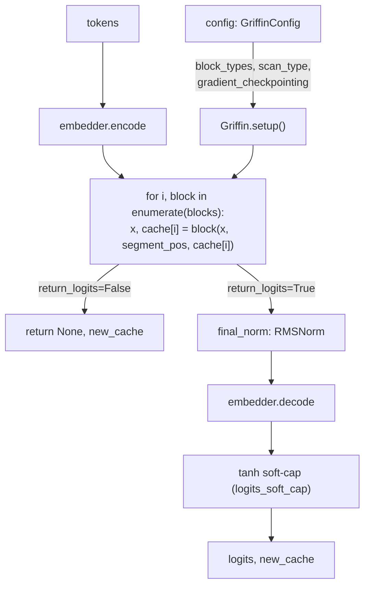

# recurrentgemma.jax.griffin — the top-level model

## Overview

[`Griffin`](../catalog/recurrentgemma/jax/griffin.md#Griffin) is the flax `nn.Module` that stitches
together the [embedder](../catalog/recurrentgemma/jax/modules.md#Embedder.encode), the stack of
[`ResidualBlock`](../catalog/recurrentgemma/jax/modules.md#ResidualBlock)s, and the final norm/logits
projection into one callable model, built directly from one
[`GriffinConfig`](../catalog/recurrentgemma/common.md#GriffinConfig) (see
[recurrentgemma-common](recurrentgemma-common.md)). Its defining architectural trick — inherited from
[recurrentgemma-jax-modules](recurrentgemma-jax-modules.md) — is that every layer's type (recurrent
or attention) is read off `config.block_types` at construction time, so `Griffin.blocks` is a plain
Python list of heterogeneous submodules, not a repeated homogeneous stack. The other defining feature
is that essentially every return value is conditional on two boolean flags
(`return_logits`/`return_cache`), letting a single `__call__` serve both "score a full sequence" and
"advance one autoregressive step" without two separate code paths.

## Diagram

## Design rationale (why it's built this way)

**Gradient checkpointing wraps the block class itself, once, rather than being applied per call
site.** [`Griffin.setup`](../catalog/recurrentgemma/jax/griffin.md#Griffin) does `block_class =
nn.remat(ResidualBlock, static_argnums=4)` when `gradient_checkpointing=True` (the default), *before*
instantiating each block — every one of the (potentially 38, for `RECURRENT_GEMMA_9B_V1`) layers gets
rematerialized uniformly. `static_argnums=4` marks `return_cache` as static under `remat` (it's a
Python bool controlling a return shape, not an array) — without this, `nn.remat` would try to treat
it as a traced value and fail.

**Every block gets its own `final_w_init_variance_scale = 2.0 / num_layers`.**
[`Griffin.setup`](../catalog/recurrentgemma/jax/griffin.md#Griffin) computes this once per block from
`config.num_layers` and threads it into every
[`ResidualBlock`](../catalog/recurrentgemma/jax/modules.md#ResidualBlock)'s final-layer
initialization scale — the standard "scale residual branch init by `1/depth`" trick for training
deep residual stacks stably, applied identically regardless of whether that particular layer is
recurrent or attention.

**The four-way return-value branching (`return_logits` × `return_cache`) is implemented via
`@overload`-annotated signatures over one real implementation, so callers get precise static types
without four separate methods.** [`Griffin.__call__`](../catalog/recurrentgemma/jax/griffin.md#Griffin.__call__)
declares four `@overload` stubs (each pinning one flag combination's return type to `None` or the
real type) before the one `@at.typed`-decorated real implementation — a pattern reused identically in
[`ResidualBlock`](../catalog/recurrentgemma/jax/modules.md#ResidualBlock),
`RecurrentBlock`, and `LocalAttentionBlock` — this is why a caller invoking `griffin(tokens,
segment_pos, return_logits=True, return_cache=False)` gets a type checker-verified
`tuple[TokenLogits, None]` rather than a defensively-`Optional` type on every call.

**Soft-capping is a `tanh`, applied only if `logits_soft_cap` is truthy.** `Griffin.__call__`'s final
step is `logits = tanh(logits / c) * c` if `c := config.logits_soft_cap` is nonzero — bounding the
final logits' magnitude to `[-c, c]` regardless of embedding-table scale; `HAWK_PAPER_7B`/
`GRIFFIN_PAPER_7B` set `c=0` (disabled) while both `RECURRENT_GEMMA_*_V1` presets set `c=30.0`
(see [recurrentgemma-common](recurrentgemma-common.md)) — a difference between the original
paper's architecture and the later "RecurrentGemma" release, not a universal constant.

> [!inferred] `Griffin.init_cache` builds a `dict[str, ResidualBlockCache]` keyed by `f"blocks.{i}"`
> string — the same naming convention Flax uses for its own parameter-tree layer names (visible in
> [`GriffinConfig.from_flax_params_or_variables`](../catalog/recurrentgemma/common.md#GriffinConfig)'s
> `f"blocks.{i}"` key-walking) — so cache dict keys and parameter dict keys share a naming scheme by
> convention, not by any shared code.

## Entry points

- [`Griffin.__call__`](../catalog/recurrentgemma/jax/griffin.md#Griffin.__call__) — the single model
  forward; called both for full-prompt scoring (`return_cache=True`, `cache=None`) and single-token
  decode (`return_cache=True`, `cache=<prior cache>`) by the `Sampler` (see
  [recurrentgemma-jax-sampler](recurrentgemma-jax-sampler.md)).
- [`Griffin.init_cache`](../catalog/recurrentgemma/jax/griffin.md#Griffin.init_cache) — called once
  before autoregressive sampling begins, dispatching per-layer to
  [`ResidualBlock.init_cache`](../catalog/recurrentgemma/jax/modules.md#ResidualBlock.init_cache).

## Mechanism (step-by-step)

1. **Short-circuit when nothing is requested.** If both `return_logits` and `return_cache` are
   `False`, [`Griffin.__call__`](../catalog/recurrentgemma/jax/griffin.md#Griffin.__call__) returns
   `(None, None)` immediately without running any layer — a degenerate but explicit case (used, e.g.,
   in overload-typed call sites that statically know neither output is needed).
2. **Token embedding.** `input_emb = `[`embedder.encode`](../catalog/recurrentgemma/jax/modules.md#Embedder.encode)`(tokens)`
   — this also applies the `sqrt(embed_dim)` scale if
   `config.embeddings_scale_by_sqrt_dim` is set.
3. **Sequential layer loop over [`Griffin.blocks`](../catalog/recurrentgemma/jax/griffin.md#Griffin.blocks),
   building a fresh cache dict per call.** For each `blocks[i]` (a `ResidualBlock`, possibly
   `nn.remat`-wrapped), `x, new_cache[f"blocks.{i}"] = block(x, segment_pos, cache_i,
   return_cache)` — `cache_i` is `None` on the very first call (prompt processing from scratch) or
   the corresponding entry from a caller-supplied cache dict on subsequent decode steps.
4. **Early exit if logits aren't needed.** If `return_logits` is false, `Griffin.__call__` returns
   `(None, new_cache)` right after the block loop — skipping
   [`final_norm`](../catalog/recurrentgemma/jax/griffin.md#Griffin.final_norm) and the (potentially
   large, vocab-sized) decode matmul entirely; relevant when only the cache/state needs updating.
5. **Final projection and optional soft-cap.**
   [`final_norm`](../catalog/recurrentgemma/jax/griffin.md#Griffin.final_norm) (an `RMSNorm`) then
   [`embedder.decode`](../catalog/recurrentgemma/jax/modules.md#Embedder.decode) (a tied-weight
   matmul against the same embedding table used for encoding) produce raw logits, optionally passed
   through the `tanh` soft-cap described above.
6. **Cache construction mirrors the forward layer loop exactly.**
   [`Griffin.init_cache`](../catalog/recurrentgemma/jax/griffin.md#Griffin.init_cache) iterates
   `config.block_types` (not the actual `blocks` list) and calls
   [`ResidualBlock.init_cache`](../catalog/recurrentgemma/jax/modules.md#ResidualBlock.init_cache)
   per entry — meaning cache shape derivation only needs the config, not a constructed model
   instance.

## Key data structures

- **[`Griffin.blocks`](../catalog/recurrentgemma/jax/griffin.md#Griffin.blocks)** — a plain Python
  list of `ResidualBlock` (or `remat`-wrapped `ResidualBlock`) instances, one per
  `config.block_types` entry; heterogeneous in the sense that each entry's internal sub-module
  (`recurrent_block` vs. `attention_block`) differs, but the outer type is uniform.
- **`Cache`** (`dict[str, ResidualBlockCache]`, aliased in `jax.griffin`) — keyed by `f"blocks.{i}"`;
  the full autoregressive state for the whole model.
- **[`Griffin.config`](../catalog/recurrentgemma/jax/griffin.md#Griffin.config)** — the single
  [`GriffinConfig`](../catalog/recurrentgemma/common.md#GriffinConfig) driving every dimension and
  per-layer type choice; a Flax dataclass attribute, so it participates in `jax.jit`'s static/dynamic
  argument split.

## Dynamics (design intent)

Because `remat` wraps the `ResidualBlock` *class* at `setup()` time (not individual calls),
gradient checkpointing granularity is fixed at one checkpoint per layer — there is no way to
checkpoint, say, only the attention layers or only every other layer without changing this setup
code.

## Edge cases

- `Griffin.__call__`'s early-return branches (`(None, None)` and `(None, new_cache)`) mean the return
  type is genuinely `tuple[TokenLogits | None, Cache | None]` at the type-checker level even though
  the `@overload` stubs promise more precise pairings for statically-known flag values — callers
  using dynamically-computed flags don't get the precise typing.
- `param_dtype` defaults to `jnp.float32` throughout, independent of `dtype` (the compute dtype) —
  a model can store fp32 parameters while computing in bf16, and `Griffin.param_dtype` is the one
  place this default is set for the whole model.

## Open questions

- The choice to checkpoint every layer by default (`gradient_checkpointing: bool = True`) versus
  making it an explicit per-training-run decision isn't discussed in this packet's grounding — it's
  presumably a memory/speed default tuned for the largest published preset (9B).

## See also
- [recurrentgemma-common](recurrentgemma-common.md) — `GriffinConfig`, the single input `Griffin` is
  built from.
- [recurrentgemma-jax-modules](recurrentgemma-jax-modules.md) — `ResidualBlock`, the per-layer unit
  `Griffin.blocks` stacks.
- [recurrentgemma-jax-sampler](recurrentgemma-jax-sampler.md) — the autoregressive driver that calls
  `Griffin.__call__` repeatedly.
