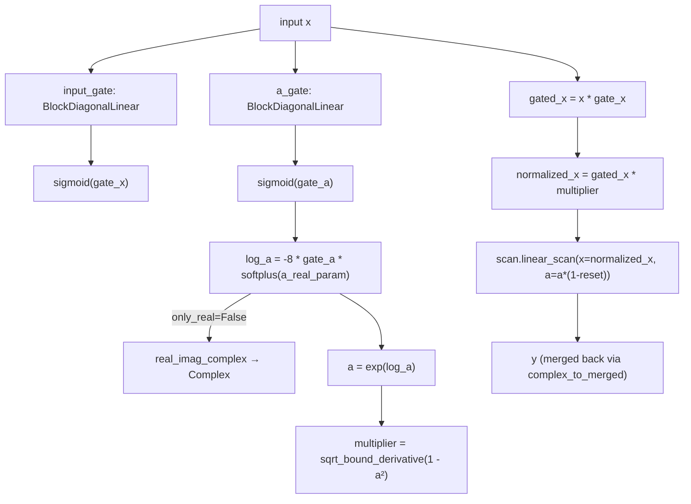

# recurrentgemma.jax.layers — RGLRU, Conv1D and the block-diagonal gates

## Overview

This module holds the Flax `nn.Module` primitives that make up the recurrent half of RecurrentGemma:
[`RGLRU`](../catalog/recurrentgemma/jax/layers.md#RGLRU) (the Real-Gated Linear Recurrent Unit that
does the actual sequence mixing), [`Conv1D`](../catalog/recurrentgemma/jax/layers.md#Conv1D) (a short
causal convolution applied just before it),
`BlockDiagonalLinear` (the
multi-head-like gating projection both the input gate and the `A` gate are built from), and
`RMSNorm` (not in this packet's own subgraph but
adjacent). The RG-LRU is the paper's central contribution: a linear recurrence whose decay rate `A`
is itself input-dependent (gated), computed here with numerically-stabilized log-space arithmetic
([`sqrt_bound_derivative`](../catalog/recurrentgemma/jax/layers.md#sqrt_bound_derivative)) so it
trains stably in `bfloat16`, and which delegates its actual sequential computation to
[`scan.linear_scan`](../catalog/recurrentgemma/jax/scan.md#linear_scan) — either a native JAX loop or
the [Pallas kernel](recurrentgemma-jax-pallas.md), transparently, via
[`RGLRU.scan_type`](../catalog/recurrentgemma/jax/layers.md#RGLRU.scan_type).

## Diagram

## Design rationale (why it's built this way)

**The recurrence coefficient `A` is computed in log-space and always negative-exponentiated, never
directly parameterized in `[0,1]`.** [`RGLRU.__call__`](../catalog/recurrentgemma/jax/layers.md#RGLRU.__call__)
computes `log_a = -8.0 * gate_a * softplus(a_real_param)` then `a = exp(log_a)` — the `-8.0` scale
and the `softplus` (always positive) guarantee `log_a ≤ 0`, so `a ∈ (0, 1]` by construction with no
clipping needed; this is also why
[`rnn_real_param_init`](../catalog/recurrentgemma/jax/layers.md#RGLRU) (used to init
[`a_real_param`](../catalog/recurrentgemma/jax/layers.md#RGLRU.a_real_param), not itself in this
packet's subgraph) initializes in the *inverse*-softplus space — "proportional to area in a ring"
per its docstring, so the initial per-unit decay rates are spread log-uniformly over an annulus of
radii `[min_rad, max_rad]`, matching the LRU paper's initialization scheme.

**The gradient of `sqrt` is explicitly clipped to prevent bf16 NaNs, via a custom VJP rather than a
`jnp.clip` on the forward value.**
[`sqrt_bound_derivative`](../catalog/recurrentgemma/jax/layers.md#sqrt_bound_derivative) computes an
ordinary `jnp.sqrt(x)` on the forward pass but its backward rule (`stable_sqrt_bwd`, adjacent in
source but not itself cited) clamps `x` to `1/(4*max_gradient²)` before differentiating — the forward
value is untouched (so the normalization multiplier `sqrt(1 - a²)` stays numerically exact) while
only the *gradient*, which blows up as `a → 1` (near-unit decay, `1-a² → 0`), is bounded. This
buys training stability specifically at `bfloat16` precision without perturbing the forward
computation other precisions rely on.

**`only_real` decides between a real-only fast path and full complex dynamics, changed by
`use_custom_complex`, not by the caller directly.**
[`RGLRU.use_custom_complex`](../catalog/recurrentgemma/jax/layers.md#RGLRU.use_custom_complex)
returns true when the working dtype is `bfloat16`/`float16` *or* the scan type is
[`LINEAR_PALLAS`](../catalog/recurrentgemma/common.md#ScanType) — meaning the same `RGLRU` instance
silently switches its internal representation
([`real_imag_complex`](../catalog/recurrentgemma/jax/layers.md#RGLRU.real_imag_complex) picks
[`Complex`](../catalog/recurrentgemma/jax/complex_lib.md#Complex) vs. native `jnp` complex vs. a bare
real array) purely as a function of dtype/backend, invisible at the call site.

**`BlockDiagonalLinear` is a manual grouped-linear layer, not `nn.Dense` with reshaping.**
Its `__call__` splits
the input into [`num_blocks`](../catalog/recurrentgemma/jax/layers.md#BlockDiagonalLinear.num_blocks)
chunks along the last axis and applies a *distinct* small `w`/`b` per chunk via
`jnp.einsum("... h i, h i j -> ... h j", x, w) + b` — a true block-diagonal weight matrix stored
compactly as `[num_blocks, block_size, block_size]` rather than a full dense matrix with zeroed-out
blocks, which is both a parameter-count and a FLOPs saving proportional to `num_blocks`.

> [!inferred] The `unroll=128` argument `RGLRU.__call__` passes to
> [`scan.linear_scan`](../catalog/recurrentgemma/jax/scan.md#linear_scan) (visible in source, not
> itself in this packet's subgraph) only affects the native-JAX scan path — the Pallas kernel path
> ignores it since it has its own tiling — so this constant is a native-scan-specific tuning knob for
> non-TPU or non-Pallas execution.

## Entry points

- [`RGLRU.__call__`](../catalog/recurrentgemma/jax/layers.md#RGLRU.__call__) — reached once per
  `RecurrentBlock` forward pass (via its
  [`lru`](../catalog/recurrentgemma/jax/modules.md#RecurrentBlock.lru) submodule), after the
  [`Conv1D`](../catalog/recurrentgemma/jax/layers.md#Conv1D) has run.
- [`Conv1D.__call__`](../catalog/recurrentgemma/jax/layers.md#Conv1D.__call__) — the short causal
  convolution feeding into the RG-LRU; called via
  [`conv_1d`](../catalog/recurrentgemma/jax/modules.md#RecurrentBlock.conv_1d) on the same block.
- [`RGLRU.init_cache`](../catalog/recurrentgemma/jax/modules.md#RecurrentBlock.init_cache) (defined
  on `RecurrentBlock`, which delegates to
  the layer classes) — the path that builds an empty autoregressive-decoding cache before the first
  sampling step.

## Mechanism (step-by-step)

1. **Two gates are computed from the same input.**
   [`RGLRU.__call__`](../catalog/recurrentgemma/jax/layers.md#RGLRU.__call__) applies
   [`input_gate`](../catalog/recurrentgemma/jax/layers.md#RGLRU.input_gate) and
   [`a_gate`](../catalog/recurrentgemma/jax/layers.md#RGLRU.a_gate) (both
   `BlockDiagonalLinear` instances) to `x`,
   each followed by [`sigmoid`](../catalog/recurrentgemma/jax/complex_lib.md#sigmoid).
2. **The decay coefficient `a` is derived in log-space, optionally complex.** `log_a = -8 * gate_a *`
   [`softplus`](../catalog/recurrentgemma/jax/complex_lib.md#softplus)`(a_real_param)`; if
   [`only_real`](../catalog/recurrentgemma/jax/layers.md#RGLRU.only_real) is false, an imaginary
   component is mixed in via
   [`real_imag_complex`](../catalog/recurrentgemma/jax/layers.md#RGLRU.real_imag_complex) before
   [`exp`](../catalog/recurrentgemma/jax/complex_lib.md#exp) — producing either a bare real array or a
   [`Complex`](../catalog/recurrentgemma/jax/complex_lib.md#Complex).
3. **Input normalization compensates for the recurrence's own gain.**
   [`sqrt_bound_derivative`](../catalog/recurrentgemma/jax/layers.md#sqrt_bound_derivative)`(1 -
   a_squared, 1000)` computes a gradient-clipped `sqrt`; document-boundary positions (`segment_pos ==
   0`) bypass the multiplier entirely (`reset[...,None] + (1-reset)*multiplier`), i.e. a fresh
   document starts with an un-normalized (full-strength) input rather than a decayed one.
4. **The reset mask also zeroes `a` at document boundaries.** `a * (1 - reset[..., None])` passed to
   [`scan.linear_scan`](../catalog/recurrentgemma/jax/scan.md#linear_scan) means the hidden state
   cannot leak across document boundaries within a packed batch — the recurrence's own `a=0` term
   forces `h_t = x_t` exactly at a reset position.
5. **The actual sequential computation is delegated, not inlined.**
   [`scan.linear_scan`](../catalog/recurrentgemma/jax/scan.md#linear_scan) is called with
   [`scan_type`](../catalog/recurrentgemma/jax/layers.md#RGLRU.scan_type) and
   [`scan_sharding_spec`](../catalog/recurrentgemma/jax/pallas.md#ShardingSpec.activations_sharding_spec)
   threaded through — `RGLRU` itself has no knowledge of whether the backend is a native loop, an
   associative scan, or the [Pallas kernel](recurrentgemma-jax-pallas.md).
6. **Output is merged back to a single real array before returning.**
   [`complex_to_merged`](../catalog/recurrentgemma/jax/layers.md#RGLRU.complex_to_merged) concatenates
   real/imaginary halves along the last axis (or is a no-op if `only_real`) — the module's public
   output shape never depends on the internal complex/real choice.
7. **Conv1D handles decode-mode caching via a fixed-size ring-style state, computed as an unrolled
   sum, not a convolution primitive.**
   [`Conv1D.__call__`](../catalog/recurrentgemma/jax/layers.md#Conv1D.__call__) loops
   `temporal_shift` from `0` to `temporal_width - 1` in plain Python (unrolled at trace time), slicing
   a window per shift and accumulating `x_window * w[shift]` — this lets it apply a
   [`_compute_document_mask`](../catalog/recurrentgemma/jax/layers.md#Conv1D._concatenate_with_state)
   per shift that a `lax.conv` primitive couldn't easily express, at the cost of a Python-level loop
   bounded by the (small, fixed) `temporal_width`.

## Key data structures

- **[`RGLRU.a_real_param`](../catalog/recurrentgemma/jax/layers.md#RGLRU.a_real_param) /
  [`a_imag_param`](../catalog/recurrentgemma/jax/layers.md#RGLRU.a_imag_param)** — the learned decay
  parameters in inverse-softplus space; `a_imag_param` only exists when `only_real=False`.
  [`width`](../catalog/recurrentgemma/jax/layers.md#RGLRU.width) — either the block's own width or
  `lru_width` if narrower.
- **[`Conv1D.w`](../catalog/recurrentgemma/jax/layers.md#Conv1D.w) /
  [`b`](../catalog/recurrentgemma/jax/layers.md#Conv1D.b)** — shape `[temporal_width, width]` and
  `[width]`; [`temporal_width`](../catalog/recurrentgemma/jax/layers.md#Conv1D.temporal_width) fixes
  the causal receptive field (4 by default across every preset).
- **[`BlockDiagonalLinear.width_input`](../catalog/recurrentgemma/jax/layers.md#BlockDiagonalLinear.width_input) /
  [`num_blocks`](../catalog/recurrentgemma/jax/layers.md#BlockDiagonalLinear.num_blocks)** — determine
  the compact `[num_blocks, in/num_blocks, out/num_blocks]` weight shape.

## Dynamics (design intent)

`RGLRU`'s `scan_type`/`only_real`/dtype interactions are resolved once per `__call__`, not cached —
[`RGLRU.dtype`](../catalog/recurrentgemma/jax/layers.md#RGLRU.dtype) /
[`param_dtype`](../catalog/recurrentgemma/jax/layers.md#RGLRU.param_dtype) can differ (compute vs.
storage precision), and [`use_custom_complex`](../catalog/recurrentgemma/jax/layers.md#RGLRU.use_custom_complex)
re-derives its answer from the *promoted* dtype each call, so mixed-precision training (bf16 compute,
fp32 params) correctly selects the `Complex` path based on the compute dtype actually in play.

## Edge cases

- [`RGLRU.setup`](../catalog/recurrentgemma/jax/layers.md#RGLRU) asserts `width % 2 == 0` always
  (even in the `only_real` case, where the imaginary parameter is unused) — a structural constraint
  on `lru_width`, not just the complex path.
- [`Conv1D._concatenate_with_state`](../catalog/recurrentgemma/jax/layers.md#Conv1D._concatenate_with_state)
  asserts the incoming decode-mode input has exactly `num_tokens == 1` — this convolution's cache
  path is single-token-decode-only, prompt chunks longer than 1 token go through the no-cache
  training-mode branch instead.
- [`_pad_cache`](../catalog/recurrentgemma/jax/layers.md#Conv1D._pad_cache) left-pads with zeros when
  the stored state is shorter than `temporal_width - 1` — relevant right after
  [`init_cache`](../catalog/recurrentgemma/jax/modules.md#RecurrentBlock.init_cache) or when a prompt
  shorter than the temporal width has been processed.

## Open questions

- Whether `unroll=128` in the native-scan call site is empirically tuned for a specific sequence
  length/hardware or a generic default isn't settled by this packet's grounding alone.

## See also
- [recurrentgemma-jax-complex_lib](recurrentgemma-jax-complex_lib.md) — the `Complex` type `RGLRU`
  optionally constructs.
- [recurrentgemma-jax-pallas](recurrentgemma-jax-pallas.md) — the TPU kernel backend
  `scan.linear_scan` dispatches to.
- [recurrentgemma-jax-modules](recurrentgemma-jax-modules.md) — `RecurrentBlock`, the caller that
  wires `RGLRU` and `Conv1D` together.
