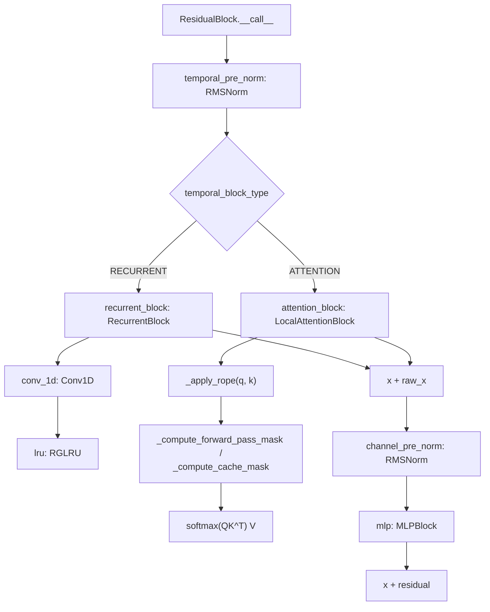

# recurrentgemma.jax.modules — the residual block and its recurrent/attention halves

## Overview

This module assembles the layer primitives from [recurrentgemma-jax-layers](recurrentgemma-jax-layers.md)
into the actual transformer-like block structure:
[`ResidualBlock`](../catalog/recurrentgemma/jax/modules.md#ResidualBlock.recurrent_block) picks, per
layer, either a [`RecurrentBlock`](../catalog/recurrentgemma/jax/modules.md#RecurrentBlock) (RG-LRU +
Conv1D) or a [`LocalAttentionBlock`](../catalog/recurrentgemma/jax/modules.md#LocalAttentionBlock)
(windowed multi-query attention with RoPE) as its temporal-mixing sub-block, based on the
`temporal_block_type` supplied by [`common.GriffinConfig.block_types`](../catalog/recurrentgemma/common.md#TemporalBlockType).
Both sub-block kinds implement the same `(x, segment_pos, cache, return_cache) -> (x, cache)`
contract, which is why [`ResidualBlock.temporal_block`](../catalog/recurrentgemma/jax/modules.md#ResidualBlock.temporal_block)
can treat them uniformly as one property regardless of which concrete type was built.

## Diagram

## Design rationale (why it's built this way)

**`ResidualBlock.temporal_block_type` selects a sub-module at `setup()` time via `match`, and the two
branches build mutually-exclusive attributes, not a discriminated union field.**
[`ResidualBlock.setup`](../catalog/recurrentgemma/jax/modules.md#ResidualBlock.recurrent_block) does
`match self.temporal_block_type: case RECURRENT: self.recurrent_block = ...; case ATTENTION:
self.attention_block = ...` — only one of
[`recurrent_block`](../catalog/recurrentgemma/jax/modules.md#ResidualBlock.recurrent_block) /
[`attention_block`](../catalog/recurrentgemma/jax/modules.md#ResidualBlock.attention_block) ever
exists on a given instance. [`ResidualBlock.temporal_block`](../catalog/recurrentgemma/jax/modules.md#ResidualBlock.temporal_block)
is a `@property` that re-dispatches the same `match` to return whichever one is present — its
docstring says this "creates a common interface while making the layer/parameter types easily
identifiable by name in a state dictionary": the Flax parameter tree gets a self-documenting
`recurrent_block`/`attention_block` key rather than an opaque `temporal_block` key that hides which
concrete type is inside.

**The local attention block's keys/values use a single head, not multi-head — this is multi-*query*
attention wearing multi-head shapes.** [`LocalAttentionBlock.setup`](../catalog/recurrentgemma/jax/modules.md#LocalAttentionBlock)
projects [`q`](../catalog/recurrentgemma/jax/modules.md#LocalAttentionBlock.q) to full `width` but
[`k`](../catalog/recurrentgemma/jax/modules.md#LocalAttentionBlock.k)/
[`v`](../catalog/recurrentgemma/jax/modules.md#LocalAttentionBlock.v) to just
[`head_dim`](../catalog/recurrentgemma/jax/modules.md#LocalAttentionBlock.head_dim) (a single head's
width), and `__call__` rearranges keys/values with `n=1` — every query head attends over the *same*
single key/value head. This roughly halves KV-cache size versus full multi-head attention while
keeping the windowed-attention math identical, at the cost of representational capacity per head.

**The attention window is a genuine sliding window, enforced identically whether processing a prompt
or decoding one token.** The shared `_compute_causal_mask` helper
combines a causal mask, a same-segment mask, and a `window_cond` (`q_positions <= k_positions +
window_size`) — this one primitive backs both
[`_compute_forward_pass_mask`](../catalog/recurrentgemma/jax/modules.md#_compute_forward_pass_mask)
(full-prompt processing, derives positions from `segment_pos`) and
[`_compute_cache_mask`](../catalog/recurrentgemma/jax/modules.md#_compute_cache_mask)
(decode-with-KV-cache, derives positions from the cache's `num_tokens`) — so the model's effective
context is always bounded by `attention_window_size`, never the full sequence, and the two code
paths cannot silently diverge in masking semantics since they share the mask primitive.

**The KV-cache is a fixed-size ring buffer sized to exactly the attention window, not the full
sequence length.** [`LocalAttentionBlock`](../catalog/recurrentgemma/jax/modules.md#LocalAttentionBlock)'s
`init_cache` allocates `keys`/`values` of shape `[batch, window_size, 1, head_dim]` — independent of how long the
eventual generation will be. [`_update_attention_cache`](../catalog/recurrentgemma/jax/modules.md#_update_attention_cache)
writes new entries at `cache.num_tokens % window_size`, wrapping around; this is what makes local
attention's memory cost O(window_size) rather than O(sequence_length), unlike the RG-LRU whose state
is already O(1) by construction.

> [!inferred] `MLPBlock`'s `ffw_up` uses a single fused `Einsum` with `w_shape=(2, width,
> expanded_width)` and splits the output into a gate and a value (`out[0]`, `out[1]`) — a GLU-style
> gated MLP computed as one matmul rather than two separate `Dense` layers, saving one kernel launch
> at the cost of a slightly less readable weight layout.

## Entry points

- `ResidualBlock.__call__` (sharing its signature with
  [`LocalAttentionBlock.__call__`](../catalog/recurrentgemma/jax/modules.md#LocalAttentionBlock.__call__)/`RecurrentBlock.__call__`)
  — reached once per layer, per forward pass, by [`Griffin`](recurrentgemma-jax-griffin.md)'s block loop.
- [`ResidualBlock.init_cache`](../catalog/recurrentgemma/jax/modules.md#ResidualBlock.init_cache) —
  a `@classmethod` dispatching to either
  [`RecurrentBlock`](../catalog/recurrentgemma/jax/modules.md#RecurrentBlock)'s or
  [`LocalAttentionBlock`](../catalog/recurrentgemma/jax/modules.md#LocalAttentionBlock)'s own
  `init_cache` based on `temporal_block_type`; called once before sampling begins.
- [`_apply_rope`](../catalog/recurrentgemma/jax/modules.md#_apply_rope) — applied to queries and keys
  inside `LocalAttentionBlock.__call__`, rotating only the first half of the head dimension (the
  second half passes through unrotated).

## Mechanism (step-by-step)

1. **Pre-norm, then dispatch to the temporal sub-block.**
   `ResidualBlock.__call__` normalizes via its `temporal_pre_norm`,
   then calls [`temporal_block`](../catalog/recurrentgemma/jax/modules.md#ResidualBlock.temporal_block)
   — whichever concrete sub-block was built — passing through `segment_pos`/`cache`/`return_cache`
   unchanged.
2. **RecurrentBlock runs Conv1D then RGLRU in sequence, on two parallel Dense-projected branches.**
   [`lru`](../catalog/recurrentgemma/jax/modules.md#RecurrentBlock.lru) (an
   [`RGLRU`](../catalog/recurrentgemma/jax/layers.md#RGLRU)) only sees the `x`-branch after
   [`conv_1d`](../catalog/recurrentgemma/jax/modules.md#RecurrentBlock.conv_1d); the parallel
   `y`-branch (gelu-activated) is combined multiplicatively (`x * y`) only *after* the RG-LRU runs —
   a gated-linear-unit-style structure around the recurrence itself.
3. **LocalAttentionBlock computes queries/keys/values, rotates, masks, and does standard scaled-dot-
   product attention.** After [`_apply_rope`](../catalog/recurrentgemma/jax/modules.md#_apply_rope),
   logits are scaled by `head_dim**-0.5`, masked via
   [`_compute_forward_pass_mask`](../catalog/recurrentgemma/jax/modules.md#_compute_forward_pass_mask)/
   [`_compute_cache_mask`](../catalog/recurrentgemma/jax/modules.md#_compute_cache_mask), and softmax
   is computed in `float32` regardless of the ambient compute dtype (an explicit `.astype(jnp.float32)`
   before `jax.nn.softmax`) before casting back — a standard mixed-precision-attention stability
   measure.
4. **Cache update differs completely between the two branches.**
   [`_update_attention_cache`](../catalog/recurrentgemma/jax/modules.md#_update_attention_cache)
   special-cases `n_fill == 1` (single-token autoregressive step — an in-place `.at[idx0,idx1].set`)
   versus filling from a fresh prompt via
   [`_attention_cache_from_prompt`](../catalog/recurrentgemma/jax/modules.md#_attention_cache_from_prompt),
   which right-pads and rolls the keys/values so the *most recent* `window_size` tokens are always at
   a predictable cache offset — whereas the recurrent branch's cache
   ([`RecurrentBlockCache`](../catalog/recurrentgemma/jax/modules.md#RecurrentBlock)) is just the RG-LRU
   state plus the Conv1D's last few inputs, no windowing logic needed.
5. **The MLP and its pre-norm always run, independent of the temporal-block choice.** After the
   temporal sub-block's output is added to the residual, `channel_pre_norm` +
   [`mlp`](../catalog/recurrentgemma/jax/modules.md#RecurrentBlock) (an `MLPBlock`) run identically for
   both `RECURRENT` and `ATTENTION` layers — only the temporal-mixing sub-block differs per layer.

## Key data structures

- **[`RecurrentBlockCache`](../catalog/recurrentgemma/jax/modules.md#RecurrentBlock) /
  [`AttentionBlockCache`](../catalog/recurrentgemma/jax/modules.md#AttentionBlockCache)** — the two
  concrete cache shapes; `AttentionBlockCache` carries
  [`keys`](../catalog/recurrentgemma/jax/modules.md#AttentionBlockCache.keys)/
  [`values`](../catalog/recurrentgemma/jax/modules.md#AttentionBlockCache.values)/
  [`num_tokens`](../catalog/recurrentgemma/jax/modules.md#AttentionBlockCache.num_tokens); the union
  type `ResidualBlockCache` lets `ResidualBlock` be cache-shape-agnostic at the type level.
- **[`LocalAttentionBlock.q`/`k`/`v`/`out`](../catalog/recurrentgemma/jax/modules.md#LocalAttentionBlock.q)**
  — the four `nn.Dense` projections; `k`/`v` project to `head_dim` (single-head width), `q`/`out`
  project to full `width`.

## Dynamics (design intent)

Because `RecurrentBlock` and `LocalAttentionBlock` are structurally distinct submodules (not a single
polymorphic class), a Flax parameter pytree for a Griffin model has a *different shape* per layer
depending on `block_types` — inspecting the pytree directly reveals the architecture, which is also
exactly what [`GriffinConfig.from_flax_params_or_variables`](../catalog/recurrentgemma/common.md#TemporalBlockType)
exploits to reconstruct a config from raw parameters (see
[recurrentgemma-common](recurrentgemma-common.md)).

## Edge cases

- [`LocalAttentionBlock.__call__`](../catalog/recurrentgemma/jax/modules.md#LocalAttentionBlock.__call__)
  asserts `segment_pos.shape == (b, t)` up front — a shape mismatch fails fast rather than silently
  broadcasting.
- [`ResidualBlock.init_cache`](../catalog/recurrentgemma/jax/modules.md#ResidualBlock.init_cache)
  asserts `width % num_heads == 0` before dispatching — this is checked again even though
  `GriffinConfig` construction paths already imply it, a defense-in-depth check at the
  cache-allocation boundary.
- `RecurrentBlock`'s `y`-branch gelu and `x`-branch Conv1D+RGLRU run on the *same* input `x`, but only
  the `x`-branch consumes `segment_pos`/`cache` — the `y`-branch is a pure per-token nonlinearity.

## Open questions

- Whether `LocalAttentionBlock`'s single-KV-head design (vs. grouped-query attention with more than
  one KV head) was a capacity/speed trade explicitly measured in the Griffin paper isn't settled by
  this packet's grounding alone.

## See also
- [recurrentgemma-jax-layers](recurrentgemma-jax-layers.md) — `RGLRU`/`Conv1D`, the primitives
  `RecurrentBlock` composes.
- [recurrentgemma-jax-griffin](recurrentgemma-jax-griffin.md) — the top-level model that stacks
  `ResidualBlock`s per `config.block_types`.
- [recurrentgemma-common](recurrentgemma-common.md) — `TemporalBlockType`/`GriffinConfig`, the source
  of the `block_types` sequence.
