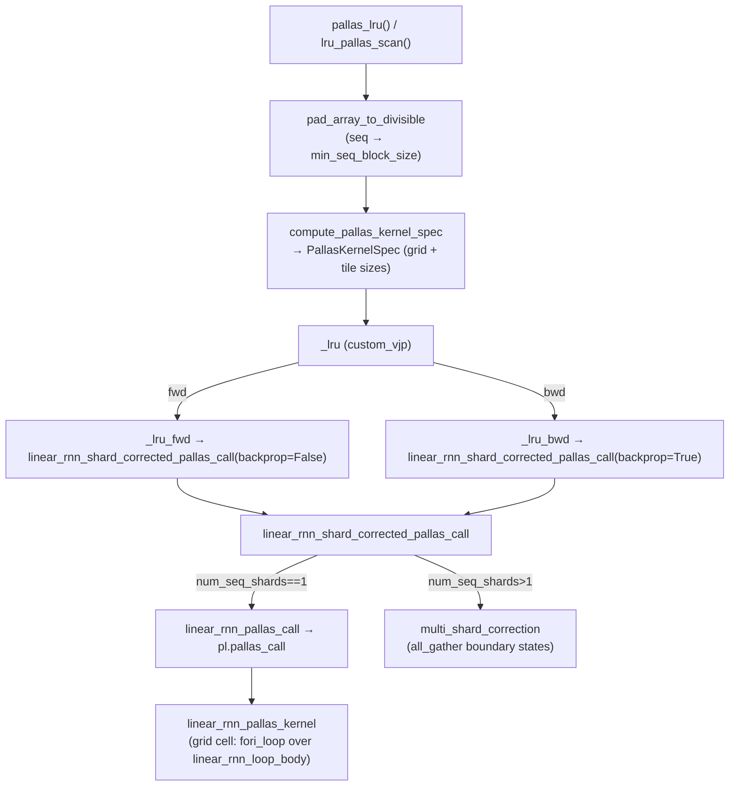

# recurrentgemma.jax.pallas — the TPU Pallas kernel for the RG-LRU scan

## Overview

This module is the performance-critical core of RecurrentGemma on TPU: it implements the RG-LRU's
elementwise linear recurrence (`h_t = a_t * h_{t-1} + x_t`) as a hand-written Pallas/Mosaic kernel
(`linear_rnn_pallas_kernel`, invoked via [`linear_rnn_pallas_call`](../catalog/recurrentgemma/jax/pallas.md#linear_rnn_pallas_call))
rather than relying on `jax.lax.scan`, because a sequential 8k+-step Python-level scan is far too
slow on TPU — the kernel instead tiles the batch/hidden-dim/sequence axes into a Pallas grid and runs
a `fori_loop` *inside* each grid cell, with a custom VJP
([`_lru`](../catalog/recurrentgemma/jax/pallas.md#_lru)) hand-implementing both the forward and
backward recurrence rather than relying on autodiff through the loop. A second, orthogonal concern —
splitting the sequence axis across TPU devices for context-parallelism — is handled by
[`multi_shard_correction`](../catalog/recurrentgemma/jax/pallas.md#multi_shard_correction), which
corrects each shard's locally-computed (incomplete) recurrence using an all-gather of boundary
states.

## Diagram

## Design rationale (why it's built this way)

**The kernel computes in reverse-time order internally when running the backward pass.** Both
`linear_rnn_pallas_kernel` and its inner `linear_rnn_loop_body`, reached via
[`linear_rnn_pallas_call`](../catalog/recurrentgemma/jax/pallas.md#linear_rnn_pallas_call), take a
`backprop: bool` flag that flips the loop index arithmetic (`a_idx`/`x_idx` computation) — the
backward pass of a linear recurrence `h_t = a_t h_{t-1} + x_t` is itself a linear recurrence run
backward with `a` shifted by one step, so the *same* kernel code computes both directions by
parameter, avoiding a second hand-written kernel.

**The grid is 3-D (batch × hidden-dim × sequence), with sequence innermost, so the sequential
recurrence carries across grid steps via revisited output refs.**
[`compute_pallas_kernel_spec`](../catalog/recurrentgemma/jax/pallas.md#compute_pallas_kernel_spec)'s
[`PallasKernelSpec.grid`](../catalog/recurrentgemma/jax/pallas.md#PallasKernelSpec) property returns
`(batch_grid_size, dim_grid_size, seq_grid_size)` — Pallas re-invokes the kernel body once per grid
point, and [`initialize_carry`](../catalog/recurrentgemma/jax/pallas.md#compute_pallas_kernel_spec)
(not itself in this packet's subgraph but adjacent to
[`get_num_seq_shards`](../catalog/recurrentgemma/jax/pallas.md#get_num_seq_shards)) only zeros the
carry ref when `pl.program_id(2) == 0` — i.e. only at the first sequence-block visit for a given
(batch, dim) pair — so the carry ref persists its value *across* grid steps along the sequence axis,
turning Pallas's grid-iteration mechanism into the outer loop of the scan, with
`linear_rnn_loop_body`'s `fori_loop` (run inside
[`linear_rnn_pallas_call`](../catalog/recurrentgemma/jax/pallas.md#linear_rnn_pallas_call)'s kernel)
as the inner one.

**Sequence sharding is corrected post-hoc rather than avoided.** Rather than requiring the whole
sequence to live on one device,
[`linear_rnn_shard_corrected_pallas_call`](../catalog/recurrentgemma/jax/pallas.md#linear_rnn_shard_corrected_pallas_call)
first runs every shard's kernel *independently* with a *local* zero initial state
(`h0=None`, `compute_a_prod=True` to also track the cumulative product of `a`), then
[`multi_shard_correction`](../catalog/recurrentgemma/jax/pallas.md#multi_shard_correction) fixes up
every shard's result by adding back `prod(a_per_shard) * h_from_previous_shard` — derived
algebraically in the function's own docstring. This lets the expensive kernel invocation happen
fully in parallel across the `seq_axis` mesh dimension, with only a single `jax.lax.all_gather` of
each shard's boundary `(h_last, a_prod_last)` pair needed to reconcile shards afterward — a
classic parallel-scan/Blelloch-style correction rather than a sequential cross-device dependency
chain.

**Padding guarantees Pallas block-size divisibility, not zero mathematical effect by accident.**
[`pad_array_to_divisible`](../catalog/recurrentgemma/jax/pallas.md#pad_array_to_divisible) pads `x`
with `0.0` but pads `a` with `1.0` when called from
[`pallas_lru`](../catalog/recurrentgemma/jax/pallas.md#pallas_lru) — padding `a` with `1` (not `0`)
matters because `a` is a multiplicative gate: padding with `0` would truncate the exponential decay
to zero at the pad boundary and corrupt the correction math, whereas `1` makes the padded steps
true no-ops (`h_t = 1*h_{t-1} + 0`).

> [!inferred] [`compute_tile_size`](../catalog/recurrentgemma/jax/pallas.md#compute_tile_size)'s
> halving loop (`while dim_size % block_size != 0: block_size //= 2`) implies block sizes are always
> powers of two — consistent with `singleton_tile_size=128` (a TPU lane-width-aligned constant) being
> the hard floor below which it raises `ValueError`.

## Entry points

- [`pallas_lru`](../catalog/recurrentgemma/jax/pallas.md#pallas_lru) /
  [`lru_pallas_scan`](../catalog/recurrentgemma/jax/pallas.md#lru_pallas_scan) — the two
  (near-identical) public entry points that
  [`scan.single_shard_rnn_scan`](../catalog/recurrentgemma/jax/scan.md#single_shard_rnn_scan) calls
  when [`ScanType.LINEAR_PALLAS`](../catalog/recurrentgemma/jax/scan.md#lru_pallas_scan) is resolved;
  both pad, dispatch to native-complex conversion if needed, and call
  [`_lru`](../catalog/recurrentgemma/jax/pallas.md#_lru).
- [`_lru`](../catalog/recurrentgemma/jax/pallas.md#_lru) — the `jax.custom_vjp`-decorated function;
  reaching it is what makes the forward/backward split explicit rather than relying on
  differentiating through `pl.pallas_call`.
- [`get_num_seq_shards`](../catalog/recurrentgemma/jax/pallas.md#get_num_seq_shards) — called at the
  top of [`linear_rnn_shard_corrected_pallas_call`](../catalog/recurrentgemma/jax/pallas.md#linear_rnn_shard_corrected_pallas_call)
  to decide whether the multi-shard correction path is needed at all.

## Mechanism (step-by-step)

1. **Padding.** [`pallas_lru`](../catalog/recurrentgemma/jax/pallas.md#pallas_lru) pads `x`/`a` along
   the sequence axis to a multiple of `min_seq_block_size` via
   [`pad_array_to_divisible`](../catalog/recurrentgemma/jax/pallas.md#pad_array_to_divisible), and
   optionally converts a native `jnp` complex input to
   [`Complex`](../catalog/recurrentgemma/jax/complex_lib.md#Complex) via
   [`to_custom_complex`](../catalog/recurrentgemma/jax/complex_lib.md#to_custom_complex) since Mosaic
   cannot lower native complex.
2. **Grid/tile computation.**
   [`compute_pallas_kernel_spec`](../catalog/recurrentgemma/jax/pallas.md#compute_pallas_kernel_spec)
   picks a `batch_tile_size` of 1, a `seq_tile_size` via
   [`compute_tile_size`](../catalog/recurrentgemma/jax/pallas.md#compute_tile_size) (largest power of
   two ≤ `max_seq_block_size` dividing `seq_len`, GPU-special-cased to the full sequence), and splits
   the hidden dimension into `singleton_tile_size`-wide (128) lanes further grouped into
   `dim_tile_size` (capped at 8) chunks — returning a
   [`PallasKernelSpec`](../catalog/recurrentgemma/jax/pallas.md#PallasKernelSpec).
3. **Forward/backward dispatch via custom VJP.**
   [`_lru`](../catalog/recurrentgemma/jax/pallas.md#_lru) is `jax.custom_vjp`; its forward rule
   `_lru_fwd` calls
   [`linear_rnn_shard_corrected_pallas_call`](../catalog/recurrentgemma/jax/pallas.md#linear_rnn_shard_corrected_pallas_call)`(backprop=False)`
   and saves `(y, a, h0_corrected, h0 is not None)` as residuals; its backward rule
   [`_lru_bwd`](../catalog/recurrentgemma/jax/pallas.md#_lru_bwd) conjugates `a` (for the `Complex`
   case), re-derives `dh_last` via a `psum` across shards if sharded, calls the same shard-corrected
   call with `backprop=True`, and reconstructs `da = dx * y_shifted` from the time-shifted forward
   output.
4. **Per-shard kernel invocation.**
   [`linear_rnn_shard_corrected_pallas_call`](../catalog/recurrentgemma/jax/pallas.md#linear_rnn_shard_corrected_pallas_call)
   calls [`linear_rnn_pallas_call`](../catalog/recurrentgemma/jax/pallas.md#linear_rnn_pallas_call),
   which builds `pl.BlockSpec`s from
   [`PallasKernelSpec`](../catalog/recurrentgemma/jax/pallas.md#PallasKernelSpec), optionally reverses
   the sequence-block iteration order via `reverse_block_spec` (when
   `reverse != backprop`), and invokes `pl.pallas_call(linear_rnn_pallas_kernel, ...)`.
5. **Inside the kernel: sequential accumulation via `fori_loop`.** The
   [`linear_rnn_pallas_call`](../catalog/recurrentgemma/jax/pallas.md#linear_rnn_pallas_call)-invoked
   kernel handles the boundary element specially (the `backprop` first-step logic differs from the
   forward first-step logic), then runs its inner `linear_rnn_loop_body` via
   `jax.lax.fori_loop` for the remaining `seq_len - 1` steps, writing `h_next` into `y_ref` at each
   step and optionally accumulating the running product of `a` into `a_prod_ref` (needed only for the
   multi-shard correction).
6. **Multi-shard correction, if sharded.** Only if `num_seq_shards > 1`,
   [`multi_shard_correction`](../catalog/recurrentgemma/jax/pallas.md#multi_shard_correction)
   all-gathers each shard's `(h_last, a_prod_last)`, iteratively folds them into a per-shard corrected
   `h0`, then patches `y` via `y_corrected = y + h0_corrected[:, None] * a_prod`.

## Key data structures

- **[`PallasKernelSpec`](../catalog/recurrentgemma/jax/pallas.md#PallasKernelSpec)** (`NamedTuple`) —
  the grid ([`batch_grid_size`](../catalog/recurrentgemma/jax/pallas.md#PallasKernelSpec.batch_grid_size),
  [`dim_grid_size`](../catalog/recurrentgemma/jax/pallas.md#PallasKernelSpec.dim_grid_size),
  [`seq_grid_size`](../catalog/recurrentgemma/jax/pallas.md#PallasKernelSpec.seq_grid_size)) and tile
  sizes ([`batch_tile_size`](../catalog/recurrentgemma/jax/pallas.md#PallasKernelSpec.batch_tile_size),
  [`dim_tile_size`](../catalog/recurrentgemma/jax/pallas.md#PallasKernelSpec.dim_tile_size),
  [`seq_tile_size`](../catalog/recurrentgemma/jax/pallas.md#PallasKernelSpec.seq_tile_size),
  [`singleton_tile_size`](../catalog/recurrentgemma/jax/pallas.md#PallasKernelSpec.singleton_tile_size))
  computed once per call shape and threaded through every downstream spec/shape builder.
- **[`LruPallasResiduals`](../catalog/recurrentgemma/jax/pallas.md#LruPallasResiduals)** — the
  `(a, y, h0, has_h0)` tuple saved by `_lru_fwd` for the backward pass.
- **carry refs (`h_carry_ref`, `a_prod_carry_ref`)** — Pallas scratch refs that persist across grid
  steps along the sequence axis; this is the mechanism that turns the Pallas grid into a scan.

## Dynamics (design intent)

The forward and backward passes reuse one kernel body with opposite index arithmetic, which means
any change to `linear_rnn_loop_body`'s indexing (reached only through
[`linear_rnn_pallas_call`](../catalog/recurrentgemma/jax/pallas.md#linear_rnn_pallas_call)) must be
verified against *both* directions — the module has no separate backward kernel to fall back on if
the shared logic is wrong.

## Edge cases

- [`get_acc_dtype`](../catalog/recurrentgemma/jax/pallas.md#get_acc_dtype) asserts the accumulation
  dtype matches `h0`'s dtype when `h0` is given, and otherwise derives it from whether `x` is
  complex — a mismatch here (e.g. passing an `acc_float_dtype` that disagrees with an existing `h0`)
  raises before any kernel launch.
- [`pallas_lru`](../catalog/recurrentgemma/jax/pallas.md#pallas_lru) only converts to native complex
  output (`.to_numpy()`) when the *input* was native complex — a `Complex`-in, `Complex`-out contract
  otherwise.
- [`compute_pallas_kernel_spec`](../catalog/recurrentgemma/jax/pallas.md#compute_pallas_kernel_spec)
  raises `ValueError` if the hidden dimension isn't divisible by `singleton_tile_size` (128) — this
  is a hard structural requirement on `lru_width`, not a soft warning.

## Open questions

- The interaction between `reverse` and `backprop` in `reverse_block_spec`'s
  `reverse != backprop` condition inside
  [`linear_rnn_pallas_call`](../catalog/recurrentgemma/jax/pallas.md#linear_rnn_pallas_call) is dense
  enough (four boolean combinations) that this packet's subgraph alone doesn't make every case's
  intent obvious without tracing concrete shapes through it.

## See also
- [recurrentgemma-jax-complex_lib](recurrentgemma-jax-complex_lib.md) — the `Complex` wrapper this
  kernel must special-case for bf16/Mosaic.
- [recurrentgemma-jax-layers](recurrentgemma-jax-layers.md) — `RGLRU`, the sole model-level caller of
  this scan (indirectly, via `scan.linear_scan`).
