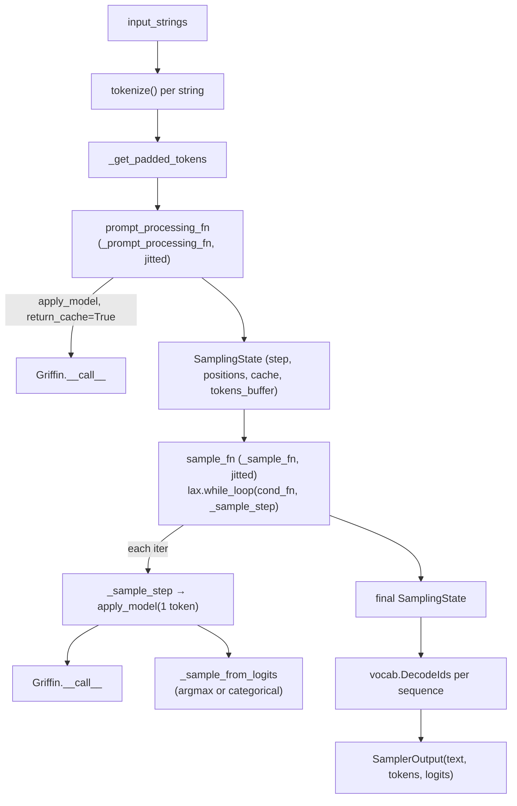

# recurrentgemma.jax.sampler — JIT-compiled autoregressive decoding

## Overview

`Sampler` (via its
[`apply_model`](../catalog/recurrentgemma/jax/sampler.md#Sampler.apply_model)) drives
[`Griffin`](recurrentgemma-jax-griffin.md) through the two-phase generation pattern every KV-cached
autoregressive model needs: a **prefill** phase that processes the whole prompt in one shot
([`_prompt_processing_fn`](../catalog/recurrentgemma/jax/sampler.md#Sampler._prompt_processing_fn)),
then a **decode** phase that repeatedly calls the model on exactly one new token
([`_sample_fn`](../catalog/recurrentgemma/jax/sampler.md#Sampler._sample_fn), internally a
`jax.lax.while_loop`). Both phases are individually `jax.jit`-compiled
([`_compiled_prompt_processing_fn`](../catalog/recurrentgemma/jax/sampler.md#Sampler._compiled_prompt_processing_fn) /
[`_compiled_sample_fn`](../catalog/recurrentgemma/jax/sampler.md#Sampler._compiled_sample_fn)), and
all mutable per-step state (token buffer, RNG, cache, done-flags) is threaded through one immutable
[`SamplingState`](../catalog/recurrentgemma/jax/sampler.md#SamplingState) pytree rather than Python
variables, which is what lets the decode loop live entirely inside a single traced `while_loop`.

## Diagram

## Design rationale (why it's built this way)

**The whole decode loop is one `jax.lax.while_loop`, not a Python `for` loop calling a jitted step
function repeatedly.** [`Sampler._sample_fn`](../catalog/recurrentgemma/jax/sampler.md#Sampler._sample_fn)
wraps [`_sample_step`](../catalog/recurrentgemma/jax/sampler.md#Sampler._sample_step) in a
`cond_fn`/`lax.while_loop`, and this whole function is what
[`_compiled_sample_fn`](../catalog/recurrentgemma/jax/sampler.md#Sampler._compiled_sample_fn) jits —
meaning the entire multi-step generation is a *single* XLA program with no host round-trip between
tokens, at the cost of the number of decode steps
([`SamplingState.total_steps`](../catalog/recurrentgemma/jax/sampler.md#SamplingState.total_steps))
being fixed by the traced `while_loop` condition rather than dynamically Python-controlled.

**`cond_fn` combines a step-count bound with a "no sequence still active" check, so early-stopping
sequences don't force the whole batch to keep running past their own EOS.**
`cond_fn(sampler_state)` is `step < total_steps - 1 AND any(NOT done)` — even if every sequence in
the batch has hit EOS before `total_steps` is reached, the loop exits early (`jnp.any` over the whole
batch's `done` vector); but conversely, the loop *cannot* stop for an individual finished sequence
early while others are still generating — it can only stop for the whole batch at once, since
`while_loop`'s trace has one shared trip count.

**The `donate_argnums` on both compiled functions marks the mutable-looking state as donatable,
letting XLA reuse the buffer instead of copying.** `Sampler.__init__` builds
[`_compiled_prompt_processing_fn`](../catalog/recurrentgemma/jax/sampler.md#Sampler._compiled_prompt_processing_fn)
with `donate_argnums=[1,2,3]` (tokens/rng/input_lengths) and
[`_compiled_sample_fn`](../catalog/recurrentgemma/jax/sampler.md#Sampler._compiled_sample_fn) with
`donate_argnums=[1]` (the `SamplingState`) — since `SamplingState` carries large buffers
(`tokens_buffer`, `logits_buffer`, the KV/RNN cache), donating them avoids XLA allocating fresh output
buffers on every call when the caller has no further use for the input.

**Two independent decision points determine what the caller gets back, both resolved before decoding
starts, not per-step.** `echo` (include the prompt tokens/logits in the output) and `return_logits`
(compute/track logits at all) are both baked into
[`_prompt_processing_fn`](../catalog/recurrentgemma/jax/sampler.md#Sampler._prompt_processing_fn)'s
static arguments (`static_argnums=[4,5,6]` on the compiled version covers
`total_generation_steps`/`return_logits`/`echo`) — changing either forces a recompile, which is why
they're marked static rather than traced.

> [!inferred] `_prompt_processing_fn` special-cases `prompt_length == 1` (a lone BOS token) separately
> from the general multi-token prompt path — likely because slicing `tokens[:, :-1]` on a
> length-1 prompt would produce a degenerate empty array, so the single-token case skips the
> "process everything but the last token separately" optimization entirely.

## Entry points

- [`Sampler.__call__`](../catalog/recurrentgemma/jax/sampler.md#Sampler.__call__) — the public API:
  takes a batch of raw strings, tokenizes, runs prefill then decode, and detokenizes the result into
  a [`SamplerOutput`](../catalog/recurrentgemma/jax/sampler.md#SamplerOutput).
- [`Sampler.apply_model`](../catalog/recurrentgemma/jax/sampler.md#Sampler.apply_model) — the single
  choke point that calls `self.model.apply(...)` (`Griffin.__call__`); both prefill and
  decode go through this one method.
- [`Sampler.tokenize`](../catalog/recurrentgemma/jax/sampler.md#Sampler.tokenize) — applies
  [`apply_it_formatter`](../catalog/recurrentgemma/common.md#apply_it_formatter) first if
  `_is_it_model` is set, then runs the SentencePiece vocab's `EncodeAsIds` and prepends BOS.

## Mechanism (step-by-step)

1. **Tokenize and pad the batch.** [`Sampler.__call__`](../catalog/recurrentgemma/jax/sampler.md#Sampler.__call__)
   calls [`tokenize`](../catalog/recurrentgemma/jax/sampler.md#Sampler.tokenize) per input string,
   then [`_get_padded_tokens`](../catalog/recurrentgemma/jax/sampler.md#Sampler._get_padded_tokens)
   left-pads every sequence in the batch to the longest prompt's length using the vocab's pad id.
2. **Prefill processes the whole (padded) prompt in one call, building the initial cache.**
   [`prompt_processing_fn`](../catalog/recurrentgemma/jax/sampler.md#Sampler.prompt_processing_fn)
   (the jitted or eager form of
   [`_prompt_processing_fn`](../catalog/recurrentgemma/jax/sampler.md#Sampler._prompt_processing_fn))
   computes right-aligned positions per sequence (accounting for left-padding via `input_lengths`),
   calls [`apply_model`](../catalog/recurrentgemma/jax/sampler.md#Sampler.apply_model) once (or
   twice, splitting off the last token, if logits for the last prompt token specifically are
   needed), and samples the very first generated token from those logits via
   [`_sample_from_logits`](../catalog/recurrentgemma/jax/sampler.md#Sampler._sample_from_logits).
3. **Decode repeats one-token-at-a-time via the while-loop, each iteration reading and writing the
   whole `SamplingState`.** [`sample_fn`](../catalog/recurrentgemma/jax/sampler.md#Sampler.sample_fn)
   runs [`_sample_step`](../catalog/recurrentgemma/jax/sampler.md#Sampler._sample_step) — which
   extracts `tokens_buffer[:, step]`, calls `apply_model` for exactly one token with the current
   cache, samples the next token, writes it into `tokens_buffer[:, step+1]`, and updates
   [`positions`](../catalog/recurrentgemma/jax/sampler.md#SamplingState.positions) — inside
   `cond_fn`'s `lax.while_loop` until every sequence is done or `total_steps` is hit.
4. **Sampling itself is a two-branch choice, resolved by `deterministic_sampling`.**
   [`_sample_from_logits`](../catalog/recurrentgemma/jax/sampler.md#Sampler._sample_from_logits)
   either takes `argmax` (greedy, no RNG consumed) or splits the RNG and draws from
   `jax.random.categorical` — the RNG key only advances in the stochastic branch, so greedy sampling
   never perturbs `SamplingState.rng`.
5. **Detokenization strips left-padding per sequence, not per batch.**
   [`Sampler.__call__`](../catalog/recurrentgemma/jax/sampler.md#Sampler.__call__)'s final step slices
   `tokens_buffer[l:]` / `logits_buffer[l:]` per sequence using that sequence's own `pad_lengths`
   entry — since sequences in a batch can have different original prompt lengths, each one's output
   slice starts at a different offset.

## Key data structures

- **[`SamplingState`](../catalog/recurrentgemma/jax/sampler.md#SamplingState)** (`flax.struct.dataclass`,
  generic over `Cache`) — the entire loop-carried state:
  [`tokens_buffer`](../catalog/recurrentgemma/jax/sampler.md#SamplingState.tokens_buffer),
  [`rng`](../catalog/recurrentgemma/jax/sampler.md#SamplingState.rng),
  [`step`](../catalog/recurrentgemma/jax/sampler.md#SamplingState.step)/
  [`total_steps`](../catalog/recurrentgemma/jax/sampler.md#SamplingState.total_steps),
  [`positions`](../catalog/recurrentgemma/jax/sampler.md#SamplingState.positions),
  [`cache`](../catalog/recurrentgemma/jax/sampler.md#SamplingState.cache),
  [`done`](../catalog/recurrentgemma/jax/sampler.md#SamplingState.done), and optionally
  [`logits_buffer`](../catalog/recurrentgemma/jax/sampler.md#SamplingState.logits_buffer).
- **[`SamplerOutput`](../catalog/recurrentgemma/jax/sampler.md#SamplerOutput)** — the final, detokenized
  result: [`text`](../catalog/recurrentgemma/jax/sampler.md#SamplerOutput.text) (decoded strings),
  [`tokens`](../catalog/recurrentgemma/jax/sampler.md#SamplerOutput.tokens),
  [`logits`](../catalog/recurrentgemma/jax/sampler.md#SamplerOutput.logits) (empty list if
  `return_logits=False`).

## Dynamics (design intent)

`total_generation_steps` and `echo` being static-argument-marked means every distinct combination of
generation length and echo setting triggers a separate XLA compilation of
[`_prompt_processing_fn`](../catalog/recurrentgemma/jax/sampler.md#Sampler._prompt_processing_fn) —
callers that vary generation length per request (rather than padding to a fixed budget) will pay
repeated recompilation cost.

## Edge cases

- `end_sampling_at_eos_token` (default `True`) only affects when `done` gets set — it does not stop
  the per-token decode step from *running* on already-done sequences; wasted compute continues for
  finished sequences within a batch until the whole batch's `cond_fn` goes false.
- [`Sampler.dtype`](../catalog/recurrentgemma/jax/sampler.md#Sampler.dtype) is derived from the first
  leaf of `self.params`, not from any config field — if a caller passes mixed-dtype parameters, this
  property silently reflects only the first pytree leaf's dtype.

## Open questions

- Whether `logits_buffer` accumulation (when `return_logits=True`) meaningfully increases peak memory
  during long-generation decode isn't discussed in this packet — the buffer is `[batch,
  total_generation_steps, vocab_size]`, which for a large vocab and many steps could dominate.

## See also
- [recurrentgemma-jax-griffin](recurrentgemma-jax-griffin.md) — `Griffin.__call__`, the model
  `apply_model` invokes every step.
- [recurrentgemma-torch-sampler](recurrentgemma-torch-sampler.md) — the PyTorch mirror, notably
  *without* `jax.jit`/`while_loop` (a plain Python `while` instead).
