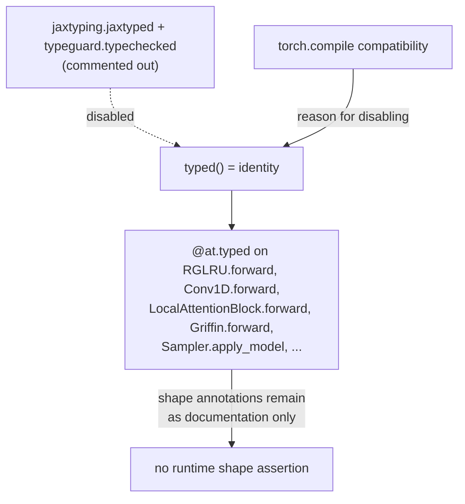

# recurrentgemma.torch.array_typing — the same alias vocabulary, with typing disabled

## Overview

This module is the PyTorch mirror of [recurrentgemma-jax-array_typing](recurrentgemma-jax-array_typing.md):
the same shape-annotated alias vocabulary
([`Activations`](../catalog/recurrentgemma/torch/array_typing.md#Activations),
[`SegmentPos`](../catalog/recurrentgemma/torch/array_typing.md#SegmentPos),
[`ExpandedActivations`](../catalog/recurrentgemma/torch/array_typing.md#ExpandedActivations),
`RNNState`, `Conv1DState`,
`Reset`, `Tokens`, `TokenLogits`, `NumTokens`,
each now a `jaxtyping.Float`/`Integer`/`Bool[torch.Tensor, "..."]` instead of `jax.Array`), but with
one deliberate, load-bearing difference: [`typed`](../catalog/recurrentgemma/torch/array_typing.md#typed)
is a **no-op** — `return function`, nothing wrapped — with the runtime-checking line commented out
and annotated "we comment out this, since it breaks torch.compile". Every `@at.typed` decorator across
the torch lane's [layers](recurrentgemma-torch-layers.md), [modules](recurrentgemma-torch-modules.md),
and [sampler](recurrentgemma-torch-sampler.md) is therefore purely documentation in this lane — the
shape annotations exist and are readable, but nothing is enforced at runtime, unlike the JAX lane.

## Diagram

## Design rationale (why it's built this way)

**The choice to disable `jaxtyped`/`typeguard` is explicit and commented, not an oversight.** The
source comment directly above [`typed`](../catalog/recurrentgemma/torch/array_typing.md#typed)'s
`return function` line states the real implementation "breaks torch.compile" — meaning the JAX lane's
safety net (runtime shape assertions on nearly every function call, see
[recurrentgemma-jax-array_typing](recurrentgemma-jax-array_typing.md)) is a `torch.compile`
incompatibility in this lane specifically, not a general PyTorch limitation; the trade is made in
favor of compile compatibility over the extra correctness check.

**Every alias still declares the same shape string as its JAX counterpart, keeping the two lanes
documentation-compatible even though only one enforces it.**
[`Activations`](../catalog/recurrentgemma/torch/array_typing.md#Activations) `= Float[torch.Tensor,
"*b t d"]` mirrors the JAX lane's own `Activations = Float[jax.Array, "*b t d"]` (see
[recurrentgemma-jax-array_typing](recurrentgemma-jax-array_typing.md)) exactly — a reader moving
between lanes (e.g. verifying numerical
equivalence in `conversion_test.py`, per [recurrentgemma-common](recurrentgemma-common.md)) sees
identical axis semantics regardless of which lane's file they're in.

> [!inferred] Because `typed` is a no-op here, every `@at.typed`-decorated `forward` method in the
> torch lane ([`RGLRU.forward`](../catalog/recurrentgemma/torch/layers.md#RGLRU.forward),
> [`Conv1D.forward`](../catalog/recurrentgemma/torch/layers.md#Conv1D.forward),
> [`LocalAttentionBlock.forward`](../catalog/recurrentgemma/torch/modules.md#LocalAttentionBlock.forward),
> [`RecurrentBlock.forward`](../catalog/recurrentgemma/torch/modules.md#RecurrentBlock.forward),
> [`ResidualBlock.forward`](../catalog/recurrentgemma/torch/modules.md#ResidualBlock.forward),
> [`Griffin.forward`](../catalog/recurrentgemma/torch/griffin.md#Griffin.forward), and every
> `Sampler` method) is functionally identical to the same method without the decorator — the
> annotation is retained purely so the two lanes stay textually parallel and so a future re-enabling
> is a one-line change.

## Entry points

- [`typed`](../catalog/recurrentgemma/torch/array_typing.md#typed) — the no-op decorator; every torch
  `forward`/sampler method still carries `@at.typed` textually, so this is where the entire lane's
  "shape checking" behavior (i.e. none) is centralized and could be re-enabled.
- [`Activations`](../catalog/recurrentgemma/torch/array_typing.md#Activations)/
  [`SegmentPos`](../catalog/recurrentgemma/torch/array_typing.md#SegmentPos) — the two most-referenced
  aliases, mirroring their JAX-lane role as the primary `forward` input types.

## Mechanism (step-by-step)

1. **Every torch `forward` is annotated with the same alias vocabulary as JAX, decorated with
   `@at.typed`.** E.g. [`RGLRU.forward`](../catalog/recurrentgemma/torch/layers.md#RGLRU.forward)`(self,
   x: ExpandedActivations, segment_pos: SegmentPos, cache: RNNState | None = None, ...)`.
2. **[`typed`](../catalog/recurrentgemma/torch/array_typing.md#typed)`(function)` simply returns
   `function` unmodified** — no wrapping, no runtime shape/dtype check occurs; the annotations are
   inert type hints as far as execution is concerned.
3. **`Reset`** (`Bool[torch.Tensor, "*b t"]`) is the one alias in this module without a direct JAX
   counterpart in the corresponding packet — it types the `reset = segment_pos == 0` boolean mask
   computed inline in [`rnn_scan`](../catalog/recurrentgemma/torch/layers.md#rnn_scan) and
   `RGLRU.forward` (see
   [recurrentgemma-torch-layers](recurrentgemma-torch-layers.md)).

## Key data structures

- **The alias table** — identical axis semantics to the JAX lane:
  [`Activations`](../catalog/recurrentgemma/torch/array_typing.md#Activations) (`*b t d`),
  [`SegmentPos`](../catalog/recurrentgemma/torch/array_typing.md#SegmentPos)/`Tokens`
  (`*b t`), `TokenLogits` (`*b t v`),
  [`ExpandedActivations`](../catalog/recurrentgemma/torch/array_typing.md#ExpandedActivations) (`*b t
  e`), `RNNState` (`*b e`),
  `Conv1DState` (`*b w e`),
  `Reset` (`*b t`),
  `NumTokens` (`*b`).
- **`F = TypeVar("F", bound=Callable)`** ([`F`](../catalog/recurrentgemma/torch/array_typing.md#F)) —
  the generic bound used by `typed`'s signature, identical in shape to the JAX lane's own `F`.

## Dynamics (design intent)

Because there is no runtime check, a shape bug in the torch lane surfaces only wherever the actual
tensor op fails (a `RuntimeError` from a mismatched matmul, or worse, a silent broadcast) — the JAX
lane would catch the same bug earlier, at the function boundary, with a named-argument error message.

## Edge cases

- Any future re-enabling of the commented-out `jt.jaxtyped(function, typechecker=typeguard.typechecked)`
  line would need to be re-verified against `torch.compile` compatibility before landing — the
  comment implies this was tried and reverted, not merely never attempted.

## Open questions

- Whether the incompatibility is with `torch.compile` broadly or a specific `typeguard`/`jaxtyping`
  version combination isn't specified by the comment alone.

## See also
- [recurrentgemma-jax-array_typing](recurrentgemma-jax-array_typing.md) — the JAX-lane counterpart
  where `typed` performs a real runtime check.
- [recurrentgemma-torch-layers](recurrentgemma-torch-layers.md) /
  [recurrentgemma-torch-modules](recurrentgemma-torch-modules.md) — the primary consumers of this
  module's aliases.
