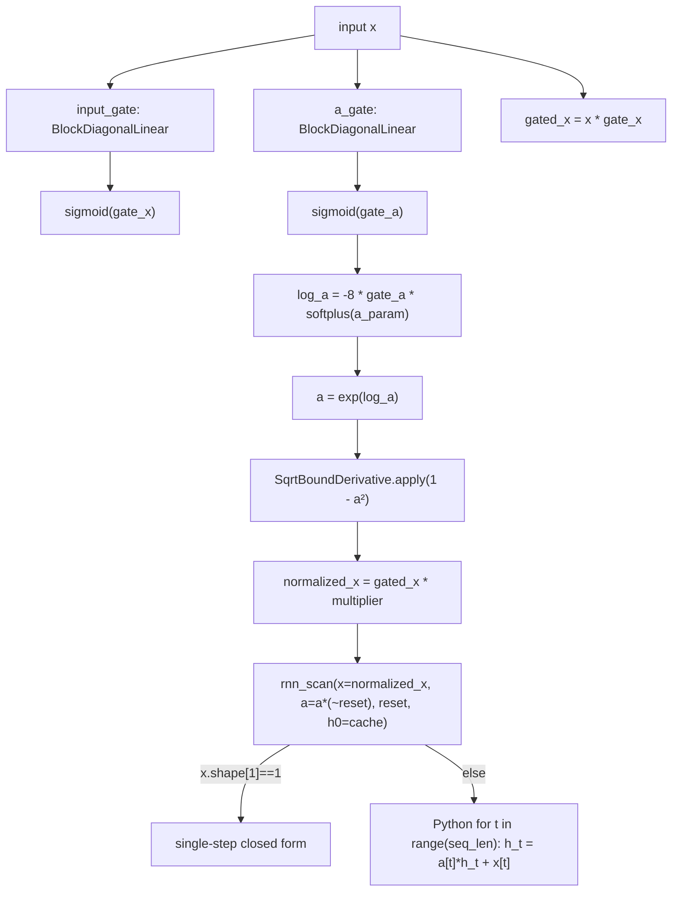

# recurrentgemma.torch.layers — RGLRU and Conv1D without a JAX runtime

## Overview

This module is the `torch.nn.Module` mirror of [recurrentgemma-jax-layers](recurrentgemma-jax-layers.md):
[`RGLRU`](../catalog/recurrentgemma/torch/layers.md#RGLRU),
[`Conv1D`](../catalog/recurrentgemma/torch/layers.md#Conv1D),
[`BlockDiagonalLinear`](../catalog/recurrentgemma/torch/layers.md#BlockDiagonalLinear), and `RMSNorm`
reimplement the identical mathematical recurrence with PyTorch idioms rather than Flax/JAX ones —
explicit `__init__` + [`reset_parameters`](../catalog/recurrentgemma/torch/layers.md#RGLRU.reset_parameters)
instead of `setup()`, `nn.Parameter`/`torch.nn.init.*` instead of `self.param(...)`, and, most
importantly, [`rnn_scan`](../catalog/recurrentgemma/torch/layers.md#rnn_scan) is a **plain Python
`for` loop** over the sequence dimension rather than a TPU Pallas kernel or a `jax.lax.scan` — there
is no equivalent of [recurrentgemma-jax-pallas](recurrentgemma-jax-pallas.md) in this lane at all.
Numerical-stability tricks (log-space `A`, gradient-clipped `sqrt`) are preserved via
[`SqrtBoundDerivative`](../catalog/recurrentgemma/torch/layers.md#SqrtBoundDerivative), a
`torch.autograd.Function` rather than a `jax.custom_vjp`.

## Diagram

## Design rationale (why it's built this way)

**`rnn_scan` is a straight-line Python loop with no kernel, no vmap, no Pallas equivalent.**
[`rnn_scan`](../catalog/recurrentgemma/torch/layers.md#rnn_scan) branches on `x.shape[1] == 1`
(single-step decode: a closed-form `a * h0 + x`, no loop at all) versus the general case, where it
allocates `y = torch.zeros_like(x)` and runs `for t in range(x.shape[1]): h_t = a[:, t] * h_t + x[:,
t]; y[:, t] = h_t` — a genuinely sequential Python loop over up to the full training sequence length.
This is the starkest architectural divergence from the JAX lane's
[Pallas kernel](recurrentgemma-jax-pallas.md), which tiles and parallelizes this exact recurrence
across a TPU grid; the torch lane trades performance for implementation simplicity, relying on
`torch.compile`/eager-mode tensor ops per step rather than a hand-written kernel.

**Gradient clipping for `sqrt` is a `torch.autograd.Function` with an explicit `backward`, mirroring
the JAX `custom_vjp` one-to-one.** [`SqrtBoundDerivative.forward`](../catalog/recurrentgemma/torch/layers.md#SqrtBoundDerivative)
computes a plain `torch.sqrt(x)`; its `backward` clips `4*x` to a floor of
`1/_MAX_SQRT_GRADIENT²` before differentiating — structurally the same two-function split as the
JAX lane's `sqrt_bound_derivative`/`stable_sqrt_fwd`/`stable_sqrt_bwd` trio (see
[recurrentgemma-jax-layers](recurrentgemma-jax-layers.md)), just expressed via PyTorch's
`ctx.save_for_backward`/`@staticmethod` convention instead of `jax.custom_vjp`'s functional style.

**Every module implements its own `reset_parameters`, called once from `__init__`, rather than
relying on PyTorch's default parameter initialization.**
[`RGLRU.reset_parameters`](../catalog/recurrentgemma/torch/layers.md#RGLRU.reset_parameters) calls
[`BlockDiagonalLinear.reset_parameters`](../catalog/recurrentgemma/torch/layers.md#BlockDiagonalLinear.reset_parameters)
on both gates and then
[`a_param_init`](../catalog/recurrentgemma/torch/layers.md#RGLRU.a_param_init) (delegating to
[`rnn_param_init`](../catalog/recurrentgemma/torch/layers.md#rnn_param_init), the direct torch
analogue of the JAX lane's `rnn_real_param_init`) — every constructor in this module explicitly
re-derives the paper's variance-scaled/ring initialization scheme rather than trusting
`nn.Linear`'s default Kaiming-uniform init, which would not match the JAX-side numerics.

**RGLRU has no complex-number path at all — `only_real` isn't a parameter here.** Unlike the JAX
lane's `RGLRU` (see [recurrentgemma-jax-layers](recurrentgemma-jax-layers.md)), this module's
[`RGLRU.forward`](../catalog/recurrentgemma/torch/layers.md#RGLRU.forward) computes `a =
torch.exp(log_a)` unconditionally as a real tensor — there is no `Complex`-equivalent wrapper and no
`use_custom_complex` branch in the torch lane's subgraph; the torch implementation only ever supports
the real-valued RG-LRU variant.

> [!inferred] [`Conv1D.forward`](../catalog/recurrentgemma/torch/layers.md#Conv1D.forward)'s manual
> unrolled-sum convolution loop (over `temporal_shift in range(temporal_width)`) is structurally
> identical to the JAX lane's, including the same
> [`_compute_document_mask`](../catalog/recurrentgemma/torch/layers.md#Conv1D._compute_document_mask)/
> [`_pad_window`](../catalog/recurrentgemma/torch/layers.md#Conv1D._pad_window) helper split — this
> particular piece of the port is a near-transliteration rather than a re-architecture.

## Entry points

- [`RGLRU.forward`](../catalog/recurrentgemma/torch/layers.md#RGLRU.forward) — reached once per
  `RecurrentBlock` forward pass, via its
  [`rg_lru`](../catalog/recurrentgemma/torch/modules.md#RecurrentBlock.rg_lru) submodule.
- [`Conv1D.forward`](../catalog/recurrentgemma/torch/layers.md#Conv1D.forward) — runs before
  `RGLRU.forward` on the same branch, via
  [`conv_1d`](../catalog/recurrentgemma/torch/modules.md#RecurrentBlock.conv_1d).
- [`rnn_scan`](../catalog/recurrentgemma/torch/layers.md#rnn_scan) — the sequential-computation core;
  every training step and every decode step passes through this one function.

## Mechanism (step-by-step)

1. **Gate computation is identical in structure to the JAX lane.** `gate_x = sigmoid(`[`input_gate`](../catalog/recurrentgemma/torch/layers.md#RGLRU.input_gate)`(x))`,
   `gate_a = sigmoid(`[`a_gate`](../catalog/recurrentgemma/torch/layers.md#RGLRU.a_gate)`(x))`,
   `log_a = -8.0 * gate_a * softplus(`[`a_param`](../catalog/recurrentgemma/torch/layers.md#RGLRU.a_param)`)`,
   `a = exp(log_a)` — no complex-branch, so this is the entire coefficient computation.
2. **Reset masking zeroes `a` per document boundary, computed once and reused for both the
   normalization multiplier and the scan input.** `reset = segment_pos == 0`;
   [`RGLRU.forward`](../catalog/recurrentgemma/torch/layers.md#RGLRU.forward) passes `a` (unmasked)
   and `reset` separately into [`rnn_scan`](../catalog/recurrentgemma/torch/layers.md#rnn_scan), which
   itself does `a = a * ~reset[..., None]` at its own top — the masking logic lives inside
   `rnn_scan`, not duplicated at the call site (a small divergence from the JAX lane, where
   `scan.linear_scan` receives an already-masked `a`).
3. **Normalization uses the custom-autograd gradient-clipped sqrt.**
   `multiplier = `[`SqrtBoundDerivative`](../catalog/recurrentgemma/torch/layers.md#SqrtBoundDerivative)`.apply(1
   - a_square)`; reset positions get `multiplier = 1` via `reset[...,None] + ~reset[...,None] *
   multiplier` before it feeds into [`rnn_scan`](../catalog/recurrentgemma/torch/layers.md#rnn_scan)
   (identical algebraic form to the JAX lane).
4. **The scan itself branches on sequence length, not the RGLRU caller.**
   [`rnn_scan`](../catalog/recurrentgemma/torch/layers.md#rnn_scan) checks `x.shape[1] == 1`
   internally (single-token decode: closed-form, no loop) versus the general multi-token case (a
   literal Python `for t in range(x.shape[1])` loop accumulating `h_t`) — `RGLRU.forward` itself has
   no branching on sequence length; that logic is entirely `rnn_scan`'s responsibility.
5. **Conv1D's cache path is single-token-only, exactly mirroring the JAX lane.**
   [`_concatenate_with_cache`](../catalog/recurrentgemma/torch/layers.md#Conv1D._concatenate_with_cache)
   asserts `num_tokens == 1` for the decode-mode input, then the same unrolled-sum convolution loop
   with [`_compute_document_mask`](../catalog/recurrentgemma/torch/layers.md#Conv1D._compute_document_mask)
   (training mode only) and [`_pad_window`](../catalog/recurrentgemma/torch/layers.md#Conv1D._pad_window)
   runs identically to the JAX version.

## Key data structures

- **[`RGLRU.a_param`](../catalog/recurrentgemma/torch/layers.md#RGLRU.a_param)** — a single real
  `nn.Parameter`, no imaginary counterpart (unlike the JAX lane's optional `a_imag_param`).
  [`width`](../catalog/recurrentgemma/torch/layers.md#RGLRU.width) /
  [`num_heads`](../catalog/recurrentgemma/torch/layers.md#RGLRU.num_heads) mirror the JAX fields.
- **[`Conv1D.w`](../catalog/recurrentgemma/torch/layers.md#Conv1D.w) /
  [`b`](../catalog/recurrentgemma/torch/layers.md#Conv1D.b)** — same `[temporal_width, width]` /
  `[width]` shapes as JAX;
  [`temporal_width`](../catalog/recurrentgemma/torch/layers.md#Conv1D.temporal_width) fixed at 4
  across presets.
- **[`BlockDiagonalLinear.w`/`b`](../catalog/recurrentgemma/torch/layers.md#BlockDiagonalLinear.w)**
  — `nn.Parameter`s of shape `[num_blocks, block_width, block_width]` /
  `[num_blocks, block_width]`; [`block_width`](../catalog/recurrentgemma/torch/layers.md#BlockDiagonalLinear.block_width)
  is `width // num_blocks`, computed once in `__init__`.

## Dynamics (design intent)

Because `rnn_scan`'s multi-step branch is a literal Python loop, its cost under `torch.compile` is
whatever the compiler's loop-unrolling/tracing strategy produces for a fixed sequence length — there
is no cross-timestep tiling or grid-based parallelism analogous to the Pallas kernel; the sequential
data dependency (`h_t` depends on `h_{t-1}`) is expressed exactly as data-dependent Python control
flow.

## Edge cases

- [`rnn_scan`](../catalog/recurrentgemma/torch/layers.md#rnn_scan) asserts `h0 is None or h0.dtype ==
  acc_dtype` — an explicit dtype-consistency check absent from the equivalent JAX assertion set (the
  JAX lane relies on `get_acc_dtype`'s own derivation instead).
- [`Conv1D._concatenate_with_cache`](../catalog/recurrentgemma/torch/layers.md#Conv1D._concatenate_with_cache)
  has the identical single-token-only assumption as the JAX lane's
  `_concatenate_with_state` — a prompt-chunk of length > 1 cannot use the cached decode path.

## Open questions

- Whether the plain Python-loop `rnn_scan` has been benchmarked against `torch.compile`'s ability to
  fuse/vectorize it isn't discussed anywhere in this packet's grounding — this is presumably the
  primary performance gap between the torch and JAX lanes for long sequences.

## See also
- [recurrentgemma-jax-layers](recurrentgemma-jax-layers.md) — the JAX counterpart, notably with a
  [Pallas kernel](recurrentgemma-jax-pallas.md) backend the torch lane has no equivalent of.
- [recurrentgemma-torch-modules](recurrentgemma-torch-modules.md) — `RecurrentBlock`, the caller that
  wires `RGLRU` and `Conv1D` together.
