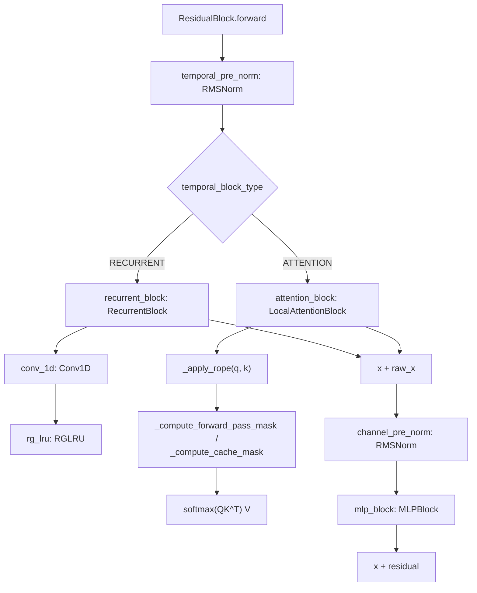

# recurrentgemma.torch.modules — the residual block, ported idiom-for-idiom

## Overview

This module is the `torch.nn.Module` mirror of [recurrentgemma-jax-modules](recurrentgemma-jax-modules.md):
the same [`ResidualBlock`](../catalog/recurrentgemma/torch/modules.md#ResidualBlock.recurrent_block)
/ [`RecurrentBlock`](../catalog/recurrentgemma/torch/modules.md#RecurrentBlock) /
[`LocalAttentionBlock`](../catalog/recurrentgemma/torch/modules.md#LocalAttentionBlock) /
`Embedder` structure, with the same
`temporal_block_type`-driven dispatch, ported to explicit `__init__`+`forward`+`reset_parameters`
methods rather than Flax's `setup()`+`__call__`. The masking/RoPE/attention math
([`_apply_rope`](../catalog/recurrentgemma/torch/modules.md#_apply_rope),
[`_compute_causal_mask`](../catalog/recurrentgemma/torch/modules.md#_compute_causal_mask),
[`_compute_forward_pass_mask`](../catalog/recurrentgemma/torch/modules.md#_compute_forward_pass_mask),
[`_compute_cache_mask`](../catalog/recurrentgemma/torch/modules.md#_compute_cache_mask)) is a
line-for-line torch transliteration of the JAX functions of the same name, differing only in
`jnp`→`torch` call spelling — this is the module pair the repo's `conversion_test.py` and
`*_test.py numerically_compare_modules` suite exists to keep numerically identical.

## Diagram

## Design rationale (why it's built this way)

**Unlike the JAX lane, `ResidualBlock`'s MLP branch is unconditional — there is no `use_mlp` flag in
this packet's subgraph.** [`ResidualBlock.forward`](../catalog/recurrentgemma/torch/modules.md#ResidualBlock.forward)
always runs `channel_pre_norm` +
[`mlp_block`](../catalog/recurrentgemma/torch/modules.md#ResidualBlock.mlp_block) after the temporal
sub-block, without the JAX lane's `if self.use_mlp:` guard (see
[recurrentgemma-jax-modules](recurrentgemma-jax-modules.md)) — the torch port's `ResidualBlock` is
strictly a residual-attention/recurrent-plus-MLP block, one architectural degree of freedom narrower
than its JAX counterpart as represented in this packet.

**Every module exposes an explicit `reset_parameters`, called top-down from the enclosing module's
own `reset_parameters`, mirroring PyTorch's typical initialization convention.**
[`ResidualBlock.reset_parameters`](../catalog/recurrentgemma/torch/modules.md#RecurrentBlock.reset_parameters)
calls `temporal_pre_norm.reset_parameters()`, `temporal_block.reset_parameters()` (dispatching
through the same [`temporal_block`](../catalog/recurrentgemma/torch/modules.md#ResidualBlock.temporal_block)
property used for `forward`), `channel_pre_norm.reset_parameters()`, and `mlp_block.reset_parameters()`
— a full top-down re-initialization walk that has no JAX-lane equivalent (Flax params are
(re-)initialized by `.init()`, not a `reset_parameters` method call chain).

**`LocalAttentionBlock`'s custom weight-init helpers (`w_init_`, `out_w_init_`) reimplement the same
`variance_scaling(fan_in)` formula as raw `torch.nn.init.normal_` calls, rather than using a PyTorch
built-in initializer.** [`LocalAttentionBlock.w_init_`](../catalog/recurrentgemma/torch/modules.md#LocalAttentionBlock)
(not itself cited by name in this packet's subgraph beyond its call sites) computes `std =
sqrt(1.0/width)` and calls `torch.nn.init.normal_(w, mean=0, std=std)` — algebraically identical to
the JAX lane's `nn.initializers.variance_scaling(scale=1.0, mode="fan_in", distribution="normal")`,
just spelled out by hand since PyTorch's `torch.nn.init` doesn't expose the same
`variance_scaling` abstraction directly.

**`head_dim`, `q`/`k`/`v`/`out` naming differs cosmetically from JAX (`proj_q`/`proj_k`/`proj_v`/
`proj_final` vs. `q`/`k`/`v`/`out`) but the shapes are identical.**
[`LocalAttentionBlock.proj_k`](../catalog/recurrentgemma/torch/modules.md#LocalAttentionBlock.proj_k)/
[`proj_v`](../catalog/recurrentgemma/torch/modules.md#LocalAttentionBlock.proj_v) both project to
[`head_dim`](../catalog/recurrentgemma/torch/modules.md#LocalAttentionBlock.head_dim) (single-KV-head,
same design as JAX), while
[`proj_final`](../catalog/recurrentgemma/torch/modules.md#LocalAttentionBlock.proj_final) projects
back to full [`width`](../catalog/recurrentgemma/torch/modules.md#LocalAttentionBlock.width) — the
naming divergence is purely cosmetic (`nn.Linear` attribute names chosen independently per lane), the
underlying multi-query-attention structure is unchanged.

> [!inferred] [`RecurrentBlock`](../catalog/recurrentgemma/torch/modules.md#RecurrentBlock)'s three
> `nn.Linear` sub-modules are named
> [`linear_y`](../catalog/recurrentgemma/torch/modules.md#RecurrentBlock.linear_y)/
> [`linear_x`](../catalog/recurrentgemma/torch/modules.md#RecurrentBlock.linear_x)/
> [`linear_out`](../catalog/recurrentgemma/torch/modules.md#RecurrentBlock.linear_out) — identical
> names to the JAX lane's `nn.Dense` attributes — suggesting the torch port deliberately preserved
> Flax attribute names as `nn.Module` attribute names to keep checkpoint/state-dict key
> correspondence straightforward for the `from_torch_params`/`from_flax_params_or_variables`
> checkpoint-inference code in [recurrentgemma-common](recurrentgemma-common.md).

## Entry points

- [`ResidualBlock.forward`](../catalog/recurrentgemma/torch/modules.md#ResidualBlock.forward) —
  reached once per layer per forward pass, from
  [`Griffin.blocks`](../catalog/recurrentgemma/torch/griffin.md#Griffin.blocks) (see
  [recurrentgemma-torch-sampler](recurrentgemma-torch-sampler.md) for the caller chain).
- [`ResidualBlock.init_cache`](../catalog/recurrentgemma/torch/modules.md#ResidualBlock.init_cache) —
  a `@classmethod`, dispatching to `RecurrentBlock`'s or `LocalAttentionBlock`'s own `init_cache` by
  `temporal_block_type`.
- [`_apply_rope`](../catalog/recurrentgemma/torch/modules.md#_apply_rope) — the RoPE application
  shared by queries and keys inside `LocalAttentionBlock.forward`.

## Mechanism (step-by-step)

1. **Pre-norm then dispatch, structurally identical to JAX.**
   [`ResidualBlock.forward`](../catalog/recurrentgemma/torch/modules.md#ResidualBlock.forward)
   normalizes via [`temporal_pre_norm`](../catalog/recurrentgemma/torch/modules.md#ResidualBlock.temporal_pre_norm),
   then calls [`temporal_block`](../catalog/recurrentgemma/torch/modules.md#ResidualBlock.temporal_block)
   — either [`recurrent_block`](../catalog/recurrentgemma/torch/modules.md#ResidualBlock.recurrent_block)
   or [`attention_block`](../catalog/recurrentgemma/torch/modules.md#ResidualBlock.attention_block).
2. **RecurrentBlock runs the same two-branch gated structure as JAX.**
   [`linear_y`](../catalog/recurrentgemma/torch/modules.md#RecurrentBlock.linear_y)→`gelu` on one
   branch, [`linear_x`](../catalog/recurrentgemma/torch/modules.md#RecurrentBlock.linear_x)→
   [`conv_1d`](../catalog/recurrentgemma/torch/modules.md#RecurrentBlock.conv_1d)→
   [`rg_lru`](../catalog/recurrentgemma/torch/modules.md#RecurrentBlock.rg_lru) on the other, combined
   multiplicatively and passed through
   [`linear_out`](../catalog/recurrentgemma/torch/modules.md#RecurrentBlock.linear_out).
3. **LocalAttentionBlock computes q/k/v, applies RoPE, masks, and does standard attention with a
   forced fp32 softmax.** Identical structure to the JAX lane:
   [`_apply_rope`](../catalog/recurrentgemma/torch/modules.md#_apply_rope) rotates the first half of
   queries/keys; [`_compute_forward_pass_mask`](../catalog/recurrentgemma/torch/modules.md#_compute_forward_pass_mask)
   (fresh prompt) or [`_compute_cache_mask`](../catalog/recurrentgemma/torch/modules.md#_compute_cache_mask)
   (decode-with-cache) produce the boolean attention mask; logits are cast to `torch.float32` before
   `nn.functional.softmax`.
4. **Cache update mirrors the JAX two-path split exactly, but with an added `NotImplementedError`
   guard.** [`_update_attention_cache`](../catalog/recurrentgemma/torch/modules.md#_update_attention_cache)
   handles `n_fill == 1` (in-place index-assignment update, note: torch tensors support true in-place
   mutation here, unlike JAX's `.at[].set()` functional update) and `n_fill == window_size` (full
   re-derivation via [`_attention_cache_from_prompt`](../catalog/recurrentgemma/torch/modules.md#_attention_cache_from_prompt)),
   but explicitly `raise NotImplementedError()` for any other `n_fill` value — a stricter contract
   than the JAX lane, whose equivalent function has no such explicit third branch.
5. **MLP always runs; there is no conditional skip.**
   [`ResidualBlock.forward`](../catalog/recurrentgemma/torch/modules.md#ResidualBlock.forward)'s final
   steps (`channel_pre_norm` → [`mlp_block`](../catalog/recurrentgemma/torch/modules.md#ResidualBlock.mlp_block)
   → residual add) execute unconditionally for every layer regardless of `temporal_block_type`.

## Key data structures

- **[`RecurrentBlockCache`](../catalog/recurrentgemma/torch/modules.md#RecurrentBlockCache) /
  [`AttentionBlockCache`](../catalog/recurrentgemma/torch/modules.md#AttentionBlockCache)** — same two
  shapes as JAX; `AttentionBlockCache` carries
  [`keys`](../catalog/recurrentgemma/torch/modules.md#AttentionBlockCache.keys)/
  [`values`](../catalog/recurrentgemma/torch/modules.md#AttentionBlockCache.values)/
  [`num_tokens`](../catalog/recurrentgemma/torch/modules.md#AttentionBlockCache.num_tokens).
- **[`LocalAttentionBlock.proj_q`/`proj_k`/`proj_v`/`proj_final`](../catalog/recurrentgemma/torch/modules.md#LocalAttentionBlock.proj_k)**
  — the four `nn.Linear` projections (torch-lane naming; see JAX-lane equivalence note above).

## Dynamics (design intent)

Because every sub-module carries its own `reset_parameters` and `ResidualBlock.reset_parameters`
walks the whole tree, re-initializing a `Griffin` model in-place (without rebuilding the module tree)
is a first-class, directly-callable operation in this lane — something the JAX/Flax lane instead does
via a fresh `.init()` call producing a new parameter pytree.

## Edge cases

- [`_update_attention_cache`](../catalog/recurrentgemma/torch/modules.md#_update_attention_cache)'s
  explicit `raise NotImplementedError()` for `n_fill` values other than `1` or `window_size` means a
  prompt chunk whose length doesn't evenly divide/match the window size in one of those two ways will
  crash rather than silently mishandle the cache — stricter than the JAX-lane equivalent.
- The absence of a `use_mlp` flag (present in JAX) means any hypothetical use case relying on an
  MLP-less residual block is not representable by this torch module as grounded in this packet.

## Open questions

- Whether the `use_mlp=False` JAX-lane configuration is actually exercised by any published preset,
  and therefore whether the torch lane's omission is a meaningful behavioral gap or simply dead code
  never ported, isn't resolved by this packet's subgraph.

## See also
- [recurrentgemma-torch-layers](recurrentgemma-torch-layers.md) — `RGLRU`/`Conv1D`, the primitives
  `RecurrentBlock` composes.
- [recurrentgemma-jax-modules](recurrentgemma-jax-modules.md) — the JAX counterpart this module is
  numerically compared against in the test suite.
- [recurrentgemma-common](recurrentgemma-common.md) — `TemporalBlockType`/`GriffinConfig`, shared by
  both lanes.
