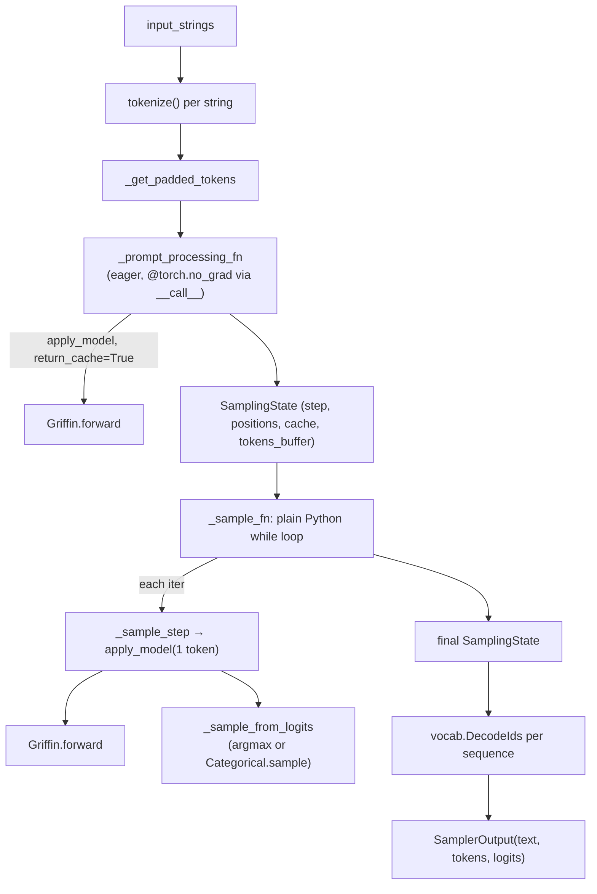

# recurrentgemma.torch.sampler — eager-mode autoregressive decoding

## Overview

This is the PyTorch mirror of [recurrentgemma-jax-sampler](recurrentgemma-jax-sampler.md), and its
central divergence is exactly what you'd expect porting a `jax.jit`-compiled two-phase generator to
eager PyTorch: [`Sampler._sample_fn`](../catalog/recurrentgemma/torch/sampler.md#Sampler._sample_fn)
is a plain Python `while` loop, not a traced `jax.lax.while_loop`, and there is no
`donate_argnums`/`static_argnums` compilation machinery at all — `Sampler.__call__` is decorated
`@torch.no_grad` instead, the eager-mode equivalent of "don't build an autograd graph for inference".
The two-phase structure (prefill via
[`_prompt_processing_fn`](../catalog/recurrentgemma/torch/sampler.md#Sampler._prompt_processing_fn),
then decode via [`_sample_step`](../catalog/recurrentgemma/torch/sampler.md#Sampler._sample_step))
and the [`SamplingState`](../catalog/recurrentgemma/torch/sampler.md#SamplingState) pytree-of-state
pattern are otherwise structurally identical to the JAX lane.

## Diagram

## Design rationale (why it's built this way)

**The decode loop's stopping condition is a plain Python `while` over tensor-valued booleans, using
bitwise operators instead of `jnp.logical_and`/`jnp.any`.**
[`Sampler._sample_fn`](../catalog/recurrentgemma/torch/sampler.md#Sampler._sample_fn)'s loop condition
is `(sampler_state.step < sampler_state.total_steps - 1) & torch.any(torch.logical_not(sampler_state.done))`
— syntactically a Python `while`, but the condition itself is still built from tensor ops (`&`, not
`and`) since `step`/`total_steps`/`done` remain `torch.Tensor`s throughout, not Python scalars; this
is what lets the same [`SamplingState`](../catalog/recurrentgemma/torch/sampler.md#SamplingState)
dataclass (a plain `@dataclasses.dataclass`, not `flax.struct.dataclass`, since there's no pytree
registration need without `jax.jit`) be reused verbatim by both lanes' `_sample_step`.

**There is no RNG-key threading — `SamplingState` in this lane has no `rng` field, and the sampler
supports only greedy or `torch.distributions.Categorical`, using ambient torch RNG state.**
[`SamplingState`](../catalog/recurrentgemma/torch/sampler.md#SamplingState)'s fields
([`tokens_buffer`](../catalog/recurrentgemma/torch/sampler.md#SamplingState.tokens_buffer),
[`step`](../catalog/recurrentgemma/torch/sampler.md#SamplingState.step),
[`total_steps`](../catalog/recurrentgemma/torch/sampler.md#SamplingState.total_steps),
[`positions`](../catalog/recurrentgemma/torch/sampler.md#SamplingState.positions),
[`cache`](../catalog/recurrentgemma/torch/sampler.md#SamplingState.cache),
[`done`](../catalog/recurrentgemma/torch/sampler.md#SamplingState.done),
[`logits_buffer`](../catalog/recurrentgemma/torch/sampler.md#SamplingState.logits_buffer)) omit the
JAX lane's explicit `rng: jt.PRNGKeyArray | None` — [`_sample_from_logits`](../catalog/recurrentgemma/torch/sampler.md#Sampler._sample_from_logits)
instead calls `torch.distributions.Categorical(logits=logits).sample()` directly, relying on
PyTorch's implicit global RNG state rather than JAX's explicit-key-splitting discipline; this is a
direct consequence of the two frameworks' different randomness models, not a stylistic choice.

**`Sampler.__call__` is `@torch.no_grad`, the entire public entry point, rather than individually
wrapping each internal phase.** Unlike the JAX lane where `_compiled_prompt_processing_fn`/
`_compiled_sample_fn` are
separately jitted (see [recurrentgemma-jax-sampler](recurrentgemma-jax-sampler.md)), here the single
`@torch.no_grad` decorator on
[`Sampler.__call__`](../catalog/recurrentgemma/torch/sampler.md#Sampler.__call__) disables
autograd-graph construction for the whole generation call, prefill and decode alike, in one place.

**EOS detection uses `torch.equal` against a pre-materialized `_eos_token` tensor, not a scalar
comparison.** [`Sampler._eos_token`](../catalog/recurrentgemma/torch/sampler.md#Sampler._eos_token)
is constructed once in `__init__` as `torch.tensor([self.vocab.eos_id()], device=self.device)`, and
[`_sample_step`](../catalog/recurrentgemma/torch/sampler.md#Sampler._sample_step) compares against it
via `torch.equal(next_token, self._eos_token)` — a whole-tensor equality check, which only makes sense
because `next_token` at that point is shape-compatible (both effectively scalar/singleton); the JAX
lane instead uses `jnp.equal` per-batch-element, broadcasting across the whole batch, a subtle
semantic difference in how multi-sequence-batch EOS detection behaves between lanes.

> [!inferred] [`Sampler.dtype`](../catalog/recurrentgemma/torch/sampler.md#Sampler.dtype) is derived
> from `next(self.model.parameters()).dtype` — the first parameter tensor's dtype, structurally
> analogous to the JAX lane's `jax.tree_util.tree_leaves(self.params)[0].dtype`, but accessed through
> PyTorch's module parameter iterator instead of a pytree leaves call.

## Entry points

- [`Sampler.__call__`](../catalog/recurrentgemma/torch/sampler.md#Sampler.__call__) — the
  `@torch.no_grad`-wrapped public API: tokenize, prefill, decode, detokenize.
- [`Sampler.apply_model`](../catalog/recurrentgemma/torch/sampler.md#Sampler.apply_model) — calls
  `self.model(...)` directly (an ordinary `nn.Module.__call__`, i.e. `Griffin.forward`) rather than the
  JAX lane's `model.apply({"params": params}, ...)` functional-parameter-passing style — this lane's
  `model` object owns its own parameters as `nn.Module` state.
- [`Sampler.tokenize`](../catalog/recurrentgemma/torch/sampler.md#Sampler.tokenize) — identical logic
  to the JAX lane: applies [`apply_it_formatter`](../catalog/recurrentgemma/common.md#apply_it_formatter)
  if `_is_it_model`, then SentencePiece-encodes and prepends BOS.

## Mechanism (step-by-step)

1. **Tokenize and pad.** [`Sampler.__call__`](../catalog/recurrentgemma/torch/sampler.md#Sampler.__call__)
   calls [`tokenize`](../catalog/recurrentgemma/torch/sampler.md#Sampler.tokenize) per string, then
   [`_get_padded_tokens`](../catalog/recurrentgemma/torch/sampler.md#Sampler._get_padded_tokens)
   left-pads to the batch's longest prompt.
2. **Prefill runs eagerly, no compilation.** [`_prompt_processing_fn`](../catalog/recurrentgemma/torch/sampler.md#Sampler._prompt_processing_fn)
   computes right-aligned positions, calls
   [`apply_model`](../catalog/recurrentgemma/torch/sampler.md#Sampler.apply_model) (once or twice,
   same last-token-split logic as JAX), and samples the first generated token.
3. **Decode is a literal Python `while` loop, not a traced construct.**
   [`_sample_fn`](../catalog/recurrentgemma/torch/sampler.md#Sampler._sample_fn) loops calling
   [`_sample_step`](../catalog/recurrentgemma/torch/sampler.md#Sampler._sample_step) — which slices
   `tokens_buffer[:, step]`, calls `apply_model` for one token with the current cache, samples the
   next token via [`_sample_from_logits`](../catalog/recurrentgemma/torch/sampler.md#Sampler._sample_from_logits),
   writes it in-place (`tokens_buffer[:, step + 1] = next_token`, true tensor mutation, unlike JAX's
   functional `.at[].set()`), and updates
   [`positions`](../catalog/recurrentgemma/torch/sampler.md#SamplingState.positions) — until `done`
   or `total_steps` is reached.
4. **Sampling branches on `greedy_sampling`, no RNG key management.**
   [`_sample_from_logits`](../catalog/recurrentgemma/torch/sampler.md#Sampler._sample_from_logits)
   returns `torch.argmax(logits, dim=-1)` if
   [`greedy_sampling`](../catalog/recurrentgemma/torch/sampler.md#Sampler.greedy_sampling), else draws
   from `torch.distributions.Categorical(logits=logits).sample()`.
5. **Detokenization, inside [`Sampler.__call__`](../catalog/recurrentgemma/torch/sampler.md#Sampler.__call__),
   slices per-sequence by that sequence's own pad length**, identical logic to the JAX lane.

## Key data structures

- **[`SamplingState`](../catalog/recurrentgemma/torch/sampler.md#SamplingState)** (`@dataclasses.dataclass`,
  generic over `Cache`) — same fields as the JAX lane minus `rng`:
  [`tokens_buffer`](../catalog/recurrentgemma/torch/sampler.md#SamplingState.tokens_buffer),
  [`step`](../catalog/recurrentgemma/torch/sampler.md#SamplingState.step)/
  [`total_steps`](../catalog/recurrentgemma/torch/sampler.md#SamplingState.total_steps),
  [`positions`](../catalog/recurrentgemma/torch/sampler.md#SamplingState.positions),
  [`cache`](../catalog/recurrentgemma/torch/sampler.md#SamplingState.cache),
  [`done`](../catalog/recurrentgemma/torch/sampler.md#SamplingState.done),
  [`logits_buffer`](../catalog/recurrentgemma/torch/sampler.md#SamplingState.logits_buffer).
- **[`SamplerOutput`](../catalog/recurrentgemma/torch/sampler.md#SamplerOutput)** (`typing.NamedTuple`
  here, vs. a `flax.struct.dataclass` in JAX) —
  [`text`](../catalog/recurrentgemma/torch/sampler.md#SamplerOutput.text)/
  [`logits`](../catalog/recurrentgemma/torch/sampler.md#SamplerOutput.logits)/
  [`tokens`](../catalog/recurrentgemma/torch/sampler.md#SamplerOutput.tokens).
- **[`Sampler._eos_token`](../catalog/recurrentgemma/torch/sampler.md#Sampler._eos_token)** — a
  pre-materialized single-element tensor, avoiding repeated tensor construction per decode step.

## Dynamics (design intent)

Because there is no `jax.jit`/`donate_argnums` mechanism, buffer reuse across decode steps in this
lane relies entirely on in-place tensor mutation (`tokens_buffer[:, step + 1] = ...`,
`logits_buffer[:, step + 1] = ...`) rather than XLA's donation-based buffer aliasing — the two lanes
achieve a similar memory-efficiency goal through opposite mechanisms (functional-with-donation vs.
literal in-place mutation).

## Edge cases

- [`Sampler.device`](../catalog/recurrentgemma/torch/sampler.md#Sampler.device) is derived from
  `next(self.model.parameters()).device` — if a caller has split model parameters across devices
  (unusual but possible in raw PyTorch), this reflects only the first parameter's device.
- The `torch.equal(next_token, self._eos_token)` EOS check requires the two tensors be
  shape-compatible for whole-tensor equality — a batch-size mismatch here would need separate
  handling not visible in this packet's subgraph.

## Open questions

- Whether `_sample_fn`'s Python `while` loop is intended to run under `torch.compile` in production
  (which would trace it similarly to the JAX `while_loop`) or is expected to stay fully eager isn't
  settled by this packet's grounding alone.

## See also
- [recurrentgemma-jax-sampler](recurrentgemma-jax-sampler.md) — the JAX counterpart, with `jax.jit`
  compilation and explicit RNG-key threading this lane lacks.
- [recurrentgemma-torch-modules](recurrentgemma-torch-modules.md) — `Griffin`/`ResidualBlock`, called
  once per `apply_model` invocation.
