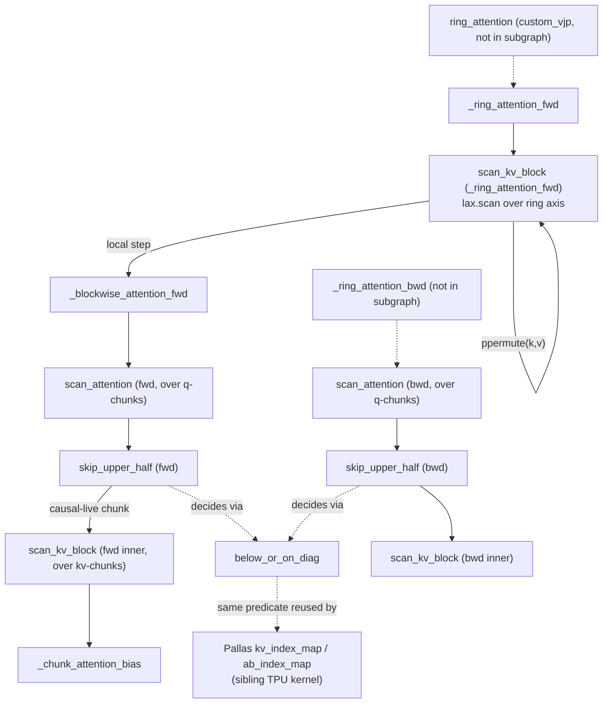

# Ring Attention — pure-JAX reference (blockwise attention + causal skip)

<!-- connect:up:begin -->
> **Cross-repo concept:** part of [ring-attention](../../../concepts/ring-attention.md) across this wiki's repos.
<!-- connect:up:end -->
## Overview
This module is the non-Pallas twin of the [TPU Pallas ring-attention kernel](ringattention-ringattention_pallas_tpu.md):
it implements the same ring-communication idea (rotate K/V shards around a device ring
with `lax.ppermute` while accumulating an online softmax) but computes each local
attention step with plain `jnp.einsum`s inside a `lax.scan`, guarded by
`jax.checkpoint` for rematerialization, instead of a hand-written kernel. It is the
reference/portable path — usable on any backend JAX supports, not just TPU — and it is
where the causal below-diagonal skip predicate ([`below_or_on_diag`](../catalog/ringattention/ringattention_jax.md#below_or_on_diag))
that the Pallas module imports is actually defined.

> [!inferred] The module's top-level public entry point (`ring_attention`, wrapping
> `_ring_attention_fwd`/`_ring_attention_bwd` as a `jax.custom_vjp` pair, mirroring
> `ring_flash_attention_tpu` in the Pallas module) and the backward counterpart
> `_blockwise_attention_bwd` are not themselves nodes in this packet's cited subgraph
> (only their nested closures are — see Mechanism below), so their outer signatures
> are described here from direct source reading rather than a `cite:` link.

## Diagram

## Design rationale (why it's built this way)
- **`below_or_on_diag` is the single source of truth for causal skipping, shared across both implementations.** [`below_or_on_diag`](../catalog/ringattention/ringattention_jax.md#below_or_on_diag) takes a query block position/size and a key block position/size plus a `causal_block_size`, and answers "is this whole block on-or-below the diagonal" using integer division rather than comparing every element — a block is live if `(r+1)*causal_block_size_q - 1 > c*causal_block_size_k`. The Pallas module imports this exact function (it does not redefine the predicate) and reuses it inside `BlockSpec` `index_map` closures such as [`kv_index_map`](../catalog/ringattention/ringattention_pallas_tpu.md#_flash_attention_impl.kv_index_map) and [`ab_index_map`](../catalog/ringattention/ringattention_pallas_tpu.md#_flash_attention_impl.ab_index_map) — so the causal geometry is defined once and consumed by two structurally different skip mechanisms (see next point).
- **Two different skip mechanisms for the same predicate.** In this pure-JAX path, [`skip_upper_half`](../catalog/ringattention/ringattention_jax.md#_blockwise_attention_fwd.scan_attention.skip_upper_half) wraps the real per-kv-chunk work in `jax.lax.cond`/`lax.cond`, so a skipped chunk still exists in the `lax.scan`'s trace but its body is replaced with a cheap zero-fill — this is a *compute* skip only (JAX/XLA still allocates the iteration). In the Pallas module the equivalent decision instead redirects the `BlockSpec` `index_map` to reuse block 0, skipping the *DMA* as well. The pure-JAX version can afford to be cheaper about this because it never leaves the XLA/HLO level, whereas the Pallas kernel is manually staging its own memory transfers.
- **`jax.checkpoint` on the innermost scan, not the outer ring loop.** Both [`scan_kv_block` in the forward blockwise pass](../catalog/ringattention/ringattention_jax.md#_blockwise_attention_fwd.scan_attention.scan_kv_block) and [its backward counterpart](../catalog/ringattention/ringattention_jax.md#_blockwise_attention_bwd.scan_attention.scan_kv_block) are decorated `@partial(jax.checkpoint, prevent_cse=prevent_cse, policy=policy)` — rematerializing the attention-weight matmul for each kv-chunk on the backward pass rather than storing every chunk's activations. Because this sits at the *innermost* scan (per kv-chunk within a q-chunk within a ring step), the rematerialization granularity is fine: only one chunk's intermediate activations are ever live at once, keeping peak memory close to `O(chunk_size²)` instead of `O(seq_len²)`.
- **Numerically-stable two-pass softmax accumulation, done per q-chunk rather than online-per-kv-block like the Pallas kernel.** [`_blockwise_attention_fwd`](../catalog/ringattention/ringattention_jax.md#_blockwise_attention_fwd)'s inner [`scan_kv_block`](../catalog/ringattention/ringattention_jax.md#_blockwise_attention_fwd.scan_attention.scan_kv_block) carries `(numerator_chunk, denominator_chunk, prev_max_score_chunk)` and rescales the numerator by `exp(prev_max - new_max)` on every kv-chunk — algebraically the same flash-attention recurrence as the Pallas kernel's `m_scratch_ref`/`l_scratch_ref`/`acc_scratch_ref`, just expressed as scan carry instead of Pallas scratch refs, since there is no manual VMEM management to do here.

## Entry points
- [`_blockwise_attention_fwd`](../catalog/ringattention/ringattention_jax.md#_blockwise_attention_fwd) — the per-ring-step local-attention routine. Control reaches it once per ring rotation, called with the accumulator carry `(numerator, denominator, max_score)` from the enclosing ring scan; it reshapes `q,k,v` into `(num_chunks, chunk_size, ...)` tiles and runs the two-level (q-chunk outer, kv-chunk inner) scan described in Mechanism.
- [`scan_kv_block`](../catalog/ringattention/ringattention_jax.md#_ring_attention_fwd.scan_kv_block) — the outer ring-communication step (defined inside `_ring_attention_fwd`, not itself a separate top-level export). Each invocation picks the currently-resident K/V shard (owned by device `(axis_index - idx) % axis_size`), calls `_blockwise_attention_fwd` on it, then `lax.ppermute`s K/V to the next ring neighbor — this is the outermost loop a caller's `shard_map`-wrapped ring-attention call actually drives.

## Mechanism (step-by-step)
1. The outer ring loop — [`scan_kv_block`](../catalog/ringattention/ringattention_jax.md#_ring_attention_fwd.scan_kv_block) — runs once per device in the ring (`axis_size` steps). At each step it derives which remote shard of K/V is locally resident (`k_block_idx = (axis_index - idx) % axis_size`) and calls [`_blockwise_attention_fwd`](../catalog/ringattention/ringattention_jax.md#_blockwise_attention_fwd) to fold that shard's contribution into the running `(numerator, denominator, max_score)` carry, then rotates K/V one hop around the ring.
2. Inside `_blockwise_attention_fwd`, the local q/k/v are reshaped into `(num_chunks, chunk_size, heads, dim)` tiles and moved so the chunk axis is leading; a further [`scan_attention`](../catalog/ringattention/ringattention_jax.md#_blockwise_attention_fwd.scan_attention) scans over q-chunks.
3. For each q-chunk, [`skip_upper_half`](../catalog/ringattention/ringattention_jax.md#_blockwise_attention_fwd.scan_attention.skip_upper_half) scans over kv-chunks and, for every one, asks [`below_or_on_diag`](../catalog/ringattention/ringattention_jax.md#below_or_on_diag) whether this (q-chunk, kv-chunk, ring-step) triple is causally reachable; if not, `lax.cond` substitutes a no-op that passes the carry through unchanged (rather than running the real math).
4. When a chunk pair is live, the wrapped [`scan_kv_block`](../catalog/ringattention/ringattention_jax.md#_blockwise_attention_fwd.scan_attention.scan_kv_block) (checkpointed) computes `attn_weights = einsum('bqhd,bkhd->bhqk', ...) / scale`, adds a bias term from [`_chunk_attention_bias`](../catalog/ringattention/ringattention_jax.md#_chunk_attention_bias) (which folds in an optional dense bias tensor, segment-id masking, the causal mask itself, and dropout — all as additive `-inf`-like penalties into one `chunk_bias`), then performs the online-softmax update: new running max, rescaled numerator/denominator, and the `exp_values = einsum('bhqk,bkhd->bqhd', ...)` contribution.
5. On the backward pass, the mirror structure repeats with [`scan_attention` (bwd)](../catalog/ringattention/ringattention_jax.md#_blockwise_attention_bwd.scan_attention) driving q-chunks, [`skip_upper_half` (bwd)](../catalog/ringattention/ringattention_jax.md#_blockwise_attention_bwd.scan_attention.skip_upper_half) applying the identical `below_or_on_diag` causal gate (substituting zero `dk_chunk`/`dv_chunk` for skipped pairs instead of passing carry through unchanged, since gradients must sum to zero rather than pass-through), and the checkpointed inner [`scan_kv_block` (bwd)](../catalog/ringattention/ringattention_jax.md#_blockwise_attention_bwd.scan_attention.scan_kv_block) recomputing `attn_weights`/`exp_weights` from the saved `denominator_chunk`/`max_score_chunk` to derive `dq_chunk`, `dk_chunk`, `dv_chunk` via three more `einsum`s.

## Key data structures
- The ring-scan carry `(numerator, denominator, max_score, k, v)` (forward) / `(dq, dk, dv, k, v)` (backward) — plain JAX arrays, not Pallas refs; `k,v` (and `dk,dv` on the backward pass) are the parts that get `lax.ppermute`d each ring step, while the softmax/gradient accumulators persist across ring steps without needing to move.
- The blockwise-scan carry `(numerator_chunk, denominator_chunk, max_score_chunk)` inside [`scan_kv_block`](../catalog/ringattention/ringattention_jax.md#_blockwise_attention_fwd.scan_attention.scan_kv_block) — the online-softmax state at chunk granularity, algebraically identical to the Pallas kernel's `(acc_scratch_ref, l_scratch_ref, m_scratch_ref)` but expressed as a functional scan carry.
- `chunk_bias` produced by [`_chunk_attention_bias`](../catalog/ringattention/ringattention_jax.md#_chunk_attention_bias) — a single additive tensor into which dense bias, segment-id mask, causal mask, and dropout mask are all folded via `jnp.minimum` (each penalty term uses `jnp.finfo(dtype).min` to represent "masked"), so the attention-weight computation only ever needs one add.

## Dynamics (design intent)
The nesting is three scans deep by design: outer ring rotation (`scan_kv_block` in `_ring_attention_fwd`, one iteration per device) → q-chunk scan (`scan_attention`) → kv-chunk scan (`skip_upper_half`/inner `scan_kv_block`, checkpointed). Only the innermost scan is checkpointed, which bounds rematerialization cost to one chunk's worth of activations per backward replay rather than the whole sequence. The causal skip via `lax.cond` inside `skip_upper_half` means the *trace* still contains every kv-chunk iteration (unlike the Pallas kernel's DMA-level elision) — the savings here are purely in avoided FLOPs/HBM-bandwidth for the masked-out einsums, not in avoided data movement, since this path has no manual memory management to skip.

## Edge cases
- `_chunk_attention_bias`'s causal-mask branch computes `query_idx // causal_block_size` and `key_idx // causal_block_size` as whole-block indices, then compares them directly — this only produces a valid mask when `causal_block_size` evenly divides both `query_chunk_size` and `key_chunk_size` (the same constraint the Pallas module enforces via asserts, but this module does not appear to assert it explicitly).
- Dropout (`attn_pdrop > 0.0`) generates a full `(batch, num_heads, q_len, kv_len)` Bernoulli mask up front in `_blockwise_attention_fwd`/`_blockwise_attention_bwd` before any chunking — this is the one place the implementation is not chunk-incremental, so dropout materializes an `O(seq_len²)` mask even though attention itself never does.

## Open questions
> [!inferred] `_ring_attention_fwd`/`_ring_attention_bwd`/`ring_attention`/`_blockwise_attention_bwd` are not present as directly-citable symbols in this packet's subgraph (their nested closures are, and are cited above) — raised here rather than inventing catalog links for them.
- Whether `float32_logits` upcasting (present in the Pallas module's forward function) has an equivalent in this pure-JAX path, or whether this reference implementation always runs attention-score matmuls at the input dtype, is not resolvable from the cited subgraph alone.

## See also
- [Ring Flash Attention — TPU Pallas kernel](ringattention-ringattention_pallas_tpu.md) — the Pallas/Mosaic implementation that imports `below_or_on_diag` from this module and reuses the identical causal-block predicate inside `BlockSpec` index-map closures instead of `lax.cond`.
