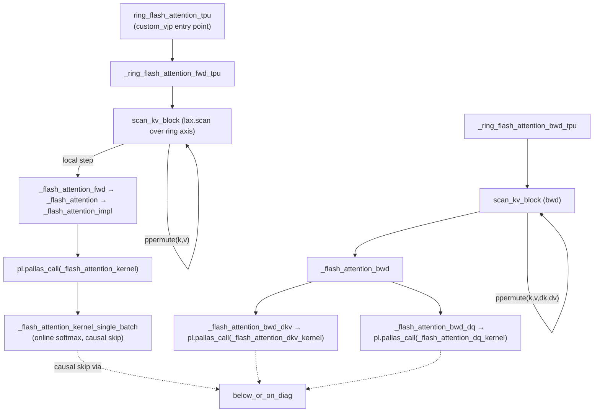

# Ring Flash Attention — TPU Pallas kernel

## Overview
This module fuses two ideas into one differentiable op: **FlashAttention's online-softmax
recurrence** (never materializing the full attention matrix) and **ring attention's
device-to-device K/V rotation** (so a sequence sharded across an axis can attend to the
whole sequence without ever holding the full K/V on one device). The forward pass is a
`lax.scan` over ring steps, and at each step the *local* flash-attention math runs as a
hand-written Pallas/Mosaic kernel — three separate `pallas_call`s exist: one for the
forward pass, and two for the backward pass (`dK,dV` and `dQ` are computed by different
kernels because they contract over different grid axes). The whole thing is wired into
JAX's autodiff via `jax.custom_vjp`, because the kernel-level backward math cannot be
derived by tracing through Pallas.

## Diagram

## Design rationale (why it's built this way)
- **Two-level blocking (`block_k_major` vs `block_k`).** [`BlockSizes`](../catalog/ringattention/ringattention_pallas_tpu.md#BlockSizes) exposes both a "major" size — the tile a Pallas `BlockSpec` DMAs into VMEM for one grid step — and a "minor" size that [`_flash_attention_kernel_single_batch`](../catalog/ringattention/ringattention_pallas_tpu.md#_flash_attention_kernel_single_batch) iterates over internally with an unrolled `fori_loop`. This decouples the memory-transfer granularity (how much K/V the DMA engine fetches per grid step, sized for pipelining/double-buffering) from the softmax-update granularity (how finely the running max/sum is refreshed), letting the same kernel trade VMEM pressure against recompute.
- **`PatchBlockSpec` is a compatibility shim, not a feature.** [`PatchBlockSpec`](../catalog/ringattention/ringattention_pallas_tpu.md#PatchBlockSpec) subclasses `pl.BlockSpec` purely to swap the constructor's positional-argument order ("Handle the arg re-order" comment) — evidence this kernel was written against an older/different Pallas `BlockSpec` signature than the one currently upstream, and every `BlockSpec` construction in the file goes through it instead of the base class.
- **Causal skip is done at the `index_map` level, not the grid level.** Pallas's grid dimensions here are declared `"parallel"` for batch/head/major-seq and `"arbitrary"` for the reduction axis (`compiler_params=dict(mosaic=dict(dimension_semantics=(...)))` in [`_flash_attention_impl`](../catalog/ringattention/ringattention_pallas_tpu.md#_flash_attention_impl)); the grid itself always iterates every index. Instead, [`kv_index_map`](../catalog/ringattention/ringattention_pallas_tpu.md#_flash_attention_impl.kv_index_map) redirects a skippable KV block's fetch index back to block `0` (via [`below_or_on_diag`](../catalog/ringattention/ringattention_jax.md#below_or_on_diag)), so Pallas's revisiting logic sees "same block as last time" and skips the DMA, and the kernel body wraps the actual FLOPs in `pl.when(should_run)` so the compute is skipped too. This is the standard block-sparse-causal trick, applied twice (DMA elision + compute elision) rather than trying to shrink the grid dynamically.
- **Separate kernels for `dK,dV` vs `dQ`.** [`_flash_attention_bwd_dkv`](../catalog/ringattention/ringattention_pallas_tpu.md#_flash_attention_bwd_dkv) accumulates over the *q* dimension (contraction axis for dK/dV) so its grid puts `kv` as the outer/parallel axis and `q` as the inner/arbitrary (accumulating) axis; [`_flash_attention_bwd_dq`](../catalog/ringattention/ringattention_pallas_tpu.md#_flash_attention_bwd_dq) is the mirror image — `q` outer, `kv` inner/accumulating — because `dQ` accumulates over kv. Fusing both into one kernel would force one of the two accumulators to live in the "wrong" grid position.
- **`custom_vjp` instead of relying on autodiff through Pallas.** [`ring_flash_attention_tpu`](../catalog/ringattention/ringattention_pallas_tpu.md#ring_flash_attention_tpu) registers `_ring_flash_attention_fwd_tpu`/`_ring_flash_attention_bwd_tpu` as an explicit VJP pair. [`_flash_attention_bwd`](../catalog/ringattention/ringattention_pallas_tpu.md#_flash_attention_bwd)'s docstring states it is the "VJP rule for FlashAttention", and it raises `NotImplementedError("Higher-order AD not supported")` if asked to save residuals for a second differentiation — the backward math (recomputing `p` from saved `l`,`m` and redoing the two matmuls) is hand-derived once, not composed automatically.
- **128-wide broadcasting of scalar-per-row statistics.** [`MIN_BLOCK_SIZE`](../catalog/ringattention/ringattention_pallas_tpu.md#MIN_BLOCK_SIZE) `= 128` and [`NUM_LANES`](../catalog/ringattention/ringattention_pallas_tpu.md#NUM_LANES) `= 128` reflect the TPU vector unit's native lane width; running softmax stats (`l`, `m`, `di`) are logically one scalar per query row but get `jnp.broadcast_to(..., MIN_BLOCK_SIZE)`'d before entering the kernel so they occupy a full VPU tile rather than triggering inefficient sub-lane operations — `pltpu.repeat` is then used inside the kernel to re-broadcast them against `block_k`-wide score tiles.

## Entry points
- [`ring_flash_attention_tpu`](../catalog/ringattention/ringattention_pallas_tpu.md#ring_flash_attention_tpu) — the public, differentiable op (`jax.custom_vjp`, `nondiff_argnums=[6,7,8]` for `axis_name`/`float32_logits`/`blockwise_kwargs`). Callers invoke this inside a `shard_map` over a sequence-sharded axis; it is the sole entry point a model's attention layer would call.
- [`_flash_attention_impl`](../catalog/ringattention/ringattention_pallas_tpu.md#_flash_attention_impl) — where the single ring-step forward `pallas_call` is actually assembled (grid, `BlockSpec`s, scratch shapes). Control reaches it once per ring step, from inside the `lax.scan`.
- [`_flash_attention_bwd_dkv`](../catalog/ringattention/ringattention_pallas_tpu.md#_flash_attention_bwd_dkv) / [`_flash_attention_bwd_dq`](../catalog/ringattention/ringattention_pallas_tpu.md#_flash_attention_bwd_dq) — the two backward `pallas_call` sites, both reached once per ring step from [`_flash_attention_bwd`](../catalog/ringattention/ringattention_pallas_tpu.md#_flash_attention_bwd).

## Mechanism (step-by-step)
1. `ring_flash_attention_tpu` rearranges `q,k,v` from `b q h d` to `b h q d` and calls [`_ring_flash_attention_fwd_tpu`](../catalog/ringattention/ringattention_pallas_tpu.md#_ring_flash_attention_fwd_tpu), which builds a per-call [`BlockSizes`](../catalog/ringattention/ringattention_pallas_tpu.md#BlockSizes) instance where every block size equals the caller-supplied `query_chunk_size`/`key_chunk_size` — i.e. one Pallas grid tile per logical attention chunk, no further sub-blocking at this layer.
2. The ring loop itself is a `lax.scan` — [`scan_kv_block`](../catalog/ringattention/ringattention_pallas_tpu.md#_ring_flash_attention_fwd_tpu.scan_kv_block) — over `axis_size` steps (the number of devices sharing the sequence axis). At step `idx`, the K/V currently resident locally belong to device `(axis_index - idx) % axis_size`; the kernel computes local attention against them via [`_flash_attention_fwd`](../catalog/ringattention/ringattention_pallas_tpu.md#_flash_attention_fwd), then rotates K/V to the next device with `lax.ppermute` before the next scan step — this is the entire ring-attention trick: the compute of step `idx` and the communication that produces step `idx+1`'s inputs are independent, so XLA can overlap them.
3. `_flash_attention_fwd` → `_flash_attention` → `_flash_attention_impl` unpack the `BlockSizes` dataclass into scalar block args and assert `block_k_major == block_k` at the forward-only call site (the two-level split only diverges for the backward kernels, [`_flash_attention_bwd_dkv`](../catalog/ringattention/ringattention_pallas_tpu.md#_flash_attention_bwd_dkv)/[`_flash_attention_bwd_dq`](../catalog/ringattention/ringattention_pallas_tpu.md#_flash_attention_bwd_dq), where major and minor differ).
4. Inside the kernel, [`_flash_attention_kernel_single_batch`](../catalog/ringattention/ringattention_pallas_tpu.md#_flash_attention_kernel_single_batch) is the online-softmax core: on the first kv grid step (`kv_seq_idx == 0`) it seeds `m_scratch_ref`/`l_scratch_ref`/`acc_scratch_ref` from the carried-in `carry=(acc,l,m)`; on every step it checks [`below_or_on_diag`](../catalog/ringattention/ringattention_jax.md#below_or_on_diag) to decide whether this (q-tile, kv-tile) pair is causally live, computes `s = q·kᵀ` via `jax.lax.dot_general`, folds in the optional attention-bias tile and segment-id mask, updates the running max/sum (`m_next`, `l_next`, rescaling the existing accumulator by `l_corr * l_next_inv_safe`), and accumulates `p·v` into `acc_scratch_ref`; on the last kv step it flushes `acc_scratch_ref`/`l_scratch_ref`/`m_scratch_ref` to the actual outputs.
5. On the backward side, `_ring_flash_attention_bwd_tpu` runs the mirror-image ring scan, but each step now calls [`_flash_attention_bwd`](../catalog/ringattention/ringattention_pallas_tpu.md#_flash_attention_bwd) which recomputes `di = sum(o*do)` then dispatches to the two separate kernels: [`_flash_attention_bwd_dkv`](../catalog/ringattention/ringattention_pallas_tpu.md#_flash_attention_bwd_dkv) (grid ordered `kv` outer, `q` inner so `dk_scratch_ref`/`dv_scratch_ref` accumulate across the inner q loop, reset via `start_new_sequence` at `q_seq_index==0`) and [`_flash_attention_bwd_dq`](../catalog/ringattention/ringattention_pallas_tpu.md#_flash_attention_bwd_dq) (grid ordered `q` outer, `kv` inner, `dq_scratch_ref` accumulating over kv, flushed at the last kv step). Both k/v (and now dk/dv) are then `ppermute`'d to the next device for the next ring step, so gradients accumulate correctly as each device eventually sees every kv shard.

## Key data structures
- [`BlockSizes`](../catalog/ringattention/ringattention_pallas_tpu.md#BlockSizes) — frozen dataclass holding every block-size knob for fwd + both bwd kernels ([`block_q`](../catalog/ringattention/ringattention_pallas_tpu.md#BlockSizes.block_q), [`block_k`](../catalog/ringattention/ringattention_pallas_tpu.md#BlockSizes.block_k), [`block_k_major`](../catalog/ringattention/ringattention_pallas_tpu.md#BlockSizes.block_k_major), [`block_b`](../catalog/ringattention/ringattention_pallas_tpu.md#BlockSizes.block_b), plus the `*_dkv`/`*_dq` variants). Its `__post_init__` enforces that every "major" size evenly divides its "minor" counterpart, and `has_backward_blocks` gates whether backward is even possible (raised as a `ValueError` in `_flash_attention_bwd` if not all backward blocks were supplied).
- [`SegmentIds`](../catalog/ringattention/ringattention_pallas_tpu.md#SegmentIds) — a `NamedTuple` of ([`q`](../catalog/ringattention/ringattention_pallas_tpu.md#SegmentIds.q), [`kv`](../catalog/ringattention/ringattention_pallas_tpu.md#SegmentIds.kv)) id arrays; tokens only attend within the same segment id, letting packed/concatenated sequences share a batch row without cross-attending.
- Scratch refs (`m_scratch_ref`, `l_scratch_ref`, `acc_scratch_ref` in fwd; `dk_scratch_ref`/`dv_scratch_ref` in bwd-dkv; `dq_scratch_ref` in bwd-dq) — the actual online-softmax/gradient-accumulation state, living in VMEM across the "arbitrary" grid dimension's steps, reset at the start of each new outer-loop pass and flushed to the real output only at the last step.

## Dynamics (design intent)
The `mosaic=dict(dimension_semantics=("parallel","parallel","parallel","arbitrary"))` compiler param on every `pallas_call` tells Mosaic that the batch/head/major-seq grid axes are independent (safe to pipeline/double-buffer/reorder), while the last axis is a strict sequential reduction — this is what licenses keeping running accumulators in scratch refs rather than in the output buffer directly. The outer ring `lax.scan` (over `axis_size` steps) is a second, coarser-grained sequential loop layered on top: each of its steps is one full Pallas grid dispatch, and the `lax.ppermute` at the end of each step is where the ring's device-to-device communication happens — the entire performance argument for ring attention is that this permute (transferring one shard of K/V to the ring-neighbor) can overlap with the *next* step's local flash-attention compute, since the two are already scheduled as consecutive-but-independent scan iterations.

## Edge cases
- `block_k != kv_seq_len` is treated as the only supported path — the `else` branch that would skip scratch buffers entirely is guarded by `assert False` (dead code kept for documentation of the alternative, not reachable).
- `causal_block_size` interacts with block sizes via two asserts in [`_flash_attention_impl`](../catalog/ringattention/ringattention_pallas_tpu.md#_flash_attention_impl): `causal_block_size` must evenly divide (or be divided by) both `block_q` and `block_k` — mixed granularities between the causal mask and the tiling are not supported.
- [`_verify_block`](../catalog/ringattention/ringattention_pallas_tpu.md#_verify_block) is called defensively before every kernel dispatch to assert block ≤ dim and (usually) dim % block == 0; `should_divide=False` is used only for the batch and forward-q dimensions, which can be ragged.
- Attention bias (`ab`) is repeated along the q-block axis (`ab[:, None].repeat(block_q, axis=1)`) before being handed to Pallas, since the bias tensor's native shape doesn't carry a query-chunk dimension — this materializes a larger intermediate than the logical bias.

## Open questions
> [!inferred] The file has no accompanying tests in this repo (only 4 source files total, no `test/` directory), so the "Dynamics" claims above about overlap between `ppermute` and compute are the *design intent* read from the code structure, not a profiled/observed fact.
- Why does `_flash_attention_kernel` special-case `block_k == kv_seq_len` with `assert False` instead of removing the dead `_flash_attention_kernel_single_batch_single_step` branch — is single-step (non-tiled softmax) mode planned but unfinished?

## See also
- [Ring Attention — pure-JAX reference / blockwise attention](ringattention-ringattention_jax.md) — the non-Pallas twin of this module; shares `below_or_on_diag` and the same ring-communication shape but computes the local step with plain `einsum`s under `lax.scan`/`jax.checkpoint` instead of a Pallas kernel.
