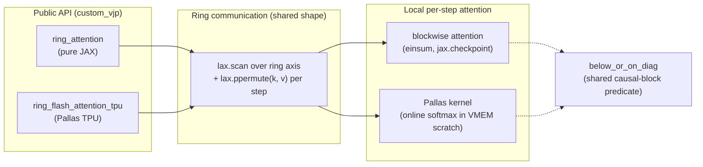

# ringattention — what it is and how it fits together

## In one paragraph
`ringattention` is a small, standalone JAX library implementing **ring attention** — the
technique that lets a Transformer attend over a sequence sharded across multiple devices
by rotating K/V shards around a device ring (`lax.ppermute`) while each device
incrementally folds in its currently-resident shard via an online-softmax (flash
attention) recurrence, so the full attention matrix is never materialized and no device
ever needs the whole sequence's K/V locally. The library ships the same algorithm twice:
a portable pure-JAX reference implementation (`einsum`s under `lax.scan`/`jax.checkpoint`)
and a TPU-specific Pallas/Mosaic kernel implementation — both expose a `jax.custom_vjp`
entry point and share one causal-skip predicate.

## Core architecture

## Main concepts
### Ring communication loop
Both implementations wrap the same shape of loop: a `lax.scan` over `axis_size` steps
(one per device sharing the sequence axis), where each step attends locally against the
K/V shard currently resident, then rotates K/V to the next ring neighbor with
`lax.ppermute` before the next step. The performance argument for ring attention is that
this permute overlaps with the *next* step's local compute. See
[Ring Flash Attention — TPU Pallas kernel](concepts/ringattention-ringattention_pallas_tpu.md)
and [Ring Attention — pure-JAX reference](concepts/ringattention-ringattention_jax.md).

### Two implementations of the same algorithm
The **pure-JAX path** (`ringattention_jax.py`) computes local attention with
`jnp.einsum`s inside a checkpointed `lax.scan`, portable to any JAX backend. The **Pallas
TPU path** (`ringattention_pallas_tpu.py`) hand-writes the local attention as a Mosaic
kernel with three separate `pallas_call`s (forward, and two backward kernels split by
which axis they contract over), manually managing VMEM scratch for the online-softmax
accumulators. Both are algebraically the same flash-attention recurrence; the split
exists because Pallas requires manual memory staging that plain JAX/XLA does not.

### Shared causal-skip predicate
`below_or_on_diag` — defined once in the pure-JAX module — decides whether a
(query-block, key-block) pair is causally live. Each implementation applies it
differently: the pure-JAX path wraps the real computation in `lax.cond` (a compute-only
skip, still traced), while the Pallas path redirects `BlockSpec` `index_map`s to reuse
block 0 for skipped pairs (skipping the DMA as well as the compute). See the Design
rationale sections of both concept pages for the detailed contrast.

### `custom_vjp`-based differentiation
Both `ring_attention` and `ring_flash_attention_tpu` register explicit forward/backward
function pairs via `jax.custom_vjp` rather than relying on JAX to differentiate through
the ring `lax.scan` (and, on the Pallas side, through a hand-written kernel) directly.
The backward pass mirrors the forward ring rotation, recomputing the softmax terms from
saved residuals (`l`, `m` on the Pallas side; `denominator`, `max_score` on the pure-JAX
side) rather than storing full attention-weight tensors.

## How a request flows
A caller inside a `shard_map`-sharded sequence axis calls either `ring_attention` or
`ring_flash_attention_tpu` with `q, k, v` already sharded along that axis, plus chunk-size
and causal-block-size configuration in `blockwise_kwargs`/`BlockSizes`. The ring scan then
runs `axis_size` steps, at each step attending against the currently-resident K/V shard
(local attention computed per the two concept pages above) and rotating K/V to the next
device. On the backward pass, the same ring rotation replays in the same order, computing
gradients incrementally and rotating `dk`/`dv` alongside `k`/`v` so every device
eventually accumulates the gradient contribution from every kv shard.

## Map of the wiki
- Read [Ring Flash Attention — TPU Pallas kernel](concepts/ringattention-ringattention_pallas_tpu.md)
  for the TPU-specific kernel mechanics (BlockSpec index-map skipping, two-level
  blocking, the dK/dV vs dQ kernel split).
- Read [Ring Attention — pure-JAX reference](concepts/ringattention-ringattention_jax.md)
  for the portable implementation and the `below_or_on_diag`/`lax.cond` causal-skip
  mechanism.
- See `catalog/` for the exhaustive per-module symbol index, and `index.md` for the
  concept table.
