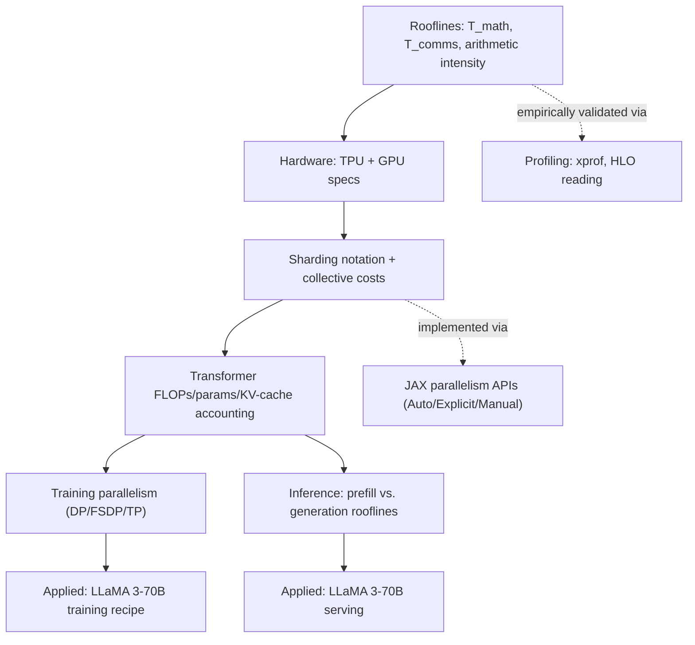

# scaling-book — what it is and how it fits together

## In one paragraph

scaling-book is the Jekyll source for *How to Scale Your Model: A Systems View of LLMs on TPUs*
(Google DeepMind, 2025) — a reference textbook, not a code library
([README.md](sources/README.md)). Its central thesis is that model-scaling performance reduces to a
small set of roofline calculations (FLOPs vs. bytes moved, at whatever bandwidth tier is relevant —
HBM, ICI, PCIe, DCN), applied consistently from a single matmul up through full-pod training and
serving ([index.md](sources/index.md)). Twelve substantive chapters build one continuous argument:
rooflines → hardware (TPU, then GPU) → sharding notation/collectives → Transformer FLOPs/memory
accounting → training parallelism → applied training (LLaMA 3) → inference → applied inference
(LLaMA 3 serving) → profiling → JAX programming model — each chapter's formulas feeding directly
into the next.

## Core structure

## Main topics

**Everything reduces to $\max(T_\text{math}, T_\text{comms})$ and a critical arithmetic
intensity.** The ~240-token critical batch size for TPU v5e bf16 matmuls is the single most-reused
number in the book, recurring in training (minimum batch for compute-bound FSDP/TP), inference
(minimum *total* batch across concurrent requests for compute-bound generation), and quantization
analysis. See [Rooflines and arithmetic intensity](topics/rooflines-and-arithmetic-intensity.md).

**TPUs are simple (1-2 big TensorCores + nearest-neighbor ICI torus); GPUs are modular (100+ small
SMs + switched NVLink fat-tree).** This structural difference explains why TPUs more easily hit
roofline with less kernel tuning, and why their sharding/collective cost models differ (ring-hop-count
vs. switched-fabric-egress). See [TPU hardware architecture](topics/tpu-hardware-architecture.md)
and [GPU hardware architecture and GPU-vs-TPU](topics/gpu-hardware-and-gpu-vs-tpu.md).

**A named-axis sharding notation ($A[I_X,J]$) reduces every sharded matmul to one of 4 cases, each
with a mechanical collective-communication rule.** AllGather, ReduceScatter, AllReduce, and AllToAll
costs are all derived from the same roofline model applied to the ICI ring, and AllGather/
ReduceScatter are forward/backward-pass duals of each other. See [Sharding notation and collective
communication](topics/sharding-notation-and-collectives.md).

**Transformer FLOPs/params collapse to $6\cdot\text{params}\cdot\text{tokens}$, with attention only
dominating once $T > 8D$.** This single inequality, plus the $2SLKH$ KV-cache-size formula, are the
quantitative inputs every training and inference cost model in the book consumes. See [Transformer
FLOPs and memory accounting](topics/transformer-flops-and-memory-accounting.md).

**Training parallelism has closed-form communication-bound thresholds for DP/FSDP/TP, worked
through to a concrete LLaMA 3-70B recipe (1024-way DP × 2-way sequence-parallel × 4-way
tensor-parallel on a full TPU v5p pod).** See [Training parallelism
strategies](topics/training-parallelism-strategies.md).

**Inference splits into compute-bound prefill and memory-bandwidth-bound generation, which want
opposite sharding strategies — this is why production serving systems disaggregate prefill and
generation onto separate server pools.** LLaMA 3-70B serving is shown to be KV-cache-memory-bandwidth-bound
in nearly every realistic configuration. See [Inference serving, latency and
throughput](topics/inference-serving-latency-throughput.md).

**JAX exposes the sharding notation through three escalating-explicitness APIs: Auto (`jax.jit`,
compiler infers everything), Explicit (sharding-in-types, ambiguity is a trace-time error), and
Manual (`jax.shard_map`, every collective hand-written).** See [JAX parallelism programming
model](topics/jax-parallelism-programming-model.md).

**Every roofline prediction in the book is empirically checkable against a real xprof/TensorBoard
trace, down to reading individual HLO op annotations (shape, tiling, memory space).** The book's own
worked example predicts 95.6ms and measures 96ms for a sharded FFW matmul. See [Profiling methodology
and reading XLA/HLO](topics/profiling-methodology-and-hlo.md).

## How the chapters build on each other

Rooflines (Part 1) establish the cost model; TPU and GPU hardware chapters (Parts 2, 12) supply the
concrete FLOPs/bandwidth numbers; sharding (Part 3) derives collective-communication costs from the
same model. Transformer accounting (Part 4) turns a model architecture into FLOPs/params/KV-cache
formulas. Training (Part 5) and its applied LLaMA 3 worked example (Part 6) combine sharding costs
with Transformer accounting to derive parallelism recipes; inference (Part 7) and its applied LLaMA 3
serving example (Part 8) do the same for the opposite (memory-bandwidth-bound generation) regime.
Profiling (Part 9) and JAX programming (Part 10) are the practical "how do I actually measure/
implement this" closing chapters.

## Map of the wiki

- "How do I tell if my kernel/model is compute-bound or memory-bound?" →
  [Rooflines and arithmetic intensity](topics/rooflines-and-arithmetic-intensity.md).
- "What are the actual TPU/GPU hardware numbers (FLOPs, bandwidth, memory)?" →
  [TPU hardware architecture](topics/tpu-hardware-architecture.md),
  [GPU hardware architecture and GPU-vs-TPU](topics/gpu-hardware-and-gpu-vs-tpu.md).
- "What collective does my sharded matmul need, and how much does it cost?" →
  [Sharding notation and collective communication](topics/sharding-notation-and-collectives.md).
- "How many FLOPs/params/KV-cache bytes does my Transformer use?" →
  [Transformer FLOPs and memory accounting](topics/transformer-flops-and-memory-accounting.md).
- "What parallelism strategy should I use for training at a given scale?" →
  [Training parallelism strategies](topics/training-parallelism-strategies.md).
- "How do I think about serving cost/latency/throughput tradeoffs?" →
  [Inference serving, latency and throughput](topics/inference-serving-latency-throughput.md).
- "How does JAX actually implement sharding, and how do I control it?" →
  [JAX parallelism programming model](topics/jax-parallelism-programming-model.md).
- "How do I read an xprof trace or an HLO op?" →
  [Profiling methodology and reading XLA/HLO](topics/profiling-methodology-and-hlo.md).
- For the full per-doc landing pages, see [`sources/`](sources/); for the assembled index, see
  `index.md`.
