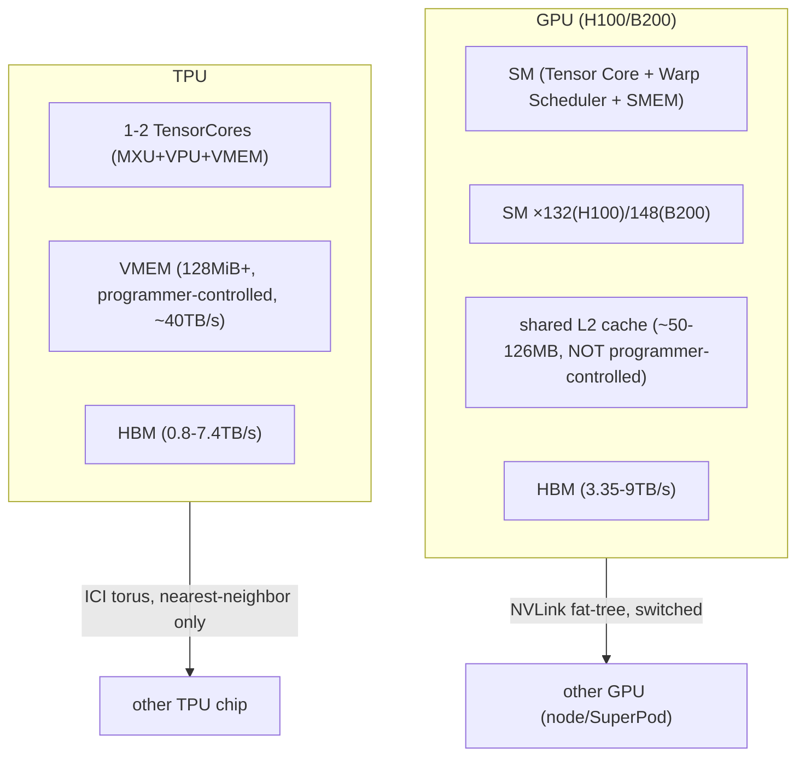

# GPU hardware architecture and GPU-vs-TPU

## Overview

A modern GPU (H100, B200) is built from ~100+ independent Streaming Multiprocessors (SMs), each
with its own Tensor Core, Warp Scheduler (CUDA cores), and SMEM — the modular, many-small-cores
analog of a TPU's 1-2 large TensorCores
([what is a gpu](src:gpus.md#what-is-a-gpu)). GPUs are networked via a switched NVLink fat-tree
(near-uniform bandwidth between any two GPUs within a node) rather than a TPU's nearest-neighbor
torus, trading TPU's cost/scalability advantage for GPU's more flexible, "just works" programming
model that leans less on compiler quality
([networking](src:gpus.md#networking)).

## Diagram

## Key results

**GPU's L2 cache is the closest analog to TPU's VMEM, but it is much slower and not
programmer-controlled** — TPU VMEM is 2x larger than an H100's L2 *and* has roughly 8x the
bandwidth (~40TB/s vs. ~5.5TB/s measured), while GPU's L2 usage pattern is opaque, hardware-managed
"spooky action at a distance" that requires the programmer to shape access patterns indirectly
([summary-of-gpu-specs](src:gpus.md#summary-of-gpu-specs)). This is the single biggest reason TPUs
can reliably hit closer-to-peak roofline performance with less kernel-tuning effort than GPUs, per
[TPU hardware architecture](tpu-hardware-architecture.md)'s VMEM-prefetching discussion.

**The 1:1 component mapping (SM↔TensorCore, Warp Scheduler↔VPU, SMEM↔VMEM, Tensor Core↔MXU) makes
the two architectures' rooflines directly comparable, but GPU's per-SM independence versus TPU's
single-scalar-core control is the structural crux of "why TPUs need less kernel tuning to hit
roofline"** ([gpus-vs-tpus-at-the-chip-level](src:gpus.md#gpus-vs-tpus-at-the-chip-level)). A TPU
v5p has 2 TensorCores and 8 VPU slots vs. an H100's 132 SMs and 528 Warp-Scheduler slots — GPUs are
dramatically more modular, which is a double-edged sword: kernels "just work" more easily but are
harder to reason about or push to roofline, since so many independent units' scheduling and shared
L2 contention can silently bottleneck a kernel.

**Historically, a single H200 has ~2x the FLOPs/s and 1.5x the HBM of a TPU v5p, but at roughly
2.5x the hourly price** (~$10/hr vs. ~$4/hr on Google Cloud) — TPUs lean more on scaling via
networking many chips, GPUs lean more on raw per-chip power
([gpus-vs-tpus-at-the-chip-level](src:gpus.md#gpus-vs-tpus-at-the-chip-level)).

**GPU collective costs are structurally different from TPU's because the topology is different: an
intra-node AllGather/ReduceScatter costs $\approx B/W_\text{egress}$ (not scaled by hop count, since
NVLink is a switched fat-tree, not a ring)**, while AllReduce costs 2x that unless NVIDIA SHARP
in-network reduction is enabled (giving only a measured ~30% improvement in practice, not the
theoretical 2x)
([how-do-collectives-work-on-gpus](src:gpus.md#how-do-collectives-work-on-gpus)). Beyond the node,
costs scale with node-egress bandwidth in a fat-tree designed for uniform bandwidth between any two
nodes — contrast with [Sharding notation and collective communication](sharding-notation-and-collectives.md)'s
TPU-ring-based cost derivations, which scale with hop count and mesh-axis size instead.

## See also
- [TPU hardware architecture](tpu-hardware-architecture.md) — the direct architectural counterpart.
- [Sharding notation and collective communication](sharding-notation-and-collectives.md) — the
  TPU-side collective cost model this topic's GPU costs contrast against.

## Sources
- [gpus.md](../sources/gpus.md)
