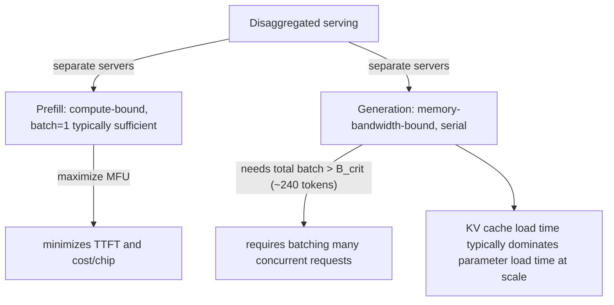

# Inference serving, latency and throughput

## Overview

LLM inference splits into two phases with opposite roofline characteristics: **prefill** (one-shot,
compute-bound at any reasonable prompt length) and **generation** (serial, token-by-token, always
memory-bandwidth-bound)
([the-basics-of-transformer-inference](src:inference.md#the-basics-of-transformer-inference)).
LLaMA 3-70B on TPU is the book's worked example applying every formula to a concrete serving
scenario, visualizing the latency/throughput Pareto tradeoff directly
([visualizing-the-latency-throughput-tradeoff](src:applied-inference.md#visualizing-the-latency-throughput-tradeoff)).

## Diagram

## Key results

**During prefill, maximizing MFU (Model FLOPs Utilization) alone is sufficient to maximize both
throughput-per-chip and latency (TTFT)** — since prefill matmuls are essentially always
compute-bound, batching multiple prompts together barely helps throughput unless prompts are very
short, and mainly costs latency
([the-basics-of-transformer-inference](src:inference.md#the-basics-of-transformer-inference)).
Attention specifically is compute-bound during prefill for any sequence length above ~480 tokens
([what-about-attention](src:inference.md#what-about-attention)).

**During generation, the same ~240-token critical batch size from [Rooflines and arithmetic
intensity](rooflines-and-arithmetic-intensity.md) reappears, but now as a *total across all
concurrently-served requests*, not per-request** — because generation is inherently serial
(one token per request per step), reaching a compute-bound linear/feed-forward operation requires
batching many independent requests together, which is operationally hard (continuous batching)
([the-basics-of-transformer-inference](src:inference.md#the-basics-of-transformer-inference)).
Attention itself, however, remains memory-bandwidth-bound during generation regardless of batch
size, since its arithmetic intensity is low and roughly constant
([what-about-attention](src:inference.md#what-about-attention)) — this is exactly why KV-cache
size (not parameter size) tends to dominate generation's memory-bandwidth cost at realistic batch
sizes, per [Transformer FLOPs and memory accounting](transformer-flops-and-memory-accounting.md)'s
KV-cache formula.

**KV-cache-size-reduction techniques (GMQA, MLA, etc.) can cut cache size by over an order of
magnitude, translating directly into an order-of-magnitude cost reduction for generation**
([theoretical-estimates-for-llm-latency-and-throughput](src:inference.md#theoretical-estimates-for-llm-latency-and-throughput)).
For LLaMA 3-70B specifically, nearly every realistic serving configuration is KV-cache-memory-bandwidth-bound
(and HBM-bound generally), underscoring just how load-bearing KV cache size is for serving cost
([whats-the-llama-serving-story](src:applied-inference.md#whats-the-llama-serving-story)).

**Prefill and generation want *opposite* sharding strategies during model-parallel scaling** —
prefill can use nearly any training-style sharding (model-parallel up to the ICI bound, then
sequence-parallel), but generation should model-shard by moving *activations* rather than KV caches
or parameters (which are larger), scaling model-parallelism up to the FLOPs-ICI bound $F/\alpha$ at
large batch, or further (trading throughput for latency) at small batch — and when sharding beyond
the number of KV heads, KVs must additionally be sharded along the batch dimension
([distributing-inference-over-multiple-accelerators](src:inference.md#distributing-inference-over-multiple-accelerators)).
This asymmetry is exactly why real high-throughput, latency-sensitive serving systems (e.g.
JetStream) **disaggregate prefill and generation into separate server pools** — prefill running at
batch 1, generation batching many concurrent requests
([designing-an-effective-inference-engine](src:inference.md#designing-an-effective-inference-engine)).

**Decode latency can be lower-bounded simply by the time to load all model parameters (plus KV
cache, at larger batch) from HBM into the MXU** — at small batch sizes and modest inter-device
comms, this bound is typically accurate within 1.5x
([whats-the-llama-serving-story](src:applied-inference.md#whats-the-llama-serving-story)). Useful
model-parallelism degree during generation caps out around 8-32 (depending on $d_{ff}$ and number of
sharding axes); scaling beyond that trades throughput for latency
([thinking-about-throughput](src:applied-inference.md#thinking-about-throughput)).

## See also
- [Rooflines and arithmetic intensity](rooflines-and-arithmetic-intensity.md) — the critical batch
  size (~240 tokens) this topic's generation-throughput analysis reuses.
- [Transformer FLOPs and memory accounting](transformer-flops-and-memory-accounting.md) — the
  KV-cache sizing formula this topic's memory-bandwidth analysis is built on.
- [Training parallelism strategies](training-parallelism-strategies.md) — the training-side
  counterpart, contrasting with inference's opposite sharding priorities.

## Sources
- [inference.md](../sources/inference.md)
- [applied-inference.md](../sources/applied-inference.md)
