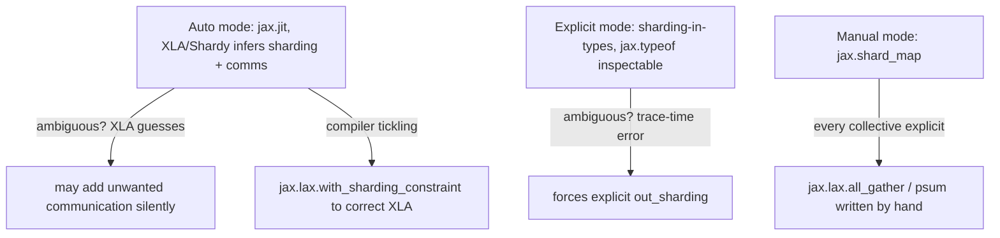

# JAX parallelism programming model

## Overview

JAX offers three progressively more explicit multi-device programming modes: **Auto** (`jax.jit`
lets XLA/Shardy infer sharding and insert communication automatically), **Explicit** ("sharding in
types" — JAX itself propagates shardings and raises trace-time errors on ambiguity), and **Manual**
(`jax.shard_map` — the programmer writes every collective by hand)
([how-does-parallelism-work-in-jax](src:jax-stuff.md#how-does-parallelism-work-in-jax)). These
three modes are the concrete API surface implementing the abstract sharding notation from
[Sharding notation and collective communication](sharding-notation-and-collectives.md).

## Diagram

## Key results

**Auto mode's `jax.jit` will silently insert whatever communication it decides is needed — including,
sometimes, communication you didn't intend** — the book's example shows a sharded matmul with
`out_shardings` specified automatically produces an AllReduce, directly visible in the compiled HLO
text via `jit_matmul.as_text()`
([how-does-parallelism-work-in-jax](src:jax-stuff.md#how-does-parallelism-work-in-jax)). When
Shardy gets this wrong (e.g. "a giant AllGather takes up 80% of the profile, where it doesn't need
to"), the fix is `jax.lax.with_sharding_constraint` to pin an intermediate tensor's sharding — the
book calls this "compiler tickling," estimating it makes up "about 60% of JAX parallel programming
in the automatic partitioning world."

**Explicit mode moves sharding-ambiguity detection from a silent runtime/profiling discovery to a
trace-time type error** — `jax.typeof` lets you inspect an array's sharding as part of its JAX type
(e.g. `float32[8@X,2@Y]`), and an operation like `jnp.einsum` on two operands with the same
contracting dimension sharded on both raises `"Contracting dimensions are sharded and it is
ambiguous how the output should be sharded"` immediately, rather than silently picking a default
that might be wrong ([how-does-parallelism-work-in-jax](src:jax-stuff.md#how-does-parallelism-work-in-jax)).
This is the direct API-level realization of [Sharding notation and collective
communication](sharding-notation-and-collectives.md)'s "Case 4" (forbidden ambiguous sharding)
becoming a hard error instead of a silent compiler decision.

**These three modes form a strict escalation of explicitness vs. effort — the same underlying
program (a sharded matmul) can be written in Auto mode with zero sharding-aware code changes, in
Explicit mode with type-level sharding annotations, or in Manual mode with hand-written
`jax.lax.all_gather`/`jax.lax.psum` calls** — a team can start in Auto mode for rapid iteration and
drop to Explicit or Manual mode only for the specific ops where the compiler's default choice
matters for performance.

## See also
- [Sharding notation and collective communication](sharding-notation-and-collectives.md) — the
  abstract notation these three JAX modes each implement concretely.
- [Profiling methodology and reading XLA/HLO](profiling-methodology-and-hlo.md) — how to detect
  when Auto mode's compiler-inserted communication is the actual profiling bottleneck.

## Sources
- [jax-stuff.md](../sources/jax-stuff.md)
