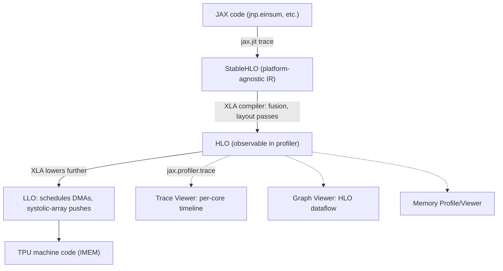

# Profiling methodology and reading XLA/HLO

## Overview

JAX code lowers through StableHLO → XLA-compiled HLO → LLO → TPU machine code
([a-thousand-foot-view-of-the-tpu-software-stack](src:profiling.md#a-thousand-foot-view-of-the-tpu-software-stack)).
The `jax.profiler`/xprof/TensorBoard trace viewer exposes this pipeline directly: the Trace Viewer
shows a per-core chronological timeline of actual XLA ops, the Graph Viewer shows the HLO dataflow
graph, and the Memory Profile shows allocation over time
([the-jax-profiler-a-multi-purpose-tpu-profiler](src:profiling.md#the-jax-profiler-a-multi-purpose-tpu-profiler)).
Reading an HLO op's shape/layout/memory-space annotations directly answers "what is this operation
actually doing and where does its data live" without needing separate documentation
([how-to-read-an-xla-op](src:profiling.md#how-to-read-an-xla-op)).

## Diagram

## Key results

**An HLO op's annotation string is a complete, directly-readable description of what it does and
where its data lives** — e.g. `bf16[32,32,4096]{2,1,0:T(8,128)(2,1)S(1)} fusion(...)` decomposes
into: dtype+shape (`bf16[32,32,4096]`), physical axis ordering and tiling (`{2,1,0:T(8,128)(2,1)}`,
a two-level tile with an inner `(2,1)` sub-tile ensuring bf16 loads are always 4-byte-aligned), and
memory space (`S(1)` = VMEM, `S(0)`/omitted = HBM)
([how-to-read-an-xla-op](src:profiling.md#how-to-read-an-xla-op)). Once you can read this notation,
a raw HLO dump becomes as informative as source code for diagnosing a specific op's behavior.

**Tiling padding is a real, sometimes-surprising memory cost** — a `T(2,2)` tiling on a `[3,5]`
array pads it to `[4,6]`, a ~1.6x memory expansion purely from tile-alignment; XLA can introduce
extra "retile"/"re-layout" copies mid-program at non-trivial overhead when consecutive ops disagree
on preferred tiling, which `jax.jit`'s `AUTO`-layout feature is designed to mitigate
([how-to-read-an-xla-op](src:profiling.md#how-to-read-an-xla-op)).

**A profiled operation's measured wall-clock time should be checked directly against its
roofline-predicted time as the primary validation that a kernel is performing as expected** — the
book's worked FFW example predicts 95.6ms from FLOPs/bandwidth arithmetic and measures 96ms in the
actual trace, "which is pretty much exactly how long it takes," confirming near-peak MXU utilization
([looking-at-a-realish-example-profile](src:profiling.md#looking-at-a-realish-example-profile)).
This is the empirical closing of the loop opened by [Rooflines and arithmetic
intensity](rooflines-and-arithmetic-intensity.md) — the roofline model isn't just a theoretical
estimate, it's directly falsifiable against a real profile trace.

**The Trace Viewer's top row (XLA Ops) is ground truth; everything else is approximate,
code-derived annotation** — labels from `jax.named_scope`/`jax.named_call`/Python stack traces
overlay the actual HLO-op timeline to help a reader map wall-clock time back to source code, but the
XLA Ops row itself is what's actually executing on the TPU
([trace-viewer](src:profiling.md#trace-viewer)).

## See also
- [Rooflines and arithmetic intensity](rooflines-and-arithmetic-intensity.md) — the predictive model
  a profile's measured timings should be checked against.
- [JAX parallelism programming model](jax-parallelism-programming-model.md) — where compiler-inserted
  collectives (visible as HLO ops like AllReduce) originate from.
- [TPU hardware architecture](tpu-hardware-architecture.md) — the memory spaces (`S(0)`=HBM,
  `S(1)`=VMEM) these HLO annotations directly reference.

## Sources
- [profiling.md](../sources/profiling.md)
