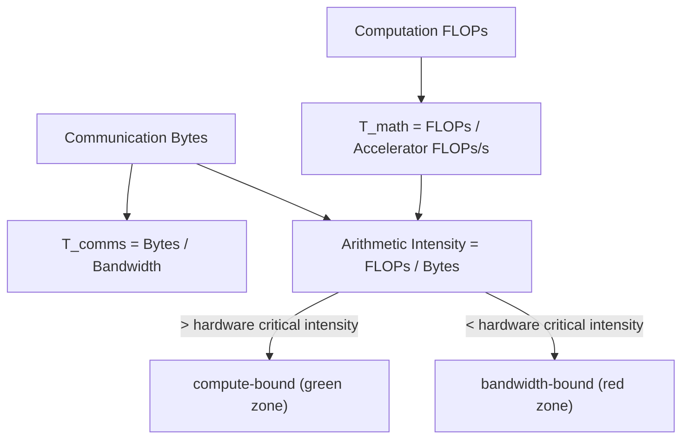

# Rooflines and arithmetic intensity

## Overview

The roofline model is the book's foundational analytical tool: any computation's runtime is
bounded below by $\max(T_\text{math}, T_\text{comms})$ and above by $T_\text{math} + T_\text{comms}$,
where $T_\text{math} = \text{FLOPs}/\text{Accelerator FLOPs/s}$ and $T_\text{comms} =
\text{Bytes}/\text{Bandwidth}$
([where does the time go](src:roofline.md#where-does-the-time-go)). The ratio of these two —
**arithmetic intensity** (FLOPs per byte moved) — determines whether an operation is compute-bound
or bandwidth-bound, and every later chapter's "is X compute-bound?" question reduces to comparing an
operation's arithmetic intensity against the hardware's critical intensity (peak FLOPs/s ÷ peak
bandwidth) for whichever link (HBM, ICI, PCIe, DCN) is relevant
([matrix multiplication](src:roofline.md#matrix-multiplication)).

## Diagram

## Key results

**The critical batch size rule: bf16 matmuls become compute-bound once per-replica token batch size
exceeds ~240 (TPU v5e/v5p), ~300 (GPU).** For a matmul $X[B,D]\cdot Y[D,F]\to Z[B,F]$ with $B \ll D,
F$, arithmetic intensity simplifies to $\approx B$, so the compute-bound threshold becomes a pure
batch-size condition: $B > \text{Intensity(Accelerator)} = \text{FLOPs/s} / \text{HBM
bandwidth}$ — 240 for TPU v5e's MXU (`1.97e14 / 8.2e11`)
([matrix multiplication](src:roofline.md#matrix-multiplication)). This single number recurs throughout the book: it
sets the minimum batch size for efficient training ([Training parallelism
strategies](training-parallelism-strategies.md)) and the minimum *total* batch size across all
concurrently-served requests for efficient generation
([Inference serving, latency and throughput](inference-serving-latency-throughput.md)).

**Quantization shifts the critical batch size differently depending on which operand is
quantized.** int8-weights-with-bf16-activations halves the critical batch size to ~120 (weight bytes
halve, but FLOPs stay bf16-rate), while full int8 (weights + activations + OPs) leaves the ~240
threshold roughly unchanged, since both FLOPs and bytes scale together
(Question 1/2, [a few problems to work](src:roofline.md#a-few-problems-to-work)). This is the quantitative basis for
why weight-only quantization is a cheap, high-leverage win: it moves the compute-bound threshold
without requiring int8 MXU support.

**The same roofline logic applies to *inter-chip* communication, not just intra-chip HBM
bandwidth** — the compute-bound threshold for a 2-way-sharded matmul depends on the contracting
dimension $D$ (not batch size $B$), since communicated bytes scale with $D$ while FLOPs per chip are
halved but batch-independent in the relevant ratio
([network communication rooflines](src:roofline.md#network-communication-rooflines)). This
generalization — that "roofline" applies to any bandwidth-bound resource, not just HBM — is what
[Sharding notation and collective communication](sharding-notation-and-collectives.md) builds its
entire cost model on.

**VMEM's ~22x bandwidth advantage over HBM lowers the effective critical arithmetic intensity to
just 10-20**, meaning weights that fit in VMEM (128MiB on TPU v5e) can be FLOPs-bound at much smaller
batch sizes — the basis for "VMEM prefetching" as an optimization
([what is a tpu](src:tpus.md#what-is-a-tpu)), covered in [TPU hardware
architecture](tpu-hardware-architecture.md).

## See also
- [TPU hardware architecture](tpu-hardware-architecture.md) — the hardware whose FLOPs/s and
  bandwidth numbers feed every roofline calculation.
- [Training parallelism strategies](training-parallelism-strategies.md) and [Inference serving,
  latency and throughput](inference-serving-latency-throughput.md) — apply this model to derive
  concrete parallelism/batching thresholds.

## Sources
- [roofline.md](../sources/roofline.md)
