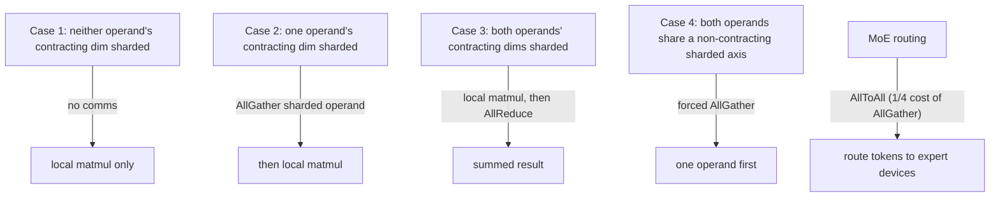

# Sharding notation and collective communication

## Overview

The book's named-axis sharding notation ($A[I_X, J_Y]$: array logical axis $I$ partitioned across
device-mesh axis $X$) is the shared vocabulary every parallelism strategy in the book is expressed
in ([a unified notation for sharding](src:sharding.md#a-unified-notation-for-sharding)). Every
sharded matrix multiplication reduces to one of four cases, each implying a specific required
collective (none, AllGather, AllReduce, or a forced AllGather), and every collective's cost can be
derived directly from the roofline model applied to the ICI ring
([computation-with-sharded-arrays](src:sharding.md#computation-with-sharded-arrays)).

## Diagram

## Key results

**Four cases cover every sharded matmul, each with a mechanical rule for what collective to
add** — no comms when neither multiplicand's contracting dimension is sharded; an AllGather when
one is; a local-multiply-then-AllReduce when both are; and a forced AllGather when both operands
share a non-contracting dimension sharded along the same mesh axis
([case-1-neither-multiplicand-has-a-sharded-contracting-dimension](src:sharding.md#case-1-neither-multiplicand-has-a-sharded-contracting-dimension)
through
[case-4-both-multiplicands-have-a-non-contracting-dimension-sharded-along-the-same-axis](src:sharding.md#case-4-both-multiplicands-have-a-non-contracting-dimension-sharded-along-the-same-axis)).
This is the mechanical decision procedure [Training parallelism
strategies](training-parallelism-strategies.md) and [Inference serving, latency and
throughput](inference-serving-latency-throughput.md) apply to derive every FSDP/tensor-parallelism/
model-parallelism communication cost.

**AllGather and ReduceScatter are forward/backward-pass duals of each other** — an AllGather in the
forward pass implies a ReduceScatter of the same array's gradient in the backward pass, and vice
versa, since broadcast and reduce are transposes of each other as linear operators
([more-about-the-reducescatter](src:sharding.md#more-about-the-reducescatter)). This means every
sharding decision has an automatic, predictable backward-pass communication cost — you don't need
to separately reason about the gradient's collective pattern.

**AllToAll is structurally cheaper than AllGather (by a factor of 4 on a bidirectional ring) because
it doesn't replicate data across every device — it only rearranges which device holds which
shard**, moving a sharding subscript from one axis to another rather than broadcasting
([our-final-communication-primitive-the-alltoall](src:sharding.md#our-final-communication-primitive-the-alltoall)).
This is precisely why Mixture-of-Experts token routing (needing two AllToAlls per MoE layer, one to
route tokens to their expert's device and one to bring results home) is comparatively cheap relative
to a naive AllGather-based approach, as covered in [Transformer FLOPs and memory
accounting](transformer-flops-and-memory-accounting.md)'s MoE section. For an ND torus, the AllToAll
cost scales with $\max(\text{mesh axis sizes})$, meaning it scales down favorably as you add more,
smaller mesh axes.

**These are TPU-ring-topology-derived costs specifically — they do not transfer directly to GPU's
switched fat-tree fabric**, where [GPU hardware architecture and
GPU-vs-TPU](gpu-hardware-and-gpu-vs-tpu.md) derives structurally different (hop-count-independent,
egress-bandwidth-scaled) collective costs.

## See also
- [Rooflines and arithmetic intensity](rooflines-and-arithmetic-intensity.md) — the underlying cost
  model (bytes/bandwidth) every collective cost formula here is derived from.
- [Training parallelism strategies](training-parallelism-strategies.md) — applies these collective
  costs to derive FSDP/tensor-parallelism communication-bound thresholds.
- [GPU hardware architecture and GPU-vs-TPU](gpu-hardware-and-gpu-vs-tpu.md) — the GPU-topology
  counterpart to these TPU-ring collective costs.

## Sources
- [sharding.md](../sources/sharding.md)
