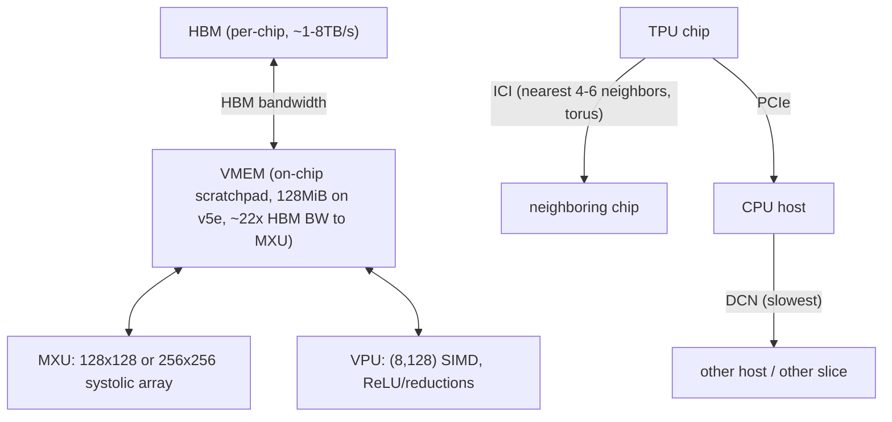

# TPU hardware architecture

## Overview

A TPU chip is a TensorCore (MXU + VPU + VMEM) attached to HBM
([what is a tpu](src:tpus.md#what-is-a-tpu)). The MXU is a systolic array (128x128, 256x256 on
v6e) performing one `bf16[8,128] @ bf16[128,128] -> f32[8,128]` multiply every 8 cycles
([appendix-b-how-does-a-systolic-array-work](src:tpus.md#appendix-b-how-does-a-systolic-array-work)),
while the VPU is a `(8,128)` SIMD unit for elementwise ops
([appendix-a-more-on-tpu-internals](src:tpus.md#appendix-a-more-on-tpu-internals)). Chips are wired
into a 2D or 3D torus via ICI (nearest-neighbor only), and multiple ICI-connected slices communicate
over the much slower DCN — this hierarchy of bandwidths (HBM > ICI > PCIe > DCN) is the physical
substrate every parallelism/sharding decision in the book is optimizing against
([tpu-networking](src:tpus.md#tpu-networking)).

## Diagram

## Key results

**All TPU operations are pipelined: HBM→VMEM→MXU/VPU→VMEM→HBM, overlapping memory movement with
compute so the MXU/VPU are never starved of work if bandwidth suffices**
([what is a tpu](src:tpus.md#what-is-a-tpu)). This pipelining assumption underlies every roofline
calculation in [Rooflines and arithmetic intensity](rooflines-and-arithmetic-intensity.md) — the
lower/upper bound model only holds because compute and communication genuinely overlap in practice.

**ICI provides only nearest-neighbor connectivity (2D/3D torus), unlike GPU's switched, near-all-to-all
NVLink fabric — this is the single biggest structural difference from GPUs**
([tpu-networking](src:tpus.md#tpu-networking)). Distant chips within a slice must hop through
intervening chips, and wraparound links (which halve the effective diameter) are only present on
full optical-switch cubes (`4x4x4` multiples) or full-16 axes — a `2x2x1` or partial-axis topology
loses wraparounds and roughly doubles communication time. See [GPU hardware architecture and
GPU-vs-TPU](gpu-hardware-and-gpu-vs-tpu.md) for the direct comparison.

**Bandwidth falls off steeply moving outward from the chip: HBM (~1-8 TB/s) ≫ ICI (~45-90 GB/s/link)
≫ PCIe (~16-32 GB/s) ≫ DCN (~3-12.5 GB/s per TPU)**
([tpu-specs](src:tpus.md#tpu-specs)). Multi-slice training must route data over DCN only when
unavoidable, and always prefers loading sharded data over many PCIe links (per-chip) over a
DCN-then-single-host-PCIe path, since parallel PCIe links from every chip in a slice vastly
outperform funneling everything through the few PCIe links on one host
(worked "Question 6", [worked-problems](src:tpus.md#worked-problems)).

**A single scalar core controls the entire TensorCore (4096-ALU VPU, up to 4 MXUs, XLUs, DMA
engines) and can only issue one DMA request per cycle**
([appendix-a-more-on-tpu-internals](src:tpus.md#appendix-a-more-on-tpu-internals)). This extreme
control-to-compute ratio is a deliberate efficiency trade — it's what makes TPUs cheap and simple
relative to GPUs' per-SM independent scheduling — but it also means the compiler (not
per-thread flexibility) is entirely responsible for pipelining memory loads against MXU/VPU work.

**Cross-lane (cross the 128-wide lane axis) reductions require the slow, separate XLU hardware
unit, while cross-sublane (the 8-wide axis) reductions are cheap shuffle operations**
([appendix-a-more-on-tpu-internals](src:tpus.md#appendix-a-more-on-tpu-internals)). This asymmetry
is why reduction-axis choice matters for kernel design — reducing along the sublane axis is nearly
free, while reducing along the lane axis is comparatively expensive.

## See also
- [Rooflines and arithmetic intensity](rooflines-and-arithmetic-intensity.md) — the analytical
  framework this hardware's specs feed into.
- [GPU hardware architecture and GPU-vs-TPU](gpu-hardware-and-gpu-vs-tpu.md) — the direct
  architectural comparison.
- [Profiling methodology and reading XLA/HLO](profiling-methodology-and-hlo.md) — where these
  memory-space annotations (`S(1)` = VMEM) show up directly in HLO.

## Sources
- [tpus.md](../sources/tpus.md)
