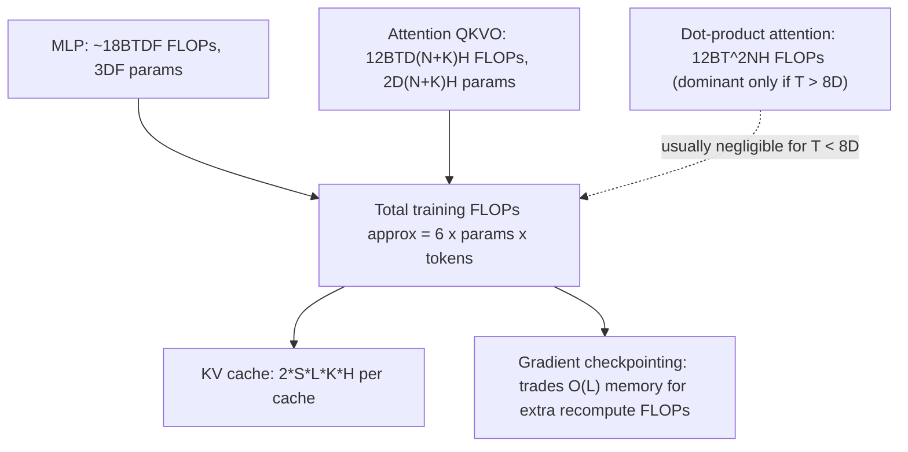

# Transformer FLOPs and memory accounting

## Overview

The book derives closed-form per-layer FLOPs and parameter counts for every Transformer sub-block
(MLP, attention QKVO, dot-product attention, unembedding)
([global-flops-and-params-calculation](src:transformers.md#global-flops-and-params-calculation)),
collapsing to the widely-cited rule that total training FLOPs $\approx 6 \cdot
\text{num\_params} \cdot \text{num\_tokens}$ for dense Transformers when attention's quadratic term
is neglected
([general-rule-of-thumb-for-transformer-flops](src:transformers.md#general-rule-of-thumb-for-transformer-flops)).
This accounting is the quantitative foundation both [Training parallelism
strategies](training-parallelism-strategies.md) and [Inference serving, latency and
throughput](inference-serving-latency-throughput.md) build their cost models on.

## Diagram

## Key results

**Dot-product attention FLOPs only dominate training cost once sequence length $T > 8D$** — for
$D \approx 8k$ (a large model) that's ~64K tokens, but for a smaller model like Gemma-27B ($D=4608$)
attention becomes dominant around 37K tokens
([fractional-cost-of-attention-with-context-length](src:transformers.md#fractional-cost-of-attention-with-context-length)).
This single inequality is the quantitative answer to "when does long-context training actually get
expensive because of attention, as opposed to the MLP" — and it explains why larger models are
relatively more robust to long context (their MLP FLOPs scale with $D^2$, swamping attention's
$T^2$ term for longer before it catches up).

**MoE is "just a dense model with E MLP blocks per layer, k of which activate per token"** — the
sparsity ratio $E/k$ (typically 8-64; DeepSeek v3 has $k=8, E=256$) multiplies parameter count by
$O(E)$ while only multiplying activated-parameter FLOPs by $k$, and costs two AllToAlls per MoE
layer to route tokens to/from their assigned expert's device
([sparsity-and-mixture-of-experts](src:transformers.md#sparsity-and-mixture-of-experts)). Per
[Sharding notation and collective communication](sharding-notation-and-collectives.md), these
AllToAlls are only 1/4 the cost of an equivalent AllGather, which is part of why MoE's
communication overhead is manageable despite adding two extra collectives per layer.

**Gradient checkpointing trades $O(L)$ activation memory for extra recompute FLOPs, with a concrete
"block remat" vs. "big matmuls only" tradeoff spectrum** — full-precision naive backprop would
require ~84TB of bf16 activations for a $BT=4M$-token, $L=64$, $D=8192$ model (rendering it
infeasible); "block remat" (save only each layer's input) cuts this to ~4.2TB at the cost of
recomputing the entire forward pass in the backward pass (raising total training FLOPs from
$6\cdot\text{params}\cdot\text{tokens}$ to ~$8\cdot\text{params}\cdot\text{tokens}$), while
"big matmuls only" (save large matmul outputs, recompute only cheaper pointwise/attention ops)
lands in between at ~7 saved activations per layer instead of 20
([gradient-checkpointing](src:transformers.md#gradient-checkpointing)). In JAX this policy is
controlled via `jax.remat`/`jax.checkpoint`.

**KV cache size is $2SLKH$ (2 for K+V, S=sequence length, L=layers, K=KV heads, H=head dim) —
grouped-query attention's entire value proposition is shrinking $K$ relative to $N$ (query heads)
without changing this formula's other terms**
([key-value-kv-caching](src:transformers.md#key-value-kv-caching)). This formula is the direct
input to every inference memory-bandwidth calculation in [Inference serving, latency and
throughput](inference-serving-latency-throughput.md) — KV cache, not parameters, dominates memory
bandwidth at realistic serving batch sizes.

## See also
- [Rooflines and arithmetic intensity](rooflines-and-arithmetic-intensity.md) — the FLOPs/bytes
  model this accounting plugs numbers into.
- [Training parallelism strategies](training-parallelism-strategies.md) — consumes the
  $6\cdot\text{params}\cdot\text{tokens}$ rule to estimate training time on a given topology.
- [Inference serving, latency and throughput](inference-serving-latency-throughput.md) — consumes
  the KV-cache sizing formula for memory-bandwidth-bound generation analysis.

## Sources
- [transformers.md](../sources/transformers.md)
