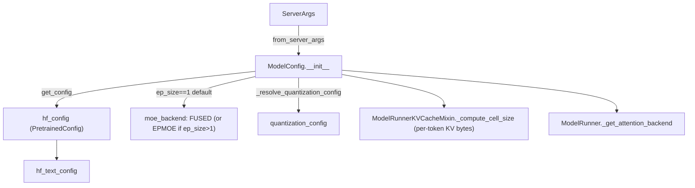

# sgl_jax.srt.configs.model_config — ModelConfig, MoE backend auto-selection, hybrid KV-cache sizing inputs

## Overview

[`ModelConfig`](../catalog/python/sgl_jax/srt/configs/model_config.md#ModelConfig) is the single
normalized view of a model's HuggingFace config plus sglang-jax-specific derived fields
([`hf_config`](../catalog/python/sgl_jax/srt/configs/model_config.md#ModelConfig.hf_config),
[`hf_text_config`](../catalog/python/sgl_jax/srt/configs/model_config.md#ModelConfig.hf_text_config),
[`head_dim`](../catalog/python/sgl_jax/srt/configs/model_config.md#ModelConfig.head_dim),
[`dtype_config`](../catalog/python/sgl_jax/srt/configs/model_config.md#ModelConfig.dtype_config),
[`moe_backend`](../catalog/python/sgl_jax/srt/configs/model_config.md#ModelConfig.moe_backend)).
Built once via
[`ModelConfig.from_server_args`](../catalog/python/sgl_jax/srt/configs/model_config.md#ModelConfig.from_server_args)
from the raw [`ServerArgs`](../catalog/python/sgl_jax/srt/server_args.md#ServerArgs), it is then
threaded through nearly every perf-relevant subsystem: KV-cache pool sizing, attention-backend
selection, quantization, weight loading, and expert-location metadata for MoE.

## Diagram

## Design rationale (why it's built this way)

**MoE backend selection defaults on expert-parallel size, not a user flag.**
[`ModelConfig.__init__`](../catalog/python/sgl_jax/srt/configs/model_config.md#ModelConfig) sets
`self.ep_size = 1` unconditionally today (`# TODO: support ep moe with ETP`) and then picks
`MoEBackend.EPMOE if self.ep_size > 1 else MoEBackend.FUSED` whenever
[`moe_backend`](../catalog/python/sgl_jax/srt/configs/model_config.md#ModelConfig.moe_backend) is
`AUTO` — the comment frames this as "use ep moe, else use fused moe," i.e. expert-parallel
dispatch across devices only pays off once experts are actually sharded across TPU chips;
single-device MoE keeps everything in one fused Pallas kernel instead of paying cross-device
dispatch/combine overhead for no sharding benefit.

**KV-cache per-token cost accounts for kernel-specific packing, not just head_dim × heads.**
[`ModelRunnerKVCacheMixin._compute_cell_size`](../catalog/python/sgl_jax/srt/model_executor/model_runner_kv_cache_mixin.md#ModelRunnerKVCacheMixin._compute_cell_size)
reads
[`hf_text_config`](../catalog/python/sgl_jax/srt/configs/model_config.md#ModelConfig.hf_text_config)
to branch: for the MLA absorbed (`fa`) path it computes `kv_packing = 32 // dtype_bits` and rounds
`page_size` up to that packing boundary before dividing — the inline comment explains "With bf16
(packing=2) and page_size=1, each page stores 2 slots but only 1 token of data" — so a naive
`head_dim * dtype_size` estimate would under-count actual HBM footprint for small page sizes,
which matters directly for how many total tokens the KV pool can hold under a fixed memory budget.

**Block-wise quantization is rejected outside TPU at model-load time, not deferred to a kernel
failure.**
[`ModelRunner.load_model`](../catalog/python/sgl_jax/srt/model_executor/model_runner.md#ModelRunner.load_model)
checks `self.model_config.quantization_config.weight_block_size is not None and
jax.default_backend() != "tpu"` and raises immediately — since block-wise dequantization is
implemented as a TPU Pallas kernel, letting it fall through to a generic backend would produce a
much later, harder-to-diagnose failure (or silently wrong numerics) instead of a clear config
error.

## Entry points

- [`ModelConfig.from_server_args`](../catalog/python/sgl_jax/srt/configs/model_config.md#ModelConfig.from_server_args) —
  the sole construction path from parsed CLI/server args; called once per model (target) and again
  per draft model in speculative decoding.
- [`ModelRunner.load_model`](../catalog/python/sgl_jax/srt/model_executor/model_runner.md#ModelRunner.load_model) —
  reached at server startup; stamps EP/MoE/quantization/absorbed-MLA flags onto
  [`hf_config`](../catalog/python/sgl_jax/srt/configs/model_config.md#ModelConfig.hf_config) before
  invoking the model loader.
- [`ModelRunnerKVCacheMixin._init_pools`](../catalog/python/sgl_jax/srt/model_executor/model_runner_kv_cache_mixin.md#ModelRunnerKVCacheMixin._init_pools) —
  reached during runner init to build the KV pool/allocator sized from this config's derived
  per-token cost.

## Mechanism (step-by-step)

1. **[`ModelConfig.from_server_args`](../catalog/python/sgl_jax/srt/configs/model_config.md#ModelConfig.from_server_args)
   forwards `ServerArgs` fields into `ModelConfig.__init__`**, which calls
   [`get_config`](../catalog/python/sgl_jax/srt/hf_transformers_utils.md#get_config) (an
   `lru_cache_frozenset`-memoized HF config loader) to populate
   [`hf_config`](../catalog/python/sgl_jax/srt/configs/model_config.md#ModelConfig.hf_config), then
   derives [`hf_text_config`](../catalog/python/sgl_jax/srt/configs/model_config.md#ModelConfig.hf_text_config)
   from it for multimodal models whose text config is nested.
2. **MoE backend is resolved once, at construction time**: `AUTO` becomes `FUSED` or `EPMOE` based
   on `ep_size`, and [`moe_backend`](../catalog/python/sgl_jax/srt/configs/model_config.md#ModelConfig.moe_backend)
   is read later by both
   [`ModelRunner.load_model`](../catalog/python/sgl_jax/srt/model_executor/model_runner.md#ModelRunner.load_model)
   (to stamp `hf_config.moe_backend`) and the model loader's quantization application.
3. **[`ModelConfig._resolve_quantization_config`](../catalog/python/sgl_jax/srt/configs/model_config.md#ModelConfig._resolve_quantization_config)
   unifies quantization from multiple sources** (explicit config path, checkpoint metadata) into
   one [`quantization_config`](../catalog/python/sgl_jax/srt/configs/model_config.md#ModelConfig.quantization_config),
   consumed later by
   [`apply_linear_quantization`](../catalog/python/sgl_jax/srt/utils/quantization/quantization_utils.md#apply_linear_quantization)/
   [`apply_moe_quantization`](../catalog/python/sgl_jax/srt/utils/quantization/quantization_utils.md#apply_moe_quantization).
4. **At runner init,**
   [`ModelRunnerKVCacheMixin._init_pools`](../catalog/python/sgl_jax/srt/model_executor/model_runner_kv_cache_mixin.md#ModelRunnerKVCacheMixin._init_pools)
   reads [`head_dim`](../catalog/python/sgl_jax/srt/configs/model_config.md#ModelConfig.head_dim)
   and hybrid-layer attention IDs off this config to build the (possibly `SWAKVPool`-split) KV
   cache, sized per
   [`ModelRunnerKVCacheMixin._compute_cell_size`](../catalog/python/sgl_jax/srt/model_executor/model_runner_kv_cache_mixin.md#ModelRunnerKVCacheMixin._compute_cell_size).

## Key data structures

- **[`ModelConfig`](../catalog/python/sgl_jax/srt/configs/model_config.md#ModelConfig)** — holds
  [`hf_config`](../catalog/python/sgl_jax/srt/configs/model_config.md#ModelConfig.hf_config)/
  [`hf_text_config`](../catalog/python/sgl_jax/srt/configs/model_config.md#ModelConfig.hf_text_config)/
  [`dtype_config`](../catalog/python/sgl_jax/srt/configs/model_config.md#ModelConfig.dtype_config)/
  [`quantization_config`](../catalog/python/sgl_jax/srt/configs/model_config.md#ModelConfig.quantization_config)/
  [`moe_backend`](../catalog/python/sgl_jax/srt/configs/model_config.md#ModelConfig.moe_backend)/
  [`sliding_window`](../catalog/python/sgl_jax/srt/configs/model_config.md#ModelConfig.sliding_window).
- **[`ServerArgs`](../catalog/python/sgl_jax/srt/server_args.md#ServerArgs)** — the raw dataclass
  `ModelConfig` is derived from; carries `mem_fraction_static`/`page_size`/`chunked_prefill_size`
  scheduling knobs alongside model-identity fields.

## Dynamics (design intent)

Because [`get_config`](../catalog/python/sgl_jax/srt/hf_transformers_utils.md#get_config) is
`lru_cache_frozenset`-memoized, repeated `ModelConfig` construction (e.g. target model plus draft
model in speculative decoding, or per-DP-rank worker init) for the same underlying HF checkpoint
does not re-parse the config file from disk each time — the derived fields on `ModelConfig` itself
are still recomputed fresh per instance.

## Edge cases

- [`ModelRunner.load_model`](../catalog/python/sgl_jax/srt/model_executor/model_runner.md#ModelRunner.load_model)'s
  draft-worker branch overwrites `self.model_config.num_hidden_layers` from
  `num_nextn_predict_layers` "to avoid create redundant layer kv cache" when the draft and target
  model share safetensor files — a narrow special case for MTP-style draft models colocated with
  their target.
- [`ModelConfig.__init__`](../catalog/python/sgl_jax/srt/configs/model_config.md#ModelConfig)'s
  MoE-backend auto-selection is evaluated once at construction against `ep_size = 1` (hardcoded),
  so today `AUTO` always resolves to `FUSED` regardless of intended future EP configuration.

## Open questions

- The conditions under which `ep_size` would ever be set above 1 (and thus `EPMOE` selected) are
  not resolved within this packet's cited subgraph — the constructor hardcodes it to `1` with a
  `TODO`.

## See also
- [python-sgl_jax-srt-model_executor-model_runner](python-sgl_jax-srt-model_executor-model_runner.md) —
  `ModelRunner`, the primary consumer of `ModelConfig` for backend selection and weight loading.
- [python-sgl_jax-srt-mem_cache-memory_pool](python-sgl_jax-srt-mem_cache-memory_pool.md) — the KV
  pool sized using `_compute_cell_size`'s per-token cost derived from this config.
- [python-sgl_jax-srt-server_args](python-sgl_jax-srt-server_args.md) — `ServerArgs`, the raw CLI
  dataclass `ModelConfig.from_server_args` consumes.

## Sources
- `raw/code/sglang-jax/python/sgl_jax/srt/configs/model_config.py`
- `raw/code/sglang-jax/python/sgl_jax/srt/model_executor/model_runner_kv_cache_mixin.py`
- `raw/code/sglang-jax/python/sgl_jax/srt/model_executor/model_runner.py`
